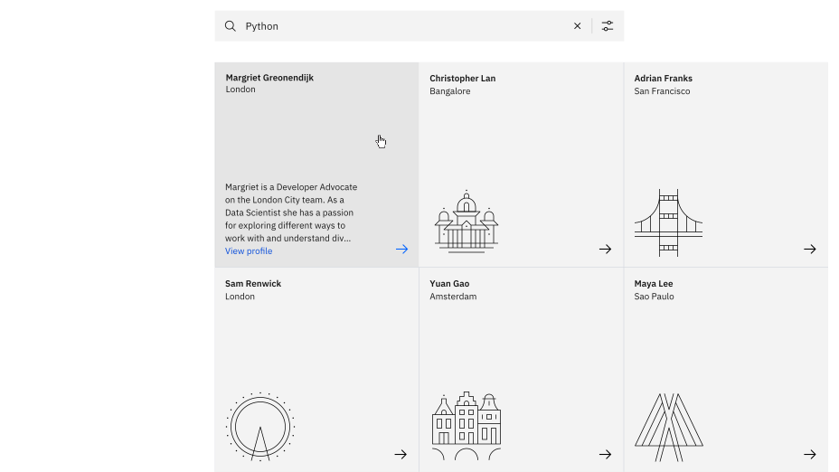
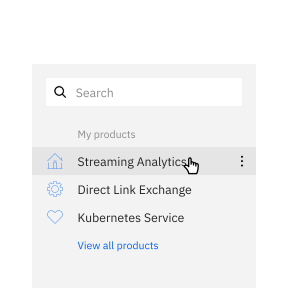
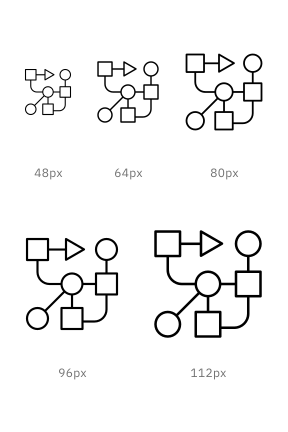
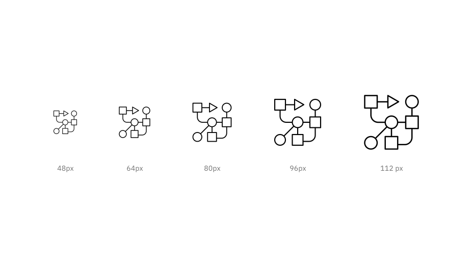
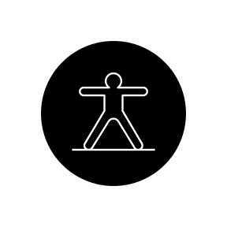
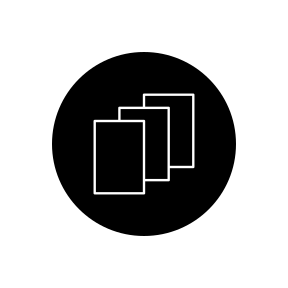
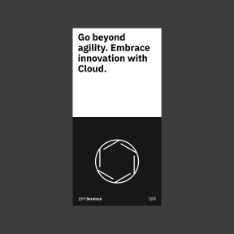
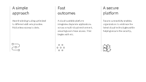
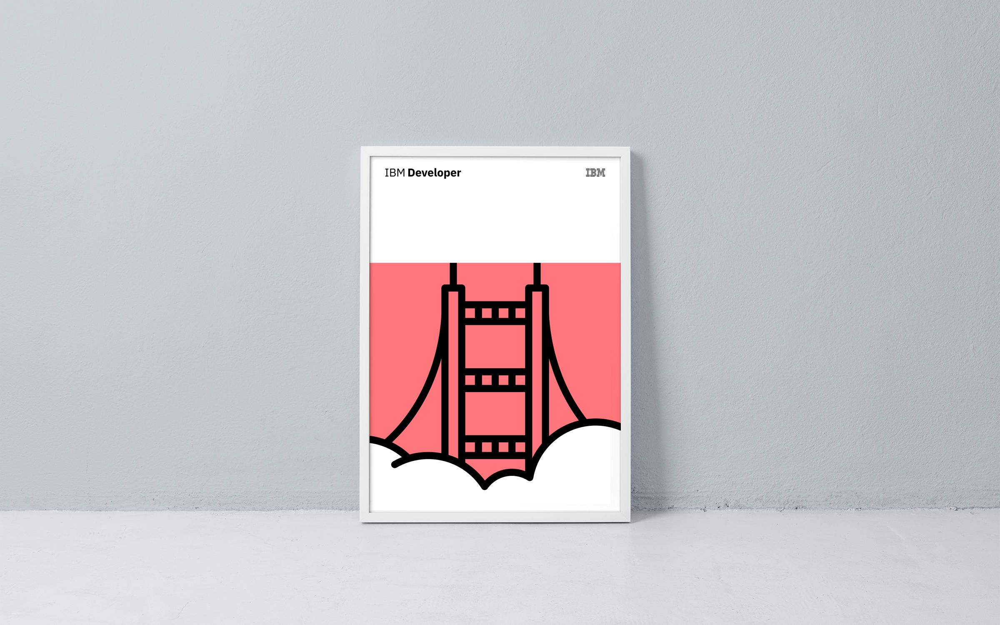

import { Bee32 } from '@carbon/icons-react';

<PageDescription>

IBM’s pictograms are visual symbols used to represent ideas, objects, or
narratives. They can communicate messages at a glance, afford interactivity, and
simplify complex ideas. They draw from details found in the Plex typeface and
work well in presentations and marketing communications.

</PageDescription>

<AnchorLinks>
  <AnchorLink>Usage</AnchorLink>
  <AnchorLink>Pictograms in action</AnchorLink>
  <AnchorLink>Resources</AnchorLink>
</AnchorLinks>

## Usage

Pictograms are illustrative and expressive and can live within a wide variety of
scales and environments whether digital or physical. As they are built on the
same grid as the rest of the IBM icon family, they share many of the same basic
principles but allow for more visual complexity and communication. You may use
pictograms to enhance the information you are conveying across various media.
It’s important to use pictograms sparingly but effectively throughout your
design.

<DoDontRow>
<DoDont caption="Do treat pictograms as illustations and provide proper clearance">

</DoDont>
</DoDontRow>

<DoDontRow>
<DoDont type="dont" caption="Don’t use pictograms as a replacement for UI icons, that is not their purpose.">

</DoDont>
<DoDont type="dont" caption="Don’t use any pictogram as a logo or in a lockup for product headers, merchandise or events.">

</DoDont>
</DoDontRow>

### Sizing

Pictograms are used in a range of sizes, the minimum being 48px while the
maximum size may vary based on application. Use pictograms at their original
sizes or scale at accepted increments. You may need to adjust the stroke weight
accordingly to accommodate larger scales. For more information on scaling and
accessibility, see the section on mini units on the 2X Grid page.

<ArtDirection>

</ArtDirection>

| Icon size | Stroke width | Padding | Live area | Corner Radius |
| --------- | ------------ | ------- | --------- | ------------- |
| 48px      | 1.08px       | 1.5px   | 48px      | 3px           |
| 64px      | 1.44px       | 2px     | 64px      | 4px           |
| 80px      | 1.80px       | 2.5px   | 80px      | 5px           |
| 96px      | 2.16px       | 3px     | 96px      | 6px           |
| 112px     | 2.52px       | 3.5px   | 112px     | 7px           |

<Caption>
  There is no set maximum to pictogram sizes. As you scale pictograms to larger
  sizes you may want to alter stroke weight to accommodate accessibility or
  environmental factors.
</Caption>

<Row>
  <Column colMd={4} colLg={4}>
    <ResourceCard
      subTitle="2X Grid: The mini unit"
      aspectRatio="2:1"
      href="https://www.ibm.com/design/language/elements/2x-grid#the-mini-unit">
      <Bee32 />
    </ResourceCard>
  </Column>
</Row>

### Alignment

Pictograms are optically aligned to the center of the icon grid within the
boundary box. Centering ensures all pictograms will be aligned correctly when
exported and used side by side.

### Containers

Pictograms can be represented in a circular or rectangular container calculated
based on the padding size.

<ArtDirection>

</ArtDirection>

<ArtDirection>

</ArtDirection>

<DoDontRow>
<DoDont caption="Do follow the clearance rule to allow for legibility and touch.">

</DoDont>
<DoDont type="dont" caption="Don't collapse the pictogram clearance area.">

</DoDont>
</DoDontRow>
<DoDontRow>
<DoDont caption="Do use accepted shapes: circle or square for containers.">

</DoDont>
<DoDont type="dont" caption="Don’t create new shapes for containers.">

</DoDont>
</DoDontRow>
<DoDontRow>
<DoDont caption="Do always optically center align pictograms in their containers.">

</DoDont>
<DoDont type="dont" caption="Don’t crop pictograms in container.">

</DoDont>
</DoDontRow>

### Clearance

When designing with pictograms, all artwork should include minimum padding based
on 1/4 of the scaled grid size. The padding can be increased by increments of
1/4 grid units.

<ArtDirection>

</ArtDirection>

<Caption>Padding starts at the edge of the container shape.</Caption>

<ArtDirection>

</ArtDirection>

<Caption>Padding is the same for both circle and square containers.</Caption>

<ArtDirection>

</ArtDirection>

<Caption>
  Same spacing rules apply when using pictograms without containers.
</Caption>

<DoDontRow>
<DoDont caption="Do keep pictograms at scale and optically center in container when necessary.">

</DoDont>
<DoDont type="dont" caption="Don’t resize pictograms outside of accepted proportions.">

</DoDont>
</DoDontRow>

## Pictograms in action

<Row>
<Column colMd={6} colLg={8}>

</Column>
<Column colMd={6} colLg={4}>

</Column>
</Row>

<Row>
<Column colSm={4} colMd={4} colLg={4}>

</Column>
<Column colSm={4} colMd={4} colLg={4}>

</Column>
<Column colSm={4} colMd={4} colLg={4}>
<Row>

</Row>
<Row>

</Row>

</Column>
</Row>

<Row>
<Column colMd={6} colLg={8}>

</Column>
<Column colMd={6} colLg={4}>

</Column>
</Row>

## Resources

<Row className="resource-card-group">
<Column colLg={4} colMd={4} noGutterSm>
  <ResourceCard
    subTitle="Pictograms"
    href="https://github.com/carbon-design-system/carbon/tree/master/packages/pictograms"
    >

<MdxIcon name="github" />

  </ResourceCard>
</Column>
<Column colLg={4} colMd={4}  noGutterSm>
  <ResourceCard
    subTitle="Pictograms-React"
    href="https://github.com/carbon-design-system/carbon/tree/master/packages/pictograms-react"
    >

<MdxIcon name="github" />

 </ResourceCard>
</Column>
</Row>
