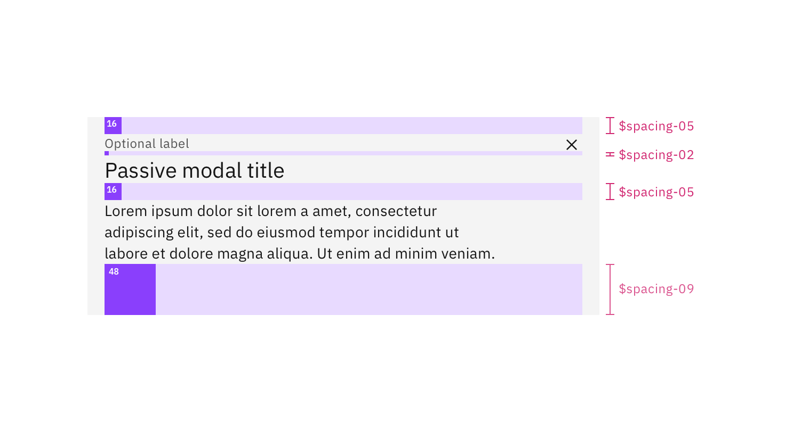

---
label:
  Spacing is an important — and often overlooked — part of visual design. Carbon
  takes a lot of the guesswork out of spacing to help designers deliver clear,
  functional layouts.
title: Spacing
description:
  Spacing is an important — and often overlooked — part of visual design. Carbon
  takes a lot of the guesswork out of spacing to help designers deliver clear,
  functional layouts.
tabs: ['Overview', 'Code']
---

<PageDescription>

Spacing is an important — and often overlooked — part of product design. Carbon
provides tokens and other utilities to take the guesswork out of spacing and
help deliver clear, functional layouts

</PageDescription>

<AnchorLinks>

<AnchorLink>Spacing</AnchorLink>
<AnchorLink>Stacking</AnchorLink>
<AnchorLink>Designing with space</AnchorLink>
<AnchorLink>FAQ</AnchorLink>

</AnchorLinks>

## Introduction

Spacing is the negative area between elements and components. It is commonly
controlled in code with `margin` and `padding`. Carbon offers several methods
such as tokens and layout components to make implementing spacing in product
easier and more consistent.

## Spacing

The Carbon spacing scale complements the 2x Grid and typography scale by using
using multiples of two, four, and eight. It includes both small increments
needed to create appropriate spatial relationships for detail-level designs as
well as larger increments used to control the density of a design. Each level of
the spacing scale has its own token. Spacing tokens can be used inside of
components for building and between components for layout spacing.

### Spacing scale

Use the spacing scale when building individual components. It includes small
increments needed to create appropriate spatial relationships for detail-level
designs. This scale is applied and used within all Carbon components.

<div className="spacing-table">

| Token         | rem   | px  | Example                                       |
| ------------- | ----- | --- | --------------------------------------------- |
| `$spacing-01` | 0.125 | 2   |  |
| `$spacing-02` | 0.25  | 4   |  |
| `$spacing-03` | 0.5   | 8   |   |
| `$spacing-04` | 0.75  | 12  |   |
| `$spacing-05` | 1     | 16  |   |
| `$spacing-06` | 1.5   | 24  |   |
| `$spacing-07` | 2     | 32  |   |
| `$spacing-08` | 2.5   | 40  |  |
| `$spacing-09` | 3     | 48  |  |
| `$spacing-10` | 4     | 64  |  |
| `$spacing-11` | 5     | 80  |  |
| `$spacing-12` | 6     | 96  |  |
| `$spacing-13` | 10    | 160 |  |

</div>

<br />

### Applying spacing

The spacing scale can be applied to `margin` or `padding` properties, as well as
to both vertical and horizontal edges. The token takes the place of the values
normally assigned to `margin` and `padding`. The following are all approved ways
to syntactically apply Carbon spacing tokens:

```css
margin: $spacing-03;
margin: $spacing-03 $spacing-01;
margin: $spacing-07 0 $spacing-04 0;
margin-right: $spacing-05;
padding: $spacing-04;
padding: $spacing-05 $spacing-03;
padding: $spacing-07 $spacing-04 0 $spacing-04;
```

<Row>
<Column colLg={8}>



<Caption>Example of spacing tokens applied</Caption>

</Column>
</Row>

### Other spacing options

There are a few other non-token methods that can be used for spacing elements.
Each has its own unique use case.

| Method   | Purpose                                                                                                                                                           |     |
| -------- | ----------------------------------------------------------------------------------------------------------------------------------------------------------------- | --- |
| `center` | Used to fluidly center an element between two edges.                                                                                                              |     |
| `auto`   | Used on one side of an element to allow undefined space to automatically grow and shrink according to screen size. Typically used for asymmetrical fluid spacing. |     |
| `gutter` | Used to space items between the grid's 12 columns                                                                                                                 |     |

## Stacking

Stacking is a form of spacing that creates equal distance between components or
a group of items. Carbon provides a stack component that uses the Carbon spacing
scale to determine how much space there should be between items. The stack
component supports both horizontal and vertical orientations.

The Stack component is a useful layout utility in a component-based model. This
allows components to not use margin and instead delegate the responsibility of
positioning and layout to parent components. It also supports a custom `gap`
property which will allow a user to provide a custom value for the gap of the
layout.

For more information, see the `Stack` component in
[React storybook](https://carbon-react-next.netlify.app/?path=/story/layout-stack--default).

<Row>
<Column colLg={8}>


<Caption>Example of spacing tokens applied with the stack component</Caption>

</Column>
</Row>

## Designing with space

Every part of a UI should be intentional including the empty space between
elements. The amount of space between items creates relationships and hierarchy.

### Creating relationships

Elements in a design that are near each other are seen as being meaningfully
related. As more space is added between elements, their perceived relationship
weakens.

Patterns created through spacing can also create relationships. Elements
arranged in the same spacing pattern are seen as related pieces that have equal
weight.

Space can also be used to denote groups of associated information. This creates
content sections on a page without having to use lines or other graphical
elements as a divider.

### Creating hierarchy

Elements that have more spacing around them tend to be perceived as higher in
importance than elements that have less space around them. Take this page for
instance. The top level headers have more space surrounding them giving them
focus and prominence. Then as the headers descend in importance they receive
less space, signaling they are subordinate.

Elements that are set close to each other can be easily overlooked. Users may
see the grouping but not process each individual item. Therefore, if you have an
element or content of high importance on the page, consider giving it extra
surrounding space to help it attract focus.

### White space

Empty space — also known as white space — is important in design. It can be used
to break up sections on a page or to help create focus on certain element(s).
White space helps with information processing; too much dense information can be
disorienting or overwhelming for a user. Sections of a UI are allowed to be
dense, but the whole page should not be crowded; there should be white space to
let the user’s eye rest.

## FAQ

#### Are spacing increments outside of the scale allowed?

There are always exceptions to the rule, but deviating from the spacing scales
should be avoided whenever possible.

#### Can I still use the Carbon grid for horizontal spacing?

Yes, in fact it's encouraged.

#### Can I use percentages for spacing?

Percentages like 50% (1/2) or 33% (1/3) are acceptable ways to divide a page.
Percentages can all be used to control max and min widths.

#### Are the spacing tokens responsive?

No, the tokens themselves do not change values based on the screen size.
However, it is acceptable at page breakpoints to jump a step(s) on the spacing
scale to fit spacing needs (i.e., at 1440 px `padding-right: $spacing-05` but at
breakpoint 768px `padding-right: $spacing-03`).
