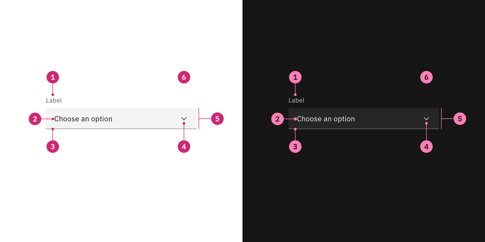

---
label:
  Themes are used to customize component styles to fit the specific aesthetic of
  a brand or product.
title: Themes
description:
  Themes are used to customize component styles to fit the specific aesthetic of
  a brand or product.
tabs: ['Overview', 'Code']
---

<PageDescription>

Themes are used to customize component styles to fit the specific aesthetic of a
brand or product.

</PageDescription>

<AnchorLinks>

<AnchorLink>Theming basics</AnchorLink>
<AnchorLink>Customizing a theme</AnchorLink>
<AnchorLink>Tokens</AnchorLink>
<AnchorLink>Theming applied</AnchorLink>
<AnchorLink>Resources</AnchorLink>

</AnchorLinks>

## Theming basics

Themes are used to modify existing components to fit a specific visual style. By
using Carbon's tokens, developers can easily customize all of their components
by changing a set of universal variables, eliminating the need to modify
individual components.

### Theme terms

| Term    | Definition                                                                                                   |     |
| ------- | ------------------------------------------------------------------------------------------------------------ | --- |
| _Theme_ | A collection of visual attributes assigned to the tokens in order to create a specific aesthetic             |     |
| _Token_ | A role-based identifier that assigns a value to a theme. Tokens are universal and never change across themes |     |
| _Role_  | The systematic usage(s) of a token. Roles cannot be changed between themes                                   |     |
| _Value_ | The actual style (such as a hex code) assigned to a token                                                    |     |

### Default theme

Carbon provides four themes as shown in the
[color usage](/guidelines/color/usage) page. When `carbon-components` is
downloaded and installed, the components are preset to use the default (White)
theme.

To use the Gray 10, Gray 90, or Gray 100 theme as your default instead of White,
set the `$theme` variable to one of the available theme maps (`$theme--g10`,
`$theme--g90`, `$theme--g100`) and then include your normal components in your
Sass build. These need to be imported before the main Carbon styles.

```scss
@import '@carbon/themes/scss/themes';

// Use the gray 10 theme
$theme: $theme--g10;
@include theme();

// Use the gray 90 theme
$theme: $theme--g90;
@include theme();

// Use the gray 100 theme
$theme: $theme--g100;
@include theme();

// import Carbon styles here
@import 'carbon-components/scss/globals/scss/styles.scss';
```

## Customizing a theme

The default theme acts as a starting point; from there designers and developers
can define how their own components and styles deviate from the default.
Altering one, some, or all of the default token values will result in a new
theme. The developer then packages those new values into a new theme SCSS
stylesheet which will replace the values of the default theme.

<Title>
  1. Create a theme mixin that effectively mimics this structure, but changes up
  values as needed:
</Title>

```scss
$theme--white: (
  // Background
  background: #ffffff,
  background-active: #c6c6c6,
  background-hover: #e5e5e5,
  background-selected: #e0e0e0,
  background-selected-hover: #cacaca,
  background-inverse: #393939,
  background-inverse-hover: #4c4c4c,
  background-brand: #0f62fe,

  // Layer
  layer: #f4f4f4,
  layer-active: #c6c6c6,
  layer-hover: #e5e5e5,
  layer-selected: #e0e0e0,
  layer-selected-hover: #cacaca,
  layer-selected-inverse: #161616,
  layer-selected-disabled: #8d8d8d,
  layer-accent: #e0e0e0,
  layer-accent-active: #a8a8a8,
  layer-accent-hover: #d1d1d1,
  layer-disabled: #f4f4f4,

  // Field
  field: #f4f4f4,
  field-hover: #e5e5e5,
  field-disabled: #f4f4f4,

  // Interactive
  interactive: #0f62fe,

  // Border
  border-subtle: #e0e0e0,
  border-subtle-selected: #c6c6c6,
  border-strong: #8d8d8d,
  border-inverse: #161616,
  border-interactive: #0f62fe,
  border-disabled: #f4f4f4,

  // Text
  text-primary: #161616,
  text-secondary: #525252,
  text-placeholder: #a8a8a8,
  text-helper: #6f6f6f,
  text-on-color: #ffffff,
  text-inverse: #ffffff,
  text-disabled: #c6c6c6,
  text-on-color-disabled: #8d8d8d,

  //Link
  link-primary: #0f62fe,
  link-primary-hover: #0043ce,
  link-secondary: #0043ce,
  link-visited: #8a3ffc,
  link-inverse: #78a9ff,

  //Icon
  icon-primary: #161616,
  icon-secondary: #525252,
  icon-on-color: #ffffff,
  icon-inverse: #ffffff,
  icon-disabled: #c6c6c6,
  icon-on-color-disabled: #8d8d8d,

  // Support
  support-error: #da1e28,
  support-success: #198038,
  support-warning: #f1c21b,
  support-info: #0043ce,
  support-error-inverse: #fa4d56,
  support-success-inverse: #42be65,
  support-warning-inverse: #f1c21b,
  support-info-inverse: #4589ff,

  // Misc.
  overlay: rgba(22, 22, 22, 0.5),
  toggle-off: #8d8d8d,

  // Button
  button-primary: #0f62fe,
  button-primary-active: #002d9c,
  button-primary-hover: #0353e9,
  button-secondary: #393939,
  button-secondary-active: #6f6f6f,
  button-secondary-hover: #4c4c4c,
  button-tertiary: #0f62fe,
  button-tertiary-active: #002d9c,
  button-tertiary-hover: #0353e9,
  button-danger-primary: #da1e28,
  button-danger-secondary: #da1e28,
  button-danger-active: #750e13,
  button-danger-hover: #b81921,
  button-disabled: #c6c6c6,

// Focus
  focus-inset: #ffffff,
  focus-inverse: #ffffff,

// Skeleton
  skeleton-background: #e5e5e5,
  skeleton-element: #c6c6c6,
```

<Title> 2. Name the mixin: </Title>

i.e., `$my-theme`

<Title> 3. Include this in your SCSS, before importing components, etc.:</Title>

`@include my-theme();`

Alternatively, for relatively minor changes to an existing theme, a developer
can make changes on a per-token basis. For example, after importing an existing
Carbon theme, she could just set something like `$interactive: hotpink;`.

## Tokens

With tokens, the code only needs to be changed in one place to see the effect
system-wide. Tokens are used across all components and help keep global patterns
and styles consistent.

All tokens come pre-baked into the Carbon component source code. Tokens are
denoted by the prefix `$` (e.g. `$layer-01`). Tokens can also be nested within
other tokens. For example, `$interactive` calls the IBM Design Language color
palette token `$blue-60` for its value in the default theme.

There are several token categories:

- Color
- Spacing
- Typography
- Global

### Color

Each theme is assigned universal color variables, which are determined by common
roles and usage. This allows for uniform color application across themes while
maintaining full styling flexibility. For more information, see the
[color](/guidelines/color/overview) page.

```scss
$theme--white: (
  // Background
  background: #ffffff,
  background-active: #c6c6c6,
  background-hover: #e5e5e5,
  background-selected: #e0e0e0,
  background-selected-hover: #cacaca,
  background-inverse: #393939,
  background-inverse-hover: #4c4c4c,
  background-brand: #0f62fe,
  // Layer
  layer: #f4f4f4,
  layer-active: #c6c6c6,
  layer-hover: #e5e5e5,
  layer-selected: #e0e0e0,
  layer-selected-hover: #cacaca,
  layer-selected-inverse: #161616,
  layer-selected-disabled: #8d8d8d,
  layer-accent: #e0e0e0,
  layer-accent-active: #a8a8a8,
  layer-accent-hover: #d1d1d1,
  layer-disabled: #f4f4f4,
  // Field
  field: #f4f4f4,
  field-hover: #e5e5e5,
  field-disabled: #f4f4f4,
  // Interactive
  interactive: #0f62fe,
  // Border
  border-subtle: #e0e0e0,
  border-subtle-selected: #c6c6c6,
  border-strong: #8d8d8d,
  border-inverse: #161616,
  border-interactive: #0f62fe,
  border-disabled: #f4f4f4,
  // Text
  text-primary: #161616,
  text-secondary: #525252,
  text-placeholder: #a8a8a8,
  text-helper: #6f6f6f,
  text-on-color: #ffffff,
  text-inverse: #ffffff,
  text-disabled: #c6c6c6,
  text-on-color-disabled: #8d8d8d,
  //Link
  link-primary: #0f62fe,
  link-primary-hover: #0043ce,
  link-secondary: #0043ce,
  link-visited: #8a3ffc,
  link-inverse: #78a9ff,
  //Icon
  icon-primary: #161616,
  icon-secondary: #525252,
  icon-on-color: #ffffff,
  icon-inverse: #ffffff,
  icon-disabled: #c6c6c6,
  icon-on-color-disabled: #8d8d8d,
  // Support
  support-error: #da1e28,
  support-success: #198038,
  support-warning: #f1c21b,
  support-info: #0043ce,
  support-error-inverse: #fa4d56,
  support-success-inverse: #42be65,
  support-warning-inverse: #f1c21b,
  support-info-inverse: #4589ff,
  // Misc.
  overlay: rgba(22, 22, 22, 0.5),
  toggle-off: #8d8d8d,
  // Button
  button-primary: #0f62fe,
  button-primary-active: #002d9c,
  button-primary-hover: #0353e9,
  button-secondary: #393939,
  button-secondary-active: #6f6f6f,
  button-secondary-hover: #4c4c4c,
  button-tertiary: #0f62fe,
  button-tertiary-active: #002d9c,
  button-tertiary-hover: #0353e9,
  button-danger-primary: #da1e28,
  button-danger-secondary: #da1e28,
  button-danger-active: #750e13,
  button-danger-hover: #b81921,
  button-disabled: #c6c6c6,
  // Focus
  focus-inset: #ffffff,
  focus-inverse: #ffffff,
  // Skeleton
  skeleton-background: #e5e5e5,
  skeleton-element: #c6c6c6
);
```

### Spacing

Use the spacing scale when building individual components. It includes small
increments needed to create appropriate spatial relationships for detail-level
designs. For more information, see the [spacing](/guidelines/spacing/overview/)
page.

```scss
  $spacing-01: 0.125rem,
  $spacing-02: 0.25rem,
  $spacing-03: 0.5rem,
  $spacing-04: 0.75rem,
  $spacing-05: 1rem,
  $spacing-06: 1.5rem,
  $spacing-07: 2rem,
  $spacing-08: 2.5rem,
  $spacing-09: 3rem,
  $spacing-10: 4rem,
  $spacing-11: 5rem,
  $spacing-12: 6rem,
  $spacing-13: 10rem,
```

### Typography

Typography has four categories of type styles (universal, productive, editorial,
and additional) that can be customized through tokens. These tokens are used
both within components and across layouts. Type tokens are determined by their
role across the system. For more information, see the
[typography](/guidelines/typography/overview/) page.

```scss
// Universal
$caption-01: (
  font-family: font-family('sans'),
  font-size: type-scale(1),
  font-weight: font-weight('regular'),
  line-height: rem(16px),
  letter-spacing: 0.32px,
) !default;

$label-01: (
  font-family: font-family('sans'),
  font-size: type-scale(1),
  font-weight: font-weight('regular'),
  line-height: rem(16px),
  letter-spacing: 0.32px,
) !default;

$helper-text-01: (
  font-family: font-family('sans'),
  font-size: type-scale(1),
  font-style: italic,
  line-height: rem(16px),
  letter-spacing: 0.32px,
) !default;

$body-short-01: (
  font-family: font-family('sans'),
  font-size: type-scale(2),
  font-weight: font-weight('regular'),
  line-height: rem(18px),
  letter-spacing: 0.16px,
) !default;

$body-long-01: (
  font-family: font-family('sans'),
  font-size: type-scale(2),
  font-weight: font-weight('regular'),
  line-height: rem(20px),
  letter-spacing: 0.16px,
) !default;

$body-short-02: (
  font-family: font-family('sans'),
  font-size: type-scale(3),
  font-weight: font-weight('regular'),
  line-height: rem(22px),
  letter-spacing: 0,
) !default;

$body-long-02: (
  font-family: font-family('sans'),
  font-size: type-scale(3),
  font-weight: font-weight('regular'),
  line-height: rem(24px),
  letter-spacing: 0,
) !default;

$code-01: (
  font-family: font-family('mono'),
  font-size: type-scale(1),
  font-weight: font-weight('regular'),
  line-height: rem(16px),
  letter-spacing: 0.32px,
) !default;

$code-02: (
  font-family: font-family('mono'),
  font-size: type-scale(2),
  font-weight: font-weight('regular'),
  line-height: rem(20px),
  letter-spacing: 0.32px,
) !default;

$heading-01: (
  font-family: font-family('sans'),
  font-size: type-scale(2),
  font-weight: font-weight('semibold'),
  line-height: rem(18px),
  letter-spacing: 0.16px,
) !default;

$heading-02: (
  font-family: font-family('sans'),
  font-size: type-scale(3),
  font-weight: font-weight('semibold'),
  line-height: rem(22px),
  letter-spacing: 0,
) !default;
```

```scss
// Productive
$productive-heading-03: (
  font-family: font-family('sans'),
  font-size: type-scale(5),
  font-weight: font-weight('regular'),
  line-height: rem(26px),
  letter-spacing: 0,
) !default;

$productive-heading-04: (
  font-family: font-family('sans'),
  font-size: type-scale(7),
  font-weight: font-weight('regular'),
  line-height: rem(36px),
  letter-spacing: 0,
) !default;

$productive-heading-05: (
  font-family: font-family('sans'),
  font-size: type-scale(8),
  font-weight: font-weight('regular'),
  line-height: rem(40px),
  letter-spacing: 0,
) !default;
```

```scss
// Expressive
$expressive-heading-03: (
  font-family: font-family('sans'),
  font-size: type-scale(5),
  font-weight: font-weight('regular'),
  line-height: 130%,
  letter-spacing: 0,
  breakpoints: (
    xlg: (
      font-size: type-scale(5),
      line-height: 125%,
    ),
    max: (
      font-size: type-scale(6),
    ),
  ),
) !default;

$expressive-heading-04: (
  font-family: font-family('sans'),
  font-size: type-scale(7),
  font-weight: font-weight('regular'),
  line-height: 129%,
  letter-spacing: 0,
  breakpoints: (
    xlg: (
      font-size: type-scale(7),
      line-height: 125%,
    ),
    max: (
      font-size: type-scale(8),
    ),
  ),
) !default;

$expressive-heading-05: (
  font-family: font-family('sans'),
  font-size: type-scale(8),
  font-weight: font-weight('regular'),
  line-height: 125%,
  letter-spacing: 0,
  breakpoints: (
    md: (
      font-size: type-scale(9),
      line-height: 122%,
    ),
    lg: (
      font-size: type-scale(10),
      line-height: 119%,
    ),
    xlg: (
      font-size: type-scale(11),
      line-height: 117%,
    ),
    max: (
      font-size: type-scale(13),
    ),
  ),
) !default;

$expressive-heading-06: (
  font-family: font-family('sans'),
  font-size: type-scale(8),
  font-weight: font-weight('semibold'),
  line-height: 125%,
  letter-spacing: 0,
  breakpoints: (
    md: (
      font-size: type-scale(9),
      line-height: 122%,
    ),
    lg: (
      font-size: type-scale(10),
      line-height: 119%,
    ),
    xlg: (
      font-size: type-scale(11),
      line-height: 117%,
    ),
    max: (
      font-size: type-scale(13),
    ),
  ),
) !default;

$expressive-paragraph-01: (
  font-family: font-family('sans'),
  font-size: type-scale(6),
  font-weight: font-weight('light'),
  line-height: 125%,
  letter-spacing: 0,
  breakpoints: (
    lg: (
      font-size: type-scale(7),
      line-height: 129%,
    ),
    max: (
      font-size: type-scale(8),
      line-height: 125%,
    ),
  ),
);
```

```scss
// Additional styles
$quotation-01: (
  font-family: font-family('serif'),
  font-size: type-scale(5),
  font-weight: font-weight('regular'),
  line-height: 130%,
  letter-spacing: 0,
  breakpoints: (
    md: (
      font-size: type-scale(5),
    ),
    lg: (
      font-size: type-scale(6),
      line-height: 125%,
    ),
    xlg: (
      font-size: type-scale(7),
      line-height: 129%,
    ),
    max: (
      font-size: type-scale(8),
      line-height: 125%,
    ),
  ),
) !default;

$quotation-02: (
  font-family: font-family('serif'),
  font-size: type-scale(8),
  font-weight: font-weight('light'),
  line-height: 125%,
  letter-spacing: 0,
  breakpoints: (
    md: (
      font-size: type-scale(9),
      line-height: 122%,
    ),
    lg: (
      font-size: type-scale(10),
      line-height: 119%,
    ),
    xlg: (
      font-size: type-scale(11),
      line-height: 117%,
    ),
    max: (
      font-size: type-scale(13),
    ),
  ),
) !default;

$display-01: (
  font-family: font-family('sans'),
  font-size: type-scale(10),
  font-weight: font-weight('light'),
  line-height: 119%,
  letter-spacing: 0,
  breakpoints: (
    md: (
      font-size: type-scale(10),
    ),
    lg: (
      font-size: type-scale(12),
    ),
    xlg: (
      font-size: type-scale(13),
      line-height: 117%,
    ),
    max: (
      font-size: type-scale(15),
      line-height: 113%,
    ),
  ),
) !default;

$display-02: (
  font-family: font-family('sans'),
  font-size: type-scale(10),
  font-weight: font-weight('semibold'),
  line-height: 119%,
  letter-spacing: 0,
  breakpoints: (
    md: (
      font-size: type-scale(10),
    ),
    lg: (
      font-size: type-scale(12),
    ),
    xlg: (
      font-size: type-scale(13),
      line-height: 116%,
    ),
    max: (
      font-size: type-scale(15),
      line-height: 113%,
    ),
  ),
) !default;

$display-03: (
  font-family: font-family('sans'),
  font-size: type-scale(10),
  font-weight: font-weight('light'),
  line-height: 119%,
  letter-spacing: 0,
  breakpoints: (
    md: (
      font-size: type-scale(14),
      line-height: 115%,
    ),
    lg: (
      font-size: type-scale(17),
      line-height: 111%,
      letter-spacing: -0.64px,
    ),
    xlg: (
      font-size: type-scale(20),
      line-height: 107%,
      letter-spacing: -0.64px,
    ),
    max: (
      font-size: type-scale(23),
      line-height: 105%,
      letter-spacing: -0.96px,
    ),
  ),
) !default;

$display-04: (
  font-family: font-family('sans'),
  font-size: type-scale(10),
  font-weight: font-weight('semibold'),
  line-height: 119%,
  letter-spacing: 0,
  breakpoints: (
    md: (
      font-size: type-scale(14),
      line-height: 115%,
    ),
    lg: (
      font-size: type-scale(17),
      line-height: 111%,
      letter-spacing: -0.64px,
    ),
    xlg: (
      font-size: type-scale(20),
      line-height: 107%,
      letter-spacing: -0.64px,
    ),
    max: (
      font-size: type-scale(23),
      line-height: 105%,
      letter-spacing: -0.96px,
    ),
  ),
) !default;
```

### Global

The other categories are global and component-specific variables. These control
more general styling of components, such as layer usage or border width.

```scss
// Global
$input-border: 1px solid transparent !default !global;
$input-label-weight: 400 !default !global;
$disabled: $disabled-02 !default !global;
$disabled-background-color: $disabled-01 !default !global;
$focus: $ibm-color__blue-60 !default !global;

// Link
$link-visited: $ibm-color__purple-60 !default !global;
$link-inverse-color: #6ea6ff !default !global;

// Tooltip
$tooltip-background-color: $inverse-02 !default !global;

// Button Theme Variables
$button-font-weight: 400 !default !global;
$button-font-size: 0.875rem !default !global;
$button-border-radius: 0 !default !global;
$button-height: 48px !default !global;
$button-padding: 0.875rem 15px !default !global;
$button-padding-sm: 0.375rem 15px !default !global;
$button-padding-lg: $spacing-04 !default !global;
$button-border-width: 1px !default !global;
$button-outline-width: 3px !default !global;
$button-outline-offset: -5px !default !global;
$button-outline: 1px solid $ibm-color__white-0 !default !global;

// Accordion (Reverse)
$accordion-flex-direction: row-reverse !default !global;
$accordion-justify-content: flex-start !default !global;
$accordion-arrow-margin: 0 $spacing-05 0 0 !default !global;
$accordion-title-margin: 0 0 0 $spacing-05 !default !global;
$accordion-content-padding: 0 0 0 $spacing-05 !default !global;

// Card
$card-text-align: center !default !global;
$card-flex-align: center !default !global;

// Checkbox
$checkbox-border-width: 2px !default !global;

// Code Snippet
$snippet-background-color: $ui-01 !default !global;
$snippet-border-color: $ui-03 !default !global;

// Content Switcher
$content-switcher-border-radius: 0px !default !global;
$content-switcher-option-border: 1px solid $brand-01 !default !global;
$content-switcher-divider: $ui-03 !default !global;

// Data Table
$data-table-heading-transform: uppercase !default !global;
$data-table-heading-border-bottom: 1px solid $brand-01 !default !global;
$data-table-row-height: 2rem !default !global;
$data-table-zebra-color: #fcfcfc !default !global;
$data-table-column-hover: $hover-selected-ui !default !global;

// Date Picker
$date-picker-in-range-background-color: $ibm-color__blue-20 !default !global;

// Modal
$modal-border-top: $brand-01 4px solid !default !global;
$modal-footer-background-color: $ui-03 !default !global;

// Notification
$notification-info-background-color: $ibm-color__blue-10 !default !global;
$notification-error-background-color: $ibm-color__red-10 !default !global;
$notification-warning-background-color: rgba(#fdd13a, 0.15) !default !global;
$notification-success-background-color: $ibm-color__green-10 !default !global;

// Progress Indicator
$progress-indicator-bar-width: 1px inset transparent !default !global;
$progress-indicator-stroke-width: 5 !default !global;
$progress-indicator-line-offset: 0.625rem !default !global;

//Code Snippet
$copy-active: $active-ui !default !global;
$copy-btn-feedback: $ibm-color__gray-80 !default !global;

// Radio Button
$radio-border-width: 1px !default !global;

// Structured Theme Variables
$structured-list-padding: 2rem !default !global;
$structured-list-text-transform: none !default !global;

// Slider

// Tab
$tab-underline-color: 3px solid $ibm-color__gray-30 !default !global;
$tab-underline-color-hover: 3px solid $ibm-color__gray-60 !default !global;
$tab-text-disabled: $ibm-color__gray-30 !default !global;
$tab-underline-disabled: 3px solid $ibm-color__gray-10 !default !global;

// Skeleton Loading
$skeleton: rgba($color__blue-51, 0.1) !default !global;
```

## Theming applied

The following example demonstrates the relationship between the different
themes. Each theme shares the same variables and roles, with only the value
changing for each individual theme.

<Row>
<Column colLg={12}>



</Column>
</Row>

| Key | Token             | Role                | White theme value | Gray 100 theme value |
| --- | ----------------- | ------------------- | ----------------- | -------------------- |
| 1   | `$text-secondary` | Label color         | Gray 70           | Gray 30              |
| 2   | `$text-primary`   | Primary text color  | Gray 100          | Gray 10              |
| 3   | `$border-strong`  | Border bottom color | Gray 50           | Gray 60              |
| 4   | `$icon-primary`   | Primary icon color  | Gray 100          | Gray 10              |
| 5   | `$field-01`       | Field color         | Gray 10           | Gray 90              |
| 6   | `$background`     | Page background     | White             | Gray 100             |

## Resources

<Column colMd={4} colLg={4}  noGutterSm>
  <ResourceCard
    subTitle="Carbon themes package"
    href="https://github.com/carbon-design-system/carbon/tree/v10/packages/themes"
    >

<MdxIcon name="github" />

  </ResourceCard>
</Column>
