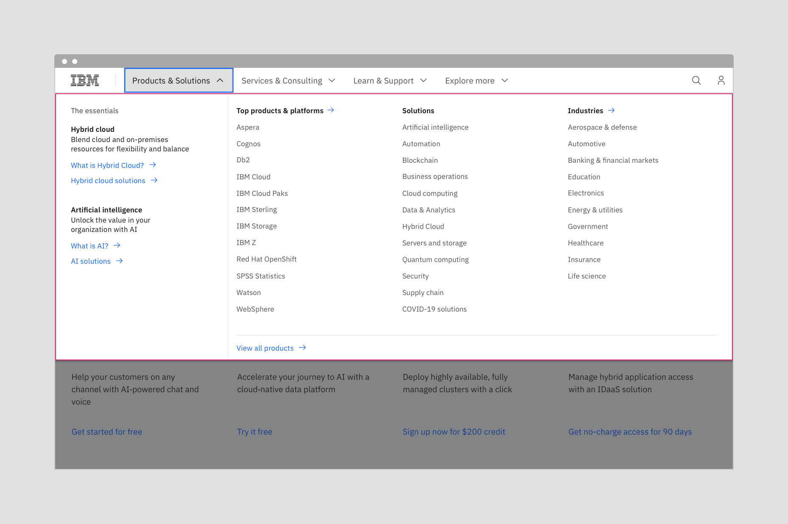
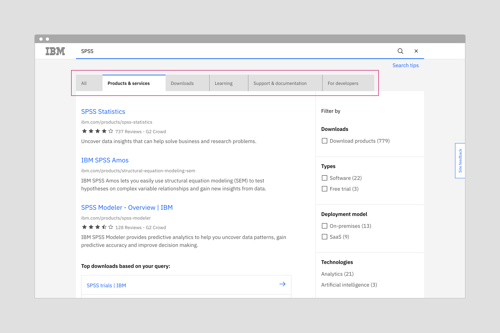
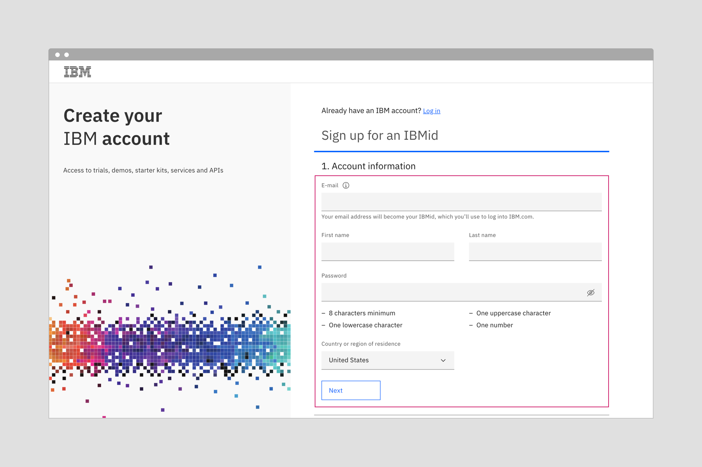
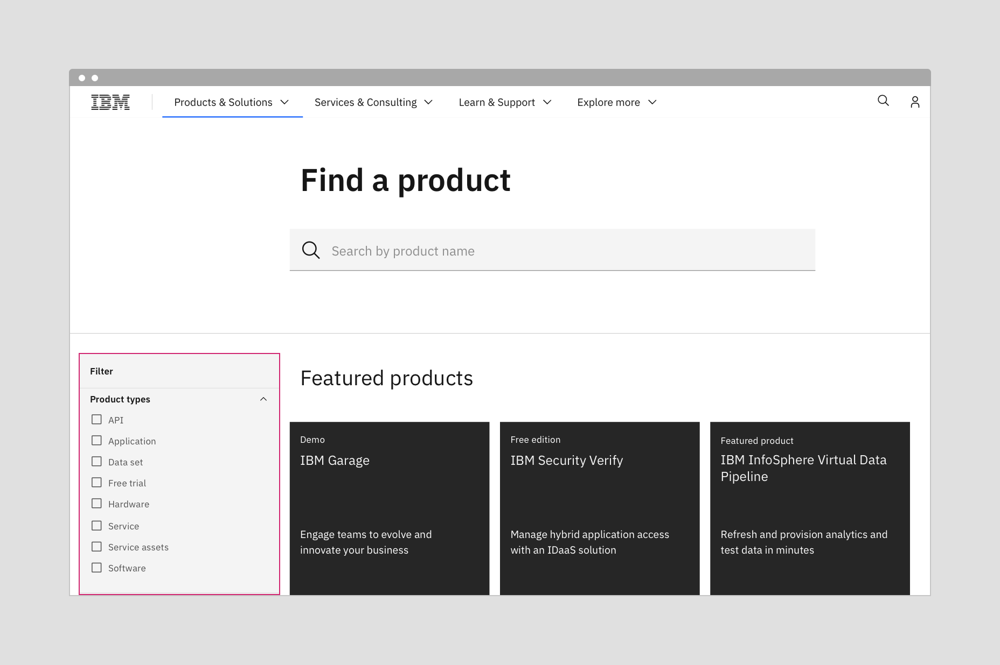

---
label:
  Carbon provides designers with two type sets that support productive and
  expressive experiences.
title: Typography
description:
  Carbon provides designers with two type sets that support productive and
  expressive experiences.
tabs: ['Overview', 'Experiences', 'Type sets', 'Code']
---

<PageDescription>

Carbon provides two type sets that support both productive and expressive
experiences. Primarily, productive was designed for product and expressive was
designed for web pages, but there are opportunities to blend contrasting moments
to elevate the overall experience.

</PageDescription>

<InlineNotification>

The Expressive theme has been integrated into the Carbon Design System's core
library, and both the productive and expressive type sets are now available
within the one [Sketch kit](/designing/design-kits/).

</InlineNotification>

<AnchorLinks>

<AnchorLink>Overview</AnchorLink>
<AnchorLink>The productive experience</AnchorLink>
<AnchorLink>The expressive experience</AnchorLink>
<AnchorLink>Blending experiences</AnchorLink>
<AnchorLink>Guidelines</AnchorLink>
<AnchorLink>Getting help</AnchorLink>

</AnchorLinks>

## Overview

Within Carbon, there are two type sets available for use with productive and
expressive experiences. The productive type styles were developed for product
design, and the expressive, more editorial type styles were developed for
IBM.com website pages.

The overarching rule has been to use the productive type styles for product
design and the expressive for web pages. For the most part, this is still a good
guideline to follow. However, over time we've recognized some situations where
we can create contrasting moments that better support the user with their
specific tasks.

Let's look at the respective design rationales for each experience, and then see
where it makes sense to provide a blend.

## The productive experience

Carbon Design System started as the design system for Cloud console and provides
typography that supports **productive experiences**.

The key drivers defining a productive experience are as follows:

- Users are focused on getting a specific job done.
- Interactions are more active, through inputs, forms, and controls.
- Users are embedded within the experience, often on one page, for awhile.
- Key performance indicators consider success in terms of time needed to
  complete a task and also the abandonment rate.

Given these considerations, a high information density is preferred. Keeping
content condensed is helpful to support focus on complex tasks.

## The expressive experience

Carbon for IBM.com is for the creators of IBM.com and it provides typography
that supports **expressive experiences.**

The key drivers defining an expressive experience are as follows:

- Users are trying to learn and explore, and are primarily scanning and reading.
- Interactions are more passive through impactful imagery, layout, and long form
  reading.
- Users typically traverse a series of pages during one session.
- Key performance indicators consider success in terms of click-through rates
  and final purchases.

Given these considerations, larger type sizes and a more editorial approach
allows users to scan, read, and navigate multiple pages with comfort and ease.

## Blending experiences

The spaces we are designing for are no longer neatly divided between productive
and expressive. Experiences can be blended with what we call "moments" if the
alternative experience better supports the user purpose.

If your users are working in a product but pausing to read or scan for options,
an expressive moment can facilitate easy reading and/or create a desired impact
or pause. In these cases, however the "moment" would span a full page or banner
where there are no containers.

If your users are on the website and reading, but then switch to a focused task
within the web experience, using productive styles within that component would
facilitate focus.

### Using productive moments within IBM.com pages

Here are some of the places the Dotcom team use productive moments:

- The global masthead mega menu
- IBM.com search
- Commerce
- Product configuration
- Account creation
- Filter panel in catalogs

<Row>
<Column colLg={12}>

</Column>
</Row>

<Caption>
  The mega menu with the more compact productive type styles allows users to see
  the full range of offerings.
</Caption>

<Row>
<Column colLg={12}>

</Column>
</Row>

<Caption>Productive tabs keep content contained and easy to scan.</Caption>

<Row>
<Column colLg={12}>

</Column>
</Row>

<Caption>
  Example of a productive moment on an account creation form assists with focus
  and interactions.
</Caption>

<Row>
<Column colLg={12}>

</Column>
</Row>

<Caption>
  A productive moment in the filter panel keeps information contained and easier
  to make selections.
</Caption>

### Using expressive moments within product designs

The productive experience is all about keeping the user focused and able to
complete complex tasks, therefore the areas where expressive moments can be used
are less common. However, when the user is first entering the product, or moving
to another area of the product you may find opportunities.

For expressive moments, you are looking for areas where the page opens up and
the content is not restricted to a container, card, or data table. Home pages
and page headers or banners are two possibilites.

\*\* add image

<Caption>
  A home page when the user is first entering the product or an area of the
  product.
</Caption>

For more details about home pages, IBMers can reference the
[World overview page pattern](https://pages.github.ibm.com/ibmcloud/pal/patterns/world-overview-pages/usage/)
in the IBM Cloud library.

## Guidelines

Here are some guidelines for creating productive and expressive moments.

#### Keep type styles consistent within a discrete task, component, or region

People unconsciously use type size as a signal of hierarchy, and each type set
has been designed with expectations about hierarchy in mind. Mixing type styles
within a component could jumble the hierarchy and create confusion.

#### Use productive for product and expressive for web pages

As a rule of thumb, stay in your lane and align with the primary space in which
the user is working. The productive type set should be used for product and the
expressive type set for web pages. The use of a blend is for key moments. It
works well for expressive experiences to have productive moments, but is a
little less common the other way around.

#### Match and support the user task

Within each type set, there are appropriately sized type styles for each user
task.

_When users need to focus on a task_ and are interacting through inputs, forms,
and controls, use the productive type set. The more dramatic, graphic use of
type in editorial design would be distracting.

_When users are learning and exploring,_ and interacting through impactful
imagery, layout, and long form reading, use the expressive type set. The high
type density found in products would be overwhelming, and information difficult
to absorb.

## Questions?

_For IBMers only:_ If you have any questions about using either of these
experiences, reach out to the teams on Slack or sign up to share your work in a
review.

#### Carbon Design System

- Slack channel:
  [#carbon-design-system](https://ibm-studios.slack.com/messages/C0M053VPT/)
- [Meetups](https://www.carbondesignsystem.com/whats-happening/meetups/) with
  Carbon Design System

#### Carbon for IBM Dotcom

- Slack channel:
  [#carbon-for-ibm-dotcom](https://cognitive-app.slack.com/archives/C2PLX8GQ6)
- Office hours with Carbon for IBM.com. See our
  [Slack channel](https://cognitive-app.slack.com/archives/C2PLX8GQ6) for
  details.
