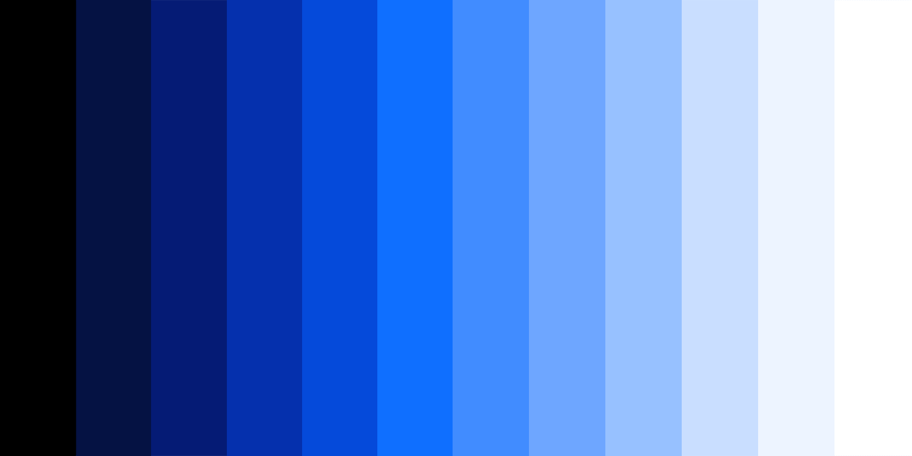
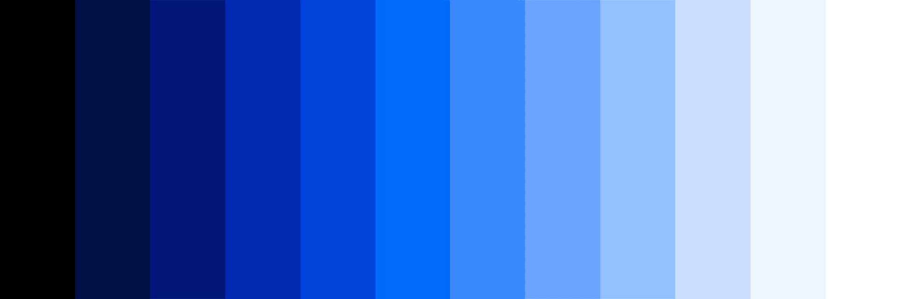
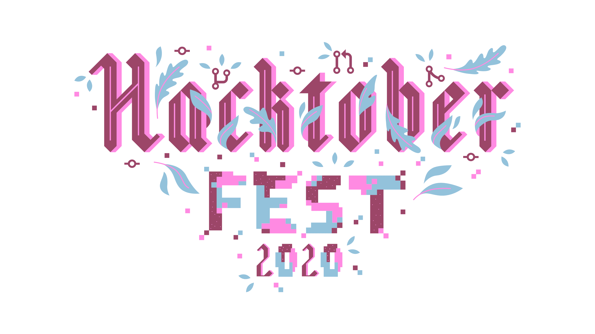

import HomepageTemplate from 'gatsby-theme-carbon/src/templates/Homepage';

export default HomepageTemplate;

<FeatureCard
    color="dark"
    href="/designing/get-started"
    subTitle="Start"
    title="Designing"
    actionIcon="arrowRight"
    className="homepage-feature"
    >

<ArtDirection>

</ArtDirection>

</FeatureCard>

<FeatureCard
    color="dark"
    href="/developing/get-started"
    subTitle="Start"
    title="Developing"
    actionIcon="arrowRight"
    className="homepage-feature"
    >

<ArtDirection>

</ArtDirection>

</FeatureCard>

### Other resources

The component libraries give developers a collection of reusable components for
building websites and user interfaces.

<Row className="resource-card-group">
<Column colLg={4} colMd={4} noGutterSm>
  <ResourceCard
    color="dark"
    subTitle="Sketch kits"
    href="/designing/kits/sketch"
    >
      <MdxIcon name="sketch" />
  </ResourceCard>
</Column>
<Column colLg={4} colMd={4} noGutterSm>
  <ResourceCard
    color="dark"
    subTitle="Carbon React components"
    href="https://github.com/carbon-design-system/carbon/tree/master/packages/react"
    >

<MdxIcon name="github" color="inverse" />

  </ResourceCard>
</Column>
<Column colLg={4} colMd={4} noGutterSm>
  <ResourceCard
    color="dark"
    subTitle="Carbon Angular components"
    href="https://github.com/IBM/carbon-components-angular"
    >

<MdxIcon name="github" color="inverse" />

  </ResourceCard>
</Column>
<Column colLg={4} colMd={4}  noGutterSm>
  <ResourceCard
    color="dark"
    subTitle="Carbon Vanilla components"
    href="https://github.com/carbon-design-system/carbon/tree/master/packages/components"
    >

<MdxIcon name="github" color="inverse" />

  </ResourceCard>
</Column>
<Column colLg={4} colMd={4} noGutterSm>
  <ResourceCard
    color="dark"
    subTitle="Carbon Vue components"
    href="https://github.com/carbon-design-system/carbon-components-vue"
    >

<MdxIcon name="github" color="inverse" />

  </ResourceCard>
</Column>
</Row>

### Latest news and articles

<Row>
<Column colLg={4} colMd={4} noGutterMdLeft>

<ArticleCard
    color="dark"
    title="Color palettes and accessibility features for data visualization"
    author="Shixie Shi Trofimov"
    date="October 5, 2020"
    href="https://medium.com/carbondesign/color-palettes-and-accessibility-features-for-data-visualization-7869f4874fca"
    >

</ArticleCard>
</Column>
<Column colLg={4} colMd={4} noGutterMdLeft>
<ArticleCard
    color="dark"
    title="Hacktoberfest 2020 is here"
    author="Scott Strubberg"
    date="October 1, 2020"
    href="https://medium.com/carbondesign/hacktoberfest-2020-is-here-2638d4f2c05 "
    >

</ArticleCard>
</Column>
<Column colLg={4} colMd={4} noGutterMdLeft>
<ArticleCard
    color="dark"
    title="Sharing components across teams"
    author="Anna Gonzales"
    date="September 23, 2020"
    href="https://medium.com/carbondesign/sharing-components-across-teams-b2335681c4aa "
    >

</ArticleCard>
</Column>

</Row>
