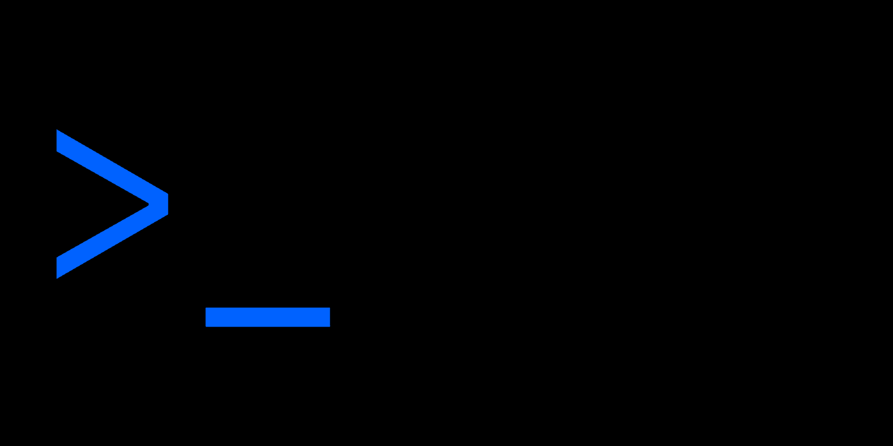

import HomepageTemplate from 'gatsby-theme-carbon/src/templates/Homepage';

export default HomepageTemplate;

<FeatureCard
    color="dark"
    href="/get-started/design"
    subTitle="Start"
    title="Designing"
    actionIcon="arrowRight"
    className="homepage-feature"
    >

<ArtDirection>

</ArtDirection>

</FeatureCard>

<FeatureCard
    color="dark"
    href="/get-started/develop/vanilla"
    subTitle="Start"
    title="Developing"
    actionIcon="arrowRight"
    className="homepage-feature"
    >

<ArtDirection>

</ArtDirection>

</FeatureCard>

### Other resources

The component libraries give developers a collection of reusable components for
building websites and user interfaces. See a
[complete list of resources.](/resources)

<Row className="resource-card-group">
<Column colLg={4} colMd={4} noGutterSm>
  <ResourceCard
    color="dark"
    subTitle="Sketch libraries"
    href="/resources#theme-libraries"
    >
      <MdxIcon name="sketch" />
  </ResourceCard>
</Column>
<Column colLg={4} colMd={4}  noGutterSm>
  <ResourceCard
    color="dark"
    subTitle="Carbon Components"
    href="https://github.com/carbon-design-system/carbon/tree/master/packages/components"
    >

<MdxIcon name="github" color="inverse" />

  </ResourceCard>
</Column>
<Column colLg={4} colMd={4} noGutterSm>
  <ResourceCard
    color="dark"
    subTitle="Carbon Components React"
    href="https://github.com/carbon-design-system/carbon/tree/master/packages/react"
    >

<MdxIcon name="github" color="inverse" />

  </ResourceCard>
</Column>
<Column colLg={4} colMd={4} noGutterSm>
  <ResourceCard
    color="dark"
    subTitle="Carbon Components Angular"
    href="https://github.com/IBM/carbon-components-angular"
    >

<MdxIcon name="github" color="inverse" />

  </ResourceCard>
</Column>
<Column colLg={4} colMd={4} noGutterSm>
  <ResourceCard
    color="dark"
    subTitle="Carbon Components Vue"
    href="https://github.com/carbon-design-system/carbon-components-vue"
    >

<MdxIcon name="github" color="inverse" />

  </ResourceCard>
</Column>
</Row>

### Latest news and articles

<Row>
<Column colLg={4} colMd={4} noGutterMdLeft>
<ArticleCard
    color="dark"
    title="New in Carbon: October 2019"
    author="Tyler Tate"
    date="October 10, 2019"
    href="https://medium.com/carbondesign/october-release-fadc38b757ad"
    >

</ArticleCard>
</Column>
<Column colLg={4} colMd={4} noGutterMdLeft>
<ArticleCard
    color="dark"
    title="Help build Carbon — Hacktoberfest 2019"
    author="Connor Leech"
    date="October 1, 2019"
    href="https://medium.com/carbondesign/help-build-carbon-hacktoberfest-2019-dbf337305c92"
    >

</ArticleCard>
</Column>
<Column colLg={4} colMd={4} noGutterMdLeft>
<ArticleCard
    color="dark"
    title="Because, colors are beautiful"
    author="Shixie Shi Trofimov"
    date="September 25, 2019"
    href="https://medium.com/carbondesign/because-colors-are-beautiful-52dd4cc39f09"
    >

</ArticleCard>
</Column>
</Row>
