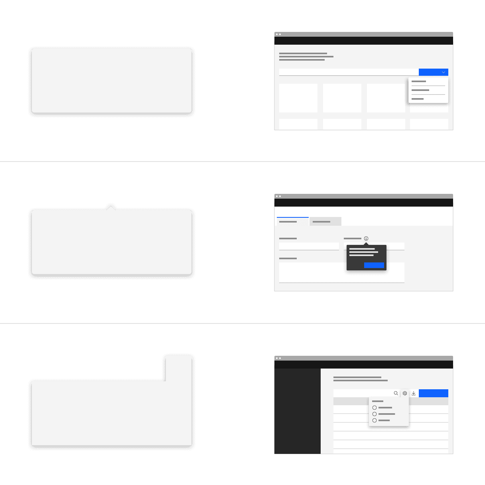
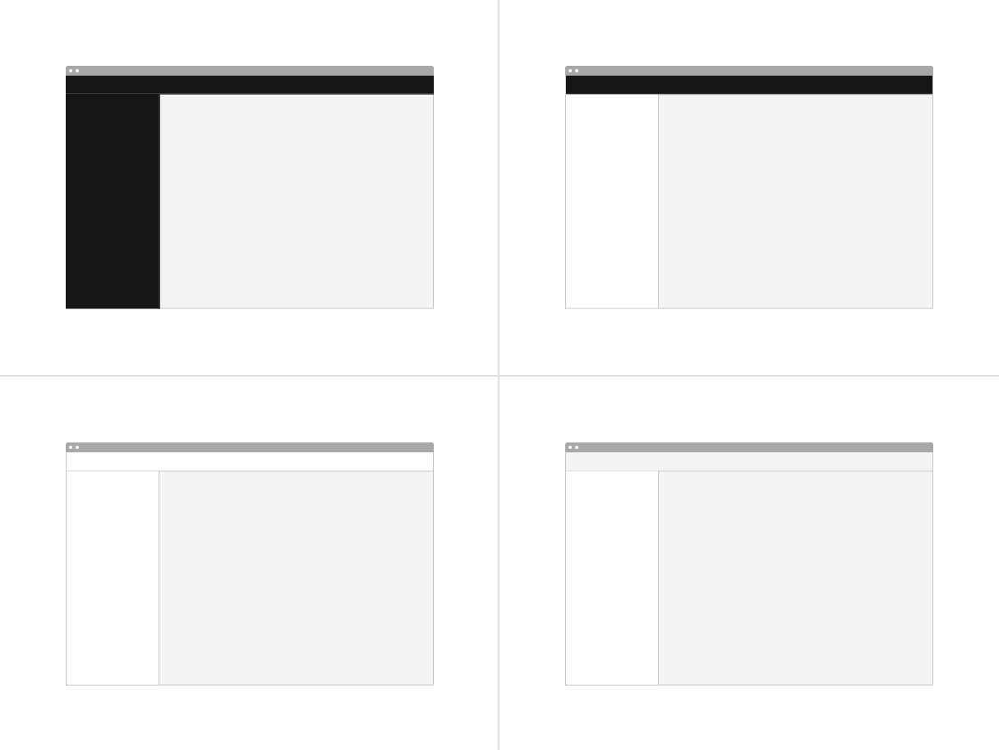
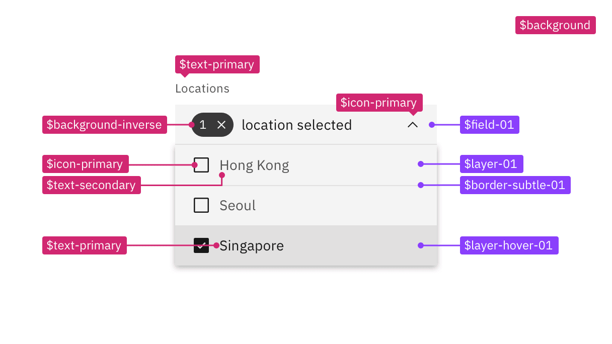
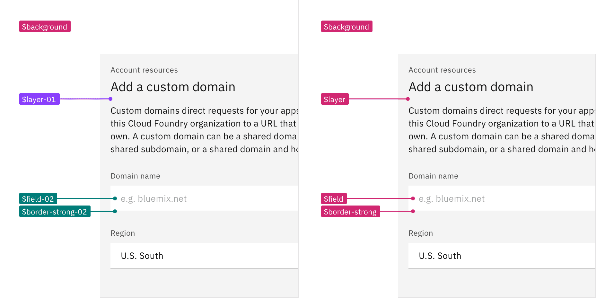

<PageDescription>

The transition from v10 to v11 includes updates and additions to color tokens,
theming, and introduces beta kits to experiment with.

</PageDescription>

<AnchorLinks>
  <AnchorLink>Design kit</AnchorLink>
  <AnchorLink>Components</AnchorLink>
  <AnchorLink>Elements</AnchorLink>
</AnchorLinks>

## Design kit

### What's new

- Added new color tokens
- Introduced layering models: layer set tokens and contextual layer tokens

### What's changed

- Updated existing color token names to better reflect their usage
- Updated layer styles with new color tokens
- Updated text styles with new color tokens
- Removal of light variants (in favor of new layer and contextual token sets)

### v11 Beta kit

Try out the v11 Beta Sketch kit that has been updated to reflect our color token
name changes and additional token layer sets and contextual layer sets. The v11
Beta kit is available in the White and Gray 100 themes.

<InlineNotification>
  Note: The v11 Beta kit is temporary and only available during our beta release
  timeframe. The existing v10 kits will be updated with these changes and
  additions once v11 is released to the general public.
</InlineNotification>

<Row className="resource-card-group">
<Column colLg={4} colMd={4} noGutterSm>
<ResourceCard
    subTitle="White theme (Beta)"
    href="sketch://add-library/cloud/fabc8814-ead2-4eeb-a893-ef3b6ea88875"
    actionIcon="download"
    >

<MdxIcon name="sketch" />

</ResourceCard>
</Column>
<Column colLg={4} colMd={4} noGutterSm>
<ResourceCard
    subTitle="Gray 100 theme (Beta)"
    actionIcon="download"
    href="sketch://add-library/cloud/9b33e49d-9b79-4696-9f57-c7a15c1e276a"
    >
      
<MdxIcon name="sketch" />

</ResourceCard>
</Column>
</Row>

## Components

### Notifications

Toast notifications have been refactored to now allow interactive content in
them, like links and buttons. To support the usecase of having a toast with or
without interactive content, we have introduced two types of toast
notifications—polite and assertive.

See Carbon's
[toast notification](https://v11.carbondesignsystem.com/components/notification/usage/#toast-notifications)
usage guidance for more information.

<Row>
<Column colLg={8}>

</Column>
</Row>

### Popover

Popover is a new component we have added to our system. A popover is a layer
that appears above all other content on the page and is used to display
additional details for specific elements whether it be text or interactive
elements.

See Carbon's
[popover](https://v11.carbondesignsystem.com/components/popover/usage/) usage
guidance for more information.

<Row>
<Column colLg={8}>

</Column>
</Row>

### Tooltip

The tooltip component has been refactored to use the popover component under the
hood to improve accessibility.

See Carbon's
[tooltip](https://v11.carbondesignsystem.com/components/tooltip/usage/) usage
guidance for more information.

<Row>
<Column colLg={8}>

</Column>
</Row>

### Toggletip

Definition and interactive tootips now use the toggletip component to achieve
accessibility standards. Toggle tip uses the disclosure pattern to toggle the
visibility of a popover. This popover may contain a variety of information, from
descriptive text to interactive elements. Further guidance on the toggle tip
component is coming soon.

### Tabs

The tab component variant names are changing. Default tabs will become Line tabs
and Container tabs will become Contained tabs. There are 3 new modifiers—tabs
with icons, icon-only tabs, and secondary labels.

See Carbon's [tab](https://v11.carbondesignsystem.com/components/tabs/usage/)
usage guidance for more information.

<Row>
<Column colLg={8}>

</Column>
</Row>

### UI shell

The UI shell is now themeable and has been updated to use inline theming. The UI
shell uses Carbon theme tokens instead of component specific tokens and the
color will follow each themes styles.

<Row>
<Column colLg={8}>

</Column>
</Row>

## Elements

### Sizing

All size properties for components have been renamed to be more consistent with
the pixel/rem value that it is paired with.

| Size                     | Height (px / rem) |
| ------------------------ | ----------------- |
| Extra small (xs)         | 24 / 1.5          |
| Small (sm)               | 32 / 2            |
| Medium (md)              | 40 / 2.5          |
| Large (lg)               | 48 / 3            |
| Extra large (xl)         | 64 / 4            |
| Double extra large (2xl) | 80 / 5            |

### Color tokens

Existing color tokens have been renamed to better reflect their usage. In
addition to renaming existing tokens, new tokens have been added to fill
existing color token gaps in our system and to fix complex layering logic.

#### Color token names

Previously, in v10 many color tokens had numeral endings, now in v11 only
layering tokens will have this distinction. All other tokens have been given an
adjective descriptor in place of the number ending to help with better
understanding how a token should be used.

<Row>
<Column colLg={8}>

</Column>
</Row>

#### Layer model tokens

We have introduced two different types of color token for the layering
models—Layering tokens and Contextual layer tokens. The two type of tokens will
produce the same visual effect. The difference between them is a technical one
and largely a developer concern. **In Sketch, and other design tools, designer
will only be using the Layering tokens to design.** The layering tokens replace
what were the `ui` color tokens in v10 and are used in a similar way.

<Row>
<Column colLg={8}>

</Column>
</Row>

See Carbon's
[color overview](https://v11.carbondesignsystem.com/guidelines/color/overview/),
[color implementation](https://v11.carbondesignsystem.com/guidelines/color/implementation)
guidance and
[migrating color tokens](https://github.com/carbon-design-system/carbon/blob/main/docs/migration/11.x-color.md)
for more information.

### Inline theming

Inline theming is available to use in your product. Inline theming is used when
a section of a UI needs to have a different theme from the rest of the page and
allows themes to be nested within each other without needing custom styles or
overrides. In product, a common use-case for inline theming is applying a
contrasting theme to a UI shell and side panels.

See Carbon's
[inline theming](https://v11.carbondesignsystem.com/guidelines/color/implementation#inline-theming)
guidance for more information.

<Row>
<Column colLg={8}>

</Column>
</Row>

### Light or dark mode

Light or dark mode has been newly introduced and is a theme setting that allows
the end user to choose a UI that is either predominately light or dark in color.
The UI will automatically switch from using light color backgrounds with dark
color text to using dark color backgrounds with light color text.

See Carbon's
[light or dark mode](https://v11.carbondesignsystem.com/guidelines/color/implementation#light-or-dark-mode)
guidance for more information.

<Row>
<Column colLg={8}>

</Column>
</Row>
