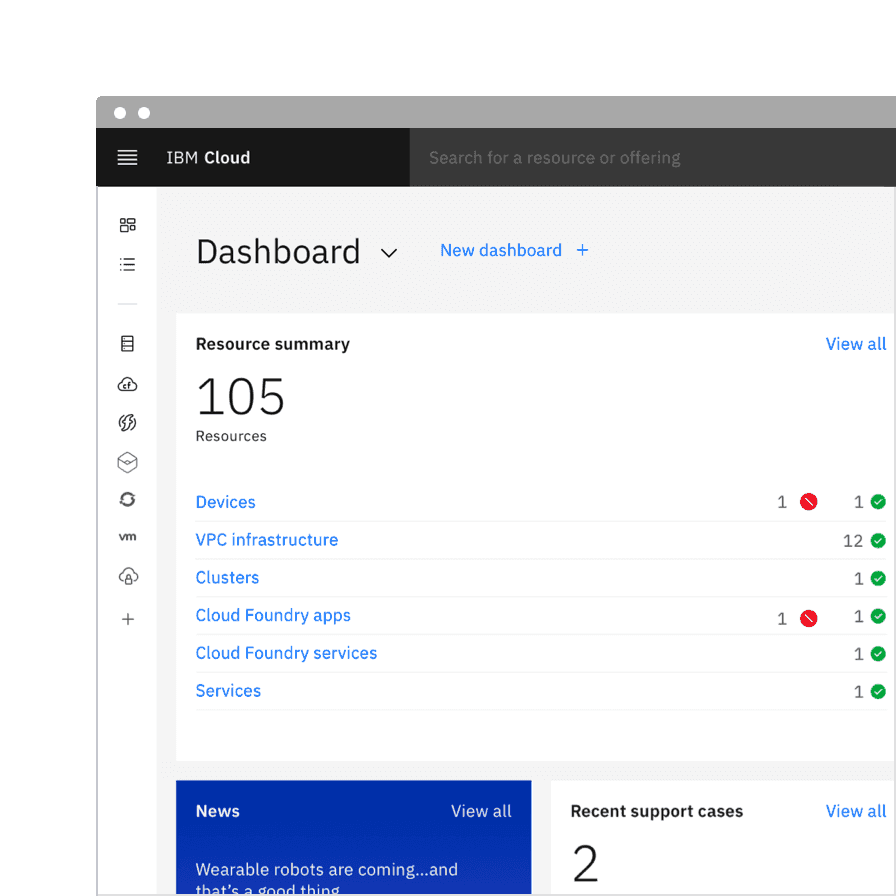

import { Tag } from '@carbon/react';

<PageDescription>

The transition from v10 to v11 includes significant updates and additions to
color tokens, theming, size naming, with new components providing better
accessibility, collaboration, and efficiency for users.

</PageDescription>

<AnchorLinks>
  <AnchorLink>Design kit</AnchorLink>
  <AnchorLink>Components</AnchorLink>
  <AnchorLink to="#sizing-breaking">Sizing</AnchorLink>
  <AnchorLink to="#type-tokens-breaking">Type tokens</AnchorLink>
  <AnchorLink to="#color-tokens-breaking">Color tokens</AnchorLink>
  <AnchorLink>Theming</AnchorLink>
</AnchorLinks>

## Design kit

### What's new

- Added new color tokens.
- Introduced layering models: layer set tokens and contextual layer tokens.

### What's changed

- Updated existing color token names to better reflect their usage.
- Updated layer styles with new color tokens.
- Updated text styles with new token names.
- Removal of `light` variants (in favor of new layer and contextual token sets).

### Kit migration

| Design tool                                                          | v11                      | Migration strategy                                                                                                                                                                                                                                                                                                                                                                                |
| -------------------------------------------------------------------- | ------------------------ | ------------------------------------------------------------------------------------------------------------------------------------------------------------------------------------------------------------------------------------------------------------------------------------------------------------------------------------------------------------------------------------------------- |
| [Figma](/designing/kits/figma)                                       | Update available         | The v11 Figma updates are available as new libraries. Teams need to swap out assets from v10 to v11 assets to migrate. The v10 Figma files will not receive continuous updates and will remain permanently on v10.                                                                                                                                                                                |
| [Sketch](/designing/kits/sketch)                                     | Update available         | The same Sketch Cloud libraries that were used in v10 have been updated to include the v11 changes. Do not accept the library update until you are ready to work in v11. There are new [v10](https://v10.carbondesignsystem.com/designing/kits/sketch#get-the-kit) libraries available for teams that still need them. Note that Sketch kits will not be prioritized or maintained in the future. |
| [Adobe XD](https://github.com/IBM/design-kit/tree/master/Adobe%20XD) | Partial update available | Some of the v11 changes have been made in the XD files, available in GitHub. Note that Adobe XD kits will no longer be prioritized or maintained.                                                                                                                                                                                                                                                 |

#### Figma

Migration to the new v11 Carbon libraries will be a manual process from v10.
Here are some steps of how to migrate your Text and Color styles from v10 to
v11.

1. Swap the library from v10 to v11.
2. Open the library panel and select the `v10` library.
3. Click the `Swap library` button.
4. Take a screenshot of the styles that didn't swap.
5. Visit the `v11` Text or Color styles file in `IBM Design Systems`.
6. Duplicate the file and move it to your team's space.
7. Rename the duplicate file to a temporary name.
8. Change the names of the text or color styles that didn't swap in Step 5 to
   match the name and organization of v10.
9. Swap to this temporary library.
10. Update the names back to v11 and swap to the actual v11 library.
11. Check nested components for text style overrides.

## Components

### Notifications <Tag type="cyan">Breaking</Tag>

An actionable variant has been added to the notification component. Actionable
notifications allow for interactive elements within a notification, like
buttons. Actionable notifications can be styled like an inline or toast
notification.

See Carbon's
[actionable notification](/components/notification/usage/#actionable-notifications)
usage guidance for more information.

<Row>
<Column colLg={8}>

</Column>
</Row>

### Popover <Tag type="green">New</Tag>

Popover is a new component we have added to our system. A popover is a layer
that appears above all other content on the page and is used to display
additional details for specific elements whether it be text or interactive
elements.

See Carbon's [popover](/components/popover/usage/) usage guidance for more
information.

<Row>
<Column colLg={8}>

</Column>
</Row>

### Tooltip <Tag type="cyan">Breaking</Tag>

The tooltip component has been refactored to use the popover component under the
hood to improve accessibility.

See Carbon's [tooltip](/components/tooltip/usage/) usage guidance for more
information.

<Row>
<Column colLg={8}>

</Column>
</Row>

### Toggletip <Tag type="green">New</Tag>

Definition and interactive tootips now use the toggletip component to achieve
accessibility standards. Toggletip uses the disclosure pattern to toggle the
visibility of a popover. This popover may contain a variety of information, from
descriptive text to interactive elements. Further guidance on the toggletip
component is coming soon.

See Carbon's [toggletip](/components/toggletip/usage/) usage guidance for more
information.

### Tabs <Tag type="cyan">Breaking</Tag>

The tab component variant names are changing. Default tabs will become _Line
tabs_ and Container tabs will become _Contained tabs_. There are three new
modifiers—tabs with icons, icon-only tabs, and secondary labels. Additionally,
there is a new third alignment option for tab that allows for auto-widths where
each tab size is determined by the label length.

See Carbon's [tab](/components/tabs/usage/) usage guidance for more information.

<Row>
<Column colLg={8}>

</Column>
</Row>

### UI shell <Tag type="purple">Updated</Tag>

The UI shell is now themeable and has been updated to use inline theming. The UI
shell uses Carbon theme tokens instead of component specific tokens and the
color will follow each themes styles.

<Row>
<Column colLg={8}>

</Column>
</Row>

## Sizing <Tag type="cyan">Breaking</Tag>

All size properties for components have been renamed to be more consistent with
the pixel/rem value that it is paired with.

| Size                     | Height (px / rem) |
| ------------------------ | ----------------- |
| Extra small (xs)         | 24 / 1.5          |
| Small (sm)               | 32 / 2            |
| Medium (md)              | 40 / 2.5          |
| Large (lg)               | 48 / 3            |
| Extra large (xl)         | 64 / 4            |
| Double extra large (2xl) | 80 / 5            |

## Type tokens <Tag type="cyan">Breaking</Tag>

The two v10 type sets—Productive and Expressive—have been blended together to
work as a unified collection in v11. As a result of this convergence, type token
names have been renamed to better define their relationship to one another and
reflect its styling.

See Carbon's [typography](/guidelines/typography/styling-strategies) guidance
for more information.

### Compact styles

Some tokens now have a compact designation, meaning the only difference it has
with the token of a similar name is a variation in line height.

### Body styles

The four body styles stay the same but their names have been updated. The `long`
styles are now simply just `body`, while the `short` styles are now
`body-compact`.

- `$body-long-01` → `$body-01`
- `$body-short-02` → `$body-compact-02`

### Heading styles

Productive and expressive while still a concept used to express different
“moments” are no longer used in the type token header names. There are two new
classifications—Fixed and Fluid.

#### Fixed headings

Fixed headings, for the most part take the place of what were the v10 productive
headings. The first two v10 expressive headings are also now included in the
fixed type set. They are called “fixed” because they do not change sizes across
breakpoints and always remain a single fixed size. However, the term fixed is
not included in the token name but simply named `heading`.

- `$productive-heading-03` → `$heading-03`

#### Fluid headings

Fluid headings take the place of the v10 expressive heading. These headings are
responsive and the type styles change size at different breakpoints.

- `$expressive-heading-05` → `$fluid-heading-05`

### Resources

<Row className="resource-card-group">
  <Column colLg={4} colMd={4} noGutterSm>
    <ResourceCard
      subTitle="Type token migration table"
      href="https://github.com/carbon-design-system/carbon/blob/main/docs/migration/v11.md#type-tokens"
    >
      <MdxIcon name="github" />
    </ResourceCard>
  </Column>
</Row>

## Color tokens <Tag type="cyan">Breaking</Tag>

Existing color tokens have been renamed to better reflect their usage. In
addition to renaming existing tokens, new tokens have been added to fill gaps in
the color token system and fix complex layering logic.

### Color token names

Previously, in v10 many color tokens had numeral endings, now in v11 only
layering tokens will have this distinction. All other tokens have been given an
adjective descriptor in place of the number ending to help users better
understand how a token should be used. The new naming convention is as follows:
`[element] - [role] - [order] - [state]`

See Carbon's [color overview](/guidelines/color/overview/) guidance for more
information.

<Row>
<Column colLg={12}>

</Column>
</Row>

<Caption>
  Examples showing v10 tokens on the left and v11 tokens on the right
</Caption>

### Layer model tokens <Tag type="green">New</Tag>

We have introduced two new types of color token for the layering models—Layering
tokens and Contextual layer tokens. The two types of tokens will produce the
same visual effect. The difference between them is a technical one and largely a
developer concern. **In Sketch, and other design tools, designer will only use
the layering tokens to design.** The layering tokens replace what were the `ui`
color tokens in v10 and are used in a similar way.

See Carbon's [color implementation](/guidelines/color/implementation) guidance
for more information.

<Row>
<Column colLg={12}>

</Column>
</Row>

<Caption>
  Examples showing layering tokens on the left and contextual tokens on the
  right
</Caption>

### Resources

<Row className="resource-card-group">
  <Column colLg={4} colMd={4} noGutterSm>
    <ResourceCard
      subTitle="Color token migration table"
      href="https://github.com/carbon-design-system/carbon/blob/main/docs/migration/v11.md#design-tokens"
    >
      <MdxIcon name="github" />
    </ResourceCard>
  </Column>
</Row>

## Theming

### Inline theming

Inline theming is available to use in your product. Inline theming is used when
a section of a UI needs to have a different theme from the rest of the page and
allows themes to be nested within each other without needing custom styles or
overrides. In product, a common use-case for inline theming is applying a
contrasting theme to a UI shell and side panels.

See Carbon's [inline theming](/guidelines/color/implementation#inline-theming)
guidance for more information.

<Row>
<Column colLg={8}>

</Column>
</Row>

### Light or dark mode

Light or dark mode has been newly introduced and is a theme setting that allows
the end user to choose a UI that is either predominately light or dark in color.
The UI will automatically switch from using light color backgrounds with dark
color text to using dark color backgrounds with light color text.

See Carbon's
[light or dark mode](/guidelines/color/implementation#light-or-dark-mode)
guidance for more information.

<Row>
<Column colMd={6} colLg={6}>

</Column>
<Column colMd={6} colLg={6}>

</Column>
</Row>
