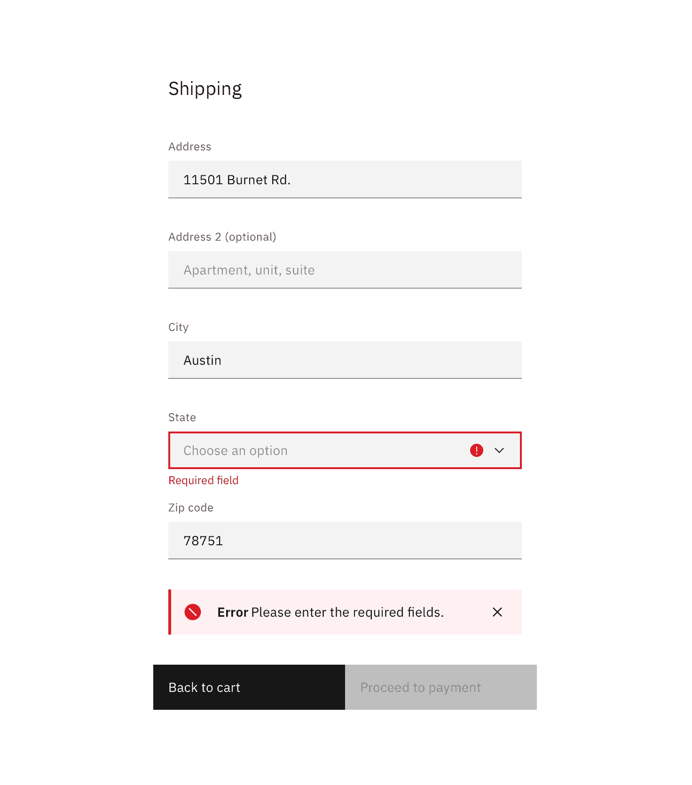
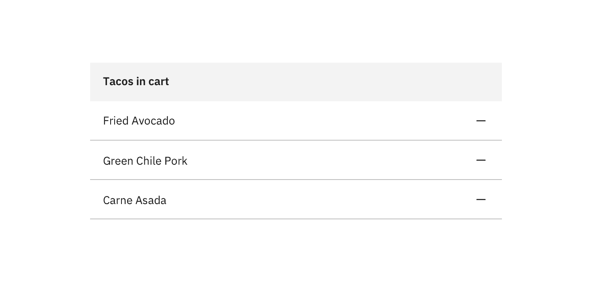
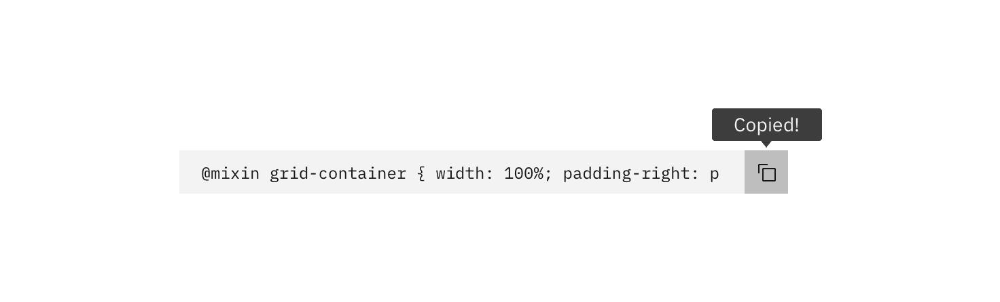
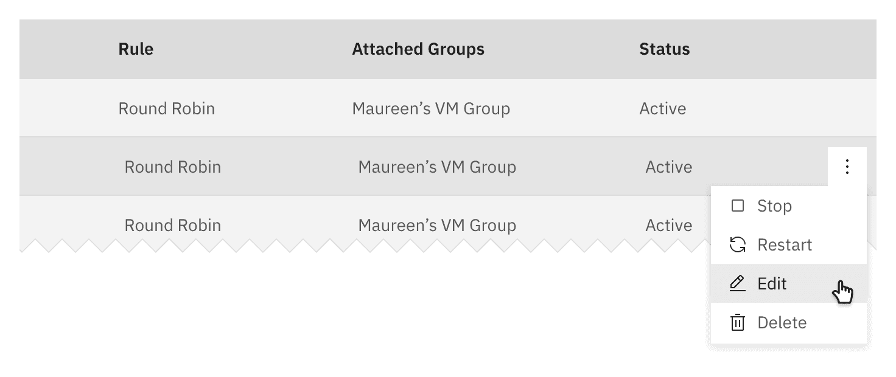
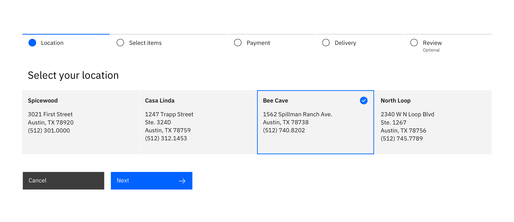

<PageDescription>

Common actions are frequently used actions that appear across different components and workflows. For platform consistency, these actions should only be applied in the ways described below.

</PageDescription>

## Regressive actions

<AnchorLinks small>

<AnchorLink>Cancel</AnchorLink>
<AnchorLink>Clear</AnchorLink>
<AnchorLink>Close</AnchorLink>
<AnchorLink>Delete</AnchorLink>
<AnchorLink>Errors</AnchorLink>
<AnchorLink>Remove</AnchorLink>
<AnchorLink>Reset</AnchorLink>

</AnchorLinks>

### Cancel

Cancel stops the current action and closes the component or item. Warn the user of any negative consequences of stopping the action from progressing, such as data corruption or data loss.

Use a secondary button or a link for cancel actions.

<Row>
<Column colLg={8}>

</Column>
</Row>

### Clear

Clear removes data from a field or removes selections. Clear can also delete the contents of a document, such as a log. Typically, the default selection or value is reset for controls that have a default selection or value, such as radio buttons.

Use the `x` icon on the right side of a field, item, or value.

<Row>
<Column colLg={8}>

</Column>
</Row>

### Close

Close terminates the current page, window, or menu. Close is also used to dismiss information, such as notifications.

Use the `close` icon, which is typically placed on the upper right side of the element. Do not use close in a button.

<Row>
<Column colLg={8}>

</Column>
</Row>

### Delete

Delete destroys an object. Delete actions cannot be easily undone and are typically permanent. The user should be warned of the negative consequences of destroying an object, such as loss of data. Use either the `delete` or `trash can` icon, a danger button, or a danger option in a menu. A danger modal is used when a warning is needed to confirm an action.

<Row>
<Column colLg={8}>

</Column>
</Row>

#### Non-dangerous deletion (~5% of cases)

Use when it's trivial to undo deletion or re-create the item. Delete the item upon click or tap without further warning.

#### Moderate danger deletion (~80% of cases)

Use when an action cannot be undone or the item cannot be recreated easily. This pattern is also useful if you're deleting more than one thing.

Ask for confirmation of the delete, with guidance about what will occur if they delete.

#### High danger deletion (~15% of cases)

Use when it would be very expensive or time-consuming to recreate an item. Also use if the action deletes a large number of items, or if other important items would be deleted as a result of the action.

In addition to presenting a dialog, have the user type the name of the resource they are deleting (manual confirmation).

#### Post-deletion flow

After the user deletes an item, return to the page that lists the item deleted. Animate the removal of the item from the list or page and present a success notification.

If the deletion fails, raise a notification to tell the user that deletion failed. Send a second notification on another communication channel, like email, if possible. Animate the item back onto the page if possible.

### Errors

Errors occur when an action or process does not succeed. Error notifications can occupy full pages, form fields, notifications (toast, inline, etc.), and modals. Ultimately, all should provide context of what happened and a clear path to continue.

<Row>
<Column colLg={8}>

</Column>
</Row>

Consider redirecting the user to a previous state, a support page, or by offering helpful recommendations. Be honest and helpful.

Some components, like text input and form field errors, are quite small and require more thoughtful approaches to the space and placement of error handling. Consider inline error notifications for these instances.

#### Copy guidelines

Be brief, honest, supportive, and human. Explain what happened and what can the user do to resolve the error.

For full-page and large modals, keep error messages no longer than three paragraph lines. For form errors, keep error messages no longer than two lines.

### Remove

This action removes an object from a list or item; however, the object is not destroyed as a result of the action. Multiple objects can be removed at once.

<Row>
<Column colLg={8}>

</Column>
</Row>

#### Hierarchy and placement

Represent remove as a button or `subtract` icon or glyph. The remove action is rarely the primary action on the page and should not be overly emphasized.

#### Considerations

- What are the implications of the add action for the user? Are there financial, access, or legal considerations?
- This action can be confused with deleting.
- A user may not have the correct permissions for this action.
- Inform the user if the result is permanent.
- How long will the action take? Seconds, minutes, hours, or days?
- What should the user do if the removal fails?
- Is this a single or bulk action?

### Reset

Reset reverts values back to their last saved state. The last saved state includes the values stored the last time the user clicked or triggered **Apply**.

<Row>
<Column colLg={8}>

Reset is typically applied as a link.

</Column>
</Row>

## Progressive actions

<AnchorLinks small>

<AnchorLink>Add</AnchorLink>
<AnchorLink>Copy</AnchorLink>
<AnchorLink>Edit</AnchorLink>
<AnchorLink>Next</AnchorLink>
<AnchorLink>Refresh</AnchorLink>

</AnchorLinks>

### Add

Add inserts an existing object to a list, set, or system. For example, adding a document to a folder.

<Row>
<Column colLg={8}>

</Column>
</Row>

#### Hierarchy and placement

Represent add with a primary button, button with an icon, `add--glyph` or `add--outline` icon.

Depending on the relevance of the add action on the page, the emphasis can be high, medium or low. For example, a high emphasis action should use a single prominent button that makes it clear that other buttons have less importance in the hierarchy.

#### Considerations

- What are the implications of the add action for the user? Are there financial, access, or legal considerations?
- A user may not have the correct permissions for this action
- Inform the user if the action is permanent
- What timeframe will the action take (seconds, minutes, hours, days)?
- What should a user do if the addition fails?
- Is this a single or bulk action?

### Copy

Copy creates a new identical instance of the selected object(s) in a distinct destination.

Use the `copy` icon with a confirmation "copied" tooltip appearing post-click.

<Row>
<Column colLg={8}>

</Column>
</Row>

### Edit

Edit allows data or values to be changed. Edit commonly triggers a state change to the targeted object or input item.

Offer edit as an option in a menu, or as a button or `edit` icon.

<Row>
<Column colLg={8}>

</Column>
</Row>

<Row>
<Column colLg={8}>

</Column>
</Row>

### Next

Next advances the user to the next step in a sequence of steps, such as in a wizard.

Represent next with a button with icon or a standalone `forward` icon.

<Row>
<Column colLg={8}>

</Column>
</Row>

### Refresh

This action reloads the view of an object, list, or data set when the displayed view has become unsynchronized with the source.

Use the `refresh` icon or a button.

<Row>
<Column colLg={8}>

</Column>
</Row>
