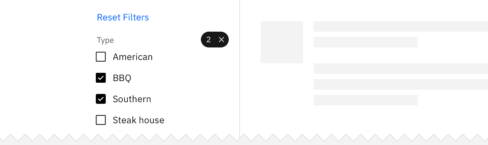

<PageDescription>

Common actions frequently appear across different components and workflows. For
platform consistency, these actions should only be applied in the ways described
below.

</PageDescription>

<AnchorLinks>

<AnchorLink>Add</AnchorLink>
<AnchorLink>Cancel</AnchorLink>
<AnchorLink>Clear</AnchorLink>
<AnchorLink>Close</AnchorLink>
<AnchorLink>Copy</AnchorLink>
<AnchorLink>Delete</AnchorLink>
<AnchorLink>Edit</AnchorLink>
<AnchorLink>Errors</AnchorLink>
<AnchorLink>Next</AnchorLink>
<AnchorLink>Refresh</AnchorLink>
<AnchorLink>Remove</AnchorLink>
<AnchorLink>Reset</AnchorLink>

</AnchorLinks>

## Add

Add inserts an existing object to a list, set, or system. For example, adding a
document to a folder.

<Row>
<Column colLg={8}>

</Column>
</Row>

### Hierarchy and placement

Depending on the importance of the add action on the page, the emphasis can be
high, medium, or low. For example, a high emphasis action should use a single
primary button with all others being secondary.

### Considerations

Small adjustments in your messaging will reduce user uncertainty. Consider the
following:

- What are the implications of the add action for the user? Are there financial,
  access, or legal considerations?
- Does the user have the correct permissions for this action?
- Is the action permanent?
- What timeframe will the action take (seconds, minutes, hours, days)?
- What should a user do if the action fails?
- Is this a single or bulk action?

## Cancel

Cancel stops the current action and closes the component or item. Warn the user
of any negative consequences if the process doesn’t progress, such as data
corruption or data loss.

Use a secondary button or a link for cancel actions.

<Row>
<Column colLg={8}>

</Column>
</Row>

## Clear

Clear removes data from a field or removes selections. Clear can also delete the
contents of a document, such as a log. For controls that have a default
selection or value, such as radio buttons, the default selection or value is
reset.

Use the `close` icon on the right side of a field, item, or value.

<Row>
<Column colLg={8}>

</Column>
</Row>

## Close

Close terminates the current page, window, or menu. Close is also used to
dismiss information, such as notifications.

Use the `close` icon, which is typically placed on the upper right side of the
element. Do not use close in a button.

<Row>
<Column colLg={8}>

</Column>
</Row>

## Copy

Copy creates a new identical instance of the selected object(s).

Use the `copy` icon with a confirmation "copied" tooltip appearing post-click or
tap.

<Row>
<Column colLg={8}>

</Column>
</Row>

## Delete

Delete destroys an object. Delete actions cannot be easily undone and are
typically permanent. Warn the user of any negative consequences if an object is
destroyed, such as loss of data. Use either the `delete` or `trash can` icon, a
danger button, or a danger option in a menu. A danger modal is used when a
warning is needed to confirm an action.

<Row>
<Column colLg={8}>

</Column>
</Row>

### Low-impact deletion

Use when it’s trivial to undo deletion or recreate the data. Delete the data
upon click or tap without further warning.

### Moderate-impact deletion

Use when an action cannot be undone or the data cannot be recreated easily. This
pattern is also useful if you’re deleting more than one thing.

Ask for confirmation of the delete, with guidance about what will occur if they
delete.

### High-impact deletion

Use when it would be very expensive or time-consuming to recreate data. Also use
if the action deletes a large amount of data, or if other important items would
be deleted as a result of the action.

In addition to presenting a dialog, have the user type the name of the resource
they are deleting (manual confirmation).

### Post-deletion

After the user deletes data, return to the page that lists the data deleted.
Animate the removal of the data from the list or page and present a success
notification.

If the deletion fails, raise a notification to tell the user that deletion
failed. Send a second notification on another communication channel, like email,
if possible. Animate the data back onto the page if possible.

## Edit

Edit allows data or values to be changed. Edit commonly triggers a state change
to the targeted object or input item.

Offer edit as an option in a menu, or as a button or `edit` icon.

<Row>
<Column colLg={8}>

</Column>
</Row>

<Row>
<Column colLg={8}>

</Column>
</Row>

## Errors

Errors occur when an action or process does not succeed. Error notifications can
occupy full pages, form fields, notifications, and modals. Error notifications
should provide context of what happened and a clear path to continue.

<Row>
<Column colLg={8}>

</Column>
</Row>

Consider redirecting the user to a previous state, a support page, or offering
recommendations. Be honest and helpful.

Some components, like text input and form field errors, are quite small and
require more thoughtful approaches to the space and placement of error handling.
Consider inline error notifications for these instances.

### Content guidelines

Be brief, honest, and supportive. Explain what happened and what the user can do
to resolve the error.

For full-page and large modals, keep error messages no longer than three
paragraph lines. For form errors, keep error messages no longer than two lines.

## Next

Next advances the user to the next step in a sequence of steps, like in a
wizard.

Represent next with a [button with icon](/components/button/usage) or a
standalone `forward` icon.

<Row>
<Column colLg={8}>

</Column>
</Row>

## Refresh

This action reloads the view of an object, list, or data set when the displayed
view has become unsynchronized with the source.

Use the `refresh` icon or a button.

<Row>
<Column colLg={8}>

</Column>
</Row>

## Remove

This action removes an object from a list or item. Remove is distinct from
delete, as a removed item is not destroyed. Multiple objects can be removed at
once.

<Row>
<Column colLg={8}>

</Column>
</Row>

### Hierarchy and placement

Represent remove as a button or `subtract` icon or glyph. The remove action is
rarely the primary action on the page and should not be overly emphasized.

### Considerations

- What are the implications of the remove action for the user? Are there
  financial, access, or legal considerations?
- This action can be confused with deleting.
- A user may not have the correct permissions for this action.
- Inform the user if the result is permanent.
- How long will the action take? Seconds, minutes, hours, or days?
- What should the user do if the removal fails?
- Is this a single or bulk action?

## Reset

Reset reverts values back to their last saved state. The last saved state
includes the values stored the last time the user clicked or triggered
**Apply**.

<Row>
<Column colLg={8}>

Reset is typically applied as a link.

</Column>
</Row>
