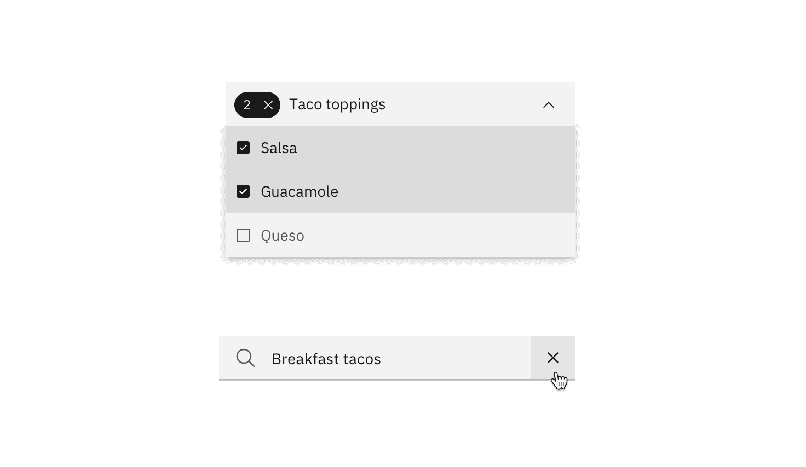
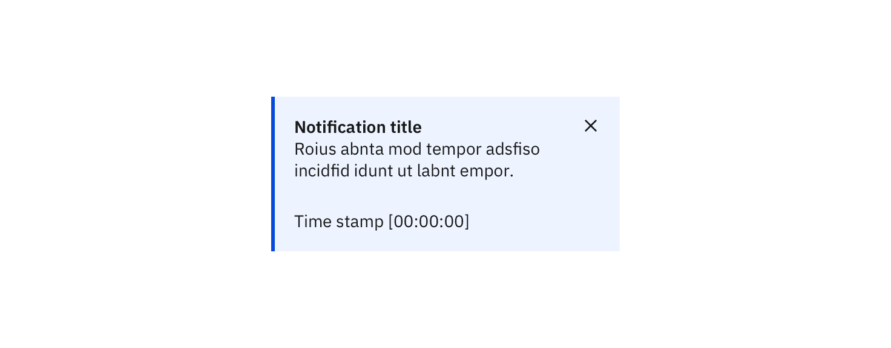
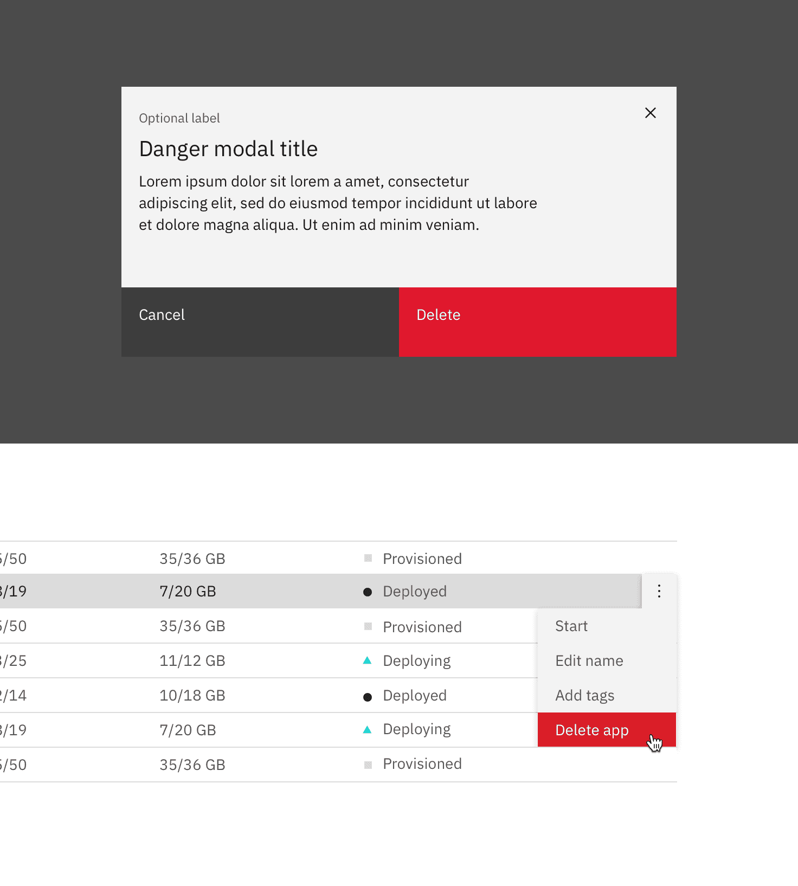
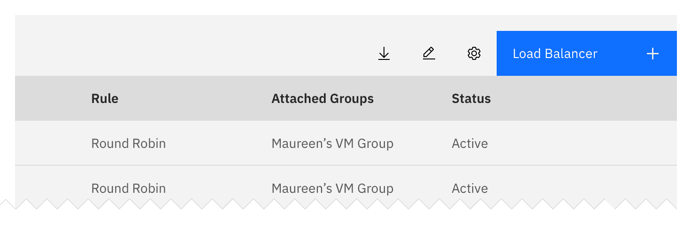

<PageDescription>

Common actions are frequently used actions that appear multiple times across different components and workflows. For platform consistency, these actions should only be applied in the ways described below.

</PageDescription>

## Regressive actions

<AnchorLinks small>

<AnchorLink>Cancel</AnchorLink>
<AnchorLink>Clear</AnchorLink>
<AnchorLink>Close</AnchorLink>
<AnchorLink>Delete</AnchorLink>
<AnchorLink>Remove</AnchorLink>
<AnchorLink>Reset</AnchorLink>

</AnchorLinks>

### Cancel

Cancel stops the current action and closes the component or item. The user should be warned of any possible negative consequences of stopping an action from progressing, such as data corruption or data loss.

Use a secondary button or a link for cancel actions.

### Clear

This action clears data from fields or removes selections. Clear can also delete the contents of a document, such as a log. Typically, the default selection or value is reset for controls that have a default selection or value, such as radio buttons.

Use the `x` icon on the right side of a field, item, or value.

### Close

This action closes the current page, window, or menu. One example is closing a secondary window containing help. Close is also used to dismiss information, such as notifications.

Use the `close` icon, which is typically placed on the upper right side of the element. Do not use close in a button.

### Delete

This action destroys an existing object. Delete actions cannot be easily undone and are typically permanent. The user should be warned of the negative consequences of destroying an object, such as loss of data. Use either the `delete` `trash can` icon, a danger button, or a danger option in a menu. A danger modal is used when a warning is needed to confirm an action.

#### Non-dangerous deletion (~5% of cases)

Use when it's trivial to undo deletion or re-create the item. Delete the item upon click or tap without further warning.

#### Moderate danger deletion (~80% of cases)

Use when an action cannot be undone or the item can't be easily recreated. Also use if you're deleting more than one thing.

Ask for confirmation of the delete, with guidance on what will occur if they delete.

#### High danger deletion (~15% of cases)

Use when it would be very expensive or time consuming to re-create an item. Also use if the action deletes a large number of items, or if other important items would be deleted as a result of the action.

In addition to presenting a dialog, have the user type the name of the resource they are deleting (manual confirmation).

#### Post-deletion flow

After the user deletes an item, return to the page that lists the item deleted. Animate the removal of the item from the list or page and present a success notification.

If deletion fails, raise a notification to tell the user that deletion failed. Also send a second a notification on another communication channel, like email, if possible. Animate the item back onto the page if possible.

### Remove

This action removes an object from a list or item; however, the object is not destroyed as a result of the action. Multiple objects can be removed at once.

#### Hierarchy and placement

Use as a button or `subtract` icon or glyph. The remove action will most likely not be the primary action on the page and should should not be overly emphasized.

#### Considerations

- What are the implications of the removing action for the user (example: financial, access, legal).
- This action can be confused with deleting.
- [Team question] Using an "X" icon can be confused with deleting, should it be used or not?
- A user may not have the correct permissions for this action.
- Can this action be undone? (if not, inform the user prior).
- What timeframe will the action take (seconds, minutes, hours, days)?
- Errors: failure to remove, etc.
- Is this a single or bulk action?

### Reset

This action reverts values back to their last saved state. The last saved state includes the values stored the last time the user clicked or triggered "Apply."

Reset is typically applied as a link.

## Progressive actions

<AnchorLinks small>

<AnchorLink>Add</AnchorLink>
<AnchorLink>Copy</AnchorLink>
<AnchorLink>Edit</AnchorLink>
<AnchorLink>Next</AnchorLink>
<AnchorLink>Refresh</AnchorLink>

</AnchorLinks>

### Add

This action adds an existing object to a list, set, or system. For example, adding a document to a folder.

#### Hierarchy and placement

Use a primary button, button with icon, `add--glyph` or `add--outline` icon.

Depending on the relevance of the add action on the page, the emphasis can be either, high, medium or low. For example, a high emphasis action should use a single prominent button that makes it clear that other buttons have less importance in the hierarchy.

#### Considerations

- What are the implications of the add action for the user (example: financial, access, legal).
- A user may not have the correct permissions for this action.
- This action can be confused with creating.
- Can this action be undone? (if not, inform the user prior).
- What timeframe will the action take (seconds, minutes, hours, days)?
- Errors: failure to add, etc.
- Is this a single or bulk action?

### Copy

Creates a new identical instance of the selected object(s) in a specific destination.

Use the `copy` icon with the confirmation "copied" tooltip appearing post-click.

### Edit

This action allows data or values to be changed. Edit commonly triggers a state change to the targeted object or input item.

Offer edit as an option in a menu, or as a button or `edit` icon.

### Next

Advances the user to the next step in a sequence of steps, such as in a wizard.

Use a button with icon or a standalone `forward` icon.

### Refresh

This action reloads the view of an object, list, or data set when the displayed view has become unsynchronized with the source.

Use the `refresh` icon or a button.

