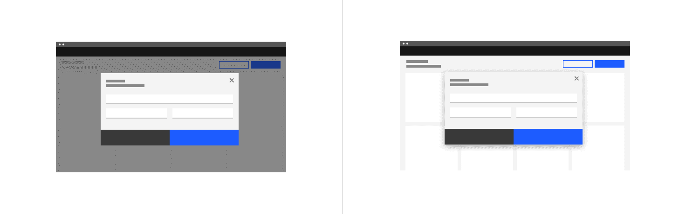
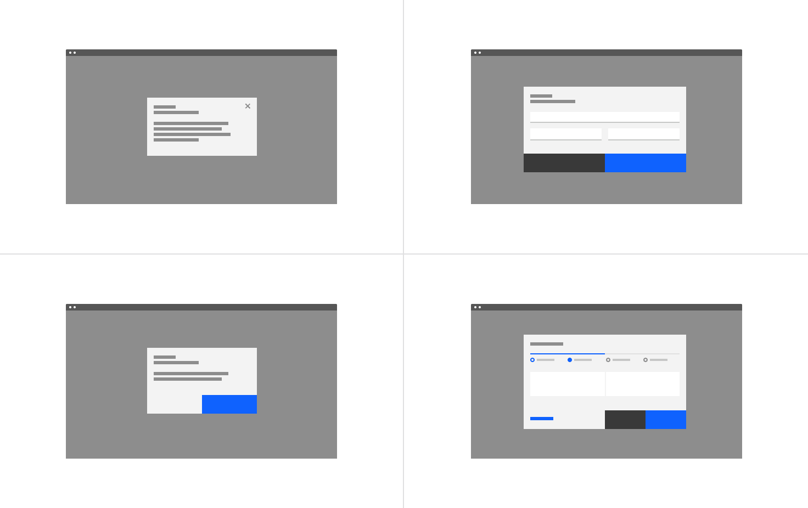
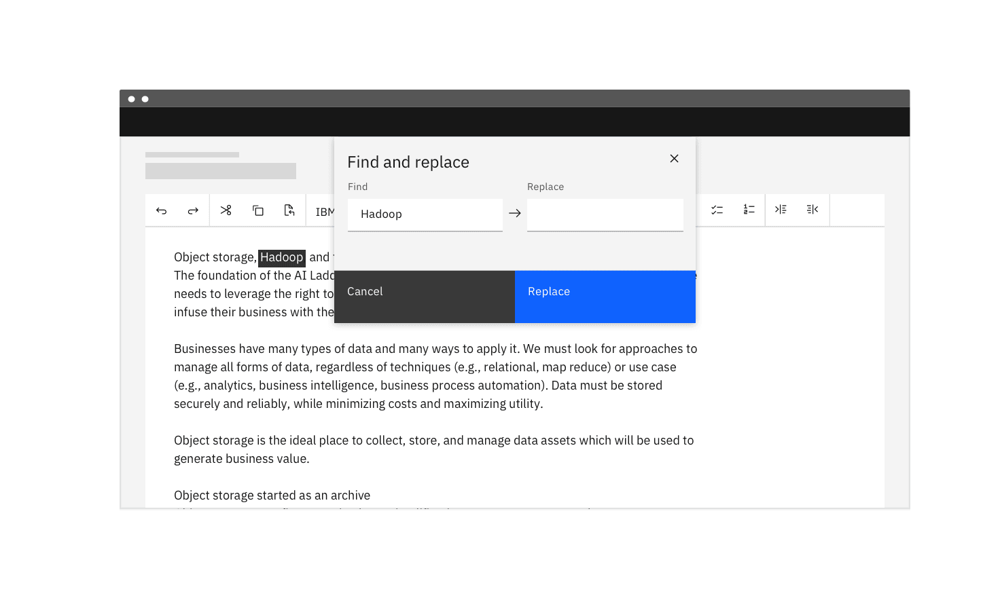
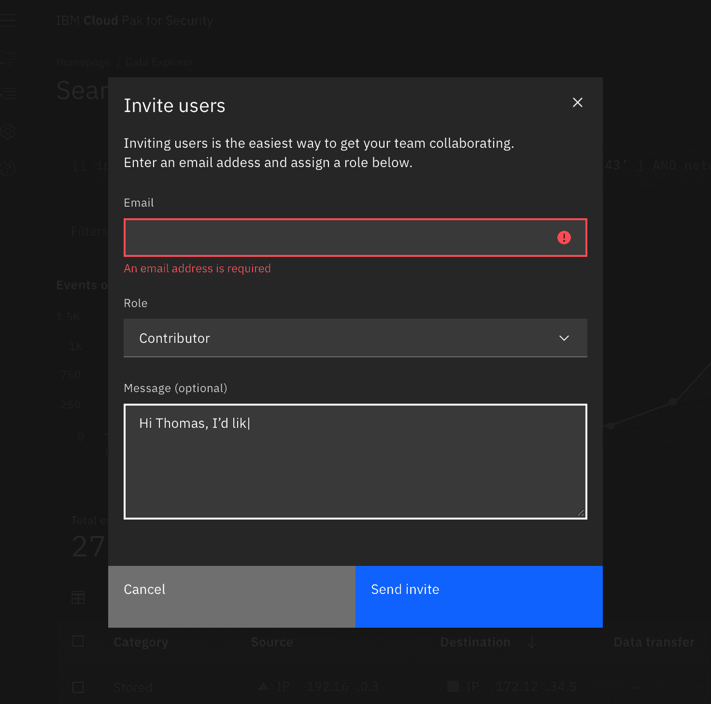
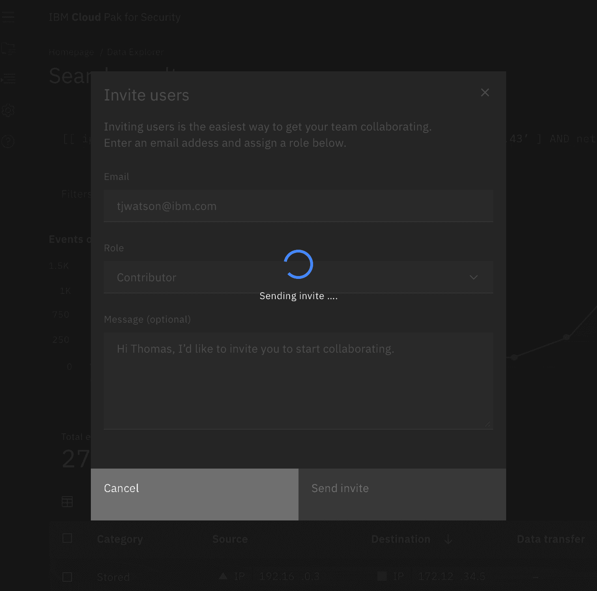
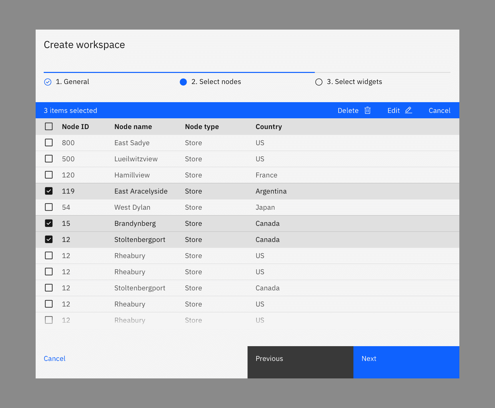
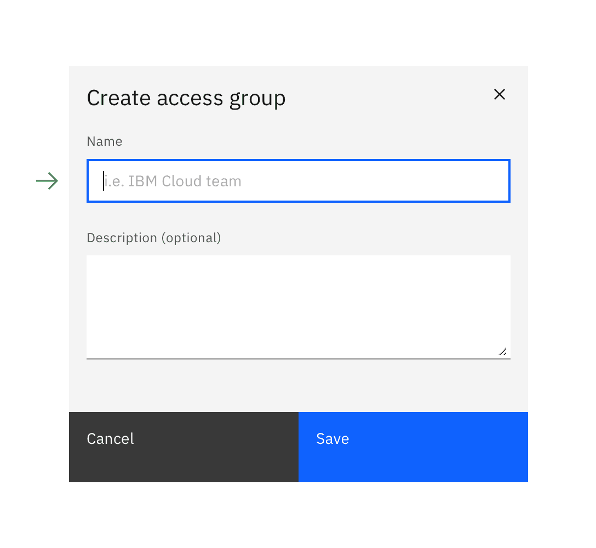
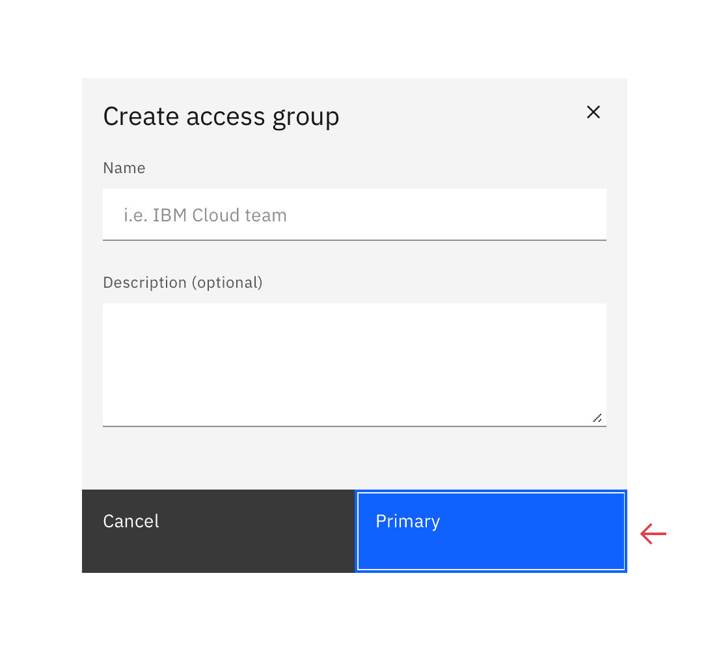

<PageDescription>

A dialog is a “conversation” between the system and the user. It is prompted
when the system needs input from the user or to give the user urgent information
concerning their current workflow. There are two types of dialogs, modal and
non-modal.

</PageDescription>

<AnchorLinks>

<AnchorLink>Overview</AnchorLink>
<AnchorLink>Modal dialogs</AnchorLink>
<AnchorLink>Non-modal dialogs</AnchorLink>
<AnchorLink>Designing with dialogs</AnchorLink>
<AnchorLink>Related components and patterns</AnchorLink>
<AnchorLink>Accessibility</AnchorLink>
<AnchorLink>References</AnchorLink>
<AnchorLink>Feedback</AnchorLink>

</AnchorLinks>

## Overview

Dialogs work best when used for short tasks or to alert the user to task
relevant information. Dialogs are useful in many scenarios; they are less
disorientating than navigating a user to a new page for simple tasks or
knowledge gathering. However, dialogs are disruptive and can be distracting to
the user. Use them sparingly.

A dialog is triggered by a user’s action, appears on top of the main page
content, and is persistent until dismissed. The purpose of a dialog should be
immediately apparent to the user, with a clear and obvious path to completion.

### Anatomy of a dialog

<Row>
<Column colLg={8}>

</Column>
</Row>

1. **Header:** Includes a title, optional label, and the close icon. The title
   should be brief and clearly describe the dialogs’s task or purpose. Use the
   optional label above the title set the context for the information in the
   dialog.
2. **Body:** Contains the information and/or controls needed to complete the
   dialog’s task. It can include message text and components.
3. **Actions:** The main actions needed to complete or cancel the dialog task.
   [Button groupings](/patterns/dialog-pattern#button-groups) change based on
   modal variant. Use descriptive words for the actions like Add, Delete, Save
   and avoid vague words like Done or OK.
4. **x:** The close `x` icon will close the dialog without submitting any data.
5. **Overlay:** (Modal dialogs only) Screen overlay that obscures the on page
   content.

### When to use a dialog

- Use to focus the user’s attention.
- Use for short task completion.
- Use to gather input from the user.
- Use to display relevant information.

### When not to use a dialog

- Don’t use if the content is unrelated to the current workflow.
- Don’t use to display complex or large amounts of data.
- Don’t recreate a full app or page in a dialog.
- Don’t use when the user hasn’t triggered the dialog.

### Dialog types

There are two types of dialogs, modal and non-modal.

A _modal_ dialog triggers a state (or mode) that focuses the user’s attention
exclusively on one task or piece of relevant information. When a modal dialog is
active, the content of the underneath page is obscured and inaccessible until
the user completes the task or dismisses the modal.

When a _non-modal_ dialog is active the user can continue viewing and
interacting with the main page while the dialog is open. Non-modal dialogs are
commonly used to present non-critical information or optional user tasks.

| Type      | Usage                                                                                        | Context                                                                                                                                                |
| --------- | -------------------------------------------------------------------------------------------- | ------------------------------------------------------------------------------------------------------------------------------------------------------ |
| Modal     | Use to present critical information or request required input needed to complete a workflow. | Focuses the users attention exclusively on one task or piece of information. On-page content is obscured from the user while the modal dialog is open. |
| Non-modal | Use to present non-critical information or optional user tasks.                              | On-page content can be accessed and interacted with while the dialog is still open.                                                                    |

<Row>
<Column colLg={8}>

</Column>
</Row>

<Caption>Modal dialog (left) and non-modal dialog (right)</Caption>

### Best practices

#### Use dialogs sparingly

Don’t overuse dialogs. They are disruptive and can easily annoy the user if used
incorrectly or too frequently. When dialogs are used for non-workflow related
tasks, it is likely a user will start ignoring or dismissing the dialogs without
fully understanding the content. This can cause users to make hurried or
impulsive choices when dealing with more critical dialogs.

#### Dialogs should be user initiated

A user action, such as clicking a button, should trigger the dialog to open.
Don’t interrupt the user by opening a dialog when they aren’t expecting it.
Avoid system generated pop-ups that distract the user while working, such as Net
Promoter Score. Triggers can either be a direct or indirect consequence of a
user’s action. An example of an indirect action is a user closing a tab with
unsaved content that then causes a dialog to ask if they want to save their
changes before closing. If the system is autogenerating an alert that is not a
consequence of a user’s action, but a response to processes happening in the
background, then a toast notification should be used instead.

#### Keep dialog tasks simple and focused

Dialog tasks should be direct and easy to complete. Avoid feature creep in
dialogs where a once simple dialog has become bloated with interactions. When
deciding to use a dialog consider how the task could expanded in the future and
if a dialog will be able to effectively incorporate additions. An example of a
simple task would adding a new item to a list where the item details are added
and submitted via a dialog.

## Modal dialogs

Use a modal dialog to present critical information or request user input needed
to complete a user’s workflow. Modal dialogs are disruptive and should be used
sparingly. When active, a user is blocked from the on-page content and cannot
return to their previous workflow until the modal task is completed or the user
dismisses the modal. Any information or input requested should be directly
related to the user’s task at hand.

Modal dialogs are commonly used for short and non-frequent tasks, such as
editing or management tasks. If a user needs to repeatedly perform a task,
consider making the task do-able from the main page. A modal dialog adds to a
workflow’s interaction cost; it takes the user out of their previous context and
requires additional actions to complete and dismiss. When considering, ask is
this critical to their current workflow?

<Row>
<Column colLg={8}>

</Column>
</Row>

### When to use

#### An immediate response is required from the user

Use a dialog to request information that is preventing the system from
continuing a user-initiated process.

#### Notify the user of urgent information

Use a modal dialog to notify the user of urgent information concerning their
current work. Commonly used to report system errors or convey a consequence of a
user’s action.

#### Confirm a user decision

Use a modal dialog to confirm user decisions. Clearly describe the action being
confirmed and explain any potential consequences that it may cause. Both the
title and the button should reflect the action that will occur. If the action is
destructive or irreversible then use a transactional danger modal.

### When not to use

#### Modals prevent access to the main page

Don’t use if additional information outside the modal needs to be consulted.
While a modal dialog is active a user cannot interact with the main page and is
restricted to only the information in the modal for making decisions. Modal
tasks should be easy to complete with the limited information presented in the
dialog itself. If a user needs access to additional information then consider
using a full page instead.

#### Don’t nest modals

One modal should never trigger another modal. If the first modal task is
dependent on a confirmation modal to approve then that first task should not be
preformed in a modal.

#### Don’t make modals full page

If a modal dialog needs more space than the large modal component allows then
the content should be displayed on a page of its own and not in a modal. A modal
is not an alternative to page.

### Modal variants

<Row>
<Column colLg={8}>

</Column>
</Row>

| Variant                                                        | Usage                                                                                                                           |
| -------------------------------------------------------------- | ------------------------------------------------------------------------------------------------------------------------------- |
| [Passive](/components/modal/usage#passive-modal)               | Presents information the user needs to be aware of concerning their current workflow. Contains no actions for the user to take. |
| [Transactional](/components/modal/usage#transactional-modal)   | Requires an action to be taken in order for the modal to be completed and closed. Contains a cancel and primary action buttons. |
| [Acknowledgment](/components/modal/usage#acknowledgment-modal) | System requires an acknowledgement of the information from the user. Contains only a single button, commonly "OK".              |
| [Progress](/components/modal/usage/#progress-modal)            | Requires several steps to be completed before it can be closed. Contains a cancel, previous and next/completion buttons.        |

### Dismissing variant modals

For passive modals:

- **x**: Clicking the close `x` icon in the upper right will close the modal
  without submitting any data and return the user to its previous context.
- **Click elsewhere**: Clicking outside the passive modal area will
  automatically close the modal.
- **Esc**: Press `ESC` on the keyboard

For transactional, progress, and acknowledgement modals:

- **Task completion**: clicking the primary action will complete the task and
  automatically close the modal.
- **Cancel button**: clicking the cancel button will close the modal and return
  the user to its previous context. Cancel undoes all applied changes.
- **x**: Clicking the close `x` icon in the upper right will close the modal
  without submitting any data and return the user to its previous context.
- **Esc**: Press `ESC` on the keyboard

## Non-modal dialogs

Use non-modal dialogs to display non-critical information or optional tasks
related to the user’s current workflow, like "find and replace". A user still
has access to the on-page content while the non-modal dialog is open and a
response is not required to continue working. However, a non-modal dialog does
require an action from the user to be dismissed.

<Row>
<Column colLg={8}>

</Column>
</Row>

 

### When to use

#### When access to the page is needed

Use when a user needs to compare or refer to information in the main page
alongside the modal. users can interact with the non-modal content and the
on-page content simultaneously.

A non-modal dialog window can be moved from its original placement on the
screen. This allows the user to access information that might otherwise be
hidden by the dialog.

#### Aid or accelerate a user’s work flow

Use to perform tasks or present informational along side the main page content
that can accelerate or aid a user’s workflow. For example, a "find and replace"
dialog can help a user perform and automate edits quicker. The user can chose to
automate the changes or navigate through the page by using the "find" feature
and manually make updates.

#### Display additional information

Use to display additional information that can help inform a user’s decision or
workflow. For example, use for incontext help or tutorials such as a knowledge
center.

### When not to use

#### Don’t use if the user’s response is required

Use for optional or non-critical tasks only. If a user’s response or input is
required to progress the workflow, use a modal dialog.

### Non-modal variants

| Name          | Description                                                                                                                 |
| ------------- | --------------------------------------------------------------------------------------------------------------------------- |
| Passive       | Presents additional information concerning the user’s current workflow. Contains no actions for the user to take.           |
| Transactional | Presents the user with optional action/s. Actions can be repeated without closing the dialog. Contains at least one button. |

### Dismissing non-modal dialogs

There are several possible ways to exit a non-modal dialog.

- **x**: Clicking the close `x` icon in the upper right will close the modal
  without submitting any data.
- **Cancel button**: If a cancel button is used then clicking it will close the
  modal. Cancel undoes all applied changes.
- **Esc**: Press `ESC` on the keyboard

## Designing with dialogs

### Button groups

When placing buttons, Cancel is always the outmost left button option and the
primary action is always the outmost right button. There should only ever be one
primary action per dialog. Dialog buttons are always full bleed and attached to
the bottom of a dialog.

<Row>
<Column colLg={8}>

</Column>
</Row>

<Caption>
  Button groups: one button, two buttons, three buttons, and progress buttons.
</Caption>

#### One button

Single buttons are placed on the right side, span 50% of the dialog, and bleed
to the edge. The single button format is most commonly used for acknowledgment
dialogs. In most scenarios, a primary button is used when only one button is
needed.

#### Two buttons

When using two buttons, the secondary button is on the left and the primary
button is placed on the right. Each button spans 50% of the dialog and are full
bleed to the edge.

#### Three buttons

When three buttons are needed, each is 25% of the dialog width and aligned to
the right side of the dialog. Only the outmost right button is allowed to be a
primary button with the other two being secondary buttons. If all three actions
have the same weight then all three should be secondary buttons.

#### Progress indicator buttons

The three progress indicator buttons are: Cancel, Previous, Next. Each button’s
width is 25% of the dialog window and are full bleed. Previous and Next should
be grouped together and placed on the right half of the dialog, with Previous as
a secondary button and Next as a primary button. The Cancel button is aligned to
left side of the dialog and uses a ghost button.

In the last step of the sequence, the Next button label should change to reflect
the final action.

### Behaviors

#### Trigger

Dialogs are triggered as a result of a user’s action and are not system
generated. Common components that can trigger a dialog include, button, link, or
icon.

#### Focus

Once the dialog is open, set the initial focus to the first location that
accepts user input. Focus should then remain trapped in the dialog until it is
closed.

#### Scrolling

The modal component has four set sizes and each size has a set max-height. If
the dialog content is longer than the dialog height then the body section should
scroll vertically with the header and footer remaining fixed in place.

#### Validation

Validate a user’s entries before the dialog is closed. If any entry is invalid
then the dialog should remain open with the entry marked with an error state and
include an inline error message. The message should inform the user what has
happened and provide guidance on next steps or possible resolutions. Effective
and immediate error messaging can help the user to understand the problem and
how to fix it.

When possible, we recommend validating the user’s data before submission. This
type of inline validation (aka
[client-side validation](/patterns/forms-pattern#errors-and-validation)) should
happen as soon as the field loses focus. This will help easily identify the
elements that need to be corrected. On field error messages should disappear
when the form criteria is met. If the data was not able to be submitted due to
server-side issues then an inline notification should appear.

Decrease the chances of invalid data by using selection controls and bound entry
controls components that provide users with specific input choices, for example
radio buttons and dropdowns.

<Row>
<Column colLg={8}>

</Column>
</Row>

<Caption>
  Real-time validation. The user has left the first required field empty.{' '}
</Caption>

#### Task completion and loading

The task completion action should take place immediately. If a short loading
period is needed then a loading spinner and overlay should appear on top of the
modal body area with content disabled. The primary action button should be
disabled while loading is in progress.

If the action requires more than a few seconds to complete, display progress
information elsewhere on the screen to inform the user how long it will take to
complete.

<Row>
<Column colLg={8}>

</Column>
</Row>

### Using components

Appropriate components to use in a dialog include form inputs and controls that
aid in collecting information from the user. Other components like content
switcher and structured list can be used to organize information. When possible,
avoid using complex components that can complicate task completion or prolong a
user’s time in the modal. A user’s journey through the modal should be direct
and short.

#### Avoid components that will direct the user away from the dialog

Avoid components like links that will take the user away from the current
context and the task at hand. A dialog’s purpose is to focus the user’s
attention on a particular task and should not encourage any action that is not
related to that task’s completion.

#### Avoid components that hide information

When possible avoid components that hide information or choices from the
user—like accordion and tabs—and require additional effort from the user to
discover all the available content. Time spent in a modal should be minimal and
only information needed to complete the task should be included. If there is too
much information for a user to consume in a dialog context, consider using a
full page instead.

#### Avoid complex interactions with data tables

When possible avoid using a data table in a dialog as it is a complex component
with its own workflow and decision making that can overly complicate a user’s
choice and task completion in relation to the dialog. If a data table is
necessary then the tables should be kept as simple as possible with limited
interactions. For example, you can use data table to make selections that will
be incurred by the dialogs action but avoid preforming table functions like
batch editing or batch actions inside the modal itself. For smaller sets of data
or selections consider using a structured list, dropdown, or tile set instead.

<DoDontRow>
<DoDont
type="do"
colMd={6} colLg={6}
caption="Do: keep data table interaction simple.">

</DoDont>
<DoDont
colMd={6} colLg={6}
type="dont"
caption="Don’t include complex interactions in data tables that are not necessary to complete the task at hand.">

</DoDont>
</DoDontRow>

## Accessibility

### Focus

1. Shift the focus into the dialog when triggered.
2. After the dialog opens, initial focus should be set on the first focusable
   element in the modal.
3. For modal dialogs, the focus should be trapped inside the dialog and must not
   move outside the modal until it is closed.
4. After a modal dialog closes, focus should return to the element that invoked
   the modal.

Reference
[WCAG 2.4.3 Focus order success criterion](https://www.w3.org/TR/UNDERSTANDING-WCAG20/navigation-mechanisms-focus-order.html)
for additional guidelines.

<DoDontRow>
<DoDont
type="do"
colMd={6} colLg={6}
caption="Do: after the dialog is opened, set focus to first focusable element.">

</DoDont>
<DoDont
colMd={6} colLg={6}
type="dont"
caption="Don’t set the first focus on the dialog button if there are inputs or selection to be made in the dialog.">

</DoDont>
</DoDontRow>

### Keyboard navigation

- `ESC`: close the dialog
- `tab`: navigates the user to the different interactive elements
- `space bar`: triggers the selected element
- `enter`: triggers the selected element

### Tab order

1. First interactive element in the body area.
2. Proceed left to right and top to bottom through the rest of the body
   elements.
3. Primary action
4. Secondary action
5. Close icon

### ARIA

See WAI-ARIA Authoring Practices
[Modal Dialog Example, Accessibility Features](https://www.w3.org/TR/wai-aria-practices-1.1/examples/dialog-modal/dialog.html)
section for best practices.

## Related components and patterns

<Row>
<Column colSm={2} colMd={2} colLg={4}>

#### Components:

- [Buttons](/components/button/usage)
- [Modal](/components/modal/usage)
- [Notification](/components/notification/usage)

</Column>
<Column colSm={2} colMd={2} colLg={4}>

#### Patterns:

- [Forms](/patterns/forms-pattern)
- [Notifications](/patterns/notification-pattern)

</Column>
</Row>

## References

- Apple Human Interface Guidelines,
  [Modality](https://developer.apple.com/design/human-interface-guidelines/ios/app-architecture/modality/)
  (2019)
- Apple Human Interface Guidelines,
  [Dialogs](https://developer.apple.com/design/human-interface-guidelines/macos/windows-and-views/dialogs/)
  (2019)
- Therese Fessenden,
  [Modal & Nonmodal Dialogs: When (& When Not) to Use Them](https://www.nngroup.com/articles/modal-nonmodal-dialog/)
  (Nielsen Norman Group, 2017)
- James Jacobs,
  [Modern Enterprise UI design — Part 2: Modal dialogs](https://medium.com/pulsar/modern-enterprise-ui-design-part-2-modal-dialogs-2ccd3cc33c92)
  (2019)
- Microsoft Docs,
  [About Dialog Boxes](https://docs.microsoft.com/en-us/windows/win32/dlgbox/about-dialog-boxes)
  (2019)
- [Web Content Accessibility Guidelines](https://www.w3.org/WAI/standards-guidelines/wcag/)
  (W3C, 2018)

## Feedback

Help us improve this pattern by providing feedback, asking questions, and
leaving any other comments on
[GitHub](https://github.com/carbon-design-system/carbon-website/issues/new?assignees=&labels=feedback&template=feedback.md).
