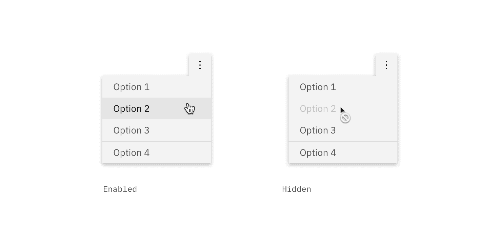
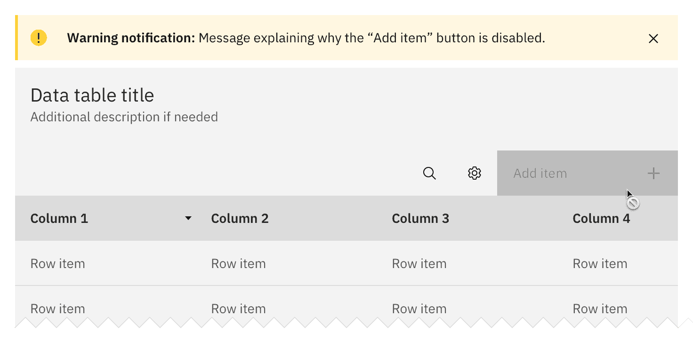
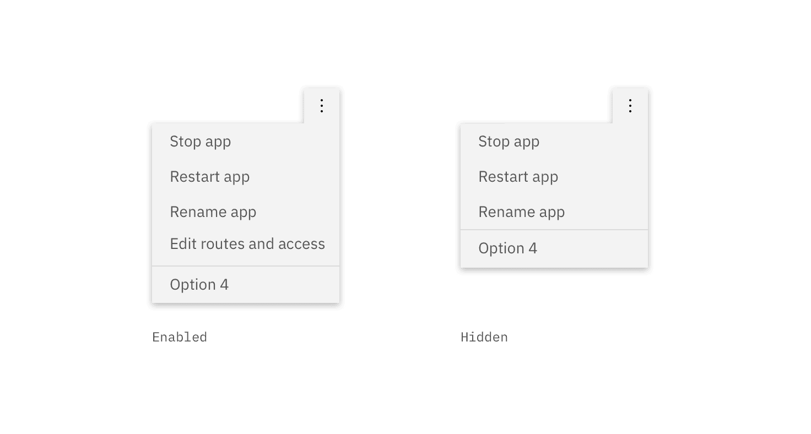

<PageDescription>

A disabled state is applied to a component when the user is not allowed to interact with the component due to either permissions, dependencies, or prerequisites. Disabled states completely remove the interactive function of a component.

</PageDescription>

<AnchorLinks>

<AnchorLink>Overview</AnchorLink>
<AnchorLink>The solution</AnchorLink>
<AnchorLink>Accessibility</AnchorLink>
<AnchorLink>Related</AnchorLink>
<AnchorLink>References</AnchorLink>
<AnchorLink>Feedback</AnchorLink>

</AnchorLinks>

## Overview

Disabled states are a way to deemphasize a page element and limit a user's ability to interact with components and information. By default, disabled components are not accessible by screen readers and the information within the component is never sent to a server. Read-only components, however, are a way to present important information to a user within a form or menu while preventing the user from interacting with, editing, or altering the information contained within.

### When to use

| State                             | Description                                                                                                                                                                                                           | When to use                                                                                                                                                         |
| --------------------------------- | --------------------------------------------------------------------------------------------------------------------------------------------------------------------------------------------------------------------- | ------------------------------------------------------------------------------------------------------------------------------------------------------------------- |
| [Disabled](#disabled)             | Cannot be clicked, selected or interacted with. It is not read by a screen reader and takes on the default disabled visual style.                                                                                     | When you want to deemphasize a page element without completely hiding it. Useful when missing prerequisites prevent a certain page function from working correctly. |
| [Read-only](#read-only)           | The user cannot interact with it but content is still readable and accessible to a screen reader. The visual style should contain no interactive indicators, hover states, or text embellishments (i.e., underlines). | When you still want a reader to see the content contained within a page element but don't want the user to interact with or change the data                         |
| [Hidden options](#hidden-options) | The component is completely hidden from view due to permission settings. The user does not know the option is there, and can only gain accesss to the option if an administrator grants permission.                   | When an option or function is permanantly disabled for a user and there is no possible action the user can take to enable it.                                       |

## The solution

### Disabled

Use a disabled state when a component is temporarily disabled due to dependencies (when one piece of software relies on another) or prerequisites. Components are only ever temporarily disabled. Once the dependencies have been resolved and the prerequisites have been met, the disabled component returns to its enabled state. Disabled components receive a default disabled style that should not be overridden.

If a component is permanantly disabled it should be [hidden](#hidden).

<Row>
<Column colLg={8}>

<Caption>
  Comparison between an enabled menu item and a disabled menu item
</Caption>

</Column>
</Row>

#### Additional warning

An [inline warning notification](/components/notification/code) can be shown in cases where a temporarily disabled item affects multiple items or the primary action of the flow. The notification should describe how the user can enable or reenable the disabled component.

<Row>
<Column colLg={8}>

<Caption>Example of a disabled button with an additional warning</Caption>

</Column>
</Row>

### Read-only

If the content of a disabled component or element is still relevant to the user or important to task completion, use the read-only variation. This allows the user to read the information but not change it. Read-only content should always be [accessible to a screen reader](https://www.w3.org/TR/html401/interact/forms.html#h-17.12).

#### Style

The visual style of the read-only states vary by component but should never contain any interactive indicators such as `$brand-01` color usage, hover states, or text embellishments (i.e., underlines).

### Hidden options

If a user doesn't have the ability to enable a functionality by addressing dependencies or prerequisites, the option should be completely hidden. An administrator must change the user's permissions to resurface the hidden item.

For example, when a user is the organization owner they are allowed to edit data routes and user access. Any user that is not an organization owner would not be shown the “Edit routes and access” button on a team directory page. If the user is made an organization owner the button will become visible.

<Row>
<Column colLg={8}>

<Caption>Comparison between a visible menu item and a hidden menu item</Caption>

</Column>
</Row>

## Accessibility

Follow all Carbon accessibility guidance provided for [individual components](/components/overview) and follow [WCAG guidance](https://www.w3.org/TR/html401/interact/forms.html#h-17.12) for all other applications of disabled and read-only states.

> In contexts where user input is either undesirable or irrelevant, it is important to be able to disable a control or render it read-only. For example, one may want to disable a form's submit button until the user has entered some required data. Similarly, an author may want to include a piece of read-only text that must be submitted as a value along with the form.
>
> <cite>- Web Content Accessibility Guidelines. (W3C, 2020)</cite>

## Related

<Row>
<Column colSm={2} colMd={2} colLg={2}>

#### Components

- [Button](/components/button/usage)
- [Dropdown](/components/dropdown/usage)
- [Form](/components/form)
- [Text input](/components/text-input/usage)
- [Tooltip](/components/tooltip/usage)

</Column>
<Column colSm={2} colMd={2} colLg={3}>

#### Patterns

- [Forms](/patterns/forms-pattern)
- [Notifications](/patterns/notification-pattern)

</Column>
</Row>

## References

- Web Content Accessibility Guidelines, [Forms](https://www.w3.org/TR/html401/interact/forms.html#h-17.12), (W3C, 2020)

## Feedback

Help us improve this pattern by providing feedback, asking questions, and leaving any other comments [on GitHub](https://github.com/carbon-design-system/carbon-website/issues/new?assignees=&labels=feedback&template=feedback.md).
