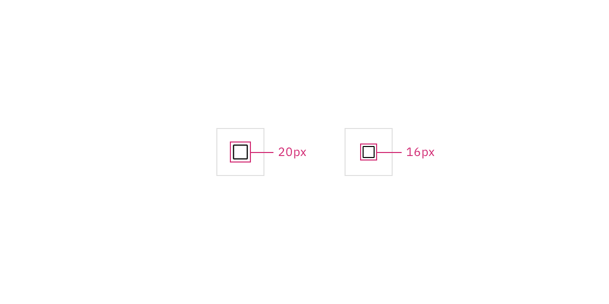

<PageDescription>

Status indicators are an important method of communicating severity level
information to users. Different shapes and colors enable users to quickly assess
and identify status and respond accordingly.

</PageDescription>

<AnchorLinks>

<AnchorLink>Overview</AnchorLink>
<AnchorLink>Designing with disclosures</AnchorLink>
<AnchorLink>Profile menu</AnchorLink>
<AnchorLink>Context menu</AnchorLink>
<AnchorLink>Settings and filter menus</AnchorLink>
<AnchorLink>Combo button</AnchorLink>
<AnchorLink>Related</AnchorLink>
<AnchorLink>References</AnchorLink>
<AnchorLink>Feedback</AnchorLink>

</AnchorLinks>

## Overview

Disclosures support a wide range of different usecases in product interfaces and
are commonly used to reveal more information or details about an element or
content on a page. Disclosures can contain interactive elements while preserving
accessible functionality.

At its core, a disclosure is comprised of two parts—a trigger that the user
interacts with by clicking or using their keyboard and the popover that opens
and discloses the content.

### When to use

- Use when disclosing additional content about part of a UI.
- Use when there is a need to include interactive elements in a popover.
- Use to show settings, filtering or sorting menus that affect large sections of
  a page,for example in data tables, or an entire page.
- Use when displaying content within types of menus, for example profile menus,
  context menus, combo buttons, and menu buttons.

### When not to use

- Don't use to present critical information or request required input needed to
  complete a workflow. Use the
  [modal component](https://www.carbondesignsystem.com/components/modal/usage/)
  instead.
- Don’t use when the user hasn’t explicitly triggered the popover to open on
  click.
- Don't use if the popover needs to have a width larger than six columns.

### Best practices

#### Keep disclosures at a reasonable size

A disclosure should not take up a considerable amount of the size of the screen.
Disclosures are meant to be smaller moments that can open on top of different
areas of a page. They should not seem like a disruption to the users workflow
and should not act as a screen takeover. Keep all content in a disclosure
concise and only include information that is necessary. We recommend having a
width of six columns or less.

#### Disclosures should be user initiated

A user action, such as clicking an interactive element, should trigger the
disclosure to open. Disclosures should not open without first being triggered by
the user.

#### One disclosure should open at a time

If there are multiple instances on a page where a disclosure is present, only
one should open at a time to avoid screen clutter and to help the user stay
focused on the information being disclosed.

<DoDontRow>
<DoDont
type="do"
caption="Do have one disclosure open at a time.">

</DoDont>

<DoDont
type="dont"
caption="Do not have multiple disclosures open at the same time.">

</DoDont>
</DoDontRow>

### Avoid nesting disclosures

Do not nest one disclosure within another disclosure. Nesting disclosures
creates a stacking effect and could confuse the user of where they should be
focusing their attention and which disclosure they should be interacting with.
Using submenus that fly out to the sides of a context menu is an acceptable way
to disclose more information in an additional popover.

### Do not hide critical information within a disclosure

Disclosures should not contain any required information needed to complete a
workflow. Information should be optional or additional content that the user can
read or interact with.

### Use the toggletip component when appropriate

A toggletip follows the disclosure pattern but is also offered as its own
component with the functionality built in. Use the toggletip component when the
popover is triggered `on click` \*\*\*\*with a mouse or by pressing `Enter` or
`Space` while the trigger element has focus.

See the toggletip component usage guidance for more information.

### Behaviors

**Opening and closing a disclosure**

To open a disclosure to reveal its content, click the trigger button it is
related to. To close a disclosure, either click on the trigger button again,
click anywhere outside of the open disclosure container or click on the close
`x` icon if it is present within the disclosure.

<Row>
<Column colLg={8}>

</Column>
</Row>

<Caption>Example of a disclosure opening and closing.</Caption>

#### Dismissible action

Depending on the type of content in a disclosure, it can be useful to display a
close `x` icon. Be mindful when and where you place a close icon in a
disclosure. The close icon should always be in the top right corner of the
popover and should not interfere or overlap with inline interactive elements.

<DoDontRow>
<DoDont
type="do"
caption="Do place a close icon in the upper right hand corner in an empty space.">

</DoDont>

<DoDont
type="dont"
caption="Do not place a close icon inline with interactive elements.">

</DoDont>
</DoDontRow>

### Visual guidance

#### Trigger button container

A disclosure is controlled by a trigger button. The trigger button can visually
change its shape and size depending on the usecase.

The trigger button can use any of our button types and can be set at these three
sizes—48px (lg), 40px (md) or 32px (sm).

<Row>
<Column colLg={8}>

</Column>
</Row>

<Caption>Example of trigger button container height sizes.</Caption>

#### Trigger button icon

If a trigger button contains an icon, the icon size should be either 20px or
16px.

<Row>
<Column colLg={8}>

</Column>
</Row>

<Caption>Example of trigger button icon sizes.</Caption>
