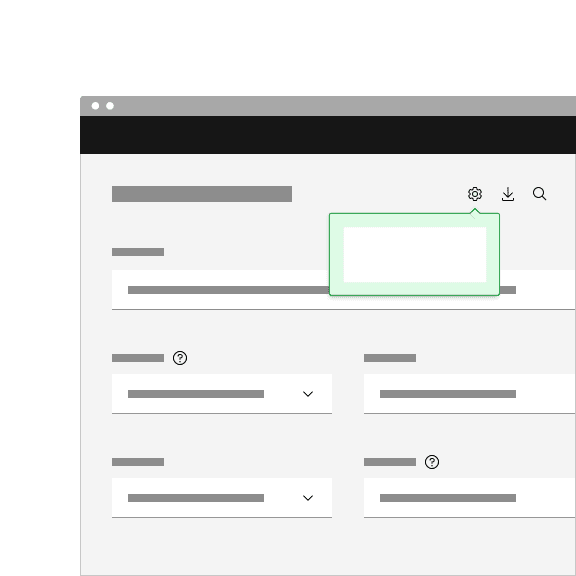
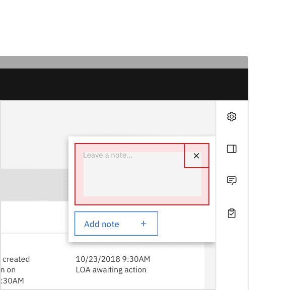
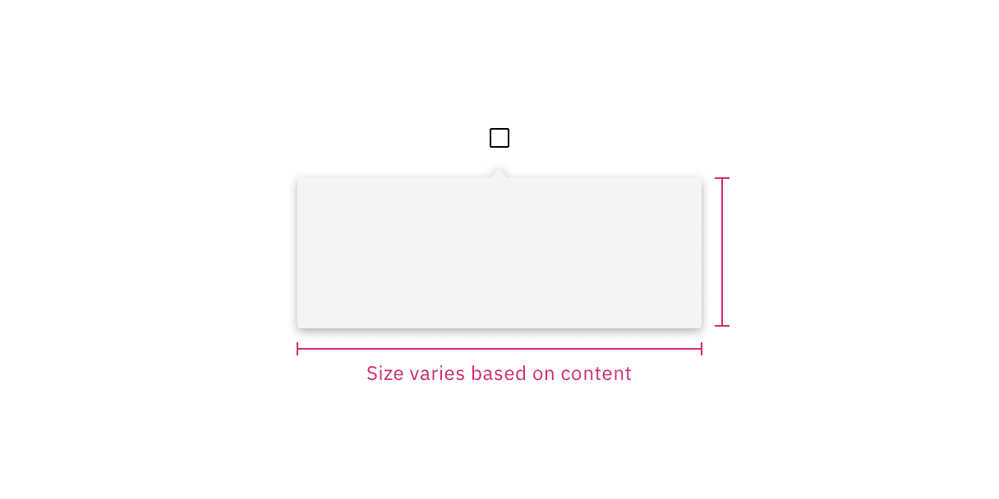
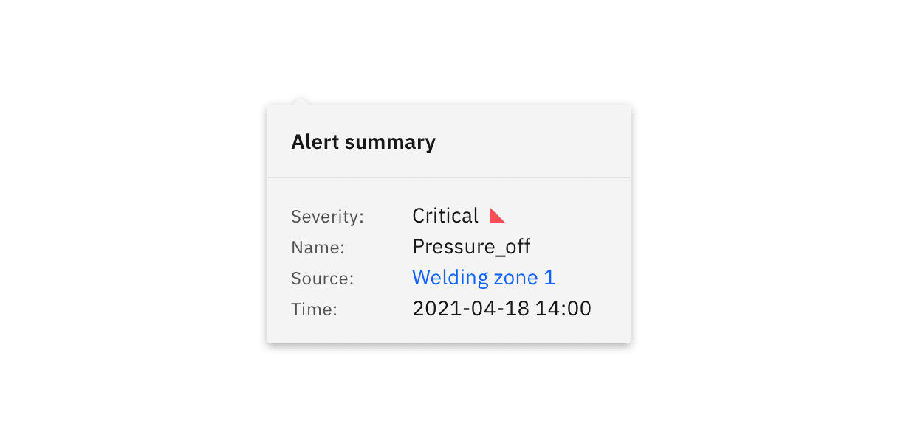
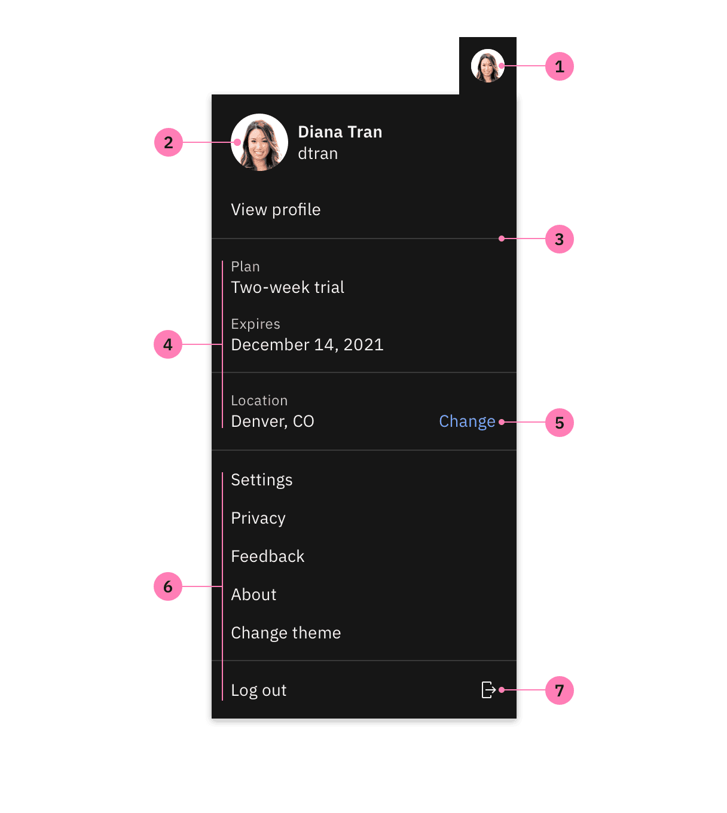
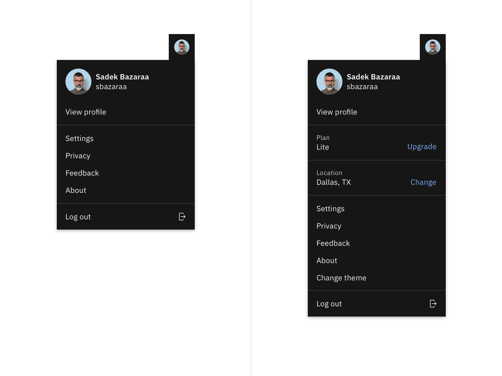
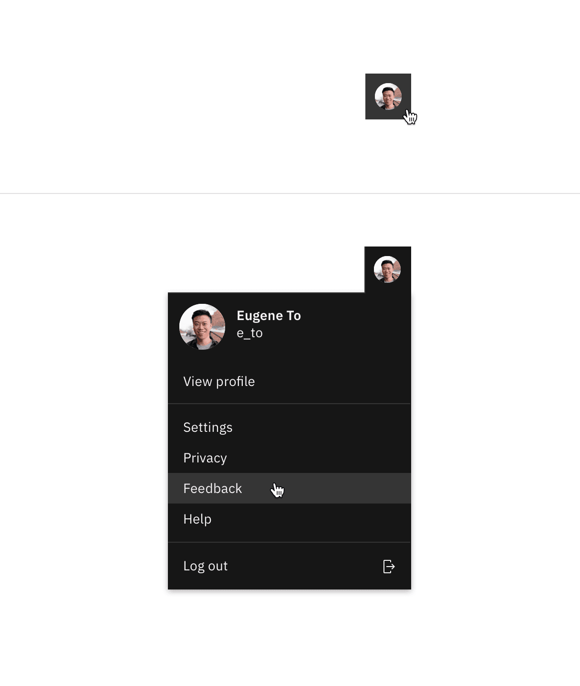
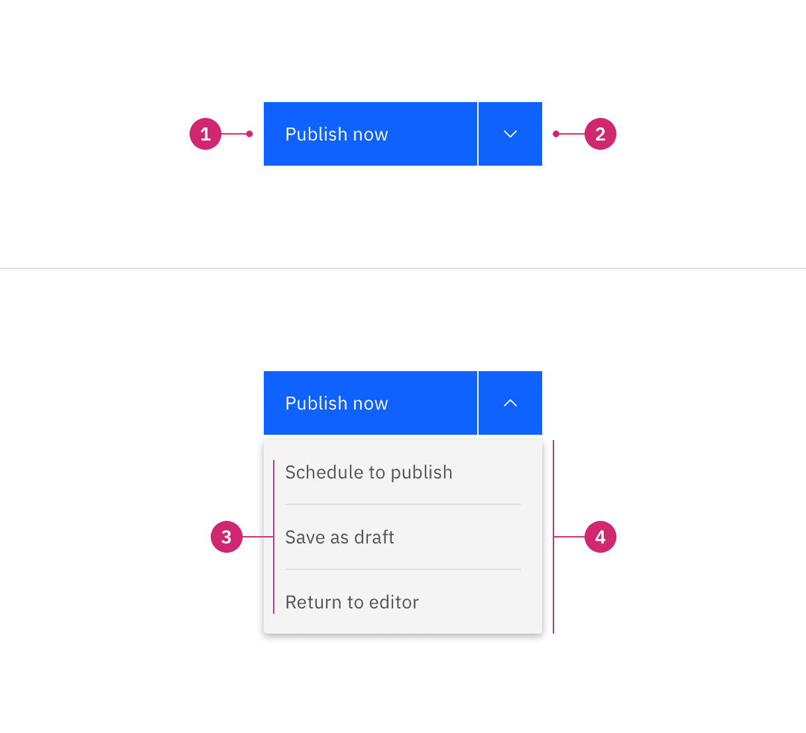

<PageDescription>

Disclosures are small moments that open up on a page and reveal additional
information related to the source it is triggered from.

</PageDescription>

<AnchorLinks>

<AnchorLink>Overview</AnchorLink>
<AnchorLink>Designing with disclosures</AnchorLink>
<AnchorLink>Profile menu</AnchorLink>
<AnchorLink>Context menu</AnchorLink>
<AnchorLink>Settings and filter menus</AnchorLink>
<AnchorLink>Combo button</AnchorLink>
<AnchorLink>Related</AnchorLink>
<AnchorLink>References</AnchorLink>
<AnchorLink>Feedback</AnchorLink>

</AnchorLinks>

## Overview

Disclosures support a wide range of different use cases in product interfaces
and are commonly used to reveal more information or details about an element or
content on a page. Unlike tooltips, the content expanded by a disclosure may
contain interactive elements.

At its core, a disclosure is comprised of two parts—a trigger that the user
interacts with by clicking or using their keyboard and the container that opens
and discloses the content.

### When to use

- Use when disclosing additional content about part of a UI.
- Use when there is a need to include interactive elements in a popover.
- Use to show settings, filtering, or sorting menus that affect large sections
  of a page, for example in data tables, or an entire page.
- Use when displaying content within types of menus, for example profile menus,
  combo buttons, and menu buttons.

### When not to use

- Don't use to present critical information or request required input needed to
  complete a workflow. Use the
  [modal component](https://www.carbondesignsystem.com/components/modal/usage/)
  instead.
- Don’t use when the user hasn’t explicitly triggered the popover to open on
  click.
- Don't use if the popover needs to have a width larger than six columns.

### Best practices

#### Keep disclosures at a reasonable size

A disclosure should not take up a considerable amount of the size of the screen.
Disclosures are meant to be smaller moments that can open on top of different
areas of a page. They should not seem like a disruption to the users workflow
and should not act as a screen takeover. Keep all content in a disclosure
concise and only include information that is necessary. We recommend having a
width of six columns or less.

#### Disclosures should be user initiated

A disclosure should not take up a considerable amount of the size of the screen.
Disclosures are meant to be smaller moments that can open on top of different
areas of a page. They should not seem like a disruption to the users workflow
and should not act as a screen takeover. Keep all content in a disclosure
concise and only include information that is necessary. We recommend having a
width of six columns or less.

#### One disclosure should open at a time

If there are multiple instances on a page where a disclosure is present, only
one should open at a time to avoid screen clutter and to help the user stay
focused on the information being disclosed.

<DoDontRow>
<DoDont
type="do"
caption="Do have one disclosure open at a time.">

</DoDont>

<DoDont
type="dont"
caption="Do not have multiple disclosures open at the same time.">

</DoDont>
</DoDontRow>

#### Avoid nesting disclosures

Do not nest one disclosure within another disclosure. Nesting disclosures
creates a stacking effect and could confuse the user of where they should be
focusing their attention and which disclosure they should be interacting with.
Using submenus in a context menu that fly out to the sides is an acceptable way
to disclose additional information in a disclosure.

#### Do not hide critical information within a disclosure

Do not nest one disclosure within another disclosure. Nesting disclosures
creates a stacking effect and could confuse the user of where they should be
focusing their attention and which disclosure they should be interacting with.
Using submenus in a context menu that fly out to the sides is an acceptable way
to disclose additional information in a disclosure.

#### Use the toggletip component when appropriate

A toggletip follows the disclosure pattern but is also offered as its own
component with the functionality built in. Use the toggletip component when the
popover is triggered `on click` with a mouse or by pressing `Enter` or `Space`
while the trigger element has focus.

### Behaviors

**Opening and closing a disclosure**

To open a disclosure to reveal its content, click the trigger button it is
related to. To close a disclosure, either click on the trigger button again,
click anywhere outside of the open disclosure container or click on the close
`x` icon if it is present within the disclosure.

#### Dismissible action

Depending on the type of content in a disclosure, it can be useful to display a
close `x` icon. Be mindful when and where you place a close icon in a
disclosure. The close icon should always be in the top right corner of the
popover and should not interfere or overlap with inline interactive elements.

<DoDontRow>
<DoDont
type="do"
caption="Do place a close icon in the upper right hand corner in an empty space.">

</DoDont>

<DoDont
type="dont"
caption="Do not place a close icon inline with interactive elements.">

</DoDont>
</DoDontRow>

### Visual guidance

#### Trigger button container

A disclosure is controlled by a trigger button. The trigger button can visually
change its shape and size depending on the usecase.

The trigger button can use any of our button types and can be set at these three
sizes—48px (lg), 40px (md) or 32px (sm).

<Row>
<Column colLg={8}>

</Column>
</Row>

<Caption>Example of trigger button container height sizes.</Caption>

#### Trigger button icon

If a trigger button contains an icon, the icon size should be either 20px or
16px.

<Row>
<Column colLg={8}>

</Column>
</Row>

<Caption>Example of trigger button icon sizes.</Caption>

#### Popover

A popover is a layer that appears above all other content on the page. Only one
popover can appear at a time and can contain varying text and interactive
elements while still being accessible. Popovers are used as a base layer in some
of our components like tooltips, overflow menus, and dropdown menus. The
disclosure pattern uses the popover component to disclose information.

See the
[popover component](https://v11.carbondesignsystem.com/components/popover/usage/)
guidance for more information.

<Row>
<Column colLg={8}>

</Column>
</Row>

<Caption>Example of a popover container.</Caption>

### Content

The type of content in a disclosure can vary depending on the use case. A
disclosure can be simple and contain solely informational text. In some cases
content can be more complex and include a combination of multiple sections and
interactive elements. Below are some common examples and best practices of how
to show body text, heading text, and footer content in disclosures.

#### Heading text

Heading text can be placed above body text in a disclosure. Placing the heading
text with 0px padding above the body text or adding a divider between the
heading text and body text are two different common use cases.

<Row>
<Column colLg={8}>

</Column>
</Row>

<Caption>Example of a disclosure with heading text.</Caption>

#### Footer content

Footer content can be placed below the body text it is related to. Placing the
footer content with 16px padding below the body text or adding a divider between
the footer content and body text are two different common use cases.

<Row>
<Column colLg={8}>

</Column>
</Row>

<Caption>Example of a disclosure with footer content.</Caption>

#### Multiple sections of text

Depending on the use case, you may need a disclosure to show multiple sections
of content. Use padding or dividers to visually create sections. Profile menus
and context menus typically display multiple sections of content depending on
the complexity of the menu.

<Row>
<Column colLg={8}>

</Column>
</Row>

<Caption>Example of a disclosure with multiple sections.</Caption>

#### Interactive elements

Disclosures allow you to place interactive elements in a popover while still
keeping it accessible. Settings and filters often include components like radio
buttons and checkboxes that the user can interact with to adjust specific
content. Searching within a menu is another common use case of including
interactive elements within a popover.

<Row>
<Column colLg={8}>

</Column>
</Row>

<Caption>Example of a disclosure with interactive content.</Caption>

## Common use cases

Disclosures are used for a wide variety of use cases. The following variants are
a few examples of common disclosures that you may come across frequently in
product interfaces.

| Example                   | Use cases                                                                                                                                                                                                              |
| ------------------------- | ---------------------------------------------------------------------------------------------------------------------------------------------------------------------------------------------------------------------- |
| Profile menu              | Profile menus are typically part of a UI shell header and can have navigational options related to a users account or active session.                                                                                  |
| Settings and filter menus | Settings and filter menus are frequently used within data table toolbars to enable users to adjust content. Filter and sort menus can also be used for filtering large amounts of content on a page or an entire page. |
| Combo button              | Combo buttons are used to contain multiple related actions that come with a default, primary action. Additional actions live in the menu.                                                                              |

## Profile menu

Profile menus follow the disclosure pattern by clicking an icon button that
opens a popover. Profile menus are essential to a product's UI and users rely on
it to find global content related to their account, product, and active session
information. Profile menus provide a way to log in or out of an account and let
users access their settings. Additional links and icons can be added to a
profile menu depending on the use case.

See the
[profile menu pattern](https://pages.github.ibm.com/cdai-design/pal/patterns/profile-header-menu/)
for more information.

### Anatomy

<Row>
<Column colLg={8}>

</Column>
</Row>

<Caption>Anatomy of a profile menu.</Caption>

1. **Toolbar profile image:** A profile image, initials, or icon of a user.
2. **Menu profile image:** A profile image that is paired with high level
   information about the user, such as a name or handle.
3. **Section dividers (optional):** To group related content by creating visual
   sections.
4. **Contextual information (optional):** Global information that is related to
   the account or active session.
5. **Link (optional):** Additional links that are not main menu items. Links can
   be used for editing, prompting a modal, etc.
6. **Menu items:** The main and most commonly used menu items that are
   navigational.
7. **Icon (optional):** Additional icons to place inline with menu items.

### Structure

A profile menu is made up of two parts—an icon button and a popover. Profile
menus support a variety of content that can range in complexity. Some profile
menus are simple while other menus may be more complex and require multiple
sections of information. Profile menus that are complex may benefit from
including interactive elements depending on the use case.

<Row>
<Column colLg={12}>

</Column>
</Row>

<Caption>Example of a simple and complex profile menu.</Caption>

### Functionality

#### Mouse

Clicking the icon button triggers the profile menu to open and reveals
information related to the users profile and account. The user can then click on
menu items and other interactive elements within the menu. To close the menu,
click on the icon button trigger again or anywhere on the page out side of the
menu.

<Row>
<Column colLg={8}>

</Column>
</Row>

#### Keyboard

- `Tab` to the icon button trigger to apply focus.
- To open the profile menu press `Enter` or `Space`.
- To navigate the profile menu items press the `Up` and `Down` arrow keys.
- To select an item in the profile menu press `Enter`.
- To close the profile menu press `Enter`, `Space`, or `Esc` .

### Best practices

#### Use with a global toolbar header

If a product has a global toolbar header and offers login capabilities use the
profile menu. Provide a way for the user to log out of an account, make changes
to profile information, or navigate to settings.

#### Show information that is pertinent to the user account or session

Include sections on a global contextual level that may be helpful to the user to
see in the profile menu. For example, indicating the current plan or location
with an option to edit or change the current information can be valuable to
include in a profile menu depending on the use case.

#### Add icons and links to help guide the user

When appropriate, pair icons with related menu items or information to indicate
the action that will be performed once it is clicked. Provide links next to
related menu items or information to specify there are additional quick actions
to take, whether it be upgrading an account plan or changing a location. Only
add icons and links to a profile menu if completely necessary in order to not
overwhelm the user and to reduce visual clutter within the menu.

## Settings and filter menus

Settings and filters follow the disclosure pattern by clicking an icon button
that opens a popover. Interactive elements are often found in settings and
filters in order to modify or adjust specific content. The disclosure pattern
allows you to nest interactive elements inside of a popover while still being
accessible.

### Anatomy

<Row>
<Column colLg={8}>

</Column>
</Row>

<Caption>Anatomy of a settings menu.</Caption>

1. **Icon button:** A trigger to open and close the popover.
2. **Menu:** Uses the popover component as an underlying layer.
3. **Content area:** Area to place text and interactive elements.
4. **Button group (optional):** To cancel or apply changes in settings or
   filters that affect other content on the page.

### Structure

Settings or filter menus are made up of two parts—an icon button and a popover.
These types of menus usually contain interactive elements. For example, use
links to clear filters, use checkboxes, radio buttons, or dropdowns to adjust
content and use sets of buttons to reset or apply changes. Content may vary
depending on what is being filtered, sorted, or what settings need to be
defined.

<Row>
<Column colLg={8}>

</Column>
</Row>

### Functionality

#### Mouse

Clicking the icon button triggers the popover to open. Upon opening the menu,
the first interactive element in the menu receives focus. To close the menu
click on the icon button again, or anywhere on the page outside of the menu.

<Row>
<Column colLg={8}>

</Column>
</Row>

#### Keyboard

- `Tab` to the icon button trigger to apply focus.
- To open the settings or filter menu press `Enter` or `Space`.
- Upon opening the menu, the first interactive element in the menu receives
  focus.
- To shift focus to different interactive elements in the menu press the `Up` or
  `Down` arrow keys.
- To close the profile menu press `Enter`, `Space`, or `Esc` .

### Best practices

#### Use a set of buttons to apply all changes

In some use cases when live filtering is not feasible or the preferred method,
use a set of buttons to either reset or apply all selected changes in the
settings or filter menu. Once the "Apply" button has been selected, the menu
closes and the results are updated.

#### Don't overcrowd menus with unnecessary content

Only include content or interactive elements that are necessary. Overcrowding
disclosures with too many options or additional content can be distracting to
the user.

#### Include enough space between elements

When placing interactive elements, be mindful of the padding between the
interactive element and other content in the disclosure. A good rule of thumb is
to keep at least 16px padding between different elements and content.

## Combo button

A combo button is a type of disclosure pattern and displays a primary default
action that discloses a list of additional, related actions to choose from in a
popover.

### Anatomy

<Row>
<Column colLg={8}>

</Column>
</Row>

<Caption>Anatomy of a combo button.</Caption>

1. **Primary button:** A default action.
2. **Icon button:** A trigger to open and close the popover.
3. **Content area:** A list of additional actions.
4. **Menu:** Uses the popover component as an underlying layer.

### Structure

A combo button is made up of three parts—a primary button, an icon button, and a
popover. Dividers are shown to visually separate different actions that are
related to each other.

<Row>
<Column colLg={8}>

</Column>
</Row>

### Functionality

#### Mouse

Clicking the primary default button will perform the defaulted action. Clicking
the icon button triggers the popover to open and reveals the additional actions
to choose from in a menu. Clicking on an action in the menu will perform the
action. To close the menu click on the icon button again, or anywhere on the
page outside of the menu.

<Row>
<Column colLg={8}>

</Column>
</Row>

#### Keyboard

Primary default button: `Tab` to the primary default button to apply focus.
Trigger the primary default button by pressing `Enter` or `Space`.

Icon button: `Tab` to the icon button to apply focus. Open the menu by
pressing `Enter`, `Space`, or the `Down` arrow key.

Menu: When the menu is opened, focus will go to the first additional action in
the menu list. Move between menu actions by pressing the `Up` and `Down` arrow
keys. Close the menu by pressing `Enter` or  `Space` to activate the action with
focus or `Esc` to cancel.

### Best practices

#### Choose a default action

Remember to choose the default, primary action that will be displayed in the
primary button so it is not hidden within the menu of additional actions. The
primary default action is typically the most commonly used action there is to
take.

#### Use to reduce visual complexity on a page

Combo buttons reduce visual complexity by grouping similar commands together.
For example, how navigation menus group together related options to enable
conceptual understanding of the site information structure.

#### Avoid using extra icons

Avoid using extra icons inside of the default, primary button and the additional
actions in the menu to reduce visual noise between elements. Keep button labels
clear and concise.

<DoDontRow>
<DoDont
type="do"
caption="Do have only text in the primary default button.">

</DoDont>

<DoDont
type="dont"
caption="Do not include an icon in the primary default button or next to additional actions.">

</DoDont>
</DoDontRow>

## Accessibility

#### Screen readers

VoiceOver: Users can trigger a button to open a disclosure popover by pressing
`Enter` or `Space` while the trigger has focus.

JAWS: Users can trigger a button to open a disclosure popover by pressing
`Enter` or `Space` while the trigger has focus.

NVDA: Users can trigger a button to open a disclosure popover by pressing
`Enter` or `Space` while the trigger has focus.

## Related

#### Button

Buttons are clickable interactive elements that are commonly used in disclosures
as the trigger to open a popover. There are multiple variants of button that
should be used in for certain use cases. For further guidance, see Carbon's
[button component](https://www.carbondesignsystem.com/components/button/usage/)
guidance.

#### Popover

Popovers are frequently used in disclosures to show additional content. Popovers
are also used in components like tooltips, overflow menus, and dropdown menus.
For further guidance of how to use a popover, see Carbon’s
[popover component](https://v11.carbondesignsystem.com/components/popover/usage/).

#### Toggletip

Toggletip uses the disclosure pattern to toggle the visibility of a popover. The
popover may contain a variety of information, from descriptive text to
interactive elements. Toggletips are triggered on click to disclose the
information inside of a popover. Further guidance on the toggletip component is
coming soon.

## References

Context menu,
[Delivering Relevant Tools for Tasks](https://www.nngroup.com/articles/contextual-menus/),(Nielsen
Norman Group)

Split
Buttons,[Component definition](https://www.nngroup.com/articles/split-buttons/),(Nielsen
Norman Group)

Popup,[Component research](https://open-ui.org/components/popup.research#popup),(OpenUI)

Enabling
Popups,[Initial Explainer](https://open-ui.org/components/popup.research.explainer),(OpenUI)

Disclosure,[W3C WAI-ARIA practices](https://v11.carbondesignsystem.com/components/popover/usage/%5Bhttps://www.w3.org/TR/wai-aria-practices-1.1/#disclosure),(W3C
Working Group Note)

## Feedback

Help us improve this pattern by providing feedback, asking questions, and
leaving any other comments on
[GitHub](https://github.com/carbon-design-system/carbon-website/issues/new?assignees=&labels=feedback&template=feedback.md).
