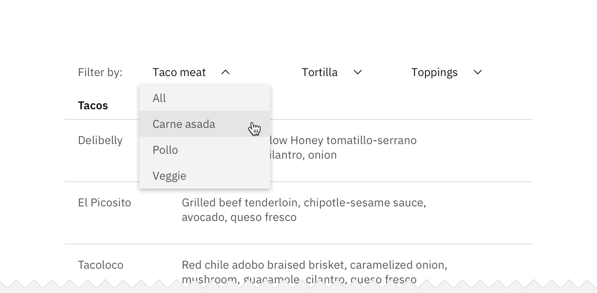
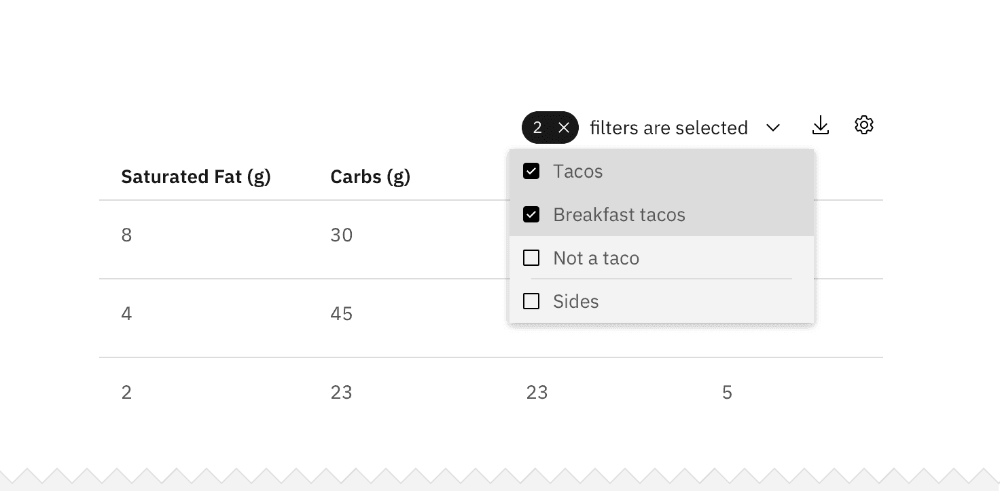
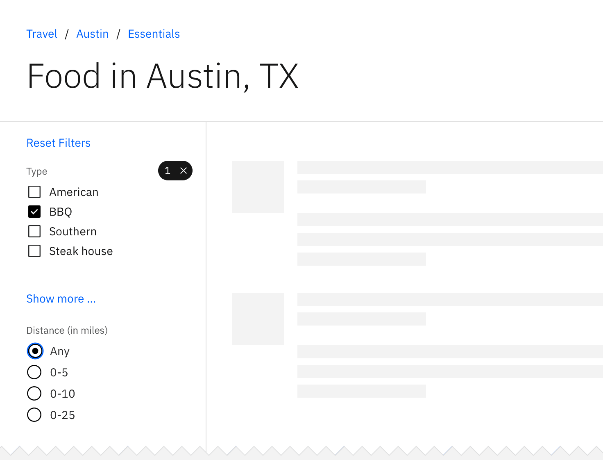
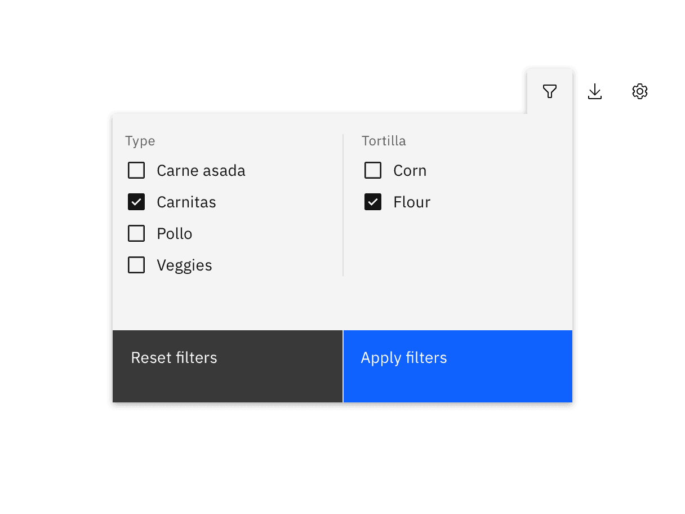
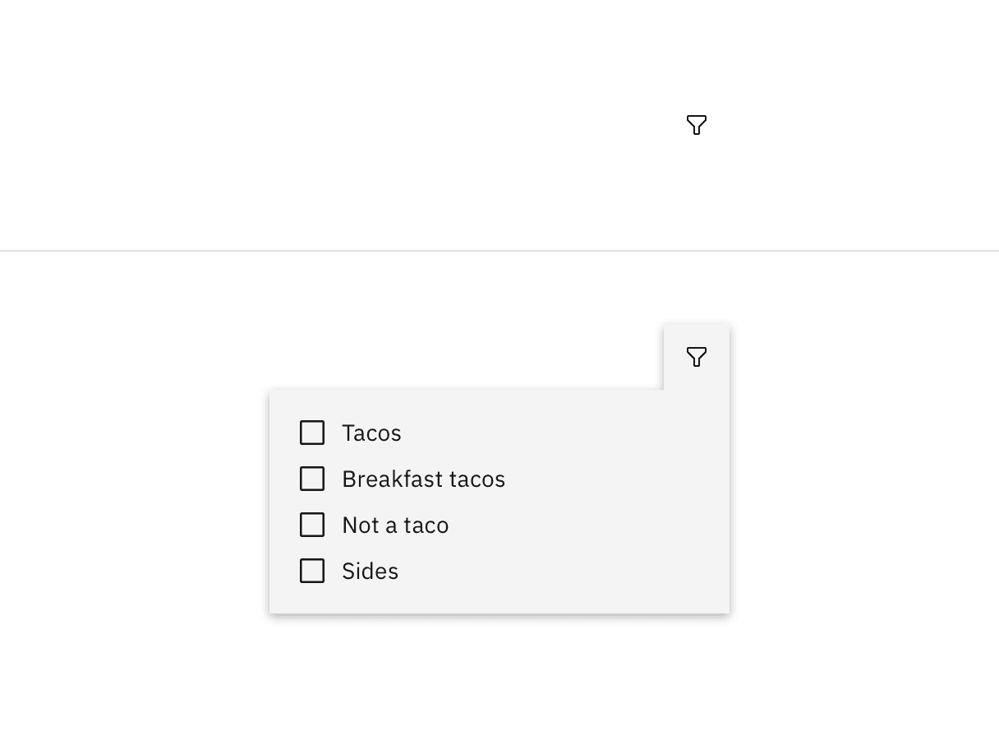
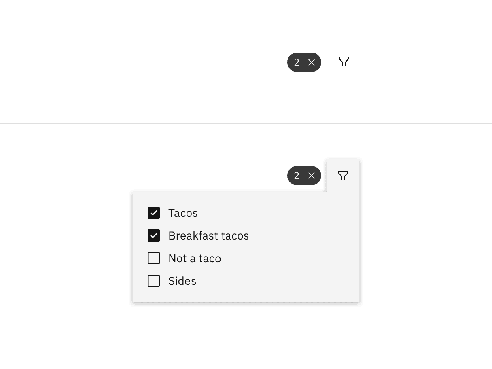
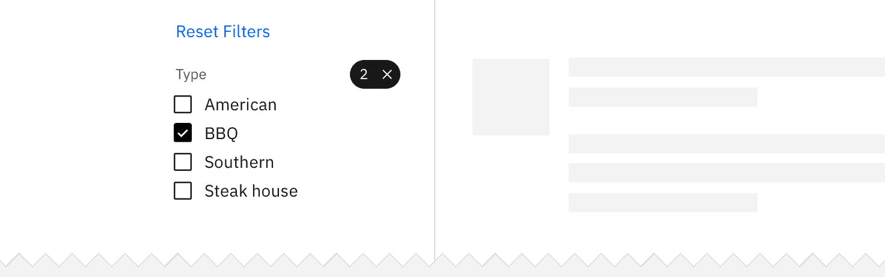

<PageDescription>

Filtering allows a user to add or remove data items from a displayed data set by
turning on and off certain predefined attributes.

</PageDescription>

<AnchorLinks>

<AnchorLink>Overview</AnchorLink>
<AnchorLink>Selection methods</AnchorLink>
<AnchorLink>Filter states</AnchorLink>
<AnchorLink>Resetting filters</AnchorLink>
<AnchorLink>Related</AnchorLink>
<AnchorLink>References</AnchorLink>
<AnchorLink>Feedback</AnchorLink>

</AnchorLinks>

## Overview

Filtering allows users to trim down visible items when working through large
data sets. Filters can help a user find something they’re looking for, see
available options within a certain set of criteria, and make a decision when
faced with a large number of options.

## Selection methods

Choosing the right filter selection method will improve usability and user
efficiency. Carbon supports several selection methods that are appropriate for
different situations. Consider the data your users are looking at, what they are
trying to achieve, and how they might intuitively narrow down the data.

| Selection method                        | Description                                                                                 |
| --------------------------------------- | ------------------------------------------------------------------------------------------- |
| _Single selection_                      | The user can pick only one attribute to modify data results.                                |
| _Multiselection_                        | The user has the option to pick more than one attribute to modify data results.             |
| _Multiple categories_                   | The user has the option to select attributes across multiple data categories.               |
| _Multiple filters with batch updates_   | The user selects multiple filters and then takes an additional action to apply the filters. |
| _Multiple filters with instant updates_ | The data is updated as the user selects each filter.                                        |

### Single selection

Use a single-selection filter when the user can pick only one attribute to
modify data results. Under the hood, single selection behaves like a
[radio button](/components/radio-button/usage). Types of single-selection
filters include:

- Basic dropdown
- Inline dropdown
- Radio button set (either standalone or within a menu)

<Row>
<Column colLg={8}>

<Caption>Example of a single selection filter in an inline dropdown</Caption>

</Column>
</Row>

### Multiselect

Use a multiselect filter when the user has the option to pick more than one
attribute to modify the data results. Under the hood, multiselects behave like
[checkboxes](components/checkbox/usage). Types of multiselect filters include:

- Multiselect dropdown
- Inline multiselect dropdown
- Checkbox set (either standalone or within a menu)

<Row>
<Column colLg={8}>

<Caption>Example of a multiselect filter in a checkbox set</Caption>

</Column>
</Row>

### Selecting multiple categories

A category is a set of filter items within the same topic. For example, "size"
is a category and `small`, `medium`, `large`, and `extra large` are its filter
choices. Multiple filter categories may be applied to the same data set. For
example, the user can filter by size, color, and price range.

Multiple category selection is usually placed vertically on the left side of the
page or horizontally at the top of the data set. Multiple categories should
never be put within a menu or dropdown.

<Row>
<Column colLg={8}>

<Caption>Example of multiple filter categories</Caption>

</Column>
</Row>

### Multiple filters with batch updates

Use a batch filter when all filters are applied together at the end of the
selection process. The data set only refreshes once at user action. The trigger
is most commonly an "Apply filters" button.

The batch filter works best when the user is making several filtering selections
across different categories that may take a longer time to mentally process.
Batch filtering is also a good solution for slow data-return speeds. This can
prevent the user from having to wait for the data to load after every selection.

<Row>
<Column colLg={8}>

<Caption>Example of batch filtering</Caption>

</Column>
</Row>

### Multiple filters with instant updates

This method returns results after each individual selection is made. The trigger
is the individual selection and the filter manipulates the data in real time.
This is a good solution for when the user is only selecting from one category or
the user is expected to only make one filter selection.

## Filter states

Filters within each category should start either as _all unselected_ or _all
selected_. When using multiple categories, the start state can vary from
category to category. If the user typically wants only one or a few criteria to
be excluded from the results, then all filters should be selected at the start.
If the user typically wants to see only results related to one particular
criteria, then all filters should start as unselected.

If the filter(s) can be hidden in either a drawer, dropdown, or menu, then there
should be an indicator visible on the closed filter state that informs the user
that filters have been applied. At a minimum, the indicator should include the
number of filters applied and have the option to clear filters without
re-opening the filter container.

<Row>
<Column colLg={6}>

<Caption>Example of filter without selections</Caption>

</Column>

<Column colLg={6}>

<Caption>Example of filter with selections</Caption>

</Column>
</Row>

## Resetting filters

Each category should have a way to clear all applied filters at once without
having to interact with each individual item. Clearing filters returns the
filters to their original default starting state.

If multiple categories have been applied to the same data set then there should
also be a way to dismiss all filters across all categories at once.

<Row>
<Column colLg={8}>

<Caption></Caption>

</Column>
</Row>

## Related

<Row>
<Column colSm={2} colMd={2} colLg={4}>

#### Components

- [Radio button](/components/radio-button/usage)
- [Dropdown](/components/dropdown/usage)
- [Checkbox](/components/checkbox/usage)
- [Data table](/components/data-table/usage)

</Column>
<Column colSm={2} colMd={2} colLg={4}>

#### Patterns

- [Clear](/patterns/common-actions#clear)
- [Notifications](/patterns/notification-pattern)
- [Search](/patterns/search-pattern)

</Column>
</Row>

## References

- Patternfly,
  [Filters](https://www.patternfly.org/v4/design-guidelines/usage-and-behavior/filters)
  (2019)
- Nick Babich,
  [Best Practices for Search Results](https://uxplanet.org/best-practices-for-search-results-1bbed9d7a311)
  (2017)
- Think with Google,
  [In-App Search](https://www.thinkwithgoogle.com/marketing-resources/experience-design/chapter-2-in-app-search/)
  (2016)

## Feedback

Help us improve this pattern by providing feedback, asking questions, and
leaving any other comments
[on GitHub](https://github.com/carbon-design-system/carbon-website/issues/new?assignees=&labels=feedback&template=feedback.md).
