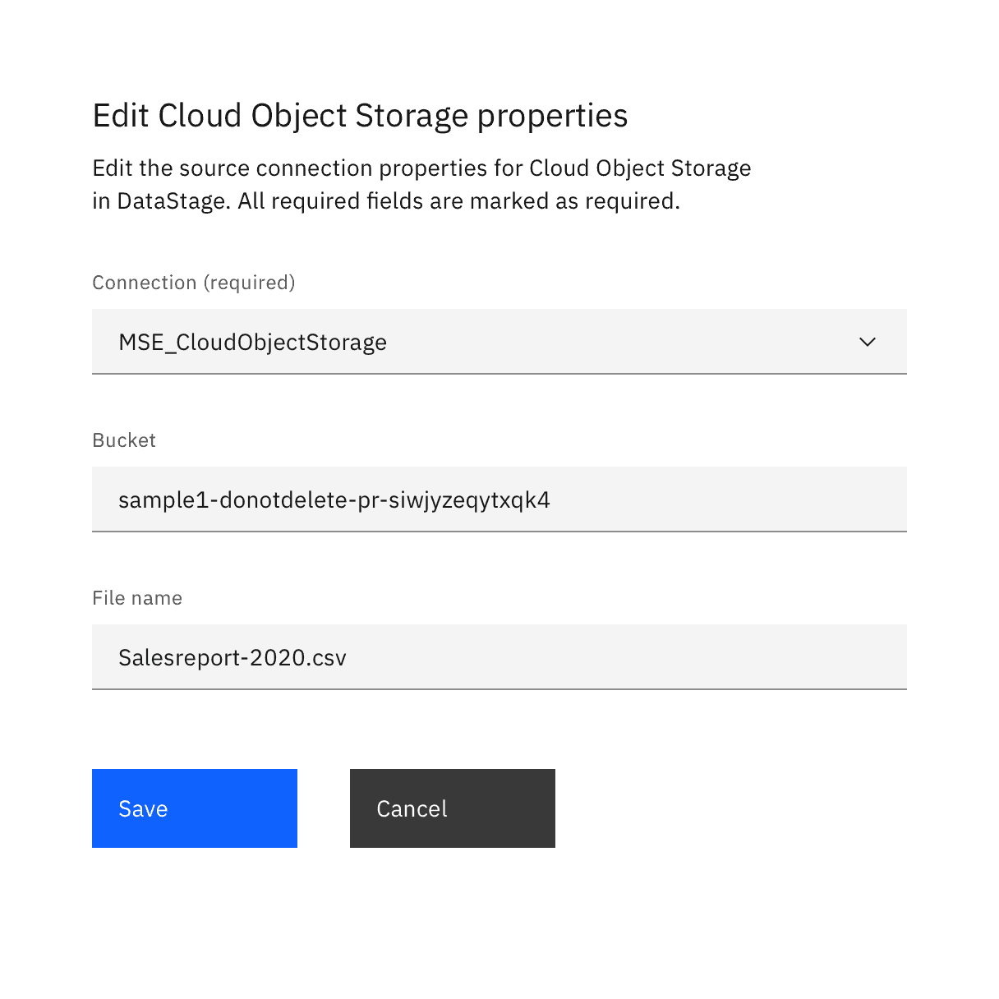
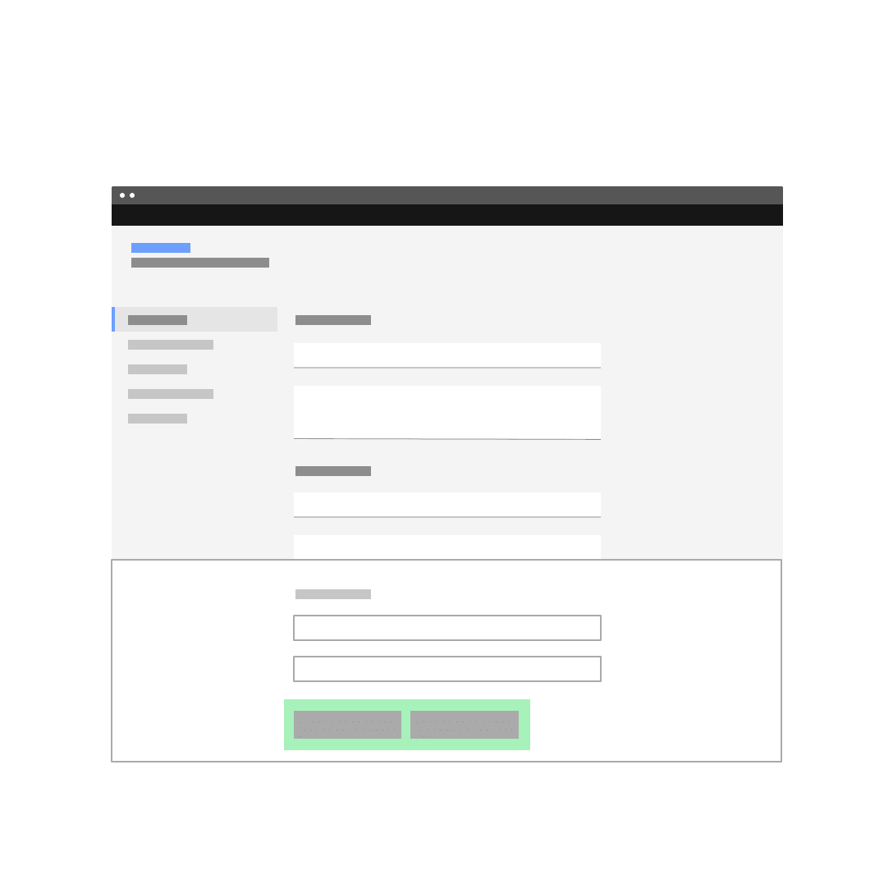
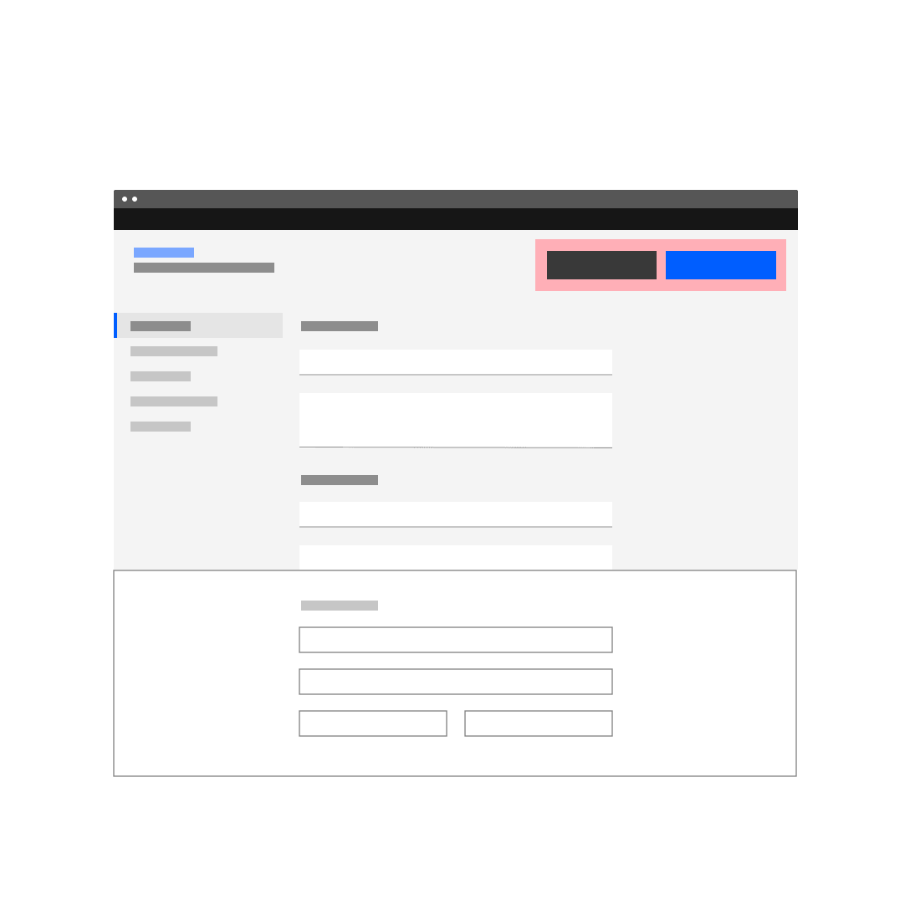
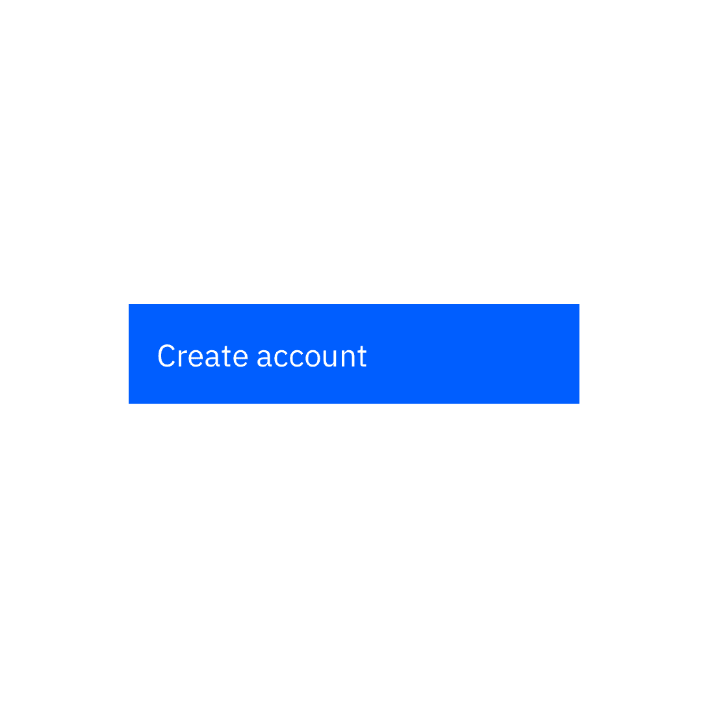
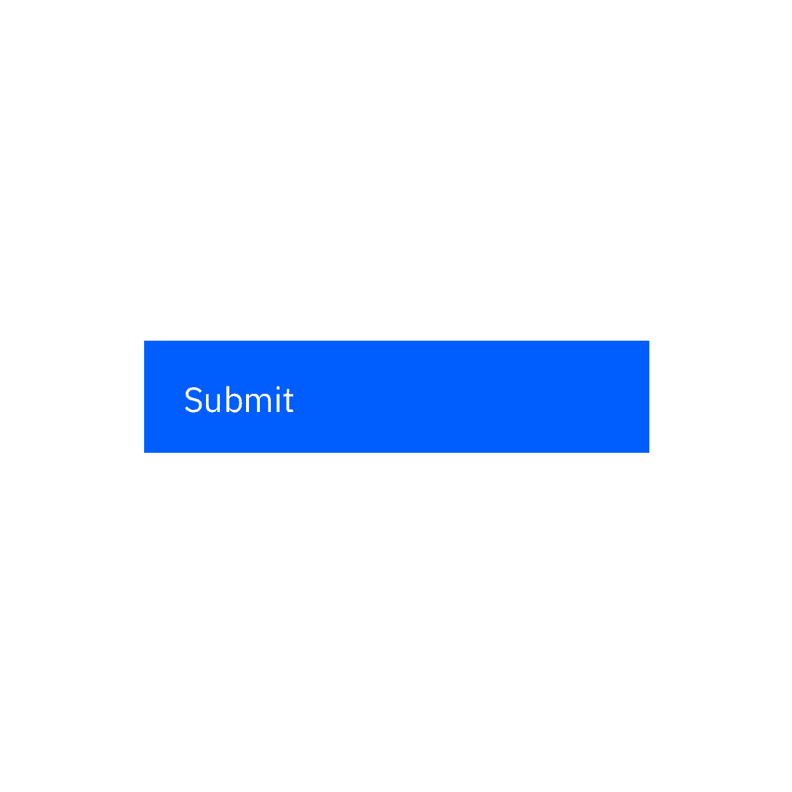
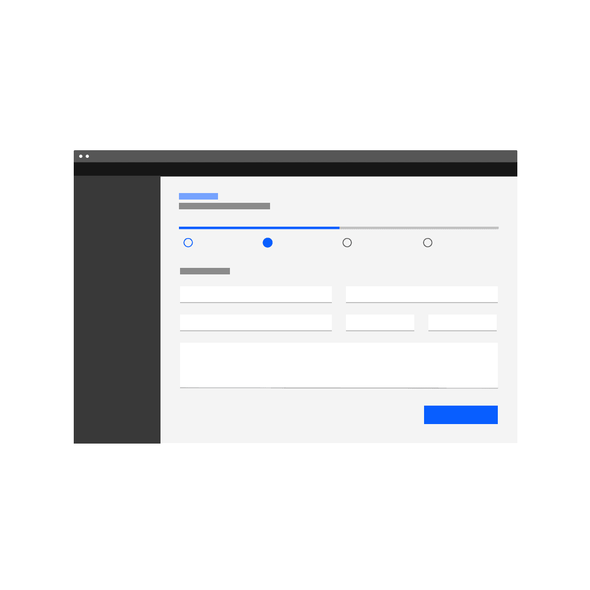
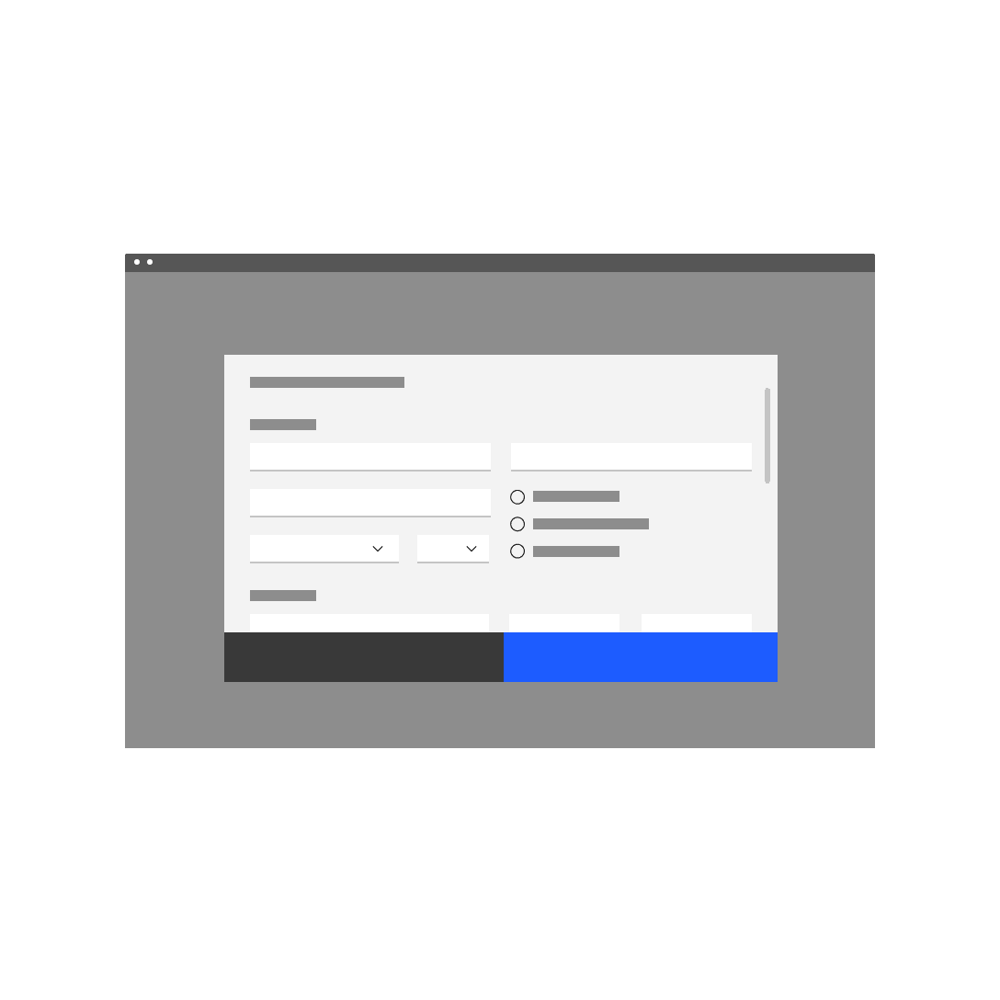

<PageDescription>

A form is a group of related input controls that allows users to provide data or
configure options. Forms can be simple or complex, and may be presented as
dedicated pages, side panels, or dialogs depending on the use case and the
situation.

</PageDescription>

<AnchorLinks>
  <AnchorLink>Overview</AnchorLink>
  <AnchorLink>Building a form</AnchorLink>
  <AnchorLink>Behavior</AnchorLink>
  <AnchorLink>Designing a form</AnchorLink>
  <AnchorLink>Variants</AnchorLink>
  <AnchorLink>Accessibility</AnchorLink>
  <AnchorLink>Related</AnchorLink>
  <AnchorLink>References</AnchorLink>
  <AnchorLink>Feedback</AnchorLink>
</AnchorLinks>

## Overview

### When to use

Forms are incredibly common in user interfaces and their design and usage
continues to evolve as input methods get smarter and more and more people use
mobile and tablet devices. You might design a form for a user to:

- Sign up for / log into an account
- Register for a service
- Reconfigure settings, (e.g. enabling notifications)
- Take a survey
- Purchase a product
- Provide feedback

### Respect the user

Forms are meant to gather information and guide people with as little fuss as
possible. To allow users to scan and complete the form quickly, forms should:

- Respect the user’s GDPR and other privacy regulations by only asking for
  information that is absolutely necessary.
- Group related tasks under section titles to provide more context and make the
  interface easier to scan.
- Follow a logical, predictable order—e.g first name first, last name second.
- Allow users to stay with a single interaction method for as long as possible
  (i.e. do not make users shift from keyboard to mouse numerous times in a
  single form).
- When designing be mindful of password managers and browser capabilities that
  populate data for users.
- Progressively disclose additional inputs only as they become relevant; see the
  [Designing for longer forms](#designing-for-longer-forms) section below.

### Anatomy of a form

Forms are comprised of some or all of the following elements.

<Row>
<Column colLg={8}>

</Column>
</Row>

1. **Labels:** Input labels helps users understand what the corresponding inputs
   mean.
1. **Text inputs:** Enable users to input free-form text.
1. **Data inputs:** Information can be entered through a variety of non-free
   form input fields as well, (e.g. checkboxes, radio buttons, dropdowns and
   selects, file uploader, date pickers, toggles, etc.) Visit the individual
   component pages for in depth details of their specific states and visuals.
1. **Help:** Provides in-context guidance like tooltips, placeholder text, or
   helper text, to assist the user in providing the right information.
1. **Buttons:** Allows users to submit or exit a form.

## Building a form

### Labels

Concise labels for text and data inputs help users understand what information
is being requested of them.

- Use sentence-style capitalization for all text elements, except for product
  names and proper nouns. Sentence-style means only the first word of each
  sentence is capitalized.
- Although they may be formatted differently, all input components need labels.
- Labels should clearly state the required input.
- Do not use colons after label names.
- Labels are not helper text; be succinct. Use one to three words only.

<Row>
<Column colLg={8}>

</Column>
</Row>

#### Top-aligned labels

Top-aligned labels are Carbon’s default (vs. left-aligned labels) and the only
label arrangement currently offered. Top-aligned labels provide a consistent
left edge, a close proximity between label and input, and are good for
scannability and quick form completion.

Advantages:

- Top-alignment enables quick completion.
- The label length has room to extend or vary, (e.g. other languages).
- When users are entering familiar content and are less likely to make data
  entry errors, top-alignment is ideal.
- This arrangement is best when fewer form fields need to be presented.

### Optional vs. mandatory

Forms items can be labeled as either optional or required depending on several
factors. A common distinction in IBM products for using required or optional is
the forms complexity.

1. **Simple forms** - generally shorter and/or user- or consumer-oriented; such
   as sign-up and contact forms and checkout screens. Most of the fields will
   tend to be required.
2. **Complex forms** - generally longer and product-oriented; contain properties
   and settings that are used to configure Enterprise software.  Although they
   will usually contain at least one required field, the majority of the fields
   will tend to be optional.

Note if the majority of the fields are **required** or **optional**, as the
overall number of form fields for your entire product should inform your
treatment. The pattern used should be consistent throughout your product, or at
minimum, consistent between all of the same types of form within your product.

- If the majority of the fields are required, mark **only** the optional field
  labels with _(optional)_.
- If the majority of the fields are optional, mark **only** the required field
  labels with _(required)_.

When designing your form, consider the purpose and the use case to reduce visual
noise and clutter to allow your user to better complete their task. This will
also ensure consistency through and across products.

An excess of optional fields should be avoided. If it’s necessary to have a
large number of optional fields, we recommend devoting an entire section to
optional fields to avoid excessive repetition.

<Row>
<Column colLg={8}>

<Caption>
  Example of a short user sign-up form using the optional pattern
</Caption>

</Column>
</Row>

<Row>
<Column colLg={8}>

<Caption>
  Example of product configuration properties using the required pattern
</Caption>

</Column>
</Row>

#### When to use

 

<DoDontRow>
<DoDont
type="do"
colMd={6} colLg={6}
caption="DO mark fields (required) when the majority of the fields are optional.">

</DoDont>
<DoDont
colMd={6} colLg={6}
type="dont"
caption="DON'T mark fields (optional) when the majority of the fields are optional.">

</DoDont>
</DoDontRow>

#### Best practices

- Consider the overall number of required and optional fields in the forms for
  your entire product. The pattern used should be consistent throughout your
  product, or at minimum consistent between all of the same type of form within
  your product.
  - For example, if you have 100 types of connections properties forms and the
    fields are optional in 85 of the 100 forms, all 100 should use the required
    pattern.
- Use the techniques illustrated below in the [Default Values](#default-values)
  and [Designing for Longer Forms](#designing-for-longer-forms) sections in
  order to make your forms easier and more efficient to use.

### Text inputs

Free-form text inputs are the most commonly used components in forms.

 

<Title> Deciding what to use </Title>

| Control                                                        | Usage                                            | Context                                                                 |
| -------------------------------------------------------------- | ------------------------------------------------ | ----------------------------------------------------------------------- |
| [Text input](/components/text-input/usage/#text-input)         | To capture several words maximum                 | Names; phone numbers; addresses                                         |
| [Password input](/components/text-input/usage/#password-input) | To collect private data by hiding the characters | Passwords, Social Security Numbers (SSN), PINs, credit card information |
| [Text area](/components/text-input/usage/#text-area)           | To capture multiple lines of text                | Feedback; support requests                                              |

#### Best practices

- The field widths should reflect the intended length of the content while still
  aligning to the responsive column or mini unit grid.
- Make sure users can enter their information at smaller screen sizes.
- Truncate when an input is too long to be fully displayed in the field.
- Pre-populate known values when possible, e.g. a default IP address.
- The first required input field in a form should receive focus on presentation
  to a user.

### Data inputs

These controls enable users to provide input on forms by selecting from a set of
pre-determined options or a limited range of values. Carbon provides a variety
of data input components that enable a user to make a selection. Each component
was created to serve a specific use case.

#### Selection controls

Selection controls offer users a selection from pre-determined options. When
designing, consider how many options you need to present as well as how many
items the user may need to select. These considerations will determine which
component to use. Common selection controls include: checkboxes, radio buttons,
file uploaders, toggles, and select lists (combo box and multiselect).

 

<Title> Deciding what to use </Title>

| Control                                                | Usage                                                                    | Context                                                                  |
| ------------------------------------------------------ | ------------------------------------------------------------------------ | ------------------------------------------------------------------------ |
| [Checkbox](/components/checkbox/usage)                 | To select or deselect one or more choices                                | Agree to terms and conditions, add optional items, select all that apply |
| [Radio button](/components/radio-button/usage)         | To select only one option from two or more choices                       | Pick type, shipping method, etc.                                         |
| [Toggle](/components/toggle/usage)                     | To choose one of two or more binary options                              | Changing user settings; On/off; Show/hide                                |
| [File uploader](/components/file-uploader/usage)       | To upload/attach a file or multiple files to a form                      | Attaching SSl certificates; adding config files to support tickets       |
| [Combo box](/components/dropdown/usage/#combo-box)     | To select a single item with type-ahead functionality from a longer list | Choosing a state, country, or language preference                        |
| [Multiselect](/components/dropdown/usage/#multiselect) | To select multiple items from a longer list                              | Add a product example for MultiSelect                                    |

#### Radio buttons:

- Pre-select a default option for the user; if the user selects a different
  option the default is deselected.
- For null options, provide a radio button with the label “None”.

#### Radio buttons and checkboxes:

- Radio buttons and checkbox item text falls to the right of their controls.
- When possible, arrange the checkbox and radio button groups vertically for
  better scannability.

#### Toggles:

- Always label toggles with the affected attribute due to accessibility
  constraints; color cannot be the only indicator.
- A standalone toggle or a checkbox can be used for a single option that a user
  can turn on or off.
- Toggles are very common controls in instantly updating forms, where submission
  is not required.

#### Select lists:

- When you have more than five options to present to the user, use a select list
  (combo box or multiselect), not a checkbox or a radio button.

#### Bound entry controls

Bound entry controls allow users to input numeric data, like dates and times
(e.g. number input, date picker, and slider components). They restrict user
input and rely equally on keyboard and mouse interactions. They only allow valid
entries, so field validation isn’t needed.

 

<Title> Deciding what to use </Title>

| Control                                                    | Usage                                                                   | Context                                            |
| ---------------------------------------------------------- | ----------------------------------------------------------------------- | -------------------------------------------------- |
| [Number input](/components/number-input/usage)             | To increase or decrease incremental values                              | Order quantities                                   |
| [Slider](/components/slider/usage)                         | To select one number from a numerical range                             | Percentages, volume, timelines, data visualization |
| [Date picker](/components/date-picker/usage)               | To input/select a single localized date or a date range from a calendar | Scheduling trips, meetings, and events             |
| [Time picker](/components/date-picker/usage/#time-pickers) | To input time in hours/minutes                                          | Scheduling meetings and travel times               |

### Offering help

#### Tooltips

Tooltips can be very useful for providing additional explanation to users that
may be unfamiliar with a particular form field. They can also offer rationale
for what may seem like an unusual request. However,
[research suggests](https://www.nngroup.com/articles/tooltip-guidelines/) that
users should not have to dig around for a tooltip to access information that’s
essential for the completion of their task.

In Carbon, we use the “i” icon instead of the “?” icon because it indicates
additional rather than essential information.

<Row>
<Column colLg={8}>

<Caption>
  Tooltip appears on hover (desktop) and on click (tablet and mobile).
</Caption>

</Column>
</Row>

#### Do:

- Use tooltips with the outlined “i” (info) icon.
- Use tooltips for explanatory or added information.
- Tooltips are microcontent; keep them concise.

#### Don’t:

- Tooltips are not catchalls for content that doesn’t fit elsewhere; they must
  be used intentionally and very sparingly.
- Never house essential information in a tooltip.

#### Helper text

Helper text appears below the input label and assists the user to provide the
right information. Helper text is always available, even when the field is
focused, that’s why it’s the correct choice for need-to-know information. For
context or background information that is “nice to have”, use placeholder text
or a tooltip.

<Row>
<Column colLg={8}>

</Column>
</Row>

#### Do:

- Think of helper text as crucial information that is secondary to the input
  label.
- Keep helper text as short and specific as possible.
- Only use helper text when truly necessary to avoid overloading the user.

#### Don’t:

- Never use helper text in place of field labels.
- Helper text should not run longer than the input area.

<Row>
<Column colLg={8}>

</Column>
</Row>

When fields appear side-by-side and one input has helper text while the other
one doesn’t; always top align the input fields, not the labels.

#### Placeholder text

Placeholder text provides hints or examples of what to enter (e.g. YYYY-MM-DD).
Since placeholder text disappears once the user begins to input data, it should
not contain crucial information. When the requested input may be unfamiliar to
the user or formatting is in question, use placeholder text.

<Row>
<Column colLg={8}>

</Column>
</Row>

#### Do:

- Keep hints as short as possible and never overrun the input field.
- Properly anonymize examples rather than using real values.

#### Don’t:

- Use placeholder text to communicate complex and lengthy requirements like
  password requirements. Instead, use an infotip.
- Provide placeholder text when it isn’t necessary.
- Ever use placeholder text as a replacement for field labels.

#### Default values

Default values can be set for for all types of inputs. Ensure that if a default
value is provided, it is something that would commonly be used anyway and would
not cause disruption or errors if the user forgets or opts not to make any
changes to it before submitting the form. Good default values reduce cognitive
load.

For example:

- If you can detect or determine where your users are from, have their country
  pre-selected in a "Country" dropdown.
- If there is a common or minimum value (i.e., a quota or memory limit),
  pre-fill that value.
- If a text input can be detected or determined in advance (i.e.-company name),
  pre-fill that value.
- If a start date is required, use the current date as the default.

### Buttons

Use a primary button for the main action, a secondary button for secondary
actions like Cancel or Discard.

#### Button alignment

Alignment refers to whether the buttons are aligned to the right or the left of
the container or layout. Button alignment depends on the type of form that you
are building. We’ll touch on alignment briefly here as it relates to the button
component and offer more detailed information about [form variations](#variants)
below.

#### Margins vs. full bleed

In side panels, dialogs, and any other forms within tiles, the button group
should span the width of the container and buttons should bleed to the bottom
edge. If the button content is too long for this arrangement, stack buttons
vertically (with primary button on the bottom) and maintain their margin and
padding. See [button usage guidance](/components/button/usage) for more
information.

| Alignment     | Bleed | Use case                                                                                       |
| ------------- | ----- | ---------------------------------------------------------------------------------------------- |
| Left-aligned  | No    | Non-dialog, in-page forms                                                                      |
| Right-aligned | No    | Multistep forms/wizards when the primary action implies a navigation step forward              |
| Full-width    | Yes   | All forms that are presented in dialogs and side panels and in some cases, forms within a tile |

#### Button emphasis

Emphasis refers to the position of the primary button in relation to secondary
and tertiary actions. When using multiple buttons in forms, the position of the
primary button can vary according to the
[button groups](/components/button/usage/#button-groups) guidance. Factors such
as page layout, form type, and alignment will influence your button emphasis.

The primary button will be left-aligned and positioned to the left of the
secondary/tertiary button on in-page forms or most other form layouts that don’t
fit the right-aligned criteria. The primary button will be right-aligned and
appear to the right of the secondary/tertiary button within progressive forms,
wizards, and forms in structured containers like dialog windows or side panels.

<Row>
<Column colLg={8}>

<Caption>Examples of in-page forms with a left-aligned primary button</Caption>

</Column>
</Row>

<Row>
<Column colLg={8}>

<Caption>
  Examples of progressive and dialog forms with a right-aligned primary button
</Caption>

</Column>
</Row>

#### Do not top-align buttons

There is a trend among product teams to pin buttons at the top of a
dedicated-page form. We want to discourage this arrangement for several reasons.

First, we should only be asking the user for essential input and we should
elicit that information in a concise, deliberate way. So we should assume that
the user scrolls through the appropriate inputs before submitting a form.

Second, the dedicated page form is not a modal and does not prevent the user
from accessing their previous workflow. A back button will be available to them
as part of the breadcrumb at the top of the page, or via the progress indicator
component (if your form is part of a multistep flow). The browser back button is
also available. In short, back should never be an action on a secondary button.
The secondary button is usually reserved for cancelling the task.

Third, and most important, the top-pinned buttons create a very awkward
relationship with the content when the user finishes the form and is ready to
submit. If we feel it’s necessary to pursue pinned actions in the future, we
should look into a pinned footer or tray to contain button groups.

<DoDontRow>
<DoDont
type="do"
caption="Do arrange primary and secondary buttons at the bottom of the form.">

</DoDont>
<DoDont
type="dont"
caption="Do not top align primary and secondary action buttons in your layouts.">

</DoDont>
</DoDontRow>

#### Naming actions

Abstract terms like “Submit” give the user the impression that the form is
generic. Although brevity is key in buttons, try to tell the user specifically
what action your button will perform.

<DoDontRow>
<DoDont
type="do"
caption="Do use task-specific language in your buttons.">

</DoDont>
<DoDont
type="dont"
caption="Do not use vague language to describe an action.">

</DoDont>
</DoDontRow>

## Behavior

### Errors and validation

Effective and immediate error messaging can help the user to understand the
problem and how to fix it. First, inform the user what has happened, then
provide guidance on next steps or possible resolutions. Always present error
states on the form, and use inline errors whenever possible.

#### Client-side validation

We recommend validating the user’s data before form submission. This type of
real-time, inline validation (a.k.a. client-side validation) should happen as
soon as the field loses focus. This will help to easily identify the elements
that need to be corrected.

The validation label below the field should be as informative as possible when
describing the issue with the user’s data. For example, if password limitations
require 16 characters, but the user inputs a password with only six characters,
the text should read something like, “Password must be at least 16 characters.”

Common user errors include:

- Incorrectly formatting data
- Leaving a mandatory field blank
- Leaving a mandatory field incomplete

<Row>
<Column colLg={8}>
<GifPlayer color='dark'>

</GifPlayer>
</Column>
</Row>

#### Server-side validation

Inline notifications come into play when server-side errors are involved, i.e.
the user tries to submit a form in its entirety and the page is reloaded with
the detected errors.

In these situations, use an inline notification as well as inline error
messaging wherever possible to help users make the fix. Inline error messages
should disappear when the form criteria is met.

<Row>

<Column colLg={8}>
<GifPlayer color='light'>

</GifPlayer>
</Column>
</Row>

### Enabling and disabling buttons

- For short forms that require server-side submission before returning errors,
  we recommend disabling primary action buttons until all of the form’s
  requirements are met.
- For longer forms, do not disable primary action buttons because the error
  messages and the primary action button may not be visible on the screen
  simultaneously.
- When a user submits a form, disable the primary action button to prevent
  duplicate submissions.
- If it’s going to take a while to process a form, communicate this to the user
  with feedback messages and progress indicators (e.g. spinners or progress
  bars).

### In-line editing

In-line editing enables users to edit form text in situ instead of taking users
to another page to edit their entry. This saves users from having to refresh the
whole form in order to make an edit.

Carbon does not have consolidated guidance around inline editing. Since it’s
something a lot of products approach in different ways, we’d like to offer more
robust, centralized guidance in the future.

### Designing for longer forms

Product designers often ask about the appropriate length for web forms.
Unfortunately, there’s no one-size-fits-all answer. Your audience and their
intentions, along with the context of your product will determine the solution
that’s best for you. Here are several techniques to help make longer forms less
overwhelming.

#### Progressive disclosure

Use progressive disclosure to reveal any additional content that may arise based
on the user’s previous selection. This kind of show/hide approach allows the
user to focus on relevant information while keeping workflows short.

<Row>
<Column colLg={8}>

</Column>
</Row>

#### Accordion forms

Accordion forms allow users to dynamically expose and hide sections of related
information. Like progressive disclosure, accordion forms allow users to focus
on relevant information without having to navigate between pages. As a general
rule, this technique should not be used in dialog forms.

[Research suggests](https://www.lukew.com/ff/entry.asp?1190) that accordion
forms can greatly enhance completion speed and page load times. However the same
research also suggests that confusion can arise for users when it comes to
primary action buttons and whether they apply only to sections vs. the full
form.

The IoT team has done some design explorations around accordion forms but more
design iteration and user testing is needed before Carbon solidifies our
guidance around this interaction. Keep an eye out for refined usage examples in
the future.

#### Multistep forms

A multistep form spreads form fields across multiple screens and incorporates a
[progress indicator](/components/progress-indicator/usage) (vertical or
horizontal) to track a user’s status step by step. There should be a logical
relationship between the fields on each screen and a linear relationship between
sections.

This approach is good for saving form progress along the journey and allows
users to return to a previous step to review their submissions.

<Row>
<Column colLg={8}>

<Caption>
  A multistep form with a horizontally oriented progress indicator.
</Caption>

</Column>
</Row>

<Row>
<Column colLg={8}>

<Caption>
  A multistep form with a vertically oriented progress indicator.
</Caption>

</Column>
</Row>

## Designing a form

### Layout

#### Form headings

Headings describe the form. The heading should be the largest type size in the
form hierarchy. IBM Product UI often uses the `$productive-heading-03` token for
this purpose if the form is within a container or a dialog. A larger type size
should be used if the form is the only element on the page. The title can also
be followed by a short descriptor.

#### Group and section headings

Group headings describe a group of controls and fields within a form. Their size
should also be adjusted depending on context and form heading size (i.e. the
chosen token should be larger than the field labels but obviously smaller than
the form heading). Inputs should be grouped to help users understand what is
required of them in a logical way. Try to make the group heading short and
precise, but, you can add a short description of the group if necessary.

### Spacing

Users will be confused if inputs are too close together. To ensure sufficient
spacing between single form elements as well as groups of inputs, use margins,
spacers, gutters, and key alignments to guide you. See the
[2x Grid](/elements/2x-grid/overview) for more information.

#### Form context

Forms can appear as dedicated pages or within dialogs, tiles, or side panels.
The form’s context affects its layout and vertical spacing. As a general rule
dedicated-page forms can handle more complexity. See [form variants](#variants)
below for more detailed usage guidance.

On dedicated page forms, use the responsive grid to drive layout decisions.
Dialogs and side panel forms will revert to a box model so designers will use
mini units to guide field widths. Consistency of alignments and geometries in
either scenario is key.

Individual input fields default to a 40px height in product regardless of
context. On dedicated-page forms, we recommend a 32px spacer between input
fields. In contained forms, such as side panels or modals, designers can revert
to 24px or even 16px between inputs.

#### Separating inputs, actions and sections

Vertical spacing between form sections also depends on whether the form is a
dedicated page or a container. Spacing between groups should be adjusted in
relationship to spacing between individual items. For instance, if vertical
spacing between individual inputs is 24px consider a 32px spacer before the
first input and between sections. If the former number is 32px, consider 40px
for the latter.

As a general rule, we recommend a 48px spacer between the last input and the
button or button group. Again, this will vary in mobile and in certain contained
forms.

<Row>
<Column colLg={8}>

</Column>
</Row>

#### Rules

Designers often use rules to separate groups of information within forms. Carbon
does not have consolidated guidance around rules within forms (i.e. width,
thickness, vertical margins). We intend to provide more detailed guidance around
their use in the future.

### Columns

Based on research from the
[Nielsen Norman Group](https://www.nngroup.com/articles/web-form-design/),
Carbon generally recommends single-column forms, simply because multicolumn
forms are more prone to misinterpretation. However, when faced with larger
screen sizes and a lot of empty space, multicolumn forms may seem like a good
idea. And in certain situations they are appropriate.

If you would like to create a multicolumn form, the number of columns should
depend on the number of input controls on the page, their relationship to one
another, and the screen size of the product window.

Always use common sense to group related fields horizontally. Two to three
inputs on a single line will not cause problems if they logically belong
together. Here are some examples:

- [first name][mi] [last name]
- [credit card number][expiration date] [security code]
- [city][state/province] [zip code]

Avoid overloading users with too much information, when a multistep form may be
a better choice.

<DoDontRow>
<DoDont
type="do"
caption="Do consider multistep forms when faced with a lot of inputs.">

</DoDont>
<DoDont
type="dont"
caption="Do not overload the user with too many input controls at once, especially in modals.">

</DoDont>
</DoDontRow>

## Variants

As mentioned above, forms may be presented as dedicated pages, side panels, or
dialogs depending on the use case and the situation.

<Title> Deciding what to use </Title>

| Form variant   | Usage                                                                                                   | Context\*                                                                   |
| -------------- | ------------------------------------------------------------------------------------------------------- | --------------------------------------------------------------------------- |
| Dedicated page | For more complex, lengthier or multistep requests for user input                                        | Creating a new service, such as provisioning; more complex order forms etc. |
| Dialog         | For critical, infrequent requests for user input often related to editing and management tasks          | User permissions; upgrading a service                                       |
| Side panel     | For repeated requests for user input which require the user needs to reference the affected information | Calibrating row information in a data table                                 |

<Caption>
  * We are looking for more input from product teams here. Please connect with
  us about your use cases.
</Caption>

#### Dialog forms:

- Use a dialog form when dealing with less than five inputs.
- Do not hide information in accordions or tabs.
- A [dialog pattern](/patterns/dialog-pattern) with more detailed guidance will
  be released shortly.

#### Side panel forms:

- Use a side panel form when dealing with more than five inputs.
- Do not hide information in accordions or tabs.

## Accessibility

When constructing a form, first refer to the specific accessibility guidance for
each component used. Every text input should have a descriptive and visible
label, along with hard coded instructions for input format. A form must be
wrapped in a `<form>` element.

Requirements for your form should be announced and declared before the user
enters the form.

The most significant challenge facing visually impaired users is form ordering.
Your form should be tab-navigable, and required fields should be clearly labeled
as such.

Validation messages should be included to advise the user of data that is input
incorrectly or a required field that is missing information.

Helper text (`label`) should be used to provide instructions to help users
understand how to complete the form fields as well as indicate any required and
optional input, data formats, and other relevant information.

See the [WCAG website](https://www.w3.org/WAI/tutorials/forms/instructions/) for
in-depth accessibility guidance for each form element.

## Related

<Row>
<Column colSm={2} colMd={2} colLg={3}>

#### Components

- [Button](/components/button/usage)  
- [Checkbox](/components/checkbox/usage)  
- [Combo box](/components/dropdown/usage/#combo-box)  
- [Multiselect](/components/dropdown/usage/#multiselect)  
- [Password input](/components/text-input/usage/#password-input)  
- [Radio button](/components/radio-button/usage)  
- [Text area](/components/text-input/usage/#text-area)  
- [Text input](/components/text-input/usage/#text-input)  
- [Toggle](/components/toggle/usage)  

</Column>
<Column colSm={2} colMd={2} colLg={3}>

#### Patterns

- [Dialogs](/patterns/dialog-pattern)  
- [Notifications](/patterns/notification-pattern)  

</Column>
</Row>

## References

- Alita Joyce,
  [Tooltip Guidelines](https://www.nngroup.com/articles/tooltip-guidelines/),
  (Nielsen Norman Group, 2019)
- Jakob Nielsen,
  [OK-Cancel or Cancel-OK? The Trouble With Buttons](https://www.nngroup.com/articles/ok-cancel-or-cancel-ok/),
  (Nielsen Norman Group, 2008)
- Kathryn Whitenton,
  [Website Forms Usability: Top 10 Recommendations](https://www.nngroup.com/articles/web-form-design/),
  (Nielsen Norman Group, 2016)
- Luke Wroblewski,
  [Testing Accordion Forms](https://www.lukew.com/ff/entry.asp?1190), (A List
  Apart, 2010)

### Further reading

- Nick Babich,
  [The Power of Defaults](https://uxplanet.org/the-power-of-defaults-992d50b73968),
  (UX Planet, 2017)
- Raluca Budiu,
  [Marking Required Fields in Forms](https://www.nngroup.com/articles/required-fields/),
  (Nielsen Norman Group, 2019)
- Andrew Coyle,
  [Design Better Forms](https://uxdesign.cc/design-better-forms-96fadca0f49c),
  (UX Collective, 2016)
- Hoa Loranger,
  [Form Design Quick Fix: Group Form Elements Effectively Using White Space](https://www.nngroup.com/articles/form-design-white-space/),
  (Nielsen Norman Group, 2013)
- Marieke McCloskey,
  [Accordions Are Not Always the Answer for Complex Content on Desktops](https://www.nngroup.com/articles/accordions-complex-content/),
  (Nielsen Norman Group, 2014)
- Jakob Nielsen,
  [The Power of Defaults](https://www.nngroup.com/articles/the-power-of-defaults/),
  (Nielsen Norman Group, 2015)
- Preibusch et al.,
  [_The privacy economics of voluntary over-disclosure in Web forms_](http://preibusch.de/publications/Preibusch-Krol-Beresford__voluntary_over-disclosure.pdf)
  (2013)

## Feedback

Help us improve this pattern by providing feedback, asking questions, and
leaving any other comments on
[GitHub](https://github.com/carbon-design-system/carbon-website/issues/new?assignees=&labels=feedback&template=feedback.md).
