<PageDescription>

Users rely on the global header to navigate and orient themselves in your UI.
This pattern outlines some of the qualities that make a global header
consistent, familiar, and usable.

</PageDescription>

<AnchorLinks>
  <AnchorLink>Overview</AnchorLink>
  <AnchorLink>Configurations</AnchorLink>
  <AnchorLink>Navigation</AnchorLink>
  <AnchorLink>Best practices</AnchorLink>
  <AnchorLink>Accessibility</AnchorLink>
  <AnchorLink>Related</AnchorLink>
  <AnchorLink>References</AnchorLink>
  <AnchorLink>Feedback</AnchorLink>

</AnchorLinks>

## Overview

The global header is essential to a product’s UI. It is a consistently available
user interface element that contains functionality for the current product as
well as for the entire system. Like the macOS Menu Bar and the Windows Start
Bar, the global header provides consistent locations to invoke your product’s
local navigation as well as pervasive access to system-wide functions like
system settings, notifications, and navigating between products.

This pattern covers the foundation of using UI Shell components for within and
between product navigation, and introduces techniques for achieving consistency
in products.

### Anatomy of a global header

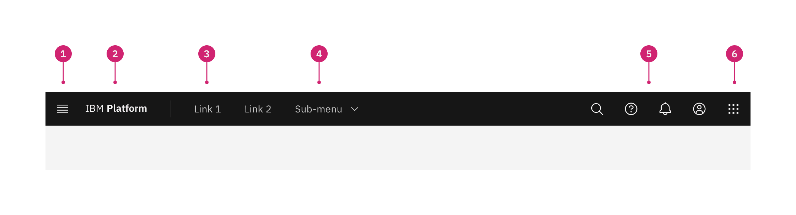

1. **Main menu:** The main menu icon is used to open product navigation such as
   the [left panel](/components/UI-shell-left-panel/usage/).
1. **Header name:** For IBM products, the header name is always preceded by
   “IBM”. This should always and only link the user to the domain’s home page.
1. **Header links:** Links in the header are supported as product navigation, if
   required. These links should not open a new tab or link to another domain.
   These links drop down to the side menu in narrow screen widths.
1. **Sub-menu:** Sub-menus are supported as product navigation, if required.
   Dropdowns open on click and are closed by either selecting an item in the
   menu, clicking outside the menu area, or clicking on the menu label. When
   open, the chevron should point up. Dropdown menu labels serve only to open
   the dropdown; they cannot be a link to another page in the product.
1. **Utilities:** The header provides a home for global system-level utilities
   from anywhere in the site. Utility icons should not be used to directly
   navigate to an area. Instead, they should open a panel that provides access
   to other places in the product.
1. **Switcher:** The switcher provides a way for the user to navigate easily
   between products and systems. Recommended uses for this component include
   recently used apps, frequently used apps, or all apps attached to the user’s
   account. If the list is a manageable size, include all apps or products
   available on the system.

### Header and panel persistence

Global and local refer to the location and persistence of header elements in
your UI.

| Persistence | Definition                                                                                                                                                                                                                                     |
| ----------- | ---------------------------------------------------------------------------------------------------------------------------------------------------------------------------------------------------------------------------------------------- |
| Global      | A global UI element is present everywhere in your UI. It contains system and product items your user may need at any time: navigation, authentication, notifications, and more. Global elements remain consistent from one context to another. |
| Local       | A local navigation exists within a product’s context and provides the means to accomplish product level tasks. Local elements will therefore differ from one product to another.                                                               |

### Task hierarchy

The task hierarchy describes the breadth of effect for various tasks. For this
guidance we use the term "product" to encompass the broad category of products,
applications, offerings, or web properties.

| Task    | Definition                                                                                                                                                                                                             |
| ------- | ---------------------------------------------------------------------------------------------------------------------------------------------------------------------------------------------------------------------- |
| System  | System-level tasks include navigating to the main sections of a platform and accessing system utilities like notifications or settings. At this level a user can manage the attributes that apply to the whole system. |
| Product | Product-level tasks include navigating within a product and accessing the product’s core functions. At this level the user directly interacts with the product’s main function.                                        |

### Examples

This matrix shows common system and product level tasks that appear globally and
locally.

<Row>
<Column colLg={12}>

|                        | System tasks                                                                                                                                       | Product tasks                                                                                                                                                                                           |
| ---------------------- | -------------------------------------------------------------------------------------------------------------------------------------------------- | ------------------------------------------------------------------------------------------------------------------------------------------------------------------------------------------------------- |
| **Global persistence** | Log in, notifications, profile access, dashboard link, setting time, billing information, user permissions, switching from one product to another. | Hamburger menu to toggle local navigation. Show/hide application navigation, document thumbnails. Consistent placement of local actions in common between products for example: new file, save, cancel. |
| **Local persistence**  | Detailed system-wide settings, such as user rights management, notification preferences.                                                           | Commenting in a text document, navigating from one peer resource to another (for example from one container, database, or document to another), selecting modalities within your product.               |

</Column>
</Row>

## Configurations

The UI shell is configurable to let a product or platform choose which shell
components and configurations match their user and information requirements.
Simple products have the flexibility of using a header or side panel and more
complex products require a combination of UI shell components to accommodate the
depth of their navigation.

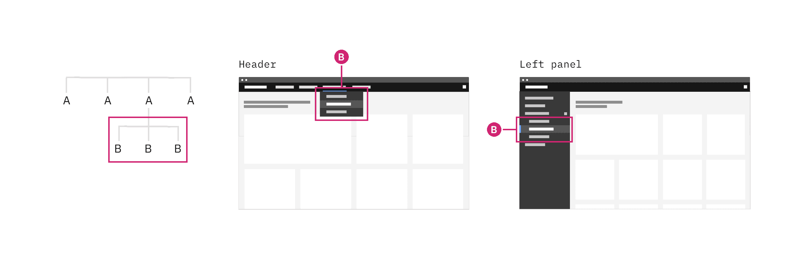

<Caption>
  Example showing how a simple architecture can be configured with only a header
  or only a left panel
</Caption>

### Header only

The UI Shell header can be used as standalone navigation for your UI when a
small number of main sections do not require a secondary navigation. The header
provides a place for a site title, navigation links and dropdowns, and header
icons. The header is globally persistent and will always be in view as the user
navigates around the site.

This configuration gives more horizontal space for the page’s content, but has
limited room for navigation items in the header. This configuration also does
not lend itself to sub-menus that need to remain open as they will overlay and
interfere with the page content. Use a left panel in combination with the header
if your navigation requires a sub-menu to remain open.

<Row>
<Column colLg={8}>

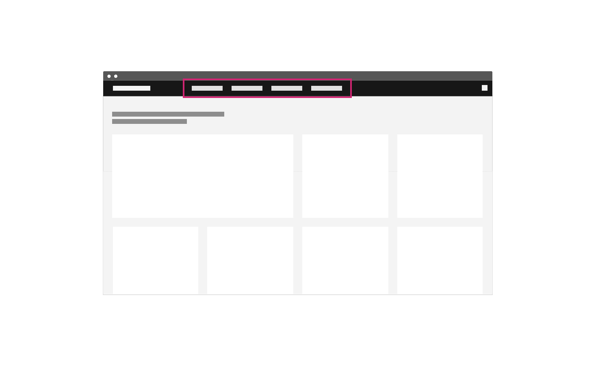

<Caption>Example of header-only navigation</Caption>

</Column>
</Row>

### Header with left panel

The left panel allows for more navigational items to stack vertically and an
additional level of hierarchy when paired with header navigation. Compared to a
header-only site navigation, this arrangement means sub-menus can remain open
without overlaying or interfering with the page content.

<Row>
<Column colLg={8}>

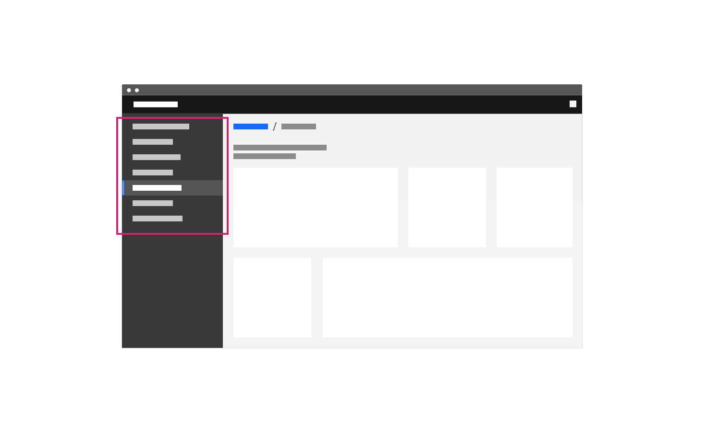

<Caption>An example of a left-panel-only navigation.</Caption>

</Column>
</Row>

## Navigation

### Global

A global navigation is always present in the UI. In this example, the
[UI shell header](https://www.carbondesignsystem.com/components/UI-shell-header/usage)
is used as a global navigation with two system level links (A) in the header and
five system level links in the switcher.

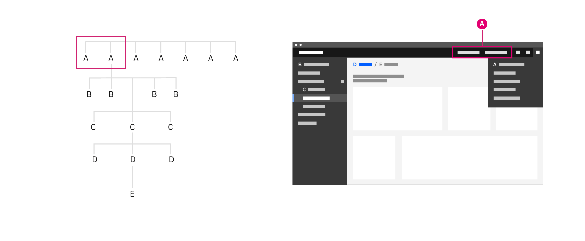

<Caption>
  The global header in this example contains only system navigation elements.
</Caption>

In the example below, the
[UI shell header](https://www.carbondesignsystem.com/components/UI-shell-header/usage)
contains both system (A) and product (B) links in the global region. System
level links should be right justified in the header and product level links
should be left justified. On narrow screens when there is no room for header
links, the system (A) links will move to the right UI shell panel and the
product (B) links will move to the left UI shell panel.

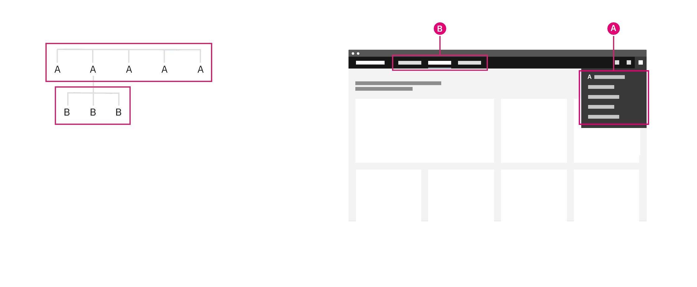

<Caption>
  The global header in this example contains both product (B) and system
  navigation (A) elements.
</Caption>

### Local

The local navigation takes users between areas of a product. Generally, these
areas are collections of pages that should be grouped together so a user can
undertake an end-to-end workflow without changing areas.

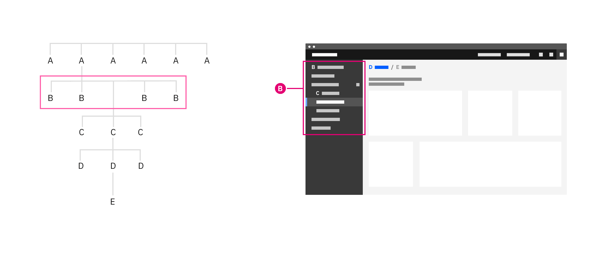

<Caption>The UI shell left panel being used as the product navigation.</Caption>

Related products should share navigation structures. Following similar
structures across a platform minimizes transitional volatility—your users will
spend less time orienting themselves. This will help increase the user’s
productivity and perception of the platform’s responsiveness as they move
between screens and states.

## Best practices

### Persistent data and UI state

The UI shell makes it easy to pivot between different offerings in your UI.
Maintaining or restoring the state of a page helps your user pivot between
different areas to complete tasks without losing context or progress. If state
or progress will be lost, inform users of this consequence. Maintaining these
states and filters will bring the user back to where they were if they had gone
through levels of drill downs or welcome screens.

One technique to maintain this state is to use the shell’s menu items to track
the essential state elements in the URL and return the user to that URL
automatically when they return. This capability is not part of the UI Shell
component and must be added during implementation.

### Sense of place

The role of the global header goes beyond linking the user to different areas in
the UI. The global qualities make the header an ideal location for your user to
naturally reference when they need to orient themselves.

This sense of place applies to location as well as states. The header can be
used to indicate the user’s logged in status, which account they are using, or
if they have entered a different mode.

### Drill down levels and breadcrumbs

[Breadcrumbs](/components/breadcrumb/usage) let your user see where they are in
the hierarchy of the application and gives users a way to navigate back up.

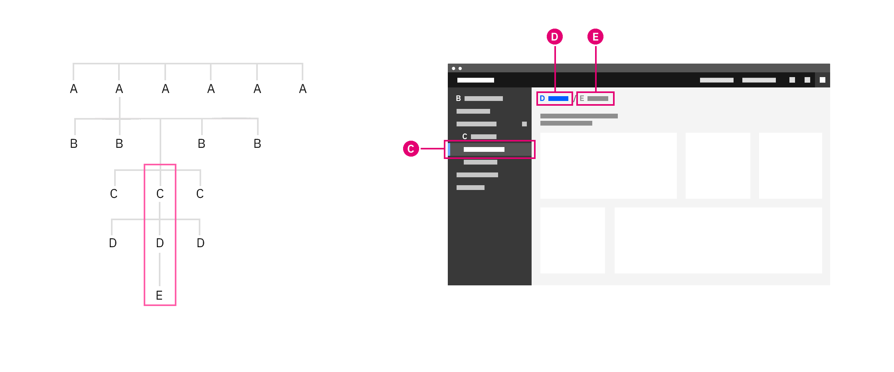

<Caption>Breadcrumbs being used to navigate up a level</Caption>

In many cases users need to drill up into a new context, for example from an
overview page to a particular project, device or asset view.

A drill down can be triggered from any interactive element in an application,
and will generally open a new page focused purely on the object that was
selected. This new page will then include a breadcrumb of the path back to the
root level above the title.

### Organizational schemes

When planning your product’s UI, put the emphasis on the tasks the user has to
complete rather than business or technical limitations. Forcing the user to
learn a new mental model for your product increases the time to productivity and
creates a disjointed experience between your product and the platform.

Your UI may need different schemes for organizing content in different parts of
your UI. Create logical groups that align to your user’s goals and improves
access to the content.

#### Most recent

Ordering a navigation by most recent helps users who are frequently looking for
the last object they used and the historical context helps with discovery. This
loses any logical grouping and may be suited as an alternative way to organize
rather than the primary way.

#### Customized

A user customized navigation lets the user personalize the UI for their own
needs.

#### Audience

Structuring content by your audience takes into account the role or permissions
tied to that persona. This can highlight more common tasks related to that
persona, but can also decrease discoverability if tasks overlap personas or your
user occasionally shifts between roles.

#### Alphabetically

Organizing your navigation alphabetically is only successful if your user knows
what they are looking for and how the item is labeled. Alphabetical navigation
decreases discoverability in cases where your user is looking for a synonym of
an item (e.g. "pop-up, modal, lightbox, dialogue").

#### Company organization

Your navigation may be composed of multiple applications, resources, and
platforms working together. The navigation should reflect an appropriate domain
model rather than an org chart or a series of company or technology
acquisitions.

#### Unbound content

Avoid placing unbounded content in the shell side navigation. Usability drops
when the number of items within the shell get too high. For this reason, do not
place content that has no upper limit (such as content created by users) within
the shell’s side navigation. Instead, make use of drill down patterns.

## Accessibility

### Matching source code order to the visual hierarchy

[Technique C27](https://www.w3.org/WAI/WCAG21/Techniques/css/C27) outlined in
WCAG 2.1 recommends matching the visual order of your UI objects with the order
they appear in the Document Object Model (DOM). This technique ensures the
designed hierarchy of information is communicated the same visually as it is by
assistive technologies.

<Row>
<Column colLg={12} colMd={12} colSm={4}>

<Caption>
Example showing a text input component as it appears visually in the UI, HTML, and accessibility tree
</Caption>
</Column>
</Row>

This technique is necessary when the organization of your navigation menu is
used to convey the meaning of stepped concepts like provisioning or other
wizard-style patterns. The intended meaning of your grouping and ordering may be
lost if the position of an object is styled differently from the DOM order.

In some cases, styling the elements with CSS to appear in a different visual
order than the DOM order may be beneficial. For example, on narrow or mobile
screen widths you may choose to move your navigation from the top of the screen
to another area that’s more appropriate for your user’s context.

<Row>

<Column colLg={12} colMd={12} colSm={6}>

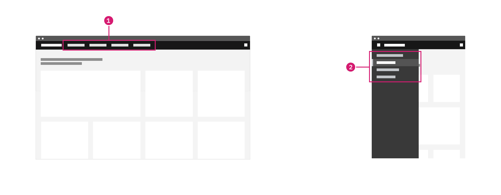

<Caption>
  1. Navigation items appear in the header at wide widths.  
  2. Navigation items have moved to a side nav for narrow widths.
</Caption>

</Column>
</Row>

#### Navigating content by headers

Users who rely on screen reader technology to navigate areas of a site also rely
on screen readers to navigate the content of a page. In the same way users can
visually scan for the larger and bolder type of a header, users of assistive
technologies also must understand the hierarchy of the page’s content to
efficiently navigate a page’s content.

To ensure all users interpret the structure of your content in the same way, the
visual representation of a heading should match the underlying ranking of the
header tag. Tutorials on how to achieve this can be found in the WCAG page
structure
[tutorials on headings](https://www.w3.org/WAI/tutorials/page-structure/headings/).

### Keyboard navigation

#### Skip to main content

Some users may use a keyboard to navigate your site. Starting focus in the main
navigation lets them quickly navigate to other areas in your UI, but could block
them from the main content if there is a large number of navigation items to tab
through first.

[Success Criterion 2.4.1 (Bypass Blocks)](https://www.w3.org/TR/2016/NOTE-WCAG20-TECHS-20161007/G1)
suggest bypassing these blocks by providing "Skip to main" link at the start of
you navigation’s focusable controls. This lets users easily skip the navigation
region and begin interacting with the page’s main content area.

<Row>

<Column colLg={8}>
<GifPlayer>

</GifPlayer>

<Caption>
  The "Skip to main content link" is the first focusable element on the Carbon
  website.
</Caption>
</Column>
</Row>

#### Landmark regions

Landmark regions are a way of grouping similar areas of content in your UI and
assigning them roles. This technique lets users navigating with assistive
technologies quickly get around your site by navigating between landmark regions
in your UI rather than each individual element.

Examples of common landmark regions include: navigation, main, form, banner, and
search. If there are multiple navigation landmark regions give each a unique
label.

<Row>

<Column colLg={8} colMd={8} colSm={6}>

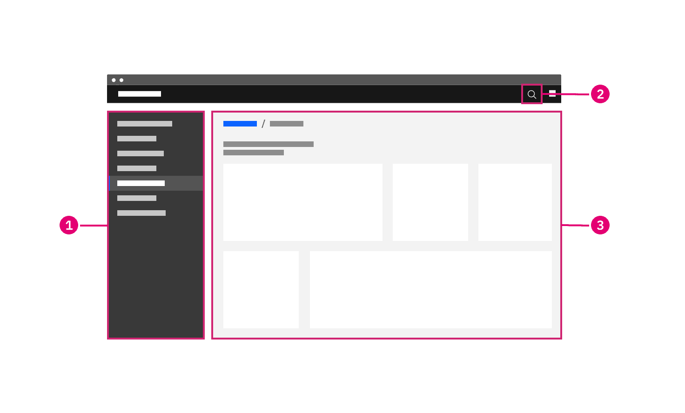

<Caption>
  1. Navigation landmark  
  2. Search landmark  
  3. Main landmark  
</Caption>

</Column>

</Row>

#### Navigating the page via regions

Navigating between landmark regions helps users who cannot see the visual
grouping of your navigation. This grouping can be important to understanding the
organization of the structure of the content and making it clear what users can
do and where they can go in your UI.

<Row>

<Column colLg={8} colMd={8} colSm={6}>

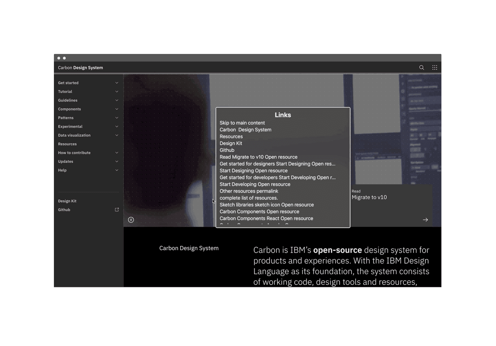

<Caption>Screenshot of a rotor in action</Caption>

</Column>

</Row>

## Related

- [UI shell header](/components/UI-shell-header/code/)
- [UI shell left panel](/components/UI-shell-left-panel/code/)
- [UI shell right panel](https://www.carbondesignsystem.com/components/UI-shell-right-panel/code/)
- [Breadcrumb](https://www.carbondesignsystem.com/components/breadcrumb/code/)

## References

- David R. Danielson,
  [_Transitional Volatility in Web Navigation_](https://www.researchgate.net/publication/240859594_Transitional_volatility_in_web_navigation)
  (2003)
- Susan Farrell,
  [_Utility Navigation: What It Is and How to Design It_](https://www.nngroup.com/articles/utility-navigation/)
  (2015)
- IBM Design,
  [_Accessibility Handbook_](http://accessibility-handbook.mybluemix.net/design/a11y-handbook/)
  (2019)
- James Kalbach,
  [_Designing Web Navigation_](https://www.oreilly.com/library/view/designing-web-navigation/9780596528102/ch04.html)
  (2007)
- WebAIM, [_"Skip Navigation" Links_](https://webaim.org/techniques/skipnav/)
  (2013)
- [Web Content Accessibility Guidelines](https://www.w3.org/WAI/standards-guidelines/wcag/)
  (W3C, 2018)

## Feedback

Help us improve this pattern by providing feedback, asking questions, and
leaving any other comments on
[GitHub](https://github.com/carbon-design-system/carbon-website/issues/new?assignees=&labels=feedback&template=feedback.md).
