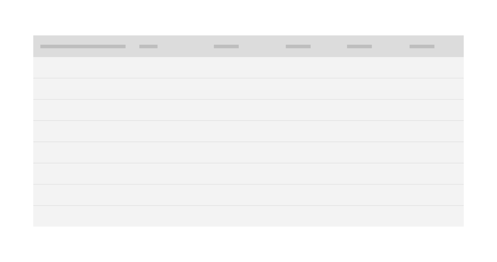

<PageDescription>

Loading patterns are used when information takes an extended amount of time to
process and appear on-screen. Skeleton states and the loading component are two
visual indicators that communicate that data is loading and that the screen is
not frozen.

</PageDescription>

<AnchorLinks>

<AnchorLink>Overview</AnchorLink>
<AnchorLink>Skeleton states</AnchorLink>
<AnchorLink>Loading indicators</AnchorLink>
<AnchorLink>Progressive loading</AnchorLink>
<AnchorLink>Load more options</AnchorLink>
<AnchorLink>Accessibility</AnchorLink>
<AnchorLink>Related</AnchorLink>
<AnchorLink>References</AnchorLink>
<AnchorLink>Feedback</AnchorLink>

</AnchorLinks>

## Overview

Loading strategies assure users that their request is in progress and can create
the illusion of shorter load times in apps. According to
[research](https://www.nngroup.com/articles/progress-indicators/) conducted by
the Nielsen Norman Group, skeleton states and other loading indicators improve
user satisfaction.

In this pattern, we will look at skeleton states, loading indicators, and
progressive loading.

## Skeleton states

Skeleton states are simplified versions of components used on an initial page
load to indicate that the information on the page has not fully loaded yet. They
should only appear for only a few seconds, disappearing once components and
content populate the page.

<Row>
<Column colLg={8}>

<Caption>Example of a skeleton state</Caption>

</Column>
</Row>

Skeleton states use motion to convey that the page is not stuck and that data is
still being loaded. This can help to
[reduce user uncertainty](https://www.nngroup.com/articles/progress-indicators/).

Only use skeleton states on container-based components like tiles and structured
lists or data-based components like data tables and cards. In most cases, action
components (e.g. buttons, input fields, checkboxes, toggles) do not need to have
a skeleton state.

Never represent toast notifications, overflow menus, dropdown items, modals, and
loaders with skeleton states. Elements inside a modal may have a skeleton state,
but the modal itself should not.

## Loading indicators

Loading indicators signal a user action is processing. Unlike progress bars,
loading indicators only signal that loading is occurring and do not give any
indication of progress. If a process will take more than a moment or two to
complete, use a progress indicator instead.

Full-screen loading indicators tell a user the entire application is processing,
while inline indicators show that a specific selection or action is processing.

### Full-screen loading

The [loading component](/components/loading/usage) should be used when the
entire page is processing. This is often applied after data is submitted or
saved by the user.

If the process is going to take more than a few minutes, consider including a
[notification](/patterns/notification-pattern).

<Row>
<Column colLg={8}>

<Caption>Example of a progress indicator in an application</Caption>

</Column>
</Row>

| When to use                                        |                                                                                                                                                                              |
| -------------------------------------------------- | ---------------------------------------------------------------------------------------------------------------------------------------------------------------------------- |
| _An action temporarily disables the application_   | If a user’s action temporarily disables the application while processing occurs, use a loading indicator and a full-screen overlay.                                          |
| _Processing takes more than a few seconds_         | If a loading process will require the application’s full resources and will take longer than a moment or two, use a full-screen loading indicator.                           |
| _Data from user input is being saved or submitted_ | Saving data following with user input often takes a few moments. Using a loading indicator allows the application to finish processing before allowing the user to continue. |

### Inline loading

Use the inline loading component when a single component is processing. For
example, when an administrator invites a user, an inline loading component
indicates the system is processing the invite request.

<Row>
<Column colLg={8}>

<Caption>Example of an inline loading indicator</Caption>

</Column>
</Row>

## Progressive loading

Progressive loading is a technique that loads pages in batches. The simplest
view of the page loads first, followed by progressively more detailed batches
until the entire viewport has loaded.

The primary batch should show a page’s basic structure (the skeleton state
versions of the container-based components), data-based text (the skeleton state
version of text) and non-data text. Following batches can include images,
content outside of the viewport, interactive (action-based) components, and
data-based text.

Not all items need a skeleton state and instead can be expressed as negative or
white space until they load. For example, a 600 x 600px image can be shown as a
600 x 600px area of white space until the full image loads.

<Row>
<Column colLg={4}>

<Caption>Phases of progressive loading</Caption>

</Column>
<Column colLg={4}>

</Column>
<Column colLg={4}>

</Column>
</Row>

 

| When to use                                        |                                                                                                   |
| -------------------------------------------------- | ------------------------------------------------------------------------------------------------- |
| _A page view is slow to load_                      | Pages that source data from multiple sources, such as dashboards, and can be slow to load.        |
| _A user changes filters or facets in a table view_ | Tables may be sourcing information from large data sets and so processing may take a few moments. |

## Load more options

A Load more option can be used to extend a list where only a small fraction of
options are displayed. It can also be used in cases where the list of options is
populated via a database. Using Load more allows the data to load in progressive
batches.

<Row>
<Column colLg={8}>

<Caption>Example of Load more</Caption>

</Column>
</Row>

## Accessibility

A screen reader should
[notify a user](https://www.w3.org/WAI/GL/wiki/Notification_of_Loading/Busy) if
an application is loading, busy, gets stuck, or if a process fails.

For specific loading accessibility concerns, see the WCAG documentation for
[Notification of Loading/Busy](https://www.w3.org/WAI/GL/wiki/Notification_of_Loading/Busy)
and adhere to accessibility guidelines for the
[loading component](/components/loading/accessibility).

## Related

<Row>
<Column colSm={2} colMd={2} colLg={3}>

#### Components

- [Data table](/components/data-table/usage)
- [Loading](/components/loading/usage)
- [Pagination](/components/pagination/usage)

</Column>
<Column colSm={2} colMd={2} colLg={3}>

#### Patterns

- [Empty states](/patterns/empty-states-pattern)
- [Forms](/patterns/forms-pattern)
- [Notifications](/patterns/notification-pattern)

</Column>
</Row>

## References

- Bill Chung,
  [Everything you need to know about skeleton states](https://uxdesign.cc/what-you-should-know-about-skeleton-screens-a820c45a571a)
  (Medium UX Collective, 2018)
- Jakob Nielsen,
  [Progress Indicators Make a Slow System Less Insufferable](https://www.nngroup.com/articles/progress-indicators/)
  (Nielsen Norman Group, 2001)
- Web Content Accessibility Guidelines,
  [Notification of Loading/Busy](https://www.w3.org/WAI/GL/wiki/Notification_of_Loading/Busy)
  (W3C, 2016)

## Feedback

Help us improve this pattern by providing feedback, asking questions, and
leaving any other comments
[on GitHub](https://github.com/carbon-design-system/carbon-website/issues/new?assignees=&labels=feedback&template=feedback.md).
