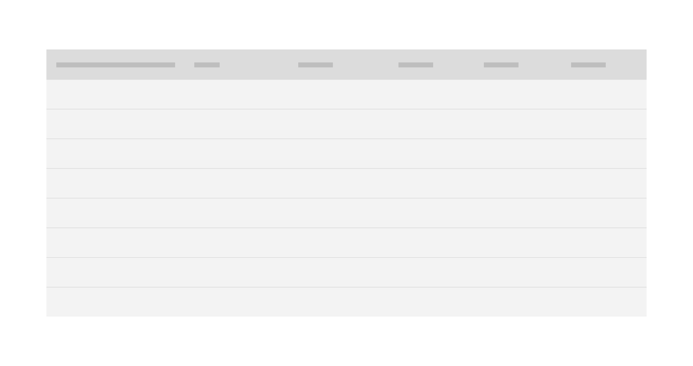

<PageDescription>

Loading patterns are used when information takes an extended amount of time to process and appear on screen. Skeleton states and the loading component are two interactions that communicate to users that data is loading and the screen is not frozen.

</PageDescription>

<AnchorLinks>

<AnchorLink>Skeleton states</AnchorLink>
<AnchorLink>Progressive loading</AnchorLink>
<AnchorLink>Loading components</AnchorLink>
<AnchorLink>Load more</AnchorLink>

</AnchorLinks>

## Skeleton states

Skeleton states are simplified versions of components used on an initial page load to indicate that the information on the page has not fully loaded yet. They should only appear for one to three seconds, disappearing once the actual content populates the page.

Skeleton states improve a web app's perceived performance as the app appears to load faster than it actually does.

Use a `field-01` rectangular block for text. Skeleton states use motion to convey that the page is not stuck loading but rather that data is still being pulled in.

<Caption>Example of a text skeleton state in a data table</Caption>

### Usage

Only use skeleton states on container-based components (e.g. tiles and structured lists), data-based components (e.g. data tables and cards), and data-based text. In most cases, action components (e.g. buttons, input fields, checkboxes, toggles) do not need to have a skeleton state.

Never represent toast notifications, overflow menus, dropdown items, modals, and loaders with skeleton states. Elements inside a modal may have a skeleton state, but the modal itself should not.

## Progressive loading

Progressive loading is when a page loads in batches. The simplest view of the page loads first, followed by progressively more detailed batches until the entire viewport has loaded.

The primary batch should show a page's basic structure (the skeleton state versions of the container-based components), data-based text (the skeleton state version of text) and non-data text. Following batches can include images, content outside of the viewport, interactive (action-based) components, and data-based text.

Not all items need a skeleton state and instead can be expressed as negative or white space until they load. For example, a 600 x 600px image can be shown as a 600 x 600px area of white space until the full image loads.

<Caption>
  First phase of a dashboard using skeleton states to demonstrate progressive
  loading
</Caption>

<Caption>
  Second phase of a dashboard using skeleton states to demonstrate progressive
  loading
</Caption>

<Caption>
  Third phase of a dashboard using skeleton states to demonstrate progressive
  loading
</Caption>

## Loading components

A loading component is a rotating shape indicating the application is processing.
Use cases include:

- When data processing takes more than a few seconds but no longer than one minute.
- When data from a user input is being saved or submitted.

### Loading

The [loading component](/components/loading/usage) should be used when the entire page is processing. This is often applied after data is submitted or saved by the user.

<Caption>Example of a large loader in an application</Caption>

### Inline loading

Use the inline loading component when a single component is processing. For example, when a user restarts a stopped application, an inline loading component indicates the system is processing the restart request.

<Row>
<Column colLg={8}>

<Caption>Example of an inline loader</Caption>

</Column>
</Row>

## Load more

A **Load more** button should be used to extend a list where there only a small fraction of options are displayed. It can also be used in cases where the list of options is populated via a database. Using **Load more** allows the data to load in progressive batches.

<Row>
<Column colLg={8}>

<Caption>Example of a 'Load more' button</Caption>

</Column>
</Row>
