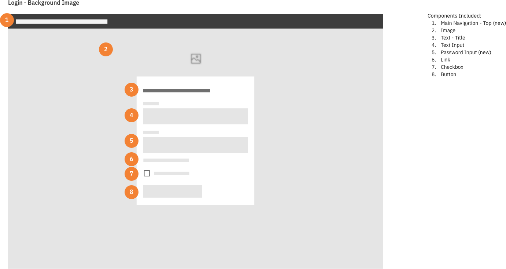
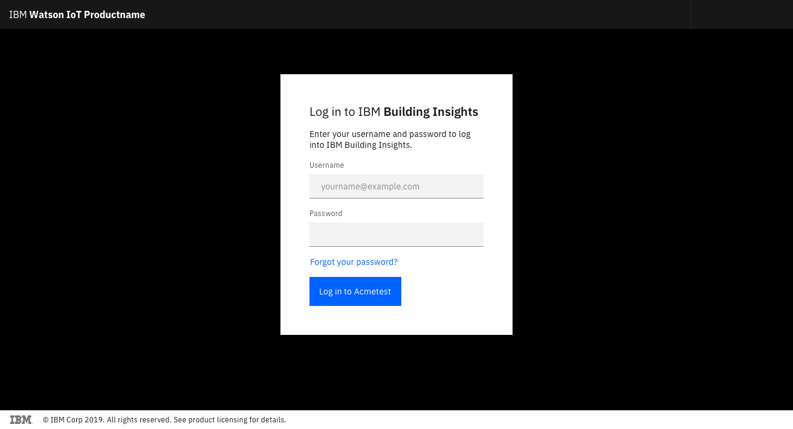
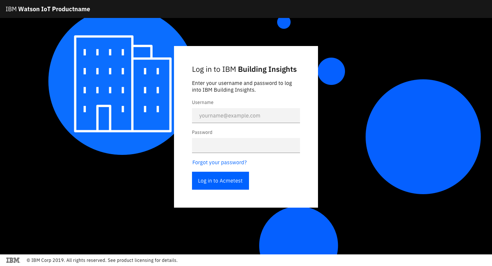
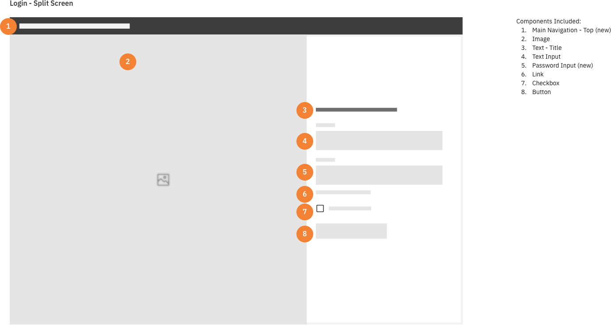
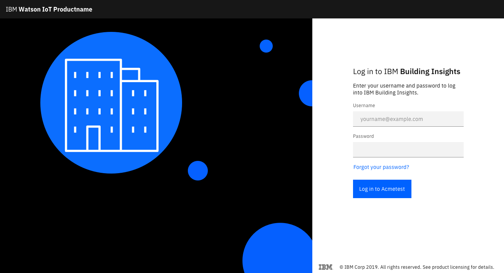
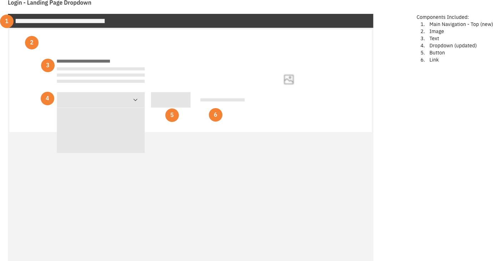
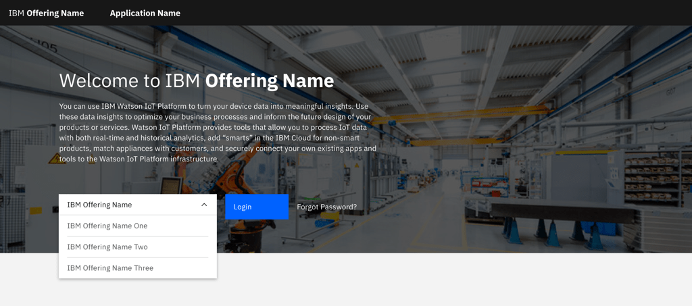

<PageDescription>

Logging in to a product, property, or system is a fundamental interaction whenever access to resources is based on identity.

</PageDescription>

## Overview

Logging in to a product, property, or system is a fundamental interaction users encounter whenever access to those resources is based on the establishment of a user's identity via an identifier and an authorization method, such as a password. This is a pattern users encounter in a vast number of products, properties and experiences, and we take advantage of users' understanding of those patterns when we employ similar, common workflows they've come to expect and understand.

This guidance describes three variants of login pattern: A [discrete page login](#discrete-page-login); a [modal dialog login](#modal-dialog-login), and a [menu item login](#menu-item-login).

The Create Account and Forgot Password patterns are related but separate from the login pattern. There are also extensions to the login patterns such as SSO sign in, Two Factor Identification, or Hardware Authentication; this document will highlight their points of extension but will reserve detailed articulation of those extensions for a future iteration of this pattern.

## Discrete page login

This pattern presents the user with an entire page devoted to the login task. It is the most disruptive login pattern.

### Use this pattern when:

- You want to isolate content from users until after they have successfully met the identification/authentication challenge
- The login procedure is complex and requires the users' full attention, such as SSO or 2-Factor authorization workflows
- A loss of context or state of work is not a consequence of the disruption

### Do not this pattern when:

- Users have invested time in work prior to responding to the login call to action, such as configuring a device to understand pricing, assembling a travel itinerary, or composing a document, especially if you cannot return them to the prior state of completion
- Any workflow where you want to convey a continuity of state

### The Solution

In this pattern the user has responded to a Login Call to Action to initiate the login workflow (or arrived at a URL that presents the login page to all unauthenticated users). The response is navigation to a complete, distinct screen where the login pattern begins. If the user successfully enters and Identifier (Frequently a User name or email address) and Authentication Token (a password) the will continue to the product or property protected by the login.

This pattern supports Create Account and Forgot ID/Forgot password patterns as extensions to the basic login identity/authorization challenge flow, and can be extended to support authorization workflows such as Two factor authorization, Single Sign On, and even External Authentication Services such as Google or Facebook authentication. These topics are outside the scope of this document iteration, but will be addressed in future revisions.

<Caption>Wireframe of a discrete page login, (centered)</Caption>

<Caption>Example of a discrete page login, (centered)</Caption>

If you choose to include an illustration, ensure the art reflects the product. Keep it simple and aligned with the product's aesthetic.

<Caption>
  Example of a discrete page login, (centered) with illustration
</Caption>

<Caption>Wireframe of discrete page login(right entry form)</Caption>

<Caption>Example of discrete page login(right entry form)</Caption>

### Login page with product selector

In some cases, you may ask the user to select which product to log into. This allows the user to jump directly to the home landing page for the product after authenticating.

Use a dropdown component to display the options.

<Caption>Wireframe of login page with product selector</Caption>

<Caption>Example of login page with product selector</Caption>

### Best Practices

- Plan for the successful login scenario and the unsuccessful scenarios.
- Present to Username and Password entry fields in a single view, since Browser and 3rd party password managers tend to work best in this modality. In some scenarios the Username must be presented before the Password field (for example to determine whether it's an SSO account); this is acceptable but less desirable.
- Avoid a barrage of upsell messaging.

## Modal Dialog Login

This pattern presents a Modal Dialog devoted to the login task. User has the ability to see much of where they were (depending on resolution) but must either complete the login flow or dismiss it to return to their Prior state. The pattern is less disruptive than a Discreet Page Login, but more disruptive than a Menu Item Login.

### Use this pattern when:

- You want to maintain both the current state and convey assurance to the user that the system knows where they were.
- A loss of context or state of work is the consequence of the disruption of a Discrete Page Login. If it is difficult or impossible to maintain a state across the page loads, use this pattern.

### Do not this pattern when:

- You want to completely block or restrict access to your property or product. Use a discrete page rather than loading a view of your product covered by a modal, or having everything disabled until you complete the modal.

### The solution

In this pattern the user has responded to a Login Call to Action to initiate the login workflow. The response is to render a modal dialog over the current context where the login pattern begins. If the user successfully enters and Identifier (Frequently a User name or email address) and Authentication Token (a password) the will return to the prior state of product or property in a logged in or authenticated state.

This pattern supports Create Account and Forgot ID/Forgot password patterns as extensions to the basic login identity/authorization challenge flow, and can be extended to support authorization workflows such as Two factor authorization, Single Sign On, and even External Authentication Services such as Google or Facebook authentication. These topics are outside the scope of this document iteration, but will be addressed in future revisions.

<Caption>Wireframe of a modal dialog login</Caption>

<Caption>Example of a modal dialog login</Caption>

### Best Practices

- Plan for the successful login scenario and the unsuccessful scenarios.
- Present to Username and Password entry fields in a single view, since Browser and 3rd party password managers tend to work best in this modality. In some scenarios the Username must be presented before the Password field (for example to determine whether it's an SSO account); this is acceptable but less desirable.

## Menu Item Login

This pattern presents a Menu Item from the Global header devoted to the login task. User has the ability to see most in not all of where they were but must either complete the login flow or dismiss it to return to their prior state. The pattern is the least disruptive.

### Use this pattern when:

- You want to maintain both the current state and convey assurance to the user that the system knows where they were.
- A loss of context or state of work is the consequence of the disruption of a Discrete Page Login. If it is difficult or impossible to maintain a state across the page loads, use this pattern.
- Your authentication systems are sophisticated enough to resolve a user's account, whether it is SSO, etc. with just the Username and password.

### Do not this pattern when:

- You want to completely block or restrict access to your property or product. Use a discrete page.
- You want to prominently feature either account creation or alternative authentication methods (such as SSO).

### The solution

In this pattern the user has responded to a Login Call to Action to initiate the login workflow, which is located in a Global Header or menu.head. The response is to render a modal dialog over the current context where the login pattern begins. If the user successfully enters and Identifier (Frequently a User name or email address) and Authentication Token (a password) the will return to the prior state of product or property in a logged in or authenticated state.

This pattern usually supports Create Account and Forgot ID/Forgot password patterns as extensions to the basic login identity/authorization challenge flow, and can be extended to support authorization workflows such as Two factor authorization, Single Sign On, and even External Authentication Services such as Google or Facebook authentication through a specific link in the menu that transports the user to either the Discrete Page Login or at least a Modal Dialog Login. These topics are outside the scope of this document iteration, but will be addressed in future revisions.

<Caption>Wireframe of a menu item login</Caption>

<Caption>Example of a menu item login</Caption>

### Best Practices

- Plan for the successful login scenario and the unsuccessful scenarios.
- Present to Username and Password entry fields in a single view, since Browser and 3rd party password managers tend to work best in this modality. In some scenarios the Username must be presented before the Password field (for example to determine whether it's an SSO account); this is acceptable but less desirable.

## Related Topics

SSO Authentication
Two Factor Authentication
Global Header
Dialog Boxes

## Accessibility

tbd

## References

tbd

## Feedback

tbd
