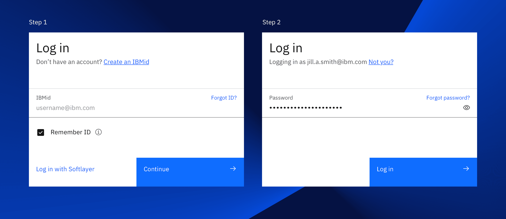
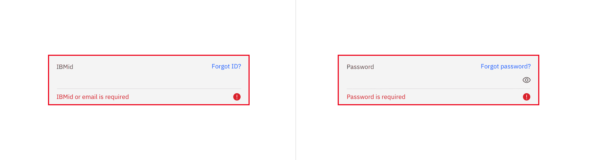
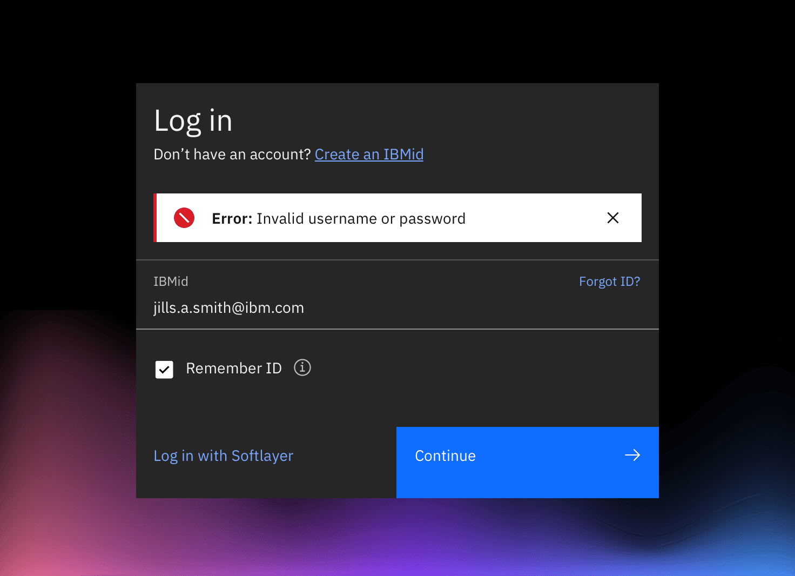
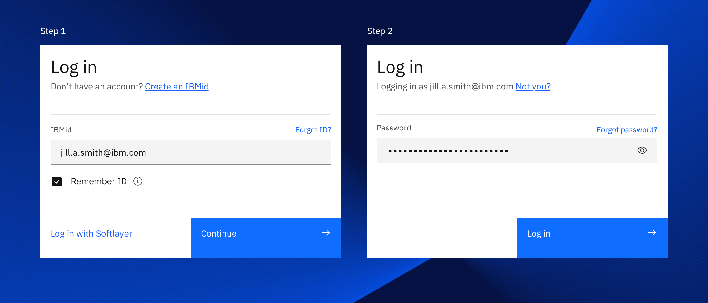
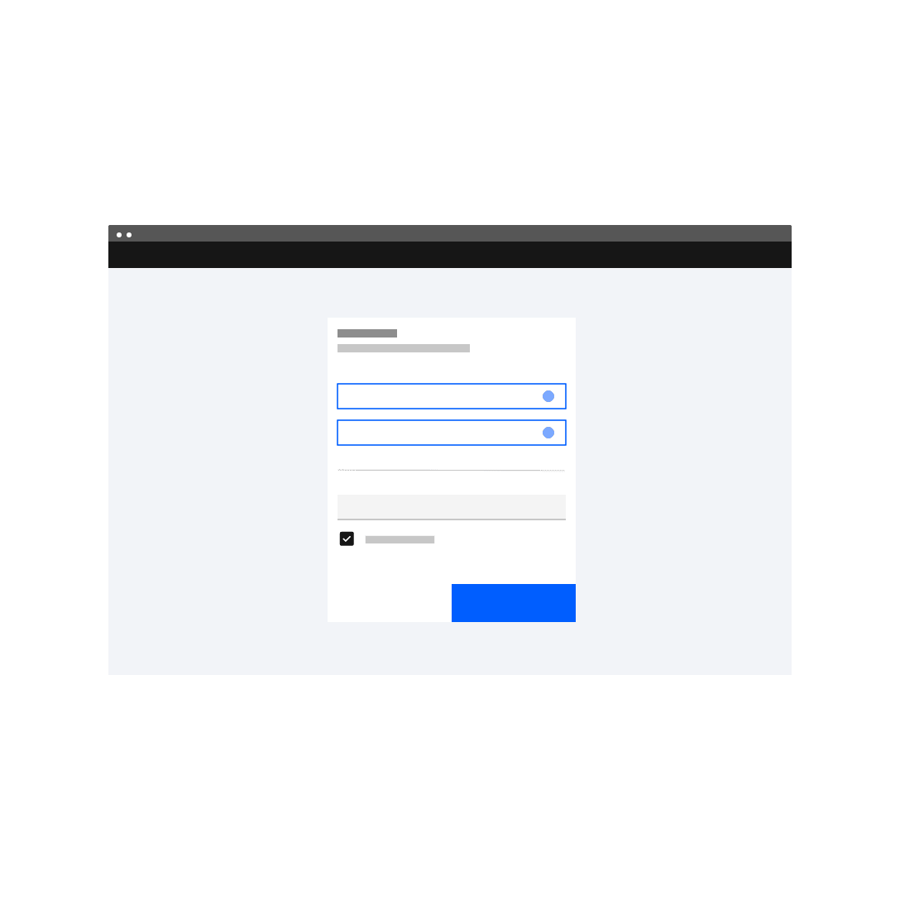
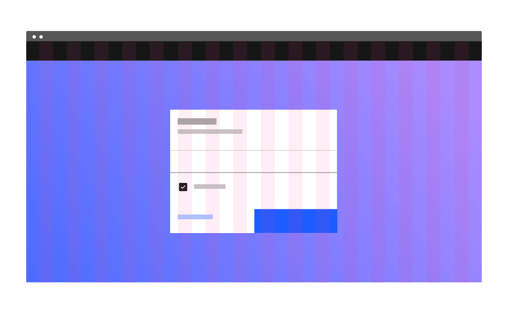
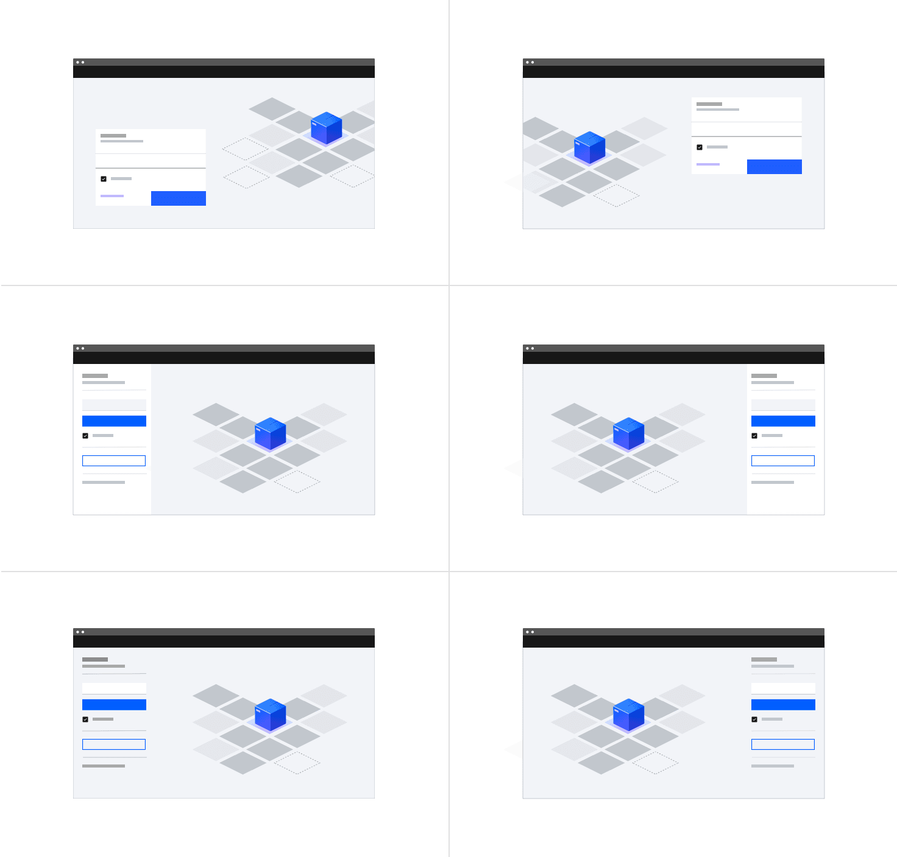
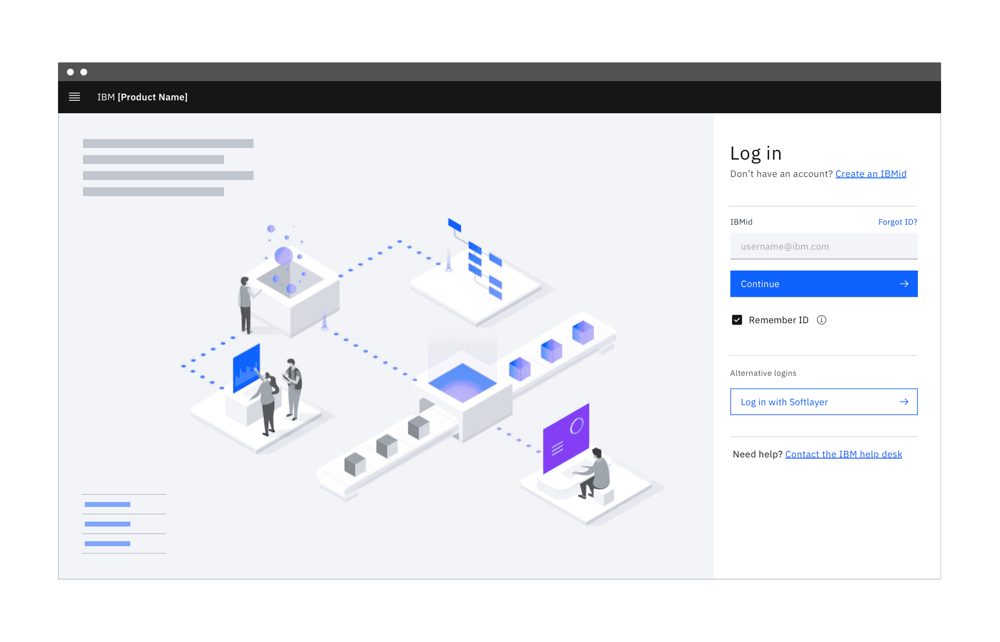
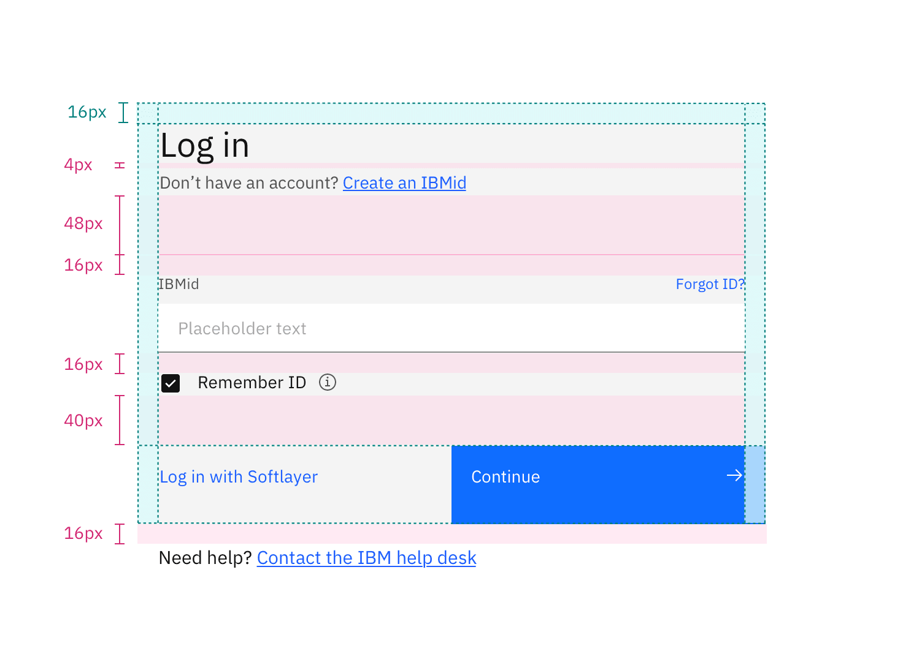
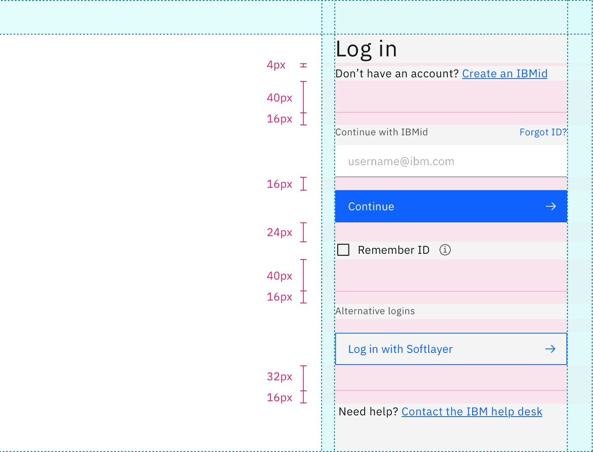

<PageDescription>

The login page allows a user to gain access to an application by entering their
user ID and password, or by using another method of authentication.

</PageDescription>

<AnchorLinks>

<AnchorLink>Overview</AnchorLink>
<AnchorLink>Behavior</AnchorLink>
<AnchorLink>Design and layout</AnchorLink>
<AnchorLink>Accessibility</AnchorLink>
<AnchorLink>Related</AnchorLink>
<AnchorLink>References</AnchorLink>
<AnchorLink>Feedback</AnchorLink>

</AnchorLinks>

## Overview

Login is often the first interaction a user has with your product. This entry
point experience is an important moment in establishing your product's brand and
experience and sets the tone for their overall experience with the product.

### Anatomy of a basic login screen

<Row>
<Column colLg={12}>

</Column>
</Row>

1. **Title:** Located at the top of the log in flow. For consistency, the title
   should include the words “Log in” rather than “Sign in” or another variant.
   The title can also include the product name if that makes sense for your
   situation. If necessary the title can wrap to the next line.
2. **Create account (optional):** Link to URX form to create an account;
   location of this element can vary with layout.
3. **Required fields:** The user ID and password fields are both required
   although, in IBM’s preferred log in flow, the password field is progressively
   disclosed, because it has a dependency on the user ID. User IDs are usually
   in the form of an email address. Depending on the product, this area may also
   include a filter to specify the ID type.
4. **Forgot username/password link:** Takes users to a page where they can
   recover their username and/or password.
5. **Remember ID (optional):** Saves the user ID and presents the completed
   input field the next time the user logs in; it is located under the required
   field. Clarify what is being remembered (that is, “user ID") to avoid
   confusion.
6. **Alternative logins (optional):** Displays alternative login methods in
   order.
7. **Continue button:** Button label should be “Continue” for the primary call
   to action. When clicked, the email address is validated and routes the user
   to either the single sign-on or password flow.
8. **Need help? (optional):** Help link specifically for user ID questions and
   issues.
9. **Background image (optional):** Check your product team's guidance and
   choose an asset accordingly; all product team guidance should adhere to the
   IBM Design Language. Brand and sub-brand guidance can be found on
   [IBM Brand Center](https://www.ibm.com/brand/).

### When to use

The login page is presented to users in the following scenarios:

- When a user wants to gain access to an app.
- When a user has logged out voluntarily. They will see a confirmation message
  after which they will be automatically redirected back to the login page.
- When a user has been logged out due to inactivity. In this scenario, when the
  user logs back in they should be redirected to the last page they were on,
  before being logged out.

## Behavior

### Progressive authentication

IBM defaults to progressive authentication for logging into products. This
decreases the user’s cognitive load by eliminating non-essential distractions
and automatically directing them to the necessary login flow.

As illustrated below, the user ID should be requested upfront with a “Continue”
button to move forward. This allows the system to distinguish which path the
user needs to take in the background instead of making the user read through
options and choose. From this point the user will either continue to a single
sign-on (SSO) flow or they’ll be presented a password field.

#### SSO

Single sign-on (SSO) enables users to log into multiple, unrelated products
through one authentication portal, rather than using a unique username and
password for each product. Many companies use SSO to give their employees access
to a suite of unrelated tools with only one login.

When users input an SSO email and click “Continue” they are taken to their
organization’s SSO flow. If it is not possible to determine whether a user is
using an SSO email in the backend, provide users with a button to take them to
their SSO flow.

#### Username and password

If a user enters an email that does not use SSO, they are taken to the password
flow. The password page includes a way to return to the previous page in case
the user makes a mistake while filling out their user ID, as well as a “Forgot
password” button.

Do not give users an error if they enter an email or username that is not valid
until after they have clicked “Log in” on the password page. This protects valid
email addresses and usernames from being exposed and helps keep your product
secure.

<Row>
<Column colLg={12}>

</Column>
</Row>

#### Multi-factor authentication

Multi-Factor Authentication (MFA) requires a user to present more than one
credential, in order to verify their identity. This method provides an added
layer of security, while still maintaining ease of use. This often includes a
password and an additional additional credential, like an SMS code or known
backup code.

Carbon does not have consolidated guidance around multi-factor authentication.
Since it’s something that products approach in different ways, we'd like to
conduct more research with a view to offering more robust, centralized guidance
in the future.

#### Separate authentication methods

If distinguishing between the authentication methods in the background is not
technically feasible, provide users buttons to the various paths upfront.
Consult your product team's guidance to determine which alternative logins your
platform or product offers.

Fixed text inputs and buttons should be used for this design so that the primary
button can maintain its position next to the input field. See the
[Fluid vs. fixed inputs](#fluid-vs.-fixed-components) section below for more
specific usage guidance. Also, please refer to brand guidelines when using logos
for alternative logins. Examples of brand guidelines for a few commonly used
alternative logins include:

- [Azure brand guidelines](https://docs.microsoft.com/en-us/azure/active-directory/develop/howto-add-branding-in-azure-ad-apps)
- [Github brand guidelines](https://github.com/logos)
- [Google brand guidelines](https://developers.google.com/identity/branding-guidelines)

<Row>
<Column colLg={12}>

<Caption>Example of a login form with alternate login options</Caption>

</Column>
</Row>

### Errors and validation

Effective error messaging is important for creating great experiences. Not being
able to log into an application is frustrating and blocks users from
accomplishing their tasks.

Always present error states on the login screen, and use inline errors whenever
possible. The error state you use will depend on whether the validation happens
on the client or the server.

#### Content guidelines

Error messages should be clear and concise. They should help users understand
what went wrong and give users steps to resolve the error. Be as specific as
possible in your error messages. If the message is written as a complete
sentence always use a period. If the message is a short fragment then feel free
to omit the period.

#### Client-side validation

Validate as much of the user's data before submission as possible. This
real-time validation should happen when the input field loses focus and checks
for input errors like invalid characters and empty fields. This helps users
easily identify mistakes and fix them before submitting the login form.

Common client-side errors:

- Empty required fields
- Invalid characters
- Incorrect input format

<Row>
<Column colLg={12}>

<Caption>Examples of client-side errors</Caption>

</Column>
</Row>

Whether you are using fixed or fluid text inputs in your login flow, inline
error messages should be displayed below any required field that is empty once
the field loses focus or an action button (“Continue” or “Log in”) is clicked.
See the fluid text input specs for more information on error states. Once the
field is filled, the error message should disappear.

The following error messages are suggested:

| Use case                                            | Message                              |
| --------------------------------------------------- | ------------------------------------ |
| _Empty username field_                              | IBMid or email is required           |
| _Empty password field_                              | Password is required                 |
| _Invalid character in an IBMid or email address_    | Enter a valid IBMid or email address |
| _Incorrect formatting of an IBMid or email address_ | Enter a valid IBMid or email address |

#### Server-side errors

If there are server-side errors when the user submits the login form, the page
should be reloaded, the password field cleared, and the user returned to the
username input field. Use an inline notification to display the errors and
provide clear direction on how users should resolve the issue. If there are
multiple server errors, the inline notifications should stack.

<Row>
<Column colLg={8}>

<Caption>Example of a server-side notificaiton on a login flow</Caption>

</Column>
</Row>

Incorrect username and/or password are the most common server errors. The
application should wait until both the username and password have been submitted
before checking they are valid. The same generic error message is suggested for
incorrect usernames or passwords. As mentioned earlier, this protects valid
email addresses and usernames from being exposed and helps keep your product
secure.

The following error messages are suggested:

| Use case         | Message                                 |
| ---------------- | --------------------------------------- |
| _Wrong username_ | Incorrect IBMid or password. Try again. |
| _Wrong password_ | Incorrect IBMid or password. Try again. |

## Design and layout

### Fluid vs. fixed components

Although the fluid inputs have not been added as a variant to Carbon core
components yet, they have complete
[design specs](https://github.com/carbon-design-system/carbon/issues/5416) and
are currently under development. Since many product teams have expressed
interest in using the fluid inputs for Login and Sign up flows, the Carbon team
wanted to consolidate exploration and present a clear path forward. What we have
presented above is the ideal future state of the login pattern.

However, since a coded variant does not exist for fluid inputs, many teams may
choose to proceed with the fixed inputs. Below are several alternate examples
illustrating the login flow with fixed inputs.

Fluid buttons and inputs require floating containers, whereas fixed buttons and
inputs can either sit on the page, without a container, or sit in a side-aligned
full bleed container (much like a panel).

<Row>
<Column colLg={12}>

<Caption>Example of a log in flow using fixed text input components</Caption>

</Column>
</Row>

#### Designing for multiple alternate logins

As mentioned above, we prefer that the system distinguishes the path a user
needs to take in the background rather than making them choose in the UI.
However, with certain products, that’s not an option. In order to present
multiple alternate logins to the user up front, designers must use fixed text
inputs and fixed buttons so that the primary button can remain close to the
input field.

Be mindful of the hierarchy and avoid layouts that emphasize alternate logins
over the preferred login path.

<Row>
<Column colLg={12}>

<Caption>
  Keep the primary button closest to the text input when presenting multiple
  alternate logins.
</Caption>

</Column>
</Row>

<DoDontRow>
<DoDont
type="dont"
caption="Do not put alternate login buttons between the username input and the primary button.">

</DoDont>

<DoDont
type="dont"
caption="Do not put alternate login buttons at the top of the login form.">

</DoDont>
</DoDontRow>

### Position

Carbon provides best practice advice on the login pattern but will leave more
specific design guidance to the product teams. For instance, decisions like
where to position the login flow on a page (i.e. left, right, or center), or
whether to use fluid or fixed inputs, can be made at the product team level as
long as the fields remain on the grid. Designers can also choose whether to
incorporate brand-approved background textures, illustrations and/or marketing
content. Visit the [IBM Brand Center](https://www.ibm.com/brand/) for specific
guidance and approved assets relating to your brand and/or sub-brand.

#### Centered layout

Placing the fluid login form in the center of the screen creates a simple entry
point for users. Without any distractions on the page, users can focus on their
primary goal of logging in to the application or product. Through navigating to
the login page, users have already shown intent to log in so additional content
about the product isn’t necessary.

This type of login is often paired with a solid color background or a
brand-approved background texture. Because the form is the focal point, complex
illustrations are not appropriate in this situation.

<Row>
<Column colLg={8}>

<Caption>
  Example of centered login forms paired with a background texture
</Caption>

</Column>
</Row>

#### Split-screen layout

The split-screen page is an alternate design that can be used to include some
marketing content or other visual treatment related to the product. The login
portion of this layout uses the same design and behavior as the centered layout
but is confined to one part of the page.

Any additional content on this page should be minimal and easy to scan. It
shouldn’t distract from the login form. The user’s primary goal is logging in
and that should be reflected in the visual design and emphasis on the page.

Brand-approved background textures or illustrations are appropriate for use with
the login form as long as the pairing is accessible and enhances the experience.
When choosing colors for your illustrations, consider their association with
your particular product or communication. Lean on IBM Design Language layout
principles along with the type scale to achieve a clear hierarchy.

Please note that the fluid login form can also be side-aligned to create space
for marketing content or an illustration.

<Row>
<Column colLg={8}>

<Caption>
  Example of split-screen login forms paired with an illustration
</Caption>

</Column>
</Row>

There may be a need to include some marketing content on this page. When
including additional content, be sure to keep the marketing and login content
separated. Testing has shown that users don’t look outside of the login region
to find related actions such as create account or SSO buttons, and often miss
those actions if they are embedded in the marketing content.

<Row>
<Column colLg={12}>

<Caption>
  Keep marketing content, including links and CTAs separate from the login.
</Caption>

</Column>
</Row>

### Spacing

Since login forms can appear as the central focus of the screen or in
conjunction with marketing content in a split-screen layout, margins and
vertical spacing can vary according to context.

#### Fluid login form

The fluid login form has consistent margins regardless of its width on the grid
or whether it uses fluid or fixed inputs. When the password input appears in
place of the username input, all of the spatial relationships remain the same,
even though certain options (for example, “Remember ID” and alternate logins)
disappear. This prevents an awkward resizing or jumping during the animation.

Even if your team chooses not to incorporate the “Remember ID” piece, please do
not adjust the spacing of the fluid login form, just remove it.

<Row>
<Column colLg={8}>

<Caption>
  Specs for margins and vertical spacing in a centered login form with fluid
  input
</Caption>

</Column>
</Row>

<Row>
<Column colLg={8}>

<Caption>
  Specs for margins and vertical spacing in a centered login form with fixed
  input
</Caption>

</Column>
</Row>

#### Fixed login form

The fixed login form may or may not appear within a container and margins will
vary according to its location on the grid. Adhere to the vertical spacing in
the specs below regardless of the container.

If teams choose not to use “Remember ID” (which is optional), they can simply
remove the 24px margin top along with it, to adjust the spacing.

<Row>
<Column colLg={8}>

<Caption>
  Specs for margins and vertical spacing in a split-screen login form with fixed
  input
</Caption>

</Column>
</Row>

## Accessibility

Ensure that users can tab through the login form and navigate the page using
only a keyboard. Use landmark regions to designate the login region and allow
screen readers to skip directly to the input fields. This is especially
important if you are using the split-screen layout or have additional content on
the page.

## Related

- [Button](https://www.carbondesignsystem.com/components/button/usage)
- [Link](https://www.carbondesignsystem.com/components/link/usage)
- [Text input](https://www.carbondesignsystem.com/components/text-input/usage)

## References

- Raluca Budiu,
  [Login Walls Stop Users in Their Tracks](https://www.nngroup.com/articles/login-walls/)
  (Nielsen Norman Group, 2014)
- Lee Munroe, [Login vs Sign in](https://www.leemunroe.com/login-vs-signin/),
  (2010)
- W3C,
  [Using AIRA landmarks to identify regions of a page](https://www.w3.org/TR/WCAG20-TECHS/ARIA11.html)
- Susan M. Weinschenk, Ph.D., 100 Things Every Designer Needs to Know about
  People (New Riders, 2011)

## Feedback

Help us improve this pattern by providing feedback, asking questions, and
leaving any other comments
on [GitHub](https://github.com/carbon-design-system/carbon-website/issues/new?assignees=&labels=feedback&template=feedback.md).
