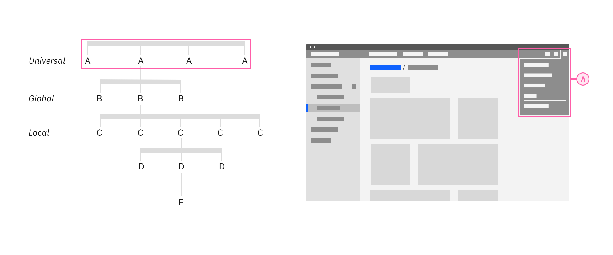

### Navigation patterns show how the UI Shell components can be used individually or combined to solve navigation for common information structures.

<AnchorLinks>

<AnchorLink>Terms</AnchorLink>
<AnchorLink>Configurations</AnchorLink>
<AnchorLink>Navigation</AnchorLink>
<AnchorLink>Grouping information</AnchorLink>
<AnchorLink>Accessibility</AnchorLink>
<AnchorLink>Touch interfaces</AnchorLink>

</AnchorLinks>

## Terms

These sets of terms are used to describe the position in hierarchy and the importance to a user's task. The top level global navigation may not be the primary navigation for most of your user's tasks.

| Position in Hierarchy | Description                                                                                                                              |
| --------------------- | ---------------------------------------------------------------------------------------------------------------------------------------- |
| Universal             | The highest level. The hub that connects other sites with their own Global navigation.                                                   |
| Global                | The level below universal. More focused information. Switch between applications. See navigating [between offerings](#between-offerings) |
| Local                 | The lowest level. See navigating [within an offering](#within-an-offering)                                                               |

| Importance to a user's task | Description                                                                                                                                                              |
| --------------------------- | ------------------------------------------------------------------------------------------------------------------------------------------------------------------------ |
| Primary                     | Navigates your user to the main sections in your UI. This may not always be top level in hierarchy. Typically seen as the global navigation.                             |
| Secondary                   | Navigates between the areas of a section. Typically seen as the local navigation.                                                                                        |
| Tertiary                    | The third most important nav to your user's task. This navigation changes subsets of information of a page.                                                              |
| Utility                     | A collection of utilities your user expects to be accessed anywhere in your UI. These can be links in the header or footer that aren't tied to a primary user's journey. |

## Configurations

The UI shell is designed to be configurable. A product or platform can choose which shell components and configurations to use, based on their user and information requirements.

### Header only

The UI Shell header can be used as standalone navigation for your UI when a small number of main sections do not require a secondary navigation. The header provides a place for a site title, navigation links and dropdowns, and header icons.

This configuration gives more horizontal space for the page's content, but limits the space for navigation items in the header. This configuration also does not lend itself to sub-menus that can be persistently open as they can overlay and interfere with the page's content. Consider using a left panel if a sub-menu needs to remain open.

<Caption>The IBM Design website using header-only navigation.</Caption>

### Header and left panel

The left panel allows for more navigational items and another level of hierarchy when paired with header navigation items. This arrangement means sub-menus can remain open without overlaying or interfering with the page's content. Compared to the navigation items in the header, the left nav is more forgiving for translating titles as the number of characters in one title does not shift the position of the rest.

<Caption>Example of the left panel as the global navigation.</Caption>

## Navigation

### Between offerings

Navigating between offerings or sections is made easy through the app switcher. The items and order of a global navigation should remain unchanged when switching between offerings.

<Caption>The switcher being used to navigate between offerings.</Caption>

#### State memory: persistent data and UI state

The app switcher (9 dot icon) makes it easy to pivot between different offerings in your UI. Consider maintaining or restoring the state of a page if your users pivot between different areas to complete tasks. Maintain states and filters brings the user back to where they were if they have gone through drill downs or welcome screens. An obvious way to drill back up the UI is crucial when bypassing drill down navigation in this way.

Use the Shell's menu items to track the essential state elements in the URL and return the user to that URL automatically when they return.

### Within an offering

The primary, or local, navigation takes users between areas of an offering. Generally, these ‘areas’ are collections of pages that should be grouped together so a user can undertake an end to end workflow without changing area.

<Caption>The switcher being used to navigate within an offering.</Caption>

Match an offering's navigation with neighboring offerings. Following a similar application structure and navigation as the rest of the platform will minimize transitional volatility and your users will spend less time getting reoriented. Your users will be able to quickly move between screens and states in your product and their expectations for the platform's capability will increase.

#### Drill down levels and breadcrumbs

Breadcrumbs let your user see where they are in the hierarchy of the application and gives users a way to navigate back up.

<Caption>Breadcrumbs being used to navigate up a level.</Caption>

In many cases users have a need to drill down into a new context (eg from an overview page to a particular project, device or asset view. For this kind of interaction of up or downwards navigation instead of lateral navigation a drill down pattern should be used.

A drill down can be triggered from any interactive element in an application, and will generally open a new page focussed purely on the object that was selected. This new page will then include a breadcrumb of the path back to the root level above the title.

## Grouping information

### Organization Schemes

Your UI may need different schemes for organizing content in different parts of your UI. Create logical groups that align to your user's goals and helps the user understand the scope of the content.

**Recently used:**
Ordering a navigation by recently used helps users are frequently switching between areas. This loses any logical grouping and should be used as an alternative way to navigate and not the primary.

**Customized:**
A user customized navigation lets the user personalize the UI for their own needs.

**Audience:**
Cautions. Tasks may overlap personas - decreasing discoverability.

**Alphabetically:** Organizing your navigation alphabetically is only successful if your user knows what they are looking for and how the item is labeled. Alphabetical navigation decreases discoverability in cases where your user is looking for a synonym of an item (e.g. "pop-up, modal, lightbox").

**Organization:**
Your navigation may be composed of multiple applications, resources, and platforms working together. The navigation should reflect an appropriate domain model and not your org chart.

When planning your product's UI, put the emphasis on the tasks the user has to complete rather than business or technical limitations. Forcing the user to learn a new mental model for your product increases the time to productivity and creates a disjointed experience between your product and the platform.

### Unbound content

Don’t place unbounded content in the shell side navigation. Usability drops rapidly as the number of items within the shell get too high. For this reason, do not place content that has no upper limit (such as created by users) within the shell’s side navigation. Instead make use of drill down patterns.

## Accessibility

### Matching the DOM order to the visual hierarchy

[Technique C27](https://www.w3.org/WAI/WCAG21/Techniques/css/C27) outlined in WCAG 2.1 recommends matching the visual order of your UI objects with the order they appear in your source code. This technique ensures the order — the designed hierarchy of information — is communicated the same visually as it is by assistive technologies.

<Row>
<Column  colLg={12} colMd={12} colSm={4}>

<Caption>
    1. Left nav in the UI  
    2. Left nav in HTML  
    3. Lef nav in the   
</Caption>
</Column>
</Row>

This technique is necessary when the organization of your navigation menu is used to convey the meaning of stepped concepts like provisioning or other wizard-style patterns. The intended meaning of your grouping and ordering may be lost if the position of an object is styled differently from the DOM order.

In some cases, styling the elements with CSS to appear in a different visual order than the DOM order may be beneficial. For example, on narrow or mobile screen widths you may choose to move your navigation from the top of the screen to another area that's more appropriate for your user's context.

<Row>

<Column  colLg={12} colMd={12} colSm={6} >

<Caption>
  1. Navigation items appear in the header at wide widths.  
  2. Navigation items have moved to a side nav for narrow widths.
</Caption>

</Column>
</Row>

### Keyboard navigation

#### Focus order

Some users may be interacting with your site with only a keyboard. Starting focus in the main nav lets them quickly get to another area in your UI, but could block them from the main content if there is a large number of nav items to tab through first.

[Success Criterion 2.4.1 (Bypass Blocks)](https://www.w3.org/TR/2016/NOTE-WCAG20-TECHS-20161007/G1) suggest bypassing these blocks by providing "Skip to main" link at the start of you navigation's focusable controls. This lets users

<Row>
<Column  colLg={8} colMd={8} colSm={6} >

<Caption>
  The "Skip to main content link" is the first focusable element on the Carbon
  website.
</Caption>

</Column>
</Row>

#### Double nests

This section needs to be completed.

#### Avoid multiple nav

#### Create consistent cues for orientation

- Ref consistency from Deque
- Do's and don'ts

### Landmark regions

Landmark regions let users quickly get around your site by navigating between sections of

- Other regions include: main, form, and search

<Row>

<Column  colLg={8} colMd={8} colSm={6} >

<Caption>Screenshot of a rotor in action.</Caption>

</Column>

</Row>

#### Getting to and from nav

- Specify which region should assume the role of a navigation landmark. This allows accessibility tools to treat navigation objects accordingly to match user expectations. [ref](https://www.w3.org/TR/wai-aria-1.1/#dfn-role)

- Touch on the role of landmark zones for assistive technologies like screen readers and rotors.

<Row>

<Column  colLg={8} colMd={8} colSm={6} >

<Caption>Screenshot of a rotor in action.</Caption>

</Column>

</Row>

## Touch interfaces

- Loss of hover states
- Where do header links go? Hamburger in left nav or app switcher?
- Touch target size. 44px is min for WCAG. add link header

#### References:

- David R. Danielson, [_Transitional Volatility in Web Navigation_](https://www.researchgate.net/publication/240859594_Transitional_volatility_in_web_navigation) (2003)
- Susan Farrell, [_Utility Navigation: What It Is and How to Design It_](https://www.nngroup.com/articles/utility-navigation/) (2015)
- Web Content Accessibility Guidelines, [_WCAG_](https://www.w3.org/WAI/standards-guidelines/wcag/) (2018)
- WebAIM, [_"Skip Navigation" Links_](https://webaim.org/techniques/skipnav/) (2013)
- IBM Design, [_Accessibility Handbook_](http://accessibility-handbook.mybluemix.net/design/a11y-handbook/) (2019)
