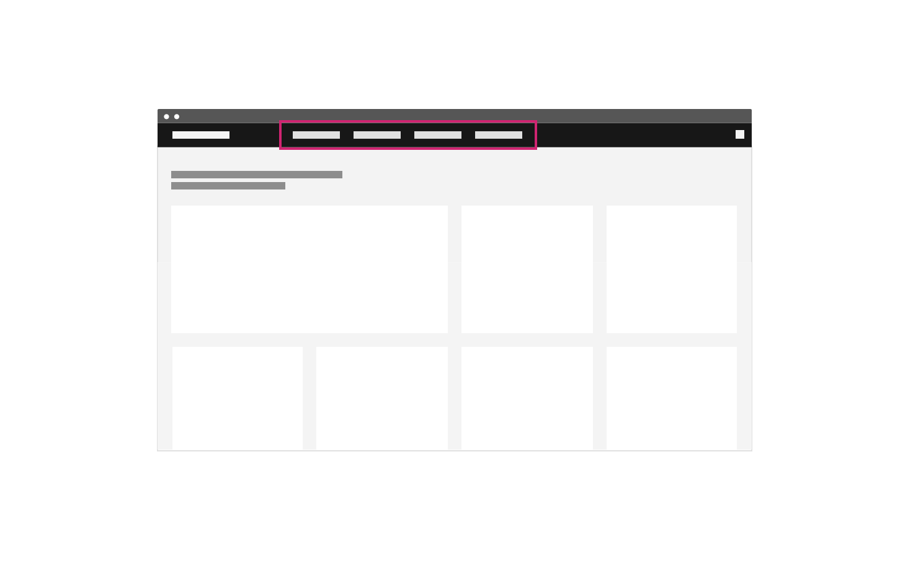
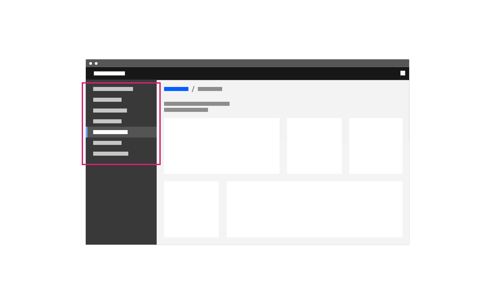
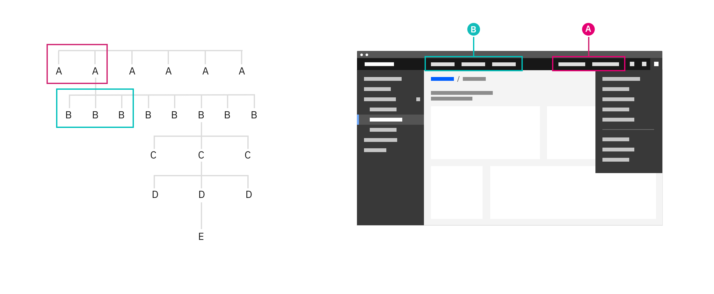
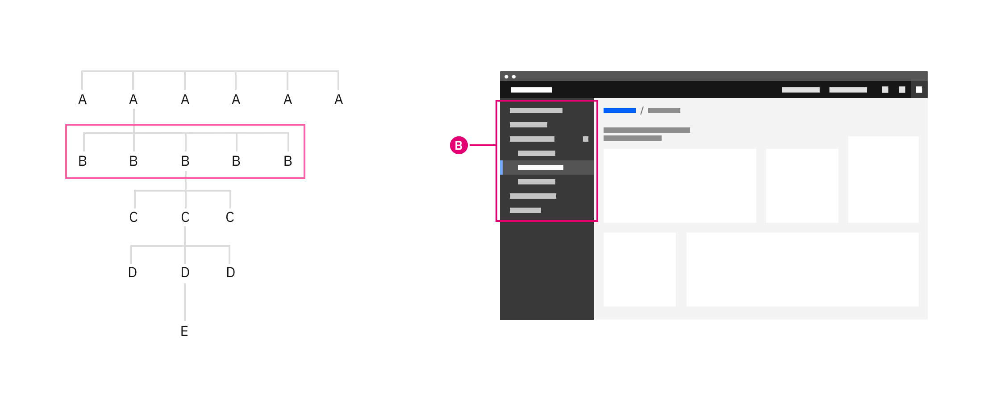
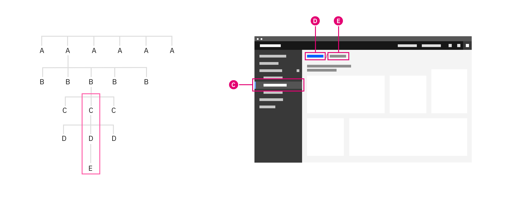
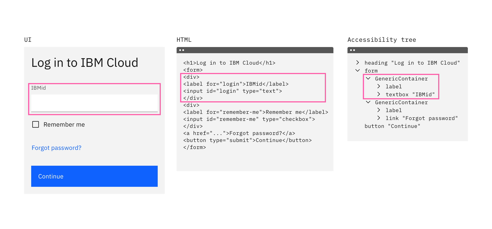
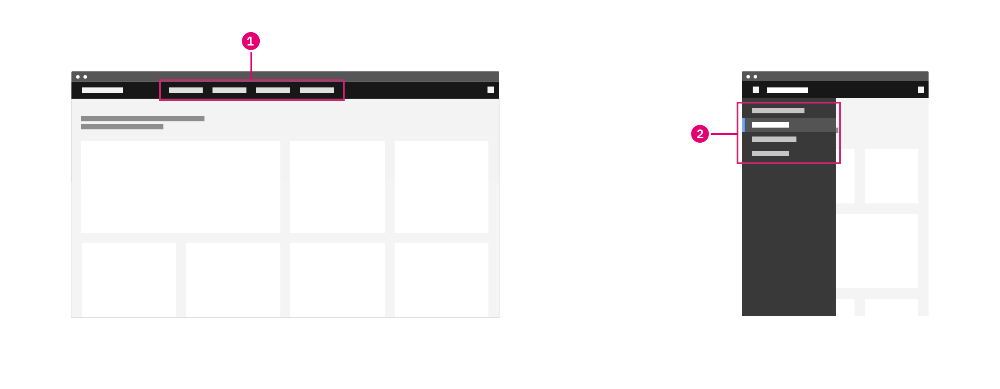
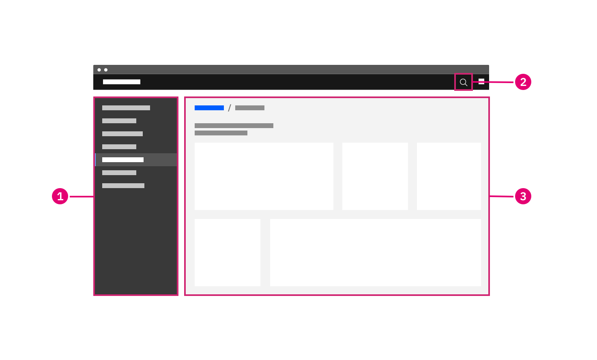
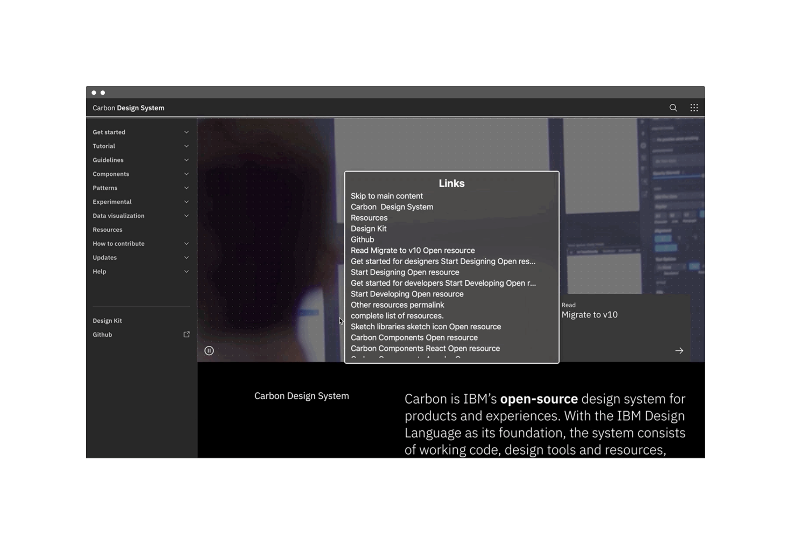

### Users learn navigation patterns as they navigate other websites, applications, and operating systems. The navigation patterns on this page aim to consolidate best practices so your user can transfer that knowledge to your UI and experience a consistent and familiar navigation.

<AnchorLinks>

<AnchorLink>Terms</AnchorLink>
<AnchorLink>Configurations</AnchorLink>
<AnchorLink>Navigation</AnchorLink>
<AnchorLink>Grouping information</AnchorLink>
<AnchorLink>Accessibility</AnchorLink>

</AnchorLinks>

## Terms

These terms are meant to distinguish between the location of the navigation elements and the tasks or links you may want your user to interact with in your navigation. The UI shell components in our library can be used in different configurations and these terms and definitions will help create consistency in system and product navigation.

In this guidance we use the term "product" to encompass the broad category of products, applications, offerings, or web properties.

### Location

The location determines the importance and persistence of the navigation elements in your UI. When we talk about global or local in our guidance we are only talking about the location and the level of permanency in the UI.

| Location | Definition                                                                                                                                                                                                          |
| -------- | ------------------------------------------------------------------------------------------------------------------------------------------------------------------------------------------------------------------- |
| Global   | The global navigation is present wherever your user goes in your UI. The global navigation contains elements your user may need any time in your UI. Global elements remain consistent from one context to another. |
| Local    | A local navigation appears in your product's context and provides the means to accomplish product level tasks. Local elements may differ, sometimes dramatically, from one product to another.                      |

### Task

The task describes what the user can do or where they can go with the items in your UI. When we talk about system or product we are referring to where the user's input will be registered or take effect.

| Task    | Definition                                                                                                                                                                                                                                |
| ------- | ----------------------------------------------------------------------------------------------------------------------------------------------------------------------------------------------------------------------------------------- |
| System  | System level tasks include navigating to the main sections of a site and giving access to global utilities like notifications or settings. At this level a user can create or set attributes that apply to the whole system and contexts. |
| Product | Product level tasks include navigating between areas of a product or selecting modalities within a product.                                                                                                                               |

### Task example matrix

This matrix breaks down common system and product tasks by their location in the global or local navigation.

|                     | System tasks                                                                                                                                        | Product tasks                                                                                                                                                                                    |
| ------------------- | --------------------------------------------------------------------------------------------------------------------------------------------------- | ------------------------------------------------------------------------------------------------------------------------------------------------------------------------------------------------ |
| **Global location** | Log in, notifications, profile access, dashboard link, setting time, entering credit card, user permissions, switching from one product to another. | Hamburger menu to toggle local nav. Show/hide application navigation, document thumbnails. Consistent placement of local actions in common between products for example: new file, save, cancel. |
| **Local location**  | Global settings, user rights management, notification preferences.                                                                                  | Commenting in a text doc, navigating from one peer resource to another (for example from one container, data base, or document to another), selecting modalities within your product.            |

## Configurations

The UI shell is designed to be configurable. A product or platform can choose which shell components and configurations to use, based on their user and information requirements.

### Header only

The UI Shell header can be used as standalone navigation for your UI when a small number of main sections do not require a secondary navigation. The header provides a place for a site title, navigation links and dropdowns, and header icons. These elements are persistent and always in view as the user navigates around the site.

This configuration gives more horizontal space for the page's content, but limits the space for navigation items in the header. This configuration also does not lend itself to sub-menus that can be persistently open as they can overlay and interfere with the page's content. Consider using a left panel if a sub-menu needs to remain open.

<Caption>The IBM Design website using header-only navigation.</Caption>

### Header and left panel

The left panel allows for more navigational items and another level of hierarchy when paired with header navigation items. Compared to a head-only site navigation, this arrangement means sub-menus can remain open without overlaying or interfering with the page's content.

<Caption>Example of the left panel as the local navigation.</Caption>

## Navigation

### Global

The global navigation is always present in the UI. In this example, the [UI shell header](https://www.carbondesignsystem.com/components/UI-shell-header/code) contains two system (A) level links in the header and four links in the switcher.

<Caption>
  The global header of the UI shell containing system navigation elements.
</Caption>

In the example below, the [UI shell header](https://www.carbondesignsystem.com/components/UI-shell-header/code) contains both system (A) and product (B) links in the global location. System level links should be right justified in the header and product level links should be left justified. On narrow screens when there is no room for header links, the system (A) links will go in the right UI shell panel and the product (B) links will go in the left UI shell panel.

<Caption>
  The global header of the UI shell containing both product and system
  navigation elements.
</Caption>

#### State memory: persistent data and UI state

The app switcher (9 dot icon) makes it easy to pivot between different offerings in your UI. Maintain or restore the state of a page if your users pivot between different areas to complete tasks. If state or progress will be lost, inform users of this consequence. Maintaining states and filters brings the user back to where they were if they have gone through drill downs or welcome screens. An obvious way to drill back up the UI is crucial when bypassing drill up navigation in this way.

A technique to maintain this state is to use the Shell's menu items to track the essential state elements in the URL and return the user to that URL automatically when they return. This capability is not part of the UI Shell component and must be added during implementation.

### Local

The local navigation takes users between areas of an offering. Generally, these ‘areas’ are collections of pages that should be grouped together so a user can undertake an end to end workflow without changing areas.

<Caption>The UI shell left panel being used as the product navigation.</Caption>

Match an offering's navigation with neighboring offerings. Following a similar application structure and navigation as the rest of the platform will minimize transitional volatility and your users will spend less time getting reoriented. Your users will be able to quickly move between screens and states in your product and their expectations for the platform's capability will increase.

#### Drill down levels and breadcrumbs

Breadcrumbs let your user see where they are in the hierarchy of the application and gives users a way to navigate back up.

<Caption>Breadcrumbs being used to navigate up a level.</Caption>

In many cases users have a need to drill up into a new context (eg from an overview page to a particular project, device or asset view. For this kind of interaction of up or downwards navigation instead of lateral navigation a drill up pattern should be used.

A drill down can be triggered from any interactive element in an application, and will generally open a new page focussed purely on the object that was selected. This new page will then include a breadcrumb of the path back to the root level above the title.

## Grouping information

When planning your product's UI, put the emphasis on the tasks the user has to complete rather than business or technical limitations. Forcing the user to learn a new mental model for your product increases the time to productivity and creates a disjointed experience between your product and the platform.

### Organization Schemes

Your UI may need different schemes for organizing content in different parts of your UI. Create logical groups that align to your user's goals and helps the user understand the scope of the content.

**Recently used:**
Ordering a navigation by recently used helps users who are frequently switching between areas. This loses any logical grouping and should be used as an alternative way to navigate and not the primary.

**Customized:**
A user customized navigation lets the user personalize the UI for their own needs.

**Audience:**
Structuring content by your audience takes into account the role or permissions tied to your persona. This can highlight more common tasks related to that persona, but can also decrease dicoverability if tasks overlap personas or your user occasionaly shifts between roles.

**Alphabetically:** Organizing your navigation alphabetically is only successful if your user knows what they are looking for and how the item is labeled. Alphabetical navigation decreases discoverability in cases where your user is looking for a synonym of an item (e.g. "pop-up, modal, lightbox").

**Organization:**
Your navigation may be composed of multiple applications, resources, and platforms working together. The navigation should reflect an appropriate domain model and not your org chart.

### Unbound content

Avoid placing unbounded content in the shell side navigation. Usability drops rapidly as the number of items within the shell get too high. For this reason, do not place content that has no upper limit (such as created by users) within the shell’s side navigation. Instead make use of drill down patterns.

## Accessibility

### Matching the DOM order to the visual hierarchy

[Technique C27](https://www.w3.org/WAI/WCAG21/Techniques/css/C27) outlined in WCAG 2.1 recommends matching the visual order of your UI objects with the order they appear in your source code. This technique ensures the order — the designed hierarchy of information — is communicated the same visually as it is by assistive technologies.

<Row>
<Column  colLg={12} colMd={12} colSm={4}>

<Caption>
An example of a text input component as it appears visually in the UI and in the code of the HTML and accessibility tree.
</Caption>
</Column>
</Row>

This technique is necessary when the organization of your navigation menu is used to convey the meaning of stepped concepts like provisioning or other wizard-style patterns. The intended meaning of your grouping and ordering may be lost if the position of an object is styled differently from the DOM order.

In some cases, styling the elements with CSS to appear in a different visual order than the DOM order may be beneficial. For example, on narrow or mobile screen widths you may choose to move your navigation from the top of the screen to another area that's more appropriate for your user's context.

<Row>

<Column  colLg={12} colMd={12} colSm={6} >

<Caption>
  1. Navigation items appear in the header at wide widths.  
  2. Navigation items have moved to a side nav for narrow widths.
</Caption>

</Column>
</Row>

#### Navigating content by headers

Users who rely on screen reader technology to navigate the areas of your site also rely on screen readers to navigate the content of a page. In the same way users can visually scan for the larger and bolder type of a header, users of assistive technologies also must understand the hierarchy of the page's content to efficiently navigate a page's content.

To ensure all users interpret the structure of your content in the same way, the visual representation of a heading should match the underlying ranking of the header tag. Tutorials on how to achieve this can be found in the WCAG page structure [tutorials on headings](https://www.w3.org/WAI/tutorials/page-structure/headings/).

### Keyboard navigation

#### Skip to main content

Some users may use a keyboard to navigate your site. Starting focus in the main nav lets them quickly navigate to other areas in your UI, but could block them from the main content if there is a large number of nav items to tab through first.

[Success Criterion 2.4.1 (Bypass Blocks)](https://www.w3.org/TR/2016/NOTE-WCAG20-TECHS-20161007/G1) suggest bypassing these blocks by providing "Skip to main" link at the start of you navigation's focusable controls. This lets users easily skip the navigation region and being interacting with the page's main content area.

<Row>
<Column  colLg={8} colMd={8} colSm={6} >

<Caption>
  The "Skip to main content link" is the first focusable element on the Carbon
  website.
</Caption>

</Column>
</Row>

#### Landmark regions

Landmark regions are a way of grouping similar areas of content in your UI and assigning them roles. This technique lets users navigating with assistive technologies quickly get around your site by navigating between landmark regions in your UI rather than each individual element.

Examples of common landmark regions include: navigation, main, form, banner, and search. If there are multiple navigation landmark regions give each a unique label.

<Row>

<Column  colLg={8} colMd={8} colSm={6} >

<Caption>
  1. Navigation landmark.  
  2. Search landmark.  
  3. Main landmark.  
</Caption>

</Column>

</Row>

#### Navigating the page via regions

Navigating between landmark regions helps users who cannot see the visual grouping of your navigation. This grouping can be important to understanding the organization of the structure of the content and making it clear what users can do and where they can go in your UI.

<Row>

<Column  colLg={8} colMd={8} colSm={6} >

<Caption>Screenshot of a rotor in action.</Caption>

</Column>

</Row>

#### References:

- David R. Danielson, [_Transitional Volatility in Web Navigation_](https://www.researchgate.net/publication/240859594_Transitional_volatility_in_web_navigation) (2003)
- Susan Farrell, [_Utility Navigation: What It Is and How to Design It_](https://www.nngroup.com/articles/utility-navigation/) (2015)
- Web Content Accessibility Guidelines, [_WCAG_](https://www.w3.org/WAI/standards-guidelines/wcag/) (2018)
- WebAIM, [_"Skip Navigation" Links_](https://webaim.org/techniques/skipnav/) (2013)
- IBM Design, [_Accessibility Handbook_](http://accessibility-handbook.mybluemix.net/design/a11y-handbook/) (2019)
- James Kalbach, [\_Designing Web Navigation](https://www.oreilly.com/library/view/designing-web-navigation/9780596528102/ch04.html) (2007)
