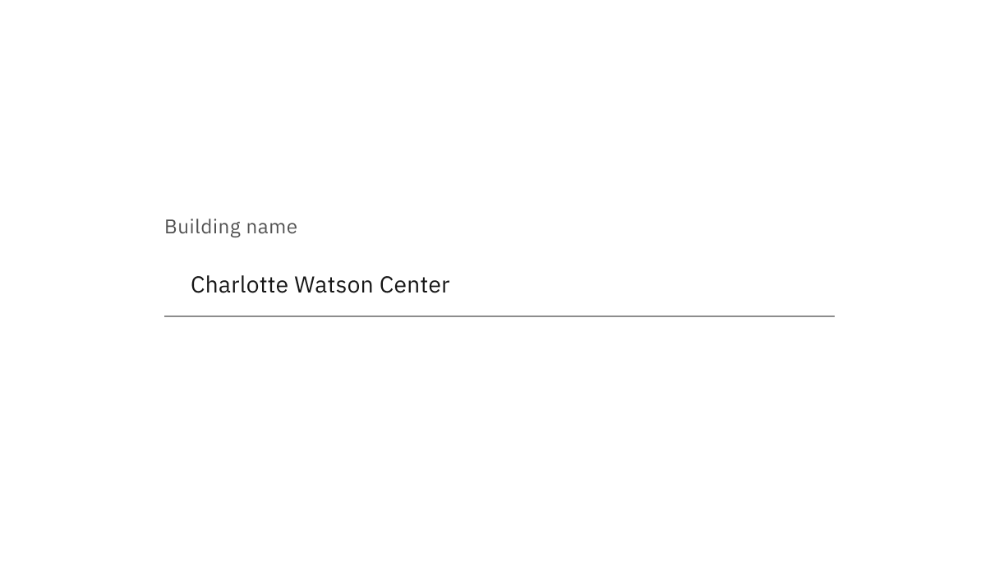
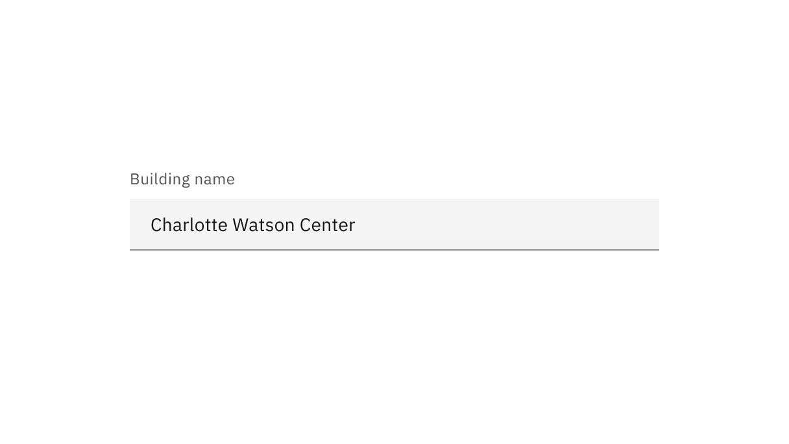
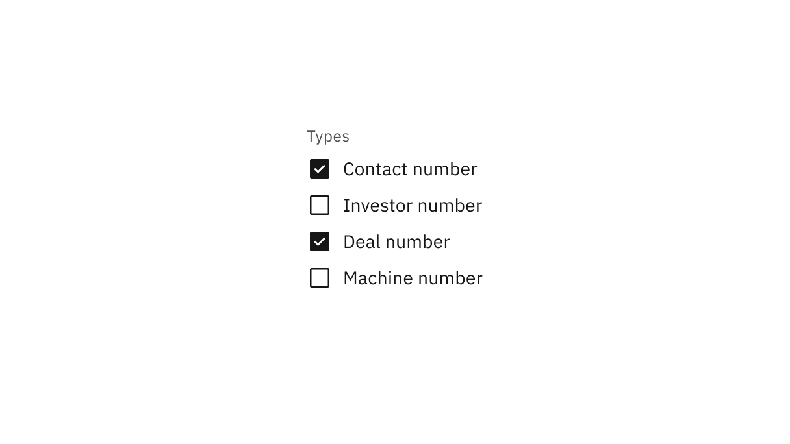
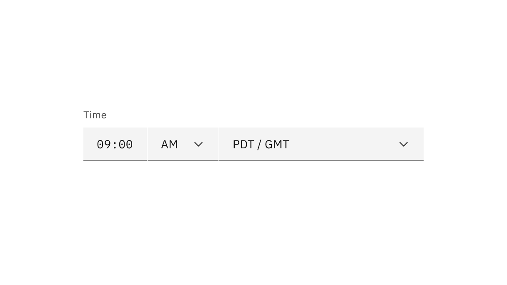
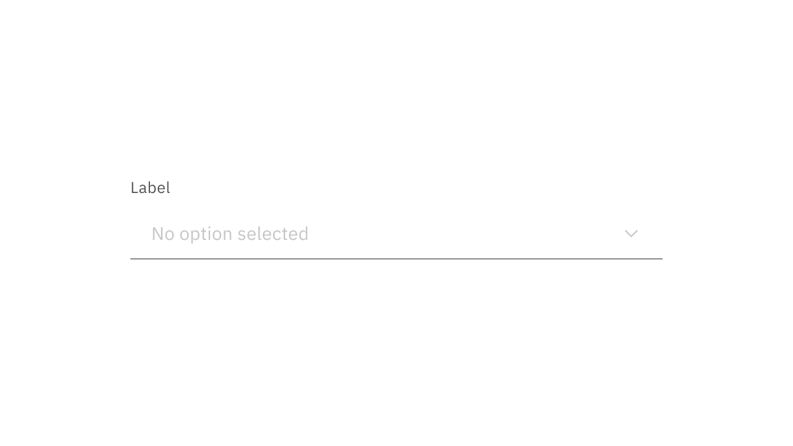
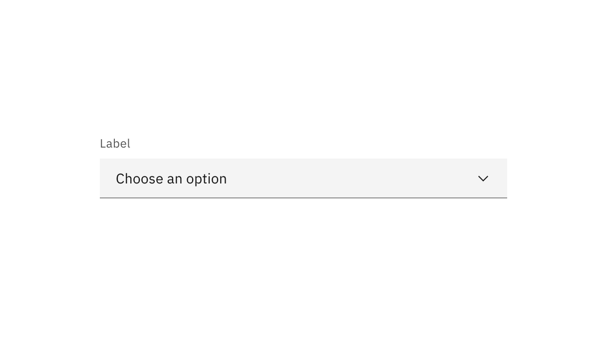

<PageDescription>

Read-only inputs are applied to components that users can review but not modify.
Read-only inputs limit or completely remove a component’s interactive functions.

</PageDescription>

<AnchorLinks>
  <AnchorLink>Overview</AnchorLink>
  <AnchorLink>Formatting</AnchorLink>
  <AnchorLink>Content</AnchorLink>
  <AnchorLink>Accessibility</AnchorLink>
  <AnchorLink>Related</AnchorLink>
  <AnchorLink>References</AnchorLink>
  <AnchorLink>Feedback</AnchorLink>
</AnchorLinks>

## Overview

Read-only inputs are applied to components that can be modified in their enabled
state. These components are considered active, and any data they contain may be
used in an application’s processes. This state change transforms a component’s
purpose to be purely informative.

<Row>
<Column colLg={12}>

<Caption>Form component read-only states in context.</Caption>

</Column>
</Row>

### When to use

There are three main use cases that initiate a read-only state:

| Use case            | Description                                                                                                     |
| ------------------- | --------------------------------------------------------------------------------------------------------------- |
| Application process | An application’s process temporarily restricts a user from modifying the component until the process completes. |
| Locked              | An application restricts the number of users that can modify the component at the same time.                    |
| Permissions         | A user’s credentials allow them to view the component but not modify it.                                        |

### When not to use

- If the component does not have an enabled state, do not use a read-only state
  to display static information.
- As an alternative to a disabled state—read-only and disabled states serve
  different purposes. For example, when a component is temporarily unavailable
  pending user actions or decisions (such as completing a form or choosing an
  option), the component's state should be temporarily disabled, not read-only.
- If the component would otherwise be disabled, components in a disabled state
  should not change to a read-only state.

## Formatting

### Anatomy

Read-only states use subtle changes to a component’s style to emphasize critical
information and de-emphasize or remove signifiers.

<Row>
<Column colLg={8}>

<Caption>Read-only input anatomy.</Caption>

</Column>
</Row>

1. **Background color change:** Having a transparent background for fields.
2. **Border color change:** De-emphasizing selection and clickability to make
   information more readable.
3. **Icon color change:** Showing embedded icons in the component for context
   but displaying that icons are not interactive with color and cursor changes.

## Designing with read-only inputs

Read-only states use subtle changes to a component’s style to emphasize critical
information and de-emphasize, or remove, signifiers.

### Structure

Components should maintain the same structure and spacing used in the
component’s enabled state. In most cases, elements in the enabled state should
be present in the read-only state.

#### Selection controls

Selection controls offer users a selection from pre-determined options. Common
selection controls include: checkboxes, radio buttons, toggles, dropdowns,
selects, comboboxes and multiselects.

<Row>
<Column colLg={12}>

<Caption>Read-only states for selection controls.</Caption>

</Column>
</Row>

#### Bound entry controls

Bound entry controls allow users to input numeric data, like dates, times, and
numeric values. Common bound entry controls include: number inputs, sliders,
date pickers, and time pickers.

<Row>
<Column colLg={12}>

<Caption>Read-only states for bound entry controls.</Caption>

</Column>
</Row>

### Interactive elements

Interactive elements included in a component’s enabled state should be removed
or modified for its read-only state. Changes to color can be used to modify
interactive elements and change their focus from interactive to informative.
Color changes to field backgrounds, interactive elements, and icon signifiers
are used to de-emphasize unavailable affordances in a component’s read-only
state. The color of key informational elements (text, icons, and visualizations)
should remain the same as the component’s enabled state.

#### Component fields

The color of field backgrounds blends with the overall UI or layer background.

<Tabs>

<Tab label="Read-only">

</Tab>

<Tab label="Enabled">

</Tab>

</Tabs>

#### Component controls

The checkbox border color changed to emphasize selected items.

<Tabs>

<Tab label="Read-only">

</Tab>

<Tab label="Enabled">

</Tab>

</Tabs>

#### Component icon signifiers

Signifier icons included in a component’s enabled state, like chevron arrow
icons, close icons, and calendar icons, should use the $icon-disabled color
token.

<Tabs>

<Tab label="Read-only">

</Tab>

<Tab label="Enabled">

</Tab>

</Tabs>

### Interactions

#### Mouse

The arrow cursor reinforces that a component is in a read-only state and is not
interactive. The cursor's state reflects a component's shift in focus from
interactive to informative.

<Row>
<Column colLg={8}>

<Caption>Read-only state arrow cursor.</Caption>

</Column>
</Row>

#### Keyboard

Interactive operations included in a component’s enabled state should be removed
or modified for its read-only state. The component should remain navigable with
a keyboard.

## Content

Components should include the same content used in the component’s enabled
state. However, when the content in the enabled state is instructive, like a
dropdown with no current selection, the content may need to change to be
informative.

<Tabs>

<Tab label="Read-only">

</Tab>

<Tab label="Enabled">

</Tab>

</Tabs>
