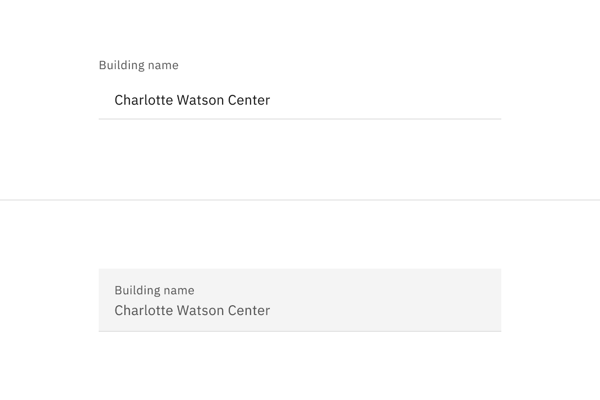
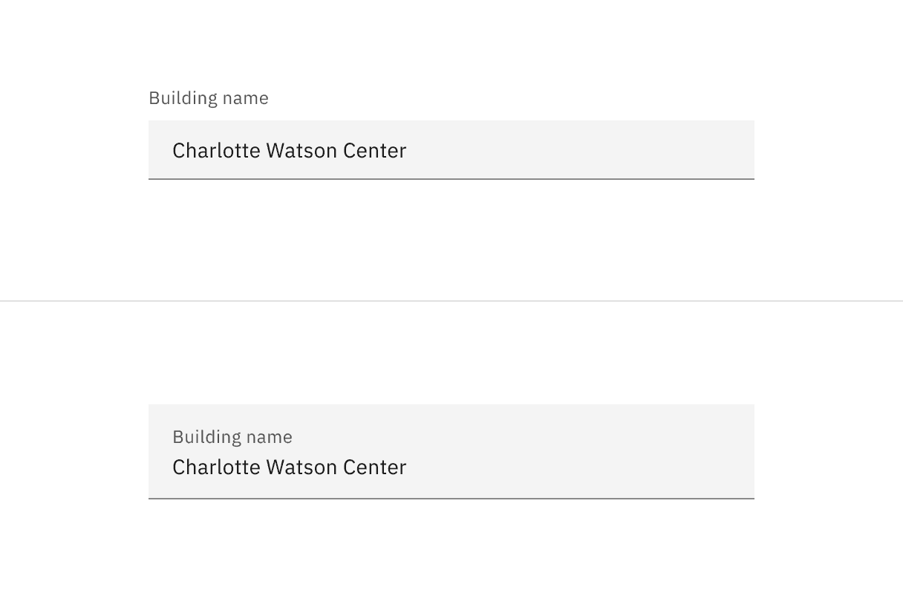
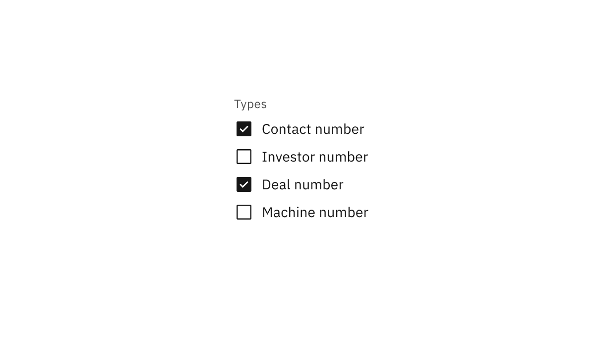
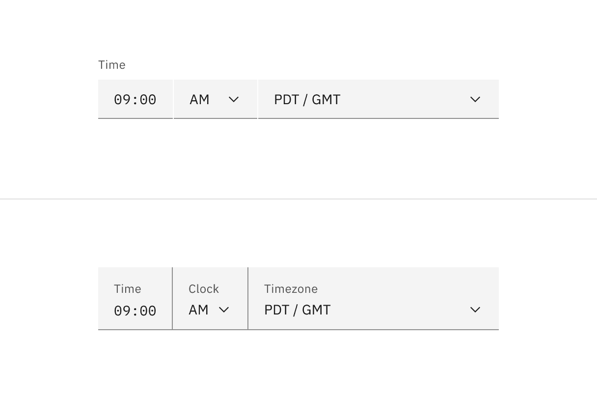
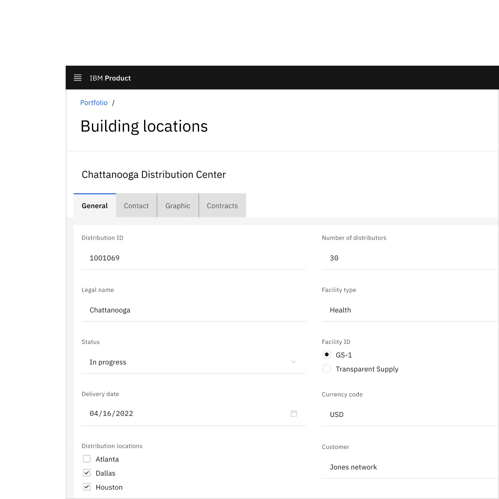
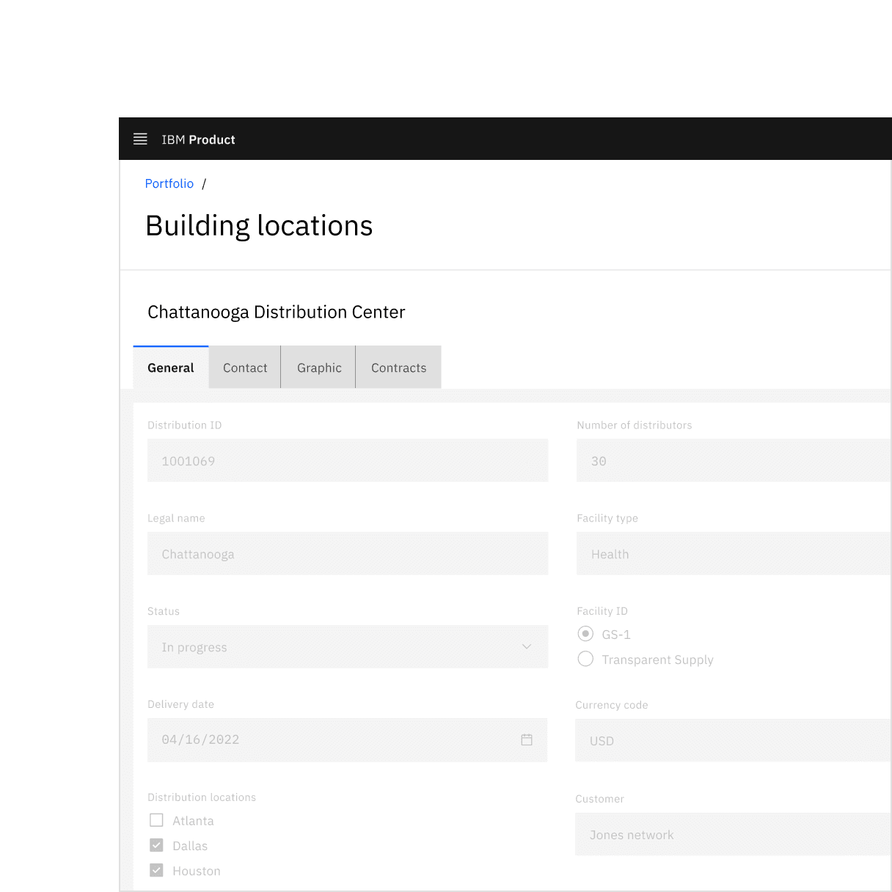

<PageDescription>

Read-only states are applied to components when the user is allowed to review
but not modify the component. It removes all interactive functions from the
component.

</PageDescription>

<AnchorLinks>
  <AnchorLink>Overview</AnchorLink>
  <AnchorLink>Formatting</AnchorLink>
  <AnchorLink>Visual guidance</AnchorLink>
  <AnchorLink>Content</AnchorLink>
  <AnchorLink>Accessibility</AnchorLink>
  <AnchorLink>Related</AnchorLink>
  <AnchorLink>References</AnchorLink>
  <AnchorLink>Feedback</AnchorLink>
</AnchorLinks>

## Overview

A read-only state is applied only to components the user can modify when toggled
to enabled. Read-only states are considered active, and the data they contain
can be used in an application’s processes. This state change transforms a
component’s purpose to be purely informative rather than interactive.

<Row>
<Column colLg={12}>

<Caption>Form component read-only states in context.</Caption>

</Column>
</Row>

### When to use

There are three main use cases that initiate a read-only state:

| Use case            | Description                                                                                                     |
| ------------------- | --------------------------------------------------------------------------------------------------------------- |
| Application process | An application’s process temporarily restricts a user from modifying the component until the process completes. |
| Locked              | An application restricts the number of users that can modify the component at the same time.                    |
| Permissions         | A user’s credentials allow them to view the component but not modify it.                                        |

### When not to use

- If the component does not have an enabled state, do not use a read-only state
  to display static information.
- As an alternative to a disabled state, read-only and disabled states serve
  different purposes. For example, when a component is temporarily unavailable
  pending user actions or decisions (such as completing a form or choosing an
  option), the component's state should be temporarily disabled, not read-only.
- If the component would otherwise be disabled, components in a disabled state
  should not change to a read-only state.

## Formatting

### Anatomy

<Row>
<Column colLg={8}>

<Caption>Read-only state anatomy.</Caption>

</Column>
</Row>

1. **Background color change:** Having a transparent background for fields.
2. **Border color change:** De-emphasizing selection and clickability to make
   information more readable.
3. **Text color no change:** Text color remains the same as in the enabled state
   and should still pass 4.5:1 color contrast rules.
4. **Icon color change:** Keeping embedded icons in the component for context
   but displaying that icons are not interactive with color and cursor changes.

## Visual guidance

Read-only states use subtle changes to a component’s style to emphasize critical
information and de-emphasize or remove icon signifiers.

### Structure

Components should maintain the same structure and spacing used in the
component’s enabled state. In most cases, elements in the enabled state are
present in the read-only state.

#### Selection controls

Selection controls offer users a selection from pre-determined options. Common
selection controls include: checkboxes, radio buttons, toggles, dropdowns,
selects, combo boxes, and multiselects.

<Row>
<Column colLg={12}>

<Caption>Read-only states for selection controls.</Caption>

</Column>
</Row>

#### Bound entry controls

Bound entry controls allow users to input numeric data, like dates, times, and
numeric values. Common bound entry controls include: number inputs, sliders,
date pickers, and time pickers.

<Row>
<Column colLg={12}>

<Caption>Read-only states for bound entry controls.</Caption>

</Column>
</Row>

### Interactive elements

Interactive elements included in a component’s enabled state should be removed
or modified for its read-only state. Changes to color are used to indicate a
modification to interactive elements and a change in their purpose from
interactive to informative. Color changes to field backgrounds, interactive
elements, and icon signifiers are used to de-emphasize unavailable affordances
in a component’s read-only state. The color of key informational elements (text,
icons, and visualizations) should remain the same as the component’s enabled
state. Below are a few examples of components comparing their read-only and
enabled states.

#### Component fields

The default style component field background colors blend in with the overall UI
or layer background for read-only states, whereas fluid component field
backgrounds retain the same enabled state background color.

<Row>
<Column colLg={8}>

<Tabs>

<Tab label="Read-only">

</Tab>

<Tab label="Enabled">

</Tab>

</Tabs>

</Column>
</Row>

#### Component borders

In some cases, the border of controls in components changes color to emphasize
selected items for read-only states and de-emphasizes control interactivity.

<Row>
<Column colLg={8}>

<Tabs>

<Tab label="Read-only">

</Tab>

<Tab label="Enabled">

</Tab>

</Tabs>

</Column>
</Row>

#### Component icon signifiers

Signifier icons included in a component’s enabled state, like chevron arrow
icons, close icons, and calendar icons, should use the `$icon-disabled` color
token.

<Row>
<Column colLg={8}>

<Tabs>

<Tab label="Read-only">

</Tab>

<Tab label="Enabled">

</Tab>

</Tabs>

</Column>
</Row>

### Best practices

#### State readability

Don’t use a disabled state for components if they need to be read by the user.
Unlike read-only states, disabled states are not read by screen readers and do
not pass visual contrast, making them inaccessible if they need to be
interpreted.

#### Read-only viewports

Do maintain a component’s disabled state when in a read-only view. Don’t change
a component’s state from disabled to read-only because of an active read-only
view; some states should remain disabled depending on the use case.

#### Disabled versus read-only states

Do use a disabled state when a component is temporarily unavailable pending user
action. Don’t change a component’s state from disabled to a read-only state.
Alternatively, don’t use a read-only state to replace a disabled state.

<DoDontRow>
<DoDont
type="do"
colMd={6} colLg={6}
caption="Do use if the component is not interactive but should be read by the user.">

</DoDont>
<DoDont
colMd={6} colLg={6}
type="dont"
caption="Don’t use disabled states in place of read-only states.">

</DoDont>
</DoDontRow>

### Interactions

#### Mouse

The arrow cursor reinforces that a component is in a read-only state and is not
interactive. The cursor's state reflects a component's shift in focus from
interactive to informative.

<Row>
<Column colLg={8}>

<Caption>Read-only state arrow cursor.</Caption>

</Column>
</Row>

#### Keyboard

Interactive operations included in a component’s enabled state should be removed
or modified for its read-only state. The component should remain navigable with
a keyboard.

## Content

Components should include the same content used in the component’s enabled
state. However, when the content in the enabled state is instructive, like a
dropdown with no current selection, the content may need to change to be
informative.

<Row>
<Column colLg={8}>

<Tabs>

<Tab label="Read-only">

</Tab>

<Tab label="Enabled">

</Tab>

</Tabs>

</Column>
</Row>

## Accessibility

When considering keyboard accessibility,  it can be helpful to distinguish
between navigation and operation. A component that can be reached by keyboard is
navigable. Read-only components remain navigable so that users can review the
information they contain. This contrasts with disabled components, which cannot
be reached by a keyboard. However, read-only components are not operable,
meaning users can neither manipulate nor alter their values.

## Related

#### Components

- [Checkbox](/components/checkbox/usage)
- [Date picker](/components/date-picker/usage/)
- [Dropdown](/components/dropdown/usage/)
- [Number input](/components/number-input/usage/)
- [Radio button](/components/radio-button/usage/)
- [Slider](/components/slider/usage/)
- [Text area](/components/text-input/usage/#text-area)
- [Text input](/components/text-input/usage/#text-input)
- [Toggle](/components/toggle/usage/)

#### Patterns

[Disabled states](https://carbondesignsystem.com/patterns/disabled-states/)

#### Carbon for IBM Products

[Read-only canvas](https://pages.github.ibm.com/cdai-design/pal/patterns/canvas/read-only-canvas)

## References

- MDN contributors,
  [HTML attribute: read-only](https://developer.mozilla.org/en-US/docs/Web/HTML/Attributes/readonly),
  (Mozilla Developer, 2022)
- Aaron Gustafson,
  [Web Forum Conundrum: disabled or read-only?](https://www.aaron-gustafson.com/notebook/web-form-conundrum-disabled-or-read-only/),
  (2017)
- W3 Schools,
  [HTML Input Attributes](https://www.w3schools.com/html/html_form_attributes.asp),
  (2022)

## Feedback

Help us improve this pattern by providing feedback, asking questions, and
leaving any other comments on
[GitHub](https://github.com/carbon-design-system/carbon-website/issues/new?assignees=&labels=feedback&template=feedback.md).
