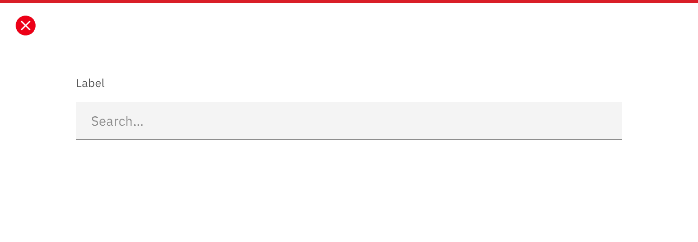
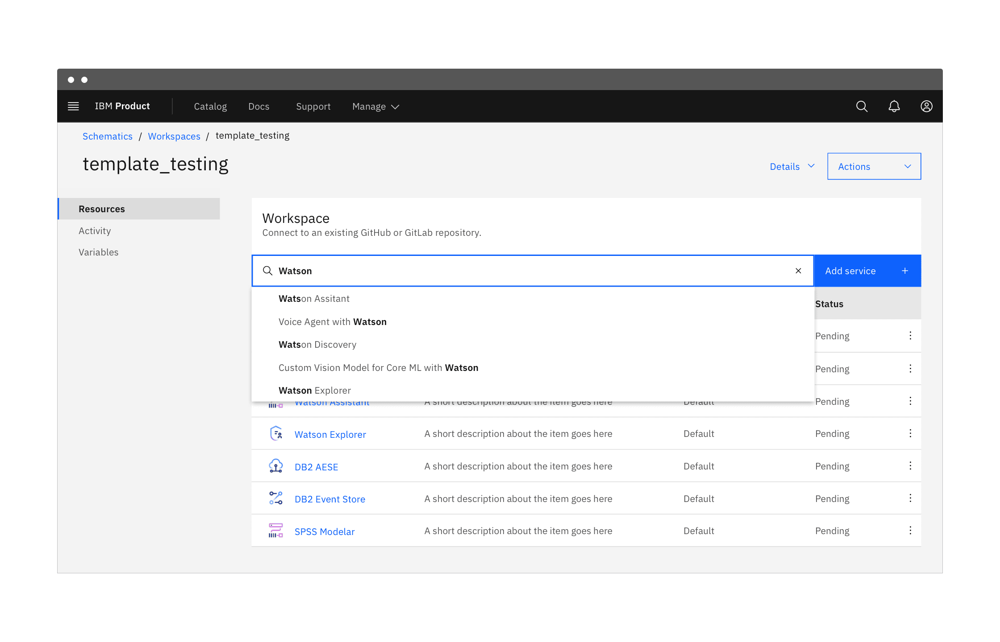

import {
  StructuredListWrapper,
  StructuredListHead,
  StructuredListBody,
  StructuredListRow,
  StructuredListInput,
  StructuredListCell,
  OrderedList,
  UnorderedList,
  ListItem,
} from 'carbon-components-react';

<PageDescription>

Search is an essential pattern for navigation or discovery. We live in the age
of search, where a search engine is often the primary entry point into the
internet. User expectations are high for the way search should work, and
consistency is critical.

</PageDescription>

<AnchorLinks>
  <AnchorLink>Overview</AnchorLink>
  <AnchorLink>Basic search</AnchorLink>
  <AnchorLink>Active search</AnchorLink>
  <AnchorLink>Focused search</AnchorLink>
  <AnchorLink>Accessibility</AnchorLink>
  <AnchorLink>Related</AnchorLink>
  <AnchorLink>References</AnchorLink>
  <AnchorLink>Feedback</AnchorLink>
</AnchorLinks>

## Overview

Searching is an intuitive method of discovery, offering users a way to explore a
website or application using keywords. Most searches begin broad, with the scope
narrowing as filters are applied.

The method of search you use depends on the size of the data set being searched
and the location of the search within your product.

The placement of your search field depends on the construction of your
application and the scope of the search. For global searches, see the
[global header pattern](/patterns/global-header) for placement guidance. See the
[data table](/components/data-table/usage#search) component for search placement
within a data table.

### Anatomy

<Row>
<Column colLg={8}>

</Column>
</Row>

1. **Scope filter (optional):** The optional scoped search allow users to limit
   their searches to a section or category of content on a website.
1. **Search icon:** Signifies a search field. The magnifying glass icon is a
   universal way to indicate search.
1. **Placeholder text:** Useful and short text hinting at what the user can
   search for. For example, “Search for networks or devices.”
1. **Text entry field:** The place where a user enters their search query.

### Types of search

<Row>
  <Column noGutterSm>
    <StructuredListWrapper>
      <StructuredListHead>
        <StructuredListRow head>
          <StructuredListCell head>Type</StructuredListCell>
          <StructuredListCell head>When to use</StructuredListCell>
          <StructuredListCell head>Use cases</StructuredListCell>
        </StructuredListRow>
      </StructuredListHead>
      <StructuredListBody>
        <StructuredListRow>
          <StructuredListCell>
            <a href="#basic-search">Basic search</a>
          </StructuredListCell>
          <StructuredListCell>
            When a user will conduct a search and be routed to a distinct
            results page.
          </StructuredListCell>
          <StructuredListCell>
            Global searches, or any search that routes users to a distinct
            results page
          </StructuredListCell>
        </StructuredListRow>
        <StructuredListRow>
          <StructuredListCell>
            <a href="#active-search">Active search</a>
          </StructuredListCell>
          <StructuredListCell>
            Best for small data sets, like a single page, website, or table.
            When a user will benefit from constant feedback based on their
            search query, and when the server can handle a substantial search
            query load.
          </StructuredListCell>
          <StructuredListCell>
            Actively searches a database and lists the top results in results
            panel or on the current page. For example:
            <UnorderedList>
              — Searching a catalog
               
              — Searching a small website
               
              — Searching a small data set within a table
               — Searching a subset of information embedded within a product
              or application’s page
            </UnorderedList>
          </StructuredListCell>
        </StructuredListRow>
        <StructuredListRow>
          <StructuredListCell>
            <a href="#focused-search">Focused search</a>
          </StructuredListCell>
          <StructuredListCell>
            When the search is focused on tasks or information specific to the
            active user. Limits server load by focusing search scope while
            offering the power of a broad, basic search.
          </StructuredListCell>
          <StructuredListCell>
            <UnorderedList>
              — Assigned tasks
               
              — Product catalogs
               
              — Personal repositories
               
              — Work created by the active user
               
            </UnorderedList>
          </StructuredListCell>
        </StructuredListRow>
      </StructuredListBody>
    </StructuredListWrapper>
  </Column>
</Row>

### Best practices

#### Avoid dead ends

If a search returns "No results", suggest a follow-up action. Provide
suggestions and helpful resources to aid the user in finding what they are
looking for. For more on no results for searches, see the
[empty states pattern](/patterns/empty-states-pattern).

#### Include a loading indicator

If the search will take longer than a moment or two, include a loading
indicator. Your loading state should reflect your empty state with useful helper
text signaling that the search is still ongoing. Include a progress bar for
advanced, resource-intensive searches. Let the user know how far along the
search is, and roughly how long it will take to finish.

#### Display the number of results

Always include the number of search results, including for searches with no
results. If you plan to offer a scope filter, also include the number of results
for each scope selector.

#### Don’t include a label

Avoid adding a label to your search field. Users expect and understand search
fields, and no label is necessary. A search icon along with useful placeholder
text should clearly indicate that the field is intended for search.

<Row>
<Column colLg={8}>

<Caption>Provide useful placeholder text and include a search icon.</Caption>

</Column>
</Row>

<Row>
<Column colLg={8}>

<Caption>Don’t include a label for search fields.</Caption>

</Column>
</Row>

#### Localize the search field

For languages that read right to left, flip the layout of the search box as
shown in the next example.

<Row>
<Column colLg={8}>

<Caption>
  Example of a search box for languages that read right to left instead of left
  to right
</Caption>

</Column>
</Row>

<Row>
<Column colLg={8}>

<Caption>
  The search icon is recognized and acceptable across languages and countries.
</Caption>

</Column>
</Row>

#### Add a scope filter to your search field

The optional scoped search allows users to limit their searches to a section or
category of content on a website, as opposed to a global search that searches
everything at once. Only one scoped category can be selected at a time, but the
dropdown should always include an "All" or "Any" option, and this option should
be selected by default. With "All" or "Any" selected, the field will function as
a [basic global search](#basic-search).

<Row>
<Column colLg={8}>

<Caption>Example of a scope filter on a search field</Caption>

</Column>
</Row>

## Basic search

Basic search entails any search that directs users to a distinct results page.
In these instances, offer either trending searches that match the active user’s
keywords, recent searches by the active user, or both.

A basic search does not actually query a data set until the user runs the
search.

<Row>
<Column colLg={8}>

<Caption>Example of a basic search field</Caption>

</Column>
</Row>

| When to use                          |                                                                                                                                                                                                                                                                   |
| ------------------------------------ | ----------------------------------------------------------------------------------------------------------------------------------------------------------------------------------------------------------------------------------------------------------------- |
| _When searching is expensive_        | Searching a large body of information can be resource intensive and expensive, expecially in instances where many users are searching the information simultaneously. Actively running the search after every character is entered or removed can be impractical. |
| _When searching is slow_             | If the body of information is massive, actively searching can become too slow to be practical. Extended processing time following each character entered results in an application or website seeming unresponsive.                                               |
| _When the information is unfamiliar_ | When users are searching an application or website they’re unfamiliar with, a dedicated search results page can give them a better idea of data structure and available resources.                                                                                |

### Behaviors

#### Recent search suggestions

When a user clicks or tabs into a search field, they are be shown a menu of
either the user’s recent searches, trending searches, or both. When the user
types in the field, this menu is replaced with suggestions based on the search
query.

<Row>
<Column colLg={8}>

</Column>
</Row>

#### Type-ahead suggestions

Type-ahead suggestions are generated from ongoing analyses of use search
patterns, and place minimal load on servers. Without committing to a search, the
user can see a preview of results, suggestions of additional search terms, or
zero in on what they were looking for.

Type-ahead suggestions appear as soon as the user begins typing in the search
field.

<Row>
<Column colLg={8}>

<Caption>Example of type-ahead suggestions</Caption>

</Column>
</Row>

#### Results page

Once the user runs the search, they are directed to a distinct results page. On
this page, the user should have the option to select filters to narrow their
search results. If you’d prefer to offer filters before the user searches,
consider adding a scope filter.

The design of the results page will depend largely on the needs of your product,
and more specific design guidance for a search results page will be covered in
future pattern guidance.

## Active search

An active search is a rapid way to search an application or data set. The search
runs after each character is entered, and results are shown immediately below
the search field. You can think of active search as a way to filter a dataset
through keywords.

An active search is constructed from a search field, a search icon, and an X
that serves as a clear or cancel button. There is no Search or Go button, as the
search is run actively and the user is not routed to a results page.

<Caption>Example of an active search field</Caption>

| When to use                         |                                                                                                                                                                                                                                                                         |
| ----------------------------------- | ----------------------------------------------------------------------------------------------------------------------------------------------------------------------------------------------------------------------------------------------------------------------- |
| _When data is limited_              | Active searches should be used in instances where the search is likely to return an accurate result, like a small website or data table with limited data. You can also use active search when looking through a catalog of items, like a product catalog or a library. |
| _When users know what to look for_  | If users are familiar with a website or application, search will likely be used to find a resource the user knows exists. Actively returning results in the search results panel allows them to navigate directly to the page or resource.                              |
| _When filtering an on-page catalog_ | If your product presents a catalog on a page, you can use an active search to refine options based on the query.                                                                                                                                                        |

### Behaviors

#### Search field

Active search placeholder text should be more specific than a basic search and
should remain visible until the user begins typing in the search field. You can
optionally add a "See all results" item to your results panel, which when
clicked behaves as a [basic search](#basic-search).

If you are using active search for a catalog or library, refine the on-page
results as the user types.

<Row>
<Column colLg={8}>

<Caption>Example of an active search field</Caption>

</Column>
</Row>

#### Presenting results

Active search is intended to be a quicker search-in-place experience. The user
should find what they’re looking for in the results panel. Recent searches from
the active user should appear in a panel below the search field and should be
replaced by matching search results when the user begins typing.

You can also implement active search for a small set of information displayed on
a full page, like a catalog of offerings. Before the search is run, all items
should be displayed. Once the user begins typing, only show items that match the
user’s search.

## Focused search

A focused search is a combination of basic search and active search. The user is
[actively shown results](#active-search) within their immediate page, product,
or scope. Below those results, they have the option to widen their scope to
search all available data.

Focused search is ideal for users who are using a specific tool that is part of
a catalog or suite.

<Caption>Example of a focused search with results panel</Caption>

| When to use                   |                                                                                                                                                                                                                                                                                                      |
| ----------------------------- | ---------------------------------------------------------------------------------------------------------------------------------------------------------------------------------------------------------------------------------------------------------------------------------------------------- |
| _Within a product suite_      | A focused search can actively present results related to the active user. This limits the resources required for the search while still giving users the option to widen the scope of the search to an entire product catalog or database.                                                           |
| _Within a folder or data set_ | Focused searches are ideal for searching within a folder or bucket, as the user can either further focus or expand the search through a data structure. If the results panel doesn’t deliver what the user needs, they can choose to search elsewhere without navigating away from the search field. |

### Behaviors

#### Search field

A focused search queries for results related to the search’s focus, whether that
is a user, a category, or a data set. The search results are presented in a
panel just like in [active search](#active-search), but below the results an
option to widen the scope and see a full page of search results is included.

<Row>
<Column colLg={8}>

<Caption>Example of focused search</Caption>

</Column>
</Row>

If the user chooses a subcategory from the results panel, the search functions
like a [basic search](#basic-search) with a filter applied. Any selected filter
should persist during future searches until the user either discards the filter
or begins a new session.

#### Presenting results

When the user clicks or tabs into the focused search field, a menu appears with
recent searches from the active user, suggestions specific to the user or
session, or both. When the user begins typing, the suggestions disappear and the
results are refined, following each character entered.

You can also cluster active results by category with the option to "View all"
within the category. This is ideal for a user who may be searching within
several similar data sets without knowing where the information lives. If the
user is likely to know the location of their data, offer a scope filter.

A successful focused search will route a user directly to a page or resource. In
the event the user does select "See all results", present a results page. Always
include the number of search results, including for searches with no results.

## Accessibility

### Search

Users should be able to `TAB` into the input field of the search box to begin
typing and press `ENTER` to run the search query.

If using a scope dropdown and/or type-ahead suggestions, those should also be
navigable by keyboard. For scope, `TAB` should select the dropdown and the
`ARROW` keys should open it to cycle through the menu. `ENTER` should make a
selection from the dropdown and advance the user to the input field of the
search box.

For type-ahead suggestions, the `ARROW` keys should cycle through displayed
suggestions, with `ENTER` choosing a suggestion and `ESCAPE` allowing the user
to exit the type-ahead menu without selecting anything.

### Faceted filtering

Users should be able to `TAB` into the filter panel to cycle through the
different groups. Pressing `ENTER` moves the selection to the facets inside a
group, allowing the user to move through the facets with the `ARROW` keys.
Pressing `ENTER` while a facet is in focus would toggle select or deselect the
facet.

After a facet is selected or deselected, the focus state should be retained as
the content reloads, that way users don’t have to `TAB` through everything again
as they move down the list.

## Related

<Row>
<Column colSm={2} colMd={2} colLg={4}>

#### Components

- [Checkbox](/components/checkbox/usage)
- [Date picker](/components/date-picker/usage)
- [Modal](/components/modal/usage)
- [Pagination](/components/pagination/usage)
- [Search](/components/search/usage)
- [Select](/components/button/usage#icon-usage)
- [Text input](/components/text-input/usage)
- [UI shell](/components/ui-shell-header/usage)

</Column>
<Column colSm={2} colMd={2} colLg={4}>

#### Patterns

- [Empty states](/patterns/empty-states-pattern)
- [Filtering](/patterns/filtering)

</Column>
</Row>

## References

- Apple Human Interface Guidelines,
  [Search Fields](https://developer.apple.com/design/human-interface-guidelines/macos/fields-and-labels/search-fields/)
  (2019)
- Nick Babich,
  [Best Practices for Search Results](https://uxplanet.org/best-practices-for-search-results-1bbed9d7a311)
  (2017)
- Think with Google,
  [In-App Search](https://www.thinkwithgoogle.com/marketing-resources/experience-design/chapter-2-in-app-search/)
  (2016)

## Feedback

Help us improve this pattern by providing feedback, asking questions, and
leaving any other comments
[on GitHub](https://github.com/carbon-design-system/carbon-website/issues/new?assignees=&labels=feedback&template=feedback.md).
