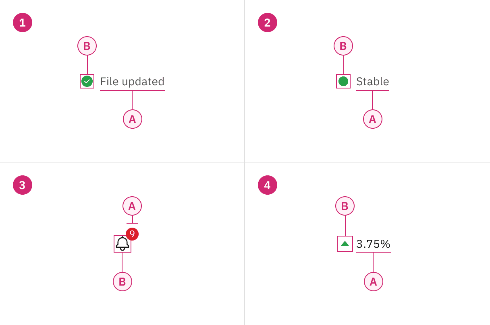
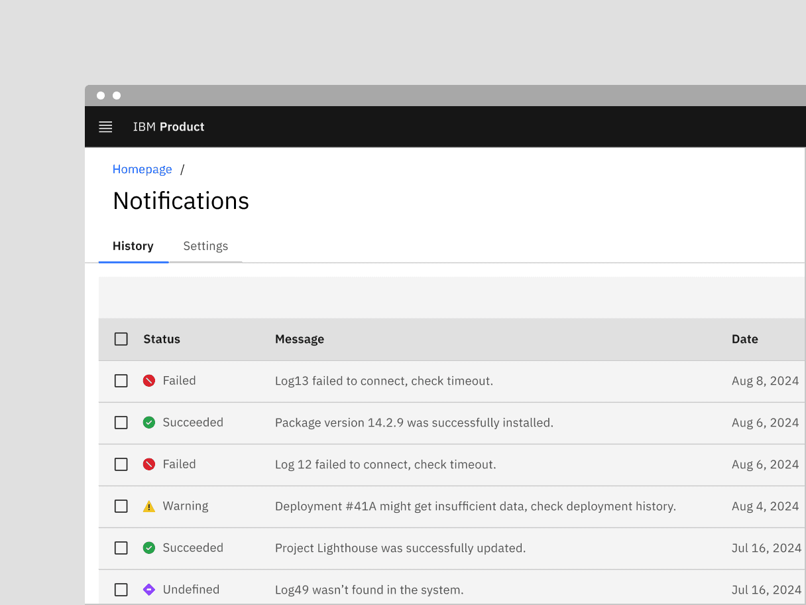
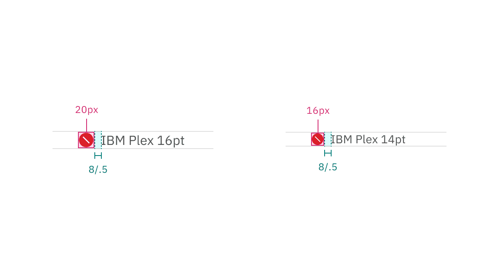
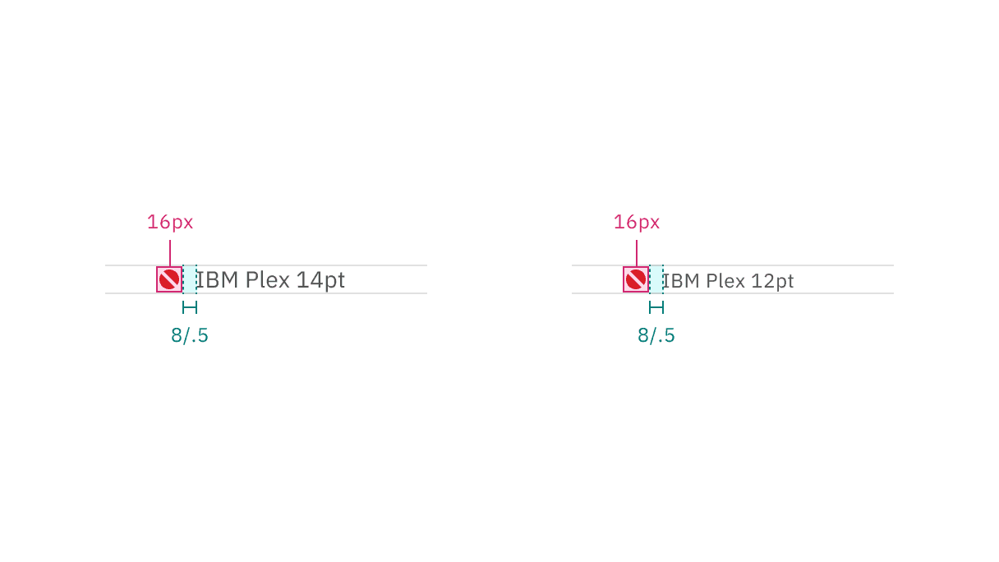
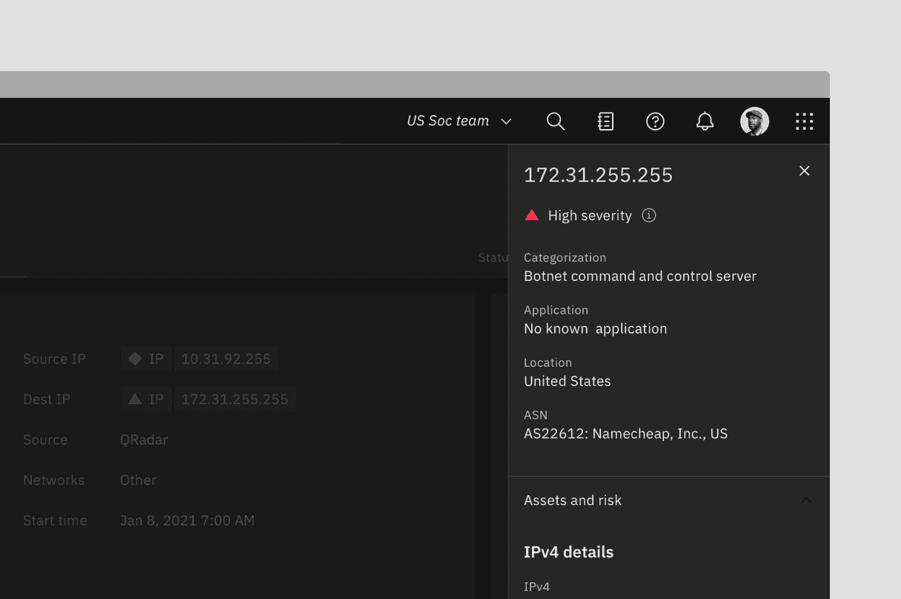
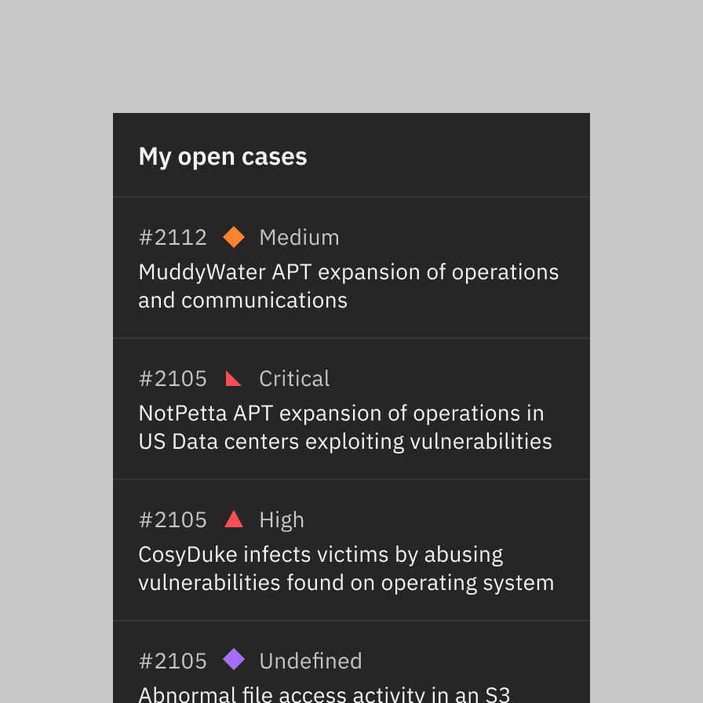
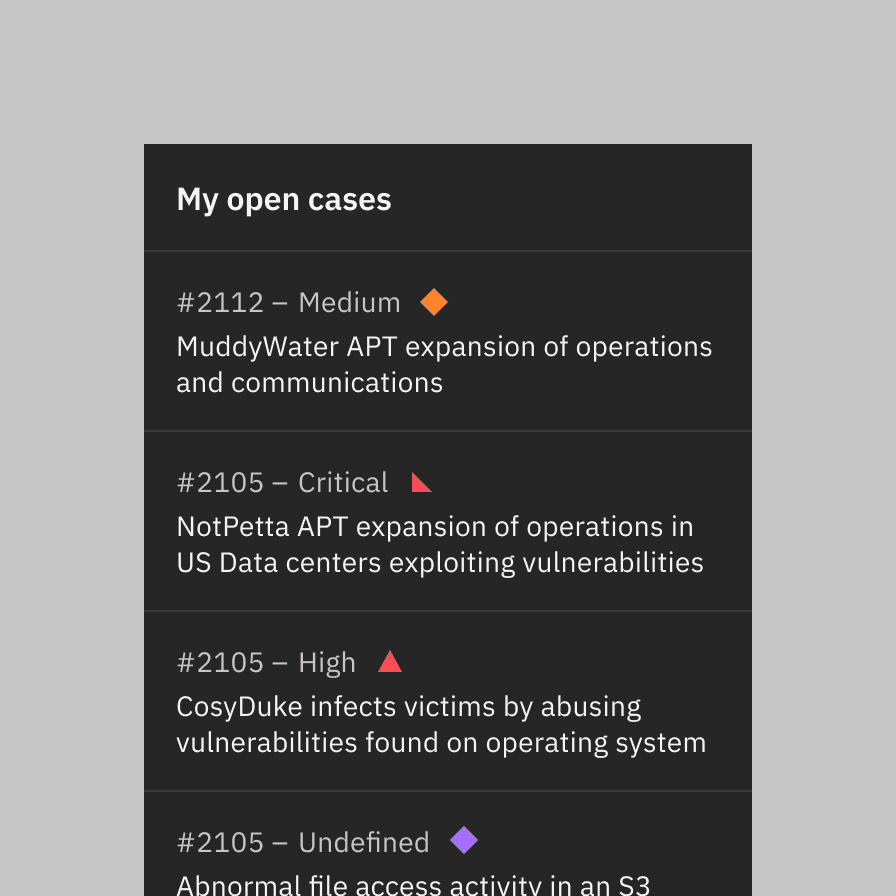
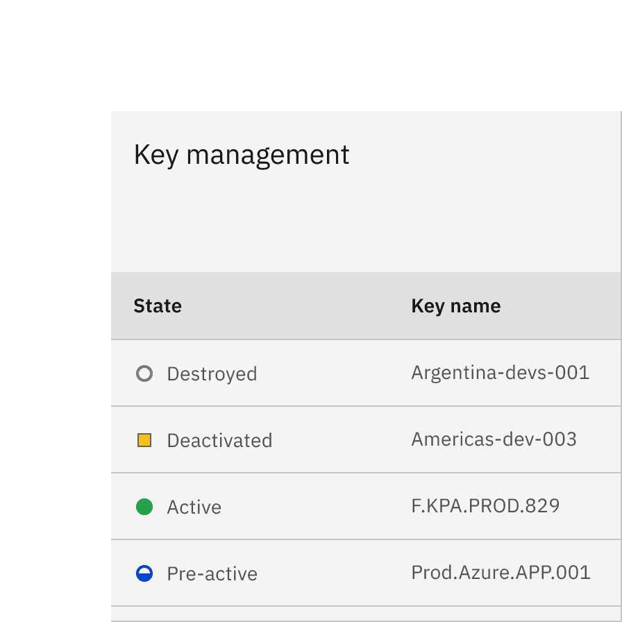
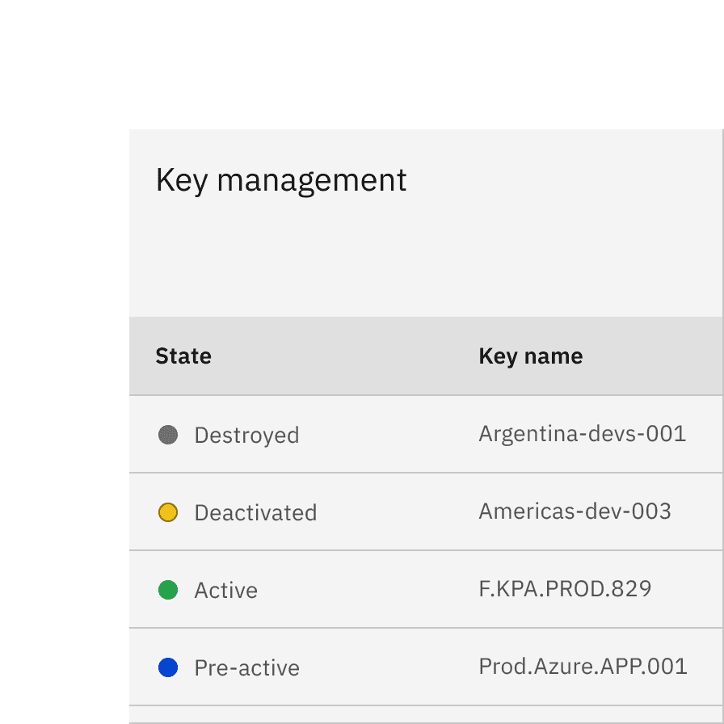
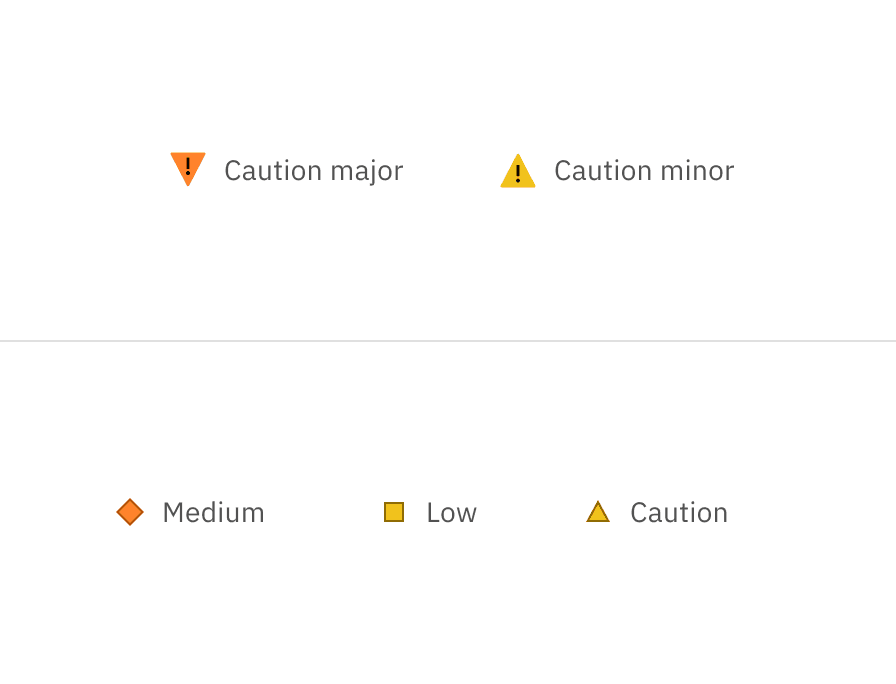

import StatusIndicatorTable from 'components/StatusIndicatorTable';

<PageDescription>

Status indicators are an important method of communicating severity-level
information to users. Different shapes and colors enable users to quickly assess
and identify status and respond accordingly.

</PageDescription>

<AnchorLinks>

<AnchorLink>Overview</AnchorLink>
<AnchorLink>Designing with status indicators</AnchorLink>
<AnchorLink>Icon indicator</AnchorLink>
<AnchorLink>Shape indicator</AnchorLink>
<AnchorLink>Badge indicator</AnchorLink>
<AnchorLink>Differential indicator</AnchorLink>
<AnchorLink>Accessibility</AnchorLink>
<AnchorLink>Related</AnchorLink>
<AnchorLink>References</AnchorLink>
<AnchorLink>Feedback</AnchorLink>

</AnchorLinks>

## Overview

Indicators help users notice important changes or issues on a page. They are
often used to show notifications, prioritized tasks, statuses, or updates. By
drawing attention to specific elements, indicators guide users to what they need
to focus on.

In this pattern we explore:

- Choosing the best status indicators for your context
- The different status indicator variants
- What elements they are comprised of and how each element works to communicate

<Row>
<Column colLg={12}>

</Column>
</Row>

### Variants

| Variant                                              | Usage                                                                                                                                                                  | Use cases                                                                                             |
| ---------------------------------------------------- | ---------------------------------------------------------------------------------------------------------------------------------------------------------------------- | ----------------------------------------------------------------------------------------------------- |
| [Icon indicator](#icon-indicator)                    | Used when the layout offers ample space and the content requires maximum attention. They require an icon, a shape, a meaningful color, and a descriptive inline label. | Most often used in notifications, progress indicators, data tables, task lists, and dashboard widgets |
| [Shape indicator](#shape-indicator)                  | Useful in smaller spaces or when users need to scan large amounts of data.                                                                                             | Most often used in lists, dashboards, data tables, data visualizations, and network diagrams          |
| [Badge indicator (with number)](#badge-indicator)    | Useful when a count of new or updated items is available, and it is important for the user to know the number of updates.                                              | Most often used in notification panes in the header and used in conjunction with avatars or icons     |
| [Badge indicator (without number)](#badge-indicator) | Useful when new or updated items are available and the number of notifications is unknown or irrelevant to the user. The dot badge is also more compact and discrete.  | Most often used in notification panes in the header and icon buttons in toolbars                      |
| [Differential indicator](#differential-indicator)    | Useful when users are monitoring differentials in large lists of statistics and when anything other than type would be too obtrusive.                                  | Most often used in financial dashboards for highlighting deltas or other types of data visualizations |

#### Icon indicators versus shape indicators

Status and shape indicators play a key role in providing feedback and guidance
within products. However, they are used in different situations and serve
distinct purposes depending on the product's needs.

Icon indicators reflect system health, notifying users if everything is running
smoothly or if issues arise, such as when a task is completed or fails after
submitting a form. They provide feedback on the product’s overall state through
system-wide notifications.

Shape indicators, as a secondary set of indicators, can be defined differently
depending on the product. Their use cases include helping users prioritize
tasks, like a red triangle for high-priority tasks, or showing the current phase
of a component's lifecycle, such as activated or deactivated. They don’t always
necessarily indicate urgency.

### Anatomy

<Row>
<Column colLg={8}>

</Column>
</Row>

<Row>
<Column colSm={2} colMd={4} colLg={4}>

#### 1. Icon indicator

A. Text label   B. Icon (shape, color, and symbol)  

#### 3. Badge indicator

A. Shape with or without number (color)   B. Icon (outline)  

</Column>
<Column colSm={2} colMd={4} colLg={4}>

#### 2. Shape indicator

A. Text label   B. Icon (shape and color)  

#### 4. Differential indicator

A. Text label   B. Symbol (optional color)\*  

</Column>
</Row>

<Caption>
  *Differential indicators must have either a “+” or “-” sign, a caret, or an
  arrow icon to indicate positive or negative values.
</Caption>

## Designing with status indicators

### Choosing for context

Choosing the right indicator for the context is important to ensure users can
quickly understand the information and respond appropriately.

#### Consolidated statuses

When multiple statuses are consolidated, use the highest-attention color to
represent the group. For example, if the statuses of underlying components are
green, yellow, and red, the consolidated indicator should be red.

#### Cognitive load

Avoid using status indicators when no user action is required or when the status
information isn’t significant enough to highlight. Instead, use plain text to
prevent overloading the interface with unnecessary indicators. While we won’t
set a strict limit, having more than five or six indicators can overwhelm users
and make it harder for them to focus.

### Standardization

All status icons must be approved and published in the
[icon library](https://carbondesignsystem.com/elements/icons/library/) to ensure
consistency across products. This guidance includes only the most common status
indicators, helping maintain a unified user experience and preventing
unnecessary variations in the design system.

If your product needs an icon that’s not currently in this pattern, please reach
out to the Carbon team to suggest its addition by
[creating a GitHub issue](https://github.com/carbon-design-system/carbon/issues/new?template=FEATURE_REQUEST_OR_ENHANCEMENT.yaml).

### Severity levels

For ease of use, status indicators can be classified by severity levels, such as
high, medium, and low attention. Product teams should define these levels based
on their specific needs and use cases, considering how each level may impact the
user’s response. High-severity levels, for example, may prompt immediate action,
while lower levels may allow for a more passive response.

#### High attention

Use these indicators when immediate user action is required due to a system
irregularity, malfunction, or potentially destructive action. Examples include
alerts, exceptions, confirmations, and errors.

#### Medium attention

Use these indicators when no immediate user action is required or to provide
feedback to a user action. Examples include acknowledgements and progress
indicators.

#### Low attention

Use these indicators when something is ready to view, for system feedback, or to
signify that something has changed since the last interaction.

### Visual guidance

To communicate their message, indicators can take many forms—they're not
confined to iconography. There are four basic elements that comprise Carbon
status indicators. (Note: we won't get into animation and sound in this
pattern.) And for WCAG compliance, at least three of these elements must be
present. Let's look at these elements more closely before examining specific
status types.

- Symbols
- Shapes
- Colors
- Type

#### Status symbols

Icons are visual symbols that represent ideas, objects, or actions. They help
communicate messages quickly, encourage interactivity, and highlight important
information—like exclamation points for warnings, checkmarks for success, and
question marks for help.

To keep icons consistent across IBM products, we’ve included only the most
widely recognized symbols in the icon library. Some products may have specific
modifications or need a more extensive set.

<Row>
<Column colLg={8}>

<Caption>Examples of some of the most common status symbols</Caption>

</Column>
</Row>

#### Status shapes

In this context, shapes refer to geometric figures like squares, circles,
rectangles, and so on, as they are instantly readable even at small sizes. These
shapes have strong visual associations that can be applied to help users succeed
in using their product flows. For instance, shapes with straight lines and 90
degree angles usually convey structure and order—like the grid. While shapes
with curves are friendlier and symbolize continuity and connection.

There can also be cultural associations connected with shapes. For example in
traffic and wayfinding, hexagons mean stop, and upside triangles means yield.
Using shapes incorrectly can disturb learned recognition patterns and confuse
users, possibly hurting their overall experience.

<Row>
<Column colLg={8}>

<Caption>Example of the most common status shapes</Caption>

</Column>
</Row>

#### Status color palette

The status palette includes all of the colors that can be used to reflect
status. Typically, red represents danger or error, orange represents a serious
warning, yellow represents a regular warning, green represents normal or
success, and blue represents passive notifications, usually involving additional
information and workflow progress. This status color palette also includes gray
and purple to add more depth to the system. Gray indicates drafts or jobs that
haven’t been started, and purple indicates outliers or undefined statuses.

<ColorPalette twoColumn type="status" />

#### Extended status palettes

This palette is only for added contrast accessibility when using yellows and
oranges. It’s not part of the IBM brand palette and is reserved for very
selective use in data visualizations and certain status indicators. Do not use
this palette in any other context or layout.

<ColorPalette type="status-extended" shouldShowControls={false} />

#### Status type

Status indicators have been paired with specific type sizes that work best in
products. While shape indicators can be paired with a larger size, it’s
recommended to use 14pt or 12pt in smaller spaces or when used as a secondary
set of indicators alongside the icon indicator set.

| Variant         | Icon size | Type size |
| --------------- | --------- | --------- |
| Icon indicator  | 20px      | 16pt      |
|                 | 16px      | 14pt      |
| Shape indicator | 16px      | 14pt      |
|                 | 16px      | 12pt      |

## Icon indicator

Icon indicators consist of an icon, a shape, a meaningful color, and a
descriptive label. They are highly effective for communication and enhance
scannability, especially in content-heavy layouts. Common uses include
notifications, progress indicators, data tables, task lists, and dashboard
widgets.

<Row>
<Column colLg={8}>

<Caption>
  Notifications are the most prevalent example of this type of status indicator.
</Caption>

</Column>
</Row>

### Icon indicator statuses

Suggested icon indicator status names are based on common use cases across
products to help guide you in defining status notifications according to your
system’s needs. These names are not intended to dictate the final status names
in your product.

<StatusIndicatorTable attention="high" />

#### Labeling and type pairing

Icon indicators, also known as "contextual" status indicators, are linked to
specific UI elements or content and should be placed near these elements for
clarity. When the label is not descriptive or paired only with numbers, it's
best practice to provide a heading or additional content to clarify the status
intention.

Status indicators within
[notification](https://carbondesignsystem.com/components/notification/usage/)
have different spacing since they are integrated into the notification component
and do not follow the inline spacing rules.

<Row>
<Column colLg={8}>

<Caption>
  Icon indicators are available in two sizes, each with recommended type size
  pairings.
</Caption>

</Column>
</Row>

#### Alignment

When stacked vertically, ensure the icons remain left-aligned with the
accompanying text for easier scanning.

<DoDontRow>
  <DoDont type="do" caption="Do left align icons and type in lists and data tables, regardless of whether you’re using the responsive grid or spacers.">

  </DoDont>
  <DoDont type="dont" caption="Do not push icons out of alignment with label length. In this case, where the status indicators are flush right, the two digit labels are pushing the icons out of alignment.">

  </DoDont>
</DoDontRow>

## Shape indicator

Shape indicators use a shape, color, and descriptive label to convey the status
of a device, feature, or version—without relying on a symbol.

Their use cases include helping users prioritize tasks, like a red triangle for
high-priority tasks, or showing the current phase of a component's lifecycle,
such as activated or deactivated. They don’t always necessarily indicate
urgency. Shape indicators are also used in diagrams and are designed to remain
clear even at small sizes.

<Row>
<Column colLg={8}>

<Caption>Example of the status label directly next to the shape</Caption>

</Column>
</Row>

### Shape indicator statuses

Suggested shape indicator status names are based on common use cases across
products to help guide you in defining status notifications according to your
system’s needs. These names are not intended to dictate the final status names
in your product.

<StatusIndicatorTable attention="glyph" />

#### Labeling and type pairing

Shape indicators are also "contextual" status indicators. Like the status icons
above, assets have been created for the shape indicators that take into account
optical alignment.

Shape indicators don’t have the added recognition of an icon, therefore, it’s
important that they are paired with a status label.

<Row>
<Column colLg={8}>

<Caption>
  Shape indicators are available in one size, but paired with two recommended
  type sizes.
</Caption>

</Column>
</Row>

<Row>
<Column colLg={8}>

<Caption>Example shows shape indicator paired with a label</Caption>

</Column>
</Row>

#### Alignment

When stacked vertically, ensure the icons remain left-aligned with the
accompanying text for easier scanning.

<DoDontRow>
<DoDont
type="do"
caption="Do place shape indicators before labels; they can be placed after other text only if there is no character count variation.">

</DoDont>

<DoDont
type="dont"
caption="Do not place shape indicators after the labels to avoid pushing them out of alignment.">

</DoDont>
</DoDontRow>

#### Best practices

The status shapes offer more flexibility in interpretation compared to status
icons, as shapes can have different colors for various situations. For best
practices, consider avoiding the use of the same shape with different colors
within the same experience.

<DoDontRow>
<DoDont
type="do"
caption="Do use shape, color, and status labels for better scanning">

</DoDont>

<DoDont
type="dont"
caption="Avoid using only color and status labels to differentiate your content">

</DoDont>
</DoDontRow>

## Badge indicator

Badge indicators let the user know that something is new or updated. A badge
status is displayed over a ghost icon button, usually in the header, to indicate
an active notification and is cleared after the user acknowledges the
notification. Depending on your use case, the icon button can open a new page or
launch a modal, pane, or flyout.

<Row>
<Column colLg={8}>

<Caption>Examples of badge indicators used for global notifications</Caption>

</Column>
</Row>

#### Badge with number

A numbered badge is used when a count of new or updated items is available, and
it's important for the user to know the exact number of updates. This badge has
a limit of three digits, with the last character using a plus symbol.

The badge with a number can only be used with the large icon button (48px) as
global actions in the UI shell header.

<Row>
<Column colLg={8}>

<Caption>Badges with numbers ranging from one to three digits</Caption>

</Column>
</Row>

#### Badge without number

A badge without a number (or dot badge) is used when a new notification is
available, but the exact number of notifications is either unknown or irrelevant
to the user. This dot badge is more subtle than the numbered badge but still
effectively draws the user’s attention to the icon button.

The badge without a number is commonly seen in toolbars' icon buttons.

## Differential indicator

Differential indicators consist of a symbol, an optional color, and a
descriptive label to help users track changes or movements in information. They
are especially useful for monitoring differences in large sets of statistics,
where more complex indicators might be too distracting. Common examples include
color-coded stock symbols in investment accounts that reflect significant price
changes. Designers also use differential indicators to highlight deltas in data
visualizations.

While typographic indicators can work with just a plus or minus sign, they are
most often paired with arrows or caret icons in our system for better clarity.

<Row>
<Column colLg={8}>

</Column>
</Row>

#### Color

Differential indicators are either displaying a positive or a negative value.
Color is optional in these situations as long as the value has either a "+" or
"-" in front of it, a chevron icon, or an arrow icon. Unless the data involves
temperature, positive values are represented by the green spectrum and negative
values are represented by the red spectrum.

<Row>
<Column colLg={8}>

<Caption>Differential indicators are most often seen in dashboards.</Caption>

</Column>
</Row>

## Accessibility

### Elements

#### Relying only on color is insufficient

Relying solely on color to convey status is insufficient, especially for users
with color vision deficiencies (refer to
[Use of Color](https://www.w3.org/WAI/WCAG22/Understanding/use-of-color.html)).
While color can be useful, it must be paired with text or other visual cues. To
meet accessibility standards and to pass
[non-text contrast](https://www.w3.org/WAI/WCAG22/Understanding/non-text-contrast),
ensure that there’s at least a 3:1 contrast between colors used for status
indicators, as well as between the indicator and the page background. If the
contrast is sufficient, even in grayscale, users should still be able to
differentiate statuses without relying solely on color.

As a result, status indicators should rely on at least two of the following
elements: color, shape, or symbol. When the icon itself meets accessibility
standards, pairing it with text helps users better understand and scan the
content.

#### Using icons alone is acceptable

We are committed to providing status indicators that include both the icon and a
label for clarity. While icons alone can be effective if they meet non-text
contrast requirements (3:1 contrast), pairing each icon with a label ensures
that all users, including those with visual impairments, can understand the
status at a glance.

<Row>
<Column colLg={8}>

<Caption>Example shows sufficient status indicators</Caption>

</Column>
</Row>

### Outlines

Our current icon indicators are static and used either inline or alongside other
components. Since they are not interactive and the symbols have sufficient
contrast against their shape colors, outlines are not necessary.

However, shape indicators rely solely on shapes and colors, which might not
provide enough accessibility for screen readers and individuals with low color
vision. Therefore, using outlines and pairing text with shape indicators is
essential to enhance their accessibility, especially with lighter status colors
such as orange and yellow in Carbon light themes.

<Row>
<Column colLg={8}>

<Caption>
  Example shows the icon indicators do not need outlines, while icon indicators
  do due to the lack of symbols
</Caption>

</Column>
</Row>

## Related

<Row>
<Column colSm={2} colMd={2} colLg={3}>

#### Components

- [Loading](/components/loading/usage)  
- [Data table](/components/data-table/usage)  
- [Notification](/components/notification/usage)  
- [Progress indicator](/components/progress-indicator/usage)  

</Column>
<Column colSm={2} colMd={2} colLg={3}>

#### Patterns

- [Notifications](/patterns/notification-pattern)  

</Column>
</Row>

## References

- Nick Babich,
  [4 Ways To Communicate the Visibility of System Status in UI](https://uxplanet.org/4-ways-to-communicate-the-visibility-of-system-status-in-ui-14ff2351c8e8),
  (UX Planet, 2020)
- Aurora Harley,
  [Visibility of System Status (Usability Heuristic #1)](https://www.nngroup.com/articles/visibility-system-status/),
  (Nielsen Norman Group, 2018)
- Miklos Philips,
  [A comprehensive guide to notification design](https://uxdesign.cc/a-comprehensive-guide-to-notification-design-2fff67f08b7a),
  (UX Planet, 2020)
- Kim Salazar,
  [Indicators, Validations, and Notifications: Pick the Correct Communication Option](https://www.nngroup.com/articles/indicators-validations-notifications/),
  (Nielsen Norman Group, 2015)

## Feedback

Help us improve this pattern by providing feedback, asking questions, and
leaving any other comments on
[GitHub](https://github.com/carbon-design-system/carbon-website/issues/new?assignees=&labels=feedback&template=feedback.md).
