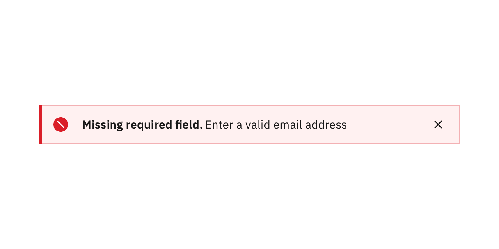
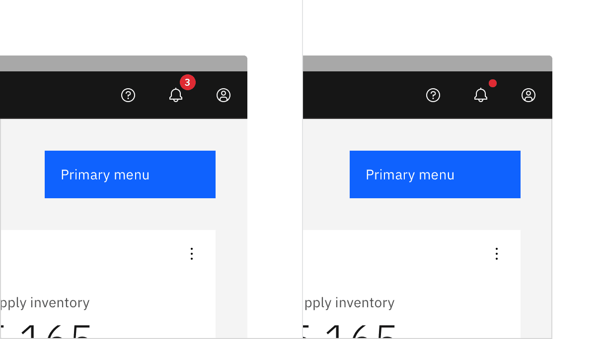
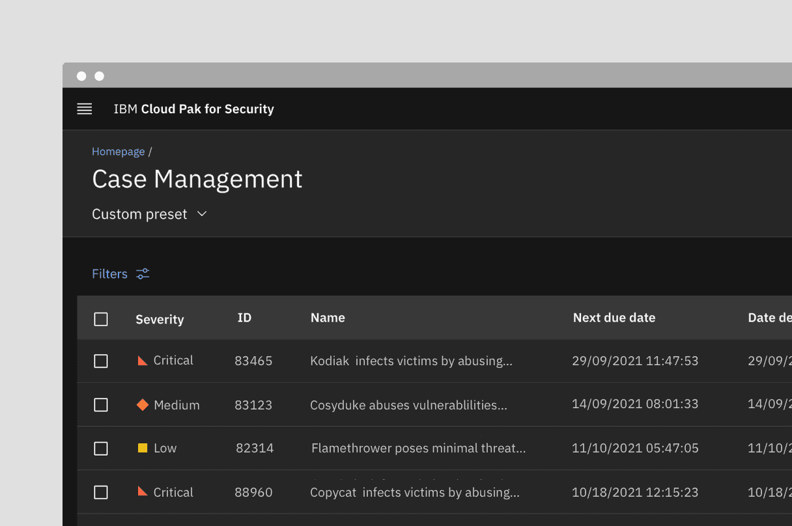
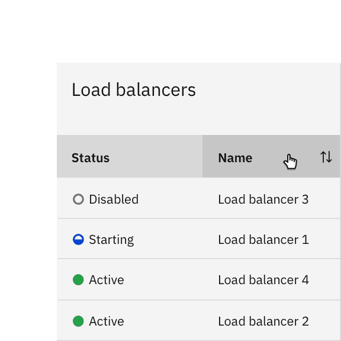
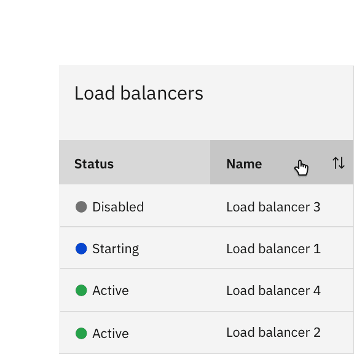

<PageDescription>

Status indicators are an important method of communicating severity level
information to users. The shapes and colors communicate severity that enable
users to quickly assess and identify status and respond accordingly.

</PageDescription>

<AnchorLinks>

<AnchorLink>Overview</AnchorLink>
<AnchorLink>Choosing for context</AnchorLink>
<AnchorLink>Ingredients</AnchorLink>
<AnchorLink>Variants</AnchorLink>
<AnchorLink>Formatting</AnchorLink>
<AnchorLink>Accessibility</AnchorLink>
<AnchorLink>Related</AnchorLink>
<AnchorLink>References</AnchorLink>
<AnchorLink>Feedback</AnchorLink>

</AnchorLinks>

## Overview

An indicator is a way of making a page element stand out to inform the user that
there is something special about it that warrants the user’s attention. Often,
the indicator will denote that there has been some change to the item
represented by that element.

Indicators are used quite frequently to signal validation errors or
notifications, changes or updates, they can also be used on their own.
Indicators are visual cues intended to attract users’ attention to a particular
piece of content or UI element that is dynamic in nature.

In this pattern we're going to explore:

- Choosing the best status indicators for your context
- The different status indicator variants
- What elements they’re comprised of and how each element works

## Choosing for context

In the UI landscape examples of status indicators are everywhere. However this
pattern will focus less on the components or patterns in which indicators tend
to appear (notifications, inline errors, dashboards etc.) and more on the
urgency of the communication. For ease of use, status indicators can be
classified into levels of severity such as high, medium, and low attention. See
more information on choosing between alias icons and outlined vs. filled icons
in the [Status shapes](#status-shapes) section below.

#### Consolidated statuses

When multiple statuses are consolidated, use the highest-attention color to
represent the group. For example, if the statuses of underlying components are
green, yellow, and red, the consolidated indicator is red.

#### Cognitive load

Don't use status indicators when no user action is necessary and status
information is not important enough to highlight. Use plain text instead to
avoid the overuse of status indicators. While we won’t go as far a prescribing a
maximum number, more than 5 or 6 indicators really starts to tax a user.

### High attention

These indicators signal that user action is needed immediately—i.e. there is an
irregularity in the system, something malfunctioned or a user needs to confirm a
potentially destructive action. Some examples include Alerts, exceptions,
confirmations, errors.

{INSERT HIGH ATTENTION TABLE HERE}

### Medium attention

Use these indicators when no immediate user action is required or to provide
feedback to a user action. Some examples include acknowledgements and progress
indicators.

{INSERT MEDIUM ATTENTION TABLE HERE}

### Low attention

Use these indicators when something is ready to view, for system feedback, or to
signify that something has changed since the last interaction. Some examples
include tooltip triggers that offer explanatory or added information and passive
notifications.

{INSERT LOW ATTENTION TABLE HERE}

## Ingredients

To communicate their message, indicators can take many forms—they're not
confined to iconography. There are four basic elements that comprise Carbon
status indicators (we won't get into animation and sound in this pattern). For
WCAG compliance, at least three of these elements must be present. We should
spend a little time unpacking these before talking more about the specific
status types.

- Symbols
- Shapes
- Colors
- Type

### Status icons

Icons are visual symbols used to represent ideas, objects, or actions. Ideally,
they communicate messages at a glance, afford interactivity, and draw attention
to important information. For example: Exclamation point for warning, checkmark
for success, question mark for help or unknown.

In an attempt to standardize the icons that are used most widely in IBM product,
for the most part, we’ve included only the most universally recognized icons.
Certain products may have certain modifications or most robust sets.

<Row>
<Column colLg={8}>

<Caption>Example of some of the most common status symbols</Caption>

</Column>
</Row>

### Status shapes

In this context, shapes refer to geometric figures like squares, circles,
rectangles, etc.— as they are instantly readable even at small sizes. These
shapes have strong visual associations that every designer should know how to
apply to help their users succeed in using their product flows. For instance,
shapes with straight lines and 90 degree angles usually convey structure and
order—like the grid. While shapes with curves are friendlier and symbolize
continuity and connection. Not to mention cultural associations connected with
traffic and wayfinding (i.e. hexagon means stop, upside triangle means yield
etc.)

Using shapes incorrectly can disturb learned recognition patterns and confuse
users, possibly hurting their overall experience.

<Row>
<Column colLg={8}>

<Caption>Example of the most common status shapes</Caption>

</Column>
</Row>

#### Outline vs filled shapes

We offer two options that can be flexible for usage based on the teams'
preference. Keep in mind that filled icons are more visible and tend to carry
more weight—as such they’re often used for high attention statuses. Outlined
icons are more delicate and not as readily scannable.

In addition, the more line work an icon has—and the more breaks in those
lines—the more difficult it is to use a filled icon. For this reason, some
product teams may occasionally mix in an outline icon with a filled icon—that’s
OK—but for the most part, designers should try to be consistent throughout the
product or application. In general though, designers should avoid mixing
outilned and filled indicators on the same page.

#### Alias status icons

In several cases, we offer multiple shape options for one type of status
indicator. For example, ‘warning.’ ‘help’ and ‘information’ status icons have
multiple variants to convey similar or exactly the same information. Often
times, users of certain products have grown accustom to say, a hexagon instead
of a circle to convey a critical warning. Or a team just wants to go the extra
mile and offer yet another differentiator for accessibility. Although
consistency is always the goal, there’s no need to prevent some differentiation
to accomodate user preferences. Whichever style you choose, avoid mixing
throughout the UI.

If an alias that your product frequently uses has been removed from the set and
you can make a case for the importance of including it here please let us know.

### Status colors

This palette is only for added contrast accessibility when using yellows and
oranges. It’s not a part of the IBM masterbrand palette and it’s also not
included in the v2 color release (i.e. it’s not in ASE, Sketch kit palettes
etc.) because it’s for very selective use in data visualizations and certain
status indicators. Do not use this palette in any other manor in your layouts.

<ColorPalette type="alert" />

#### Extended status palettes

This palette is only for added contrast accessibility when using yellows and
oranges. It’s not a part of the IBM masterbrand palette and it’s also not
included in the v2 color release (i.e. it’s not in ASE, Sketch kit palettes
etc.) because it’s for very selective use in data visualizations and certain
status indicators. Do not use this palette in any other manor in your layouts.

{Insert extended yellow and orange palette component}

## Variants

There are at least three possible ways to implement status indicators:

- Full status indicators
- Badge indicators (with and without numbers)
- Shape status indicators
- Differential status indicators

| Variant                                  | Usage                                                                                                                                                                                   | Context                                                                                                                                                                                                                        |
| ---------------------------------------- | --------------------------------------------------------------------------------------------------------------------------------------------------------------------------------------- | ------------------------------------------------------------------------------------------------------------------------------------------------------------------------------------------------------------------------------ |
| Full status indicators                   | Because they require an icon, a shape, a meaningful color and a descriptive inline label—they’re used any time the layout offers ample space and the content requires maximum attention | Icon indicators are widely used in [Notifications](/components/notification/usage), [Progress Indicators](/components/progress-indicator/usage), [Data tables](/components/data-table/usage), task lists and dashboard widgets |
| Badge status indicators (with number)    | Useful when a count of new or updated items is available, and it is important for the user to know the number of updates                                                                | Most often used in notification panes in the header (used in conjuntion with avatars or icons)                                                                                                                                 |
| Badge status indicators (without number) | Useful when new or updated items are available and the number of notifications is unknown or irrelevant to the user. The dot badge is also more compact and discrete                    | Most often used in notification panes in the header (used in conjuntion with avatars or icons)                                                                                                                                 |
| Shape status indicators                  | Useful in smaller spaces or when users need to scan large amount of data                                                                                                                | Most often used in, lists, dashboards, data tables, data visualizations and network diagrams                                                                                                                                   |
| Differential status indicators           | Useful when users are monitoring differentials in large lists of statistics and anything other than type would be too obtrusive                                                         | Most often used financial dashboards for highlighting deltas or other types of data visualizations                                                                                                                             |

### Anatomy

Like a button, a status indicator’s text label is the most important element, as
it communicates progress. By default Carbon uses sentence case for all button
labels.

Text labels, column labels (or a legend, when inline labels aren’t an option)
are strongly recommended.

<Row>
<Column colLg={8}>

</Column>
</Row>

<Row>
<Column colSm={2} colMd={4} colLg={4}>

#### 1. Full indicator

A. Text label   B. Symbol   C. Shape   D. Color

#### 3. Badge indicator (no number)

A. Shape without number   B. Symbol   C. Color

#### 5. Differential indicator

A. Text label   B. Symbol\*   C. Color (optional)

</Column>
<Column colSm={2} colMd={4} colLg={4}>

#### 2. Badge indicator (number)

A. Shape with number   B. Icon   C. Color

#### 4. Shape indicator

A. Text label   B. Shape   C. Color

</Column>
</Row>

<Caption>
  *Differential indicators must have either a ‘+’ or ‘-’ sign, a caret or an
  arrow icon to indicate positive or negative values.
</Caption>

## Formatting

### Full status indicators

Full status indicators require an icon, a shape, a meaningful color and a
descriptive label. Easily recognizable icons can make very effective
communication tools and greatly improve scanability,especially with large
amounts of content. Icon indicators are widely used in Notifications, Progress
Indicators, Data tables, task lists and dashboard widgets.

<Row>
<Column colLg={8}>

<Caption>
  Notifications are the most prevalent example of this type of status indicator.
</Caption>

</Column>
</Row>

#### Type pairing and alignment

Full status indicators are sometimes referred to as ‘contextual’ status
indicators as well because they are associated with a UI element or with a piece
of content. As such they should be shown in close proximity to that element.

There are also cases, especially in data tables and lists, where the column
heading or row label may provide additive context to the inline label. Also,
when very common ‘stop light’ associations are present (see below), it may not
be necessary to explicitly label an icon as ‘warning,’ or ‘stable’ — as these
interpretations are widely understood in product. However it is good practice to
clarify the status intention in the text label.

<DoDontRow>
  <DoDont caption="Do left-align icons and type in lists, data tables regardless of whether you’re using the responsive grid or spacers." colLg={6}>

  </DoDont>
  <DoDont type="dont" colLg={6} caption="Do not push icons out of alignment with label length; in this case, where the status indicators are flush right, the two digit labels are pushing the icons out of alignment.">

  </DoDont>
</DoDontRow>

### Badge status indicators

Badge status alerts the user that something is new or updated. A badge status is
displayed over a ghost icon button, usually in the header, to indicate an active
notification, and is cleared after the user acknowledges the notification.
Depending on your use case, the icon button can open a new page or launch a
modal, pane, or flyout.

<Row>
<Column colLg={8}>

<Caption>
  Badge statuses with numbers are usually used for global notifications.
</Caption>

</Column>
</Row>

#### Badge status with number

Numbers are used in conjunction with a badge status when a count of new or
updated items is available—and it is important for the user to know the number
of updates.

#### Badge status without number

A badge indicator with no number is used when a new notification is available
and the number of notifications is either unknown or irrelevant to the user. The
dot badge is less noticeable than the numbered badge, but still draws the user’s
attention to the icon button.

### Shape status indicators

Shape indicators combine color shape and text to create a standard and
consistent way to indicate the status of a device, feature or version—icons are
not present. These shapes are also seen in certain diagrams and data
visualizations (e.g. network diagrams). The shapes are only the most basic
geometries, derived from the larger icon containers, so they can be easily
discerned at small sizes. Shape indicators are not available in outline because
they are so small. The only situation in which you would use an outline is to
ensure contrast accessibility for yellows.

The table below is a first attempt to establish a standard lexicon for symbol
indicator within IBM product.

{INSERT SYMBOL STATUS TABLE HERE}

#### Type pairing and alignment

Shape indicators are also ‘contextual’ status indicators. Like the status icons
above, assets have been created for the shape indicators that take into account
optical alignment. Do not attempt to create these shapes yourself. Use the
approved shape indicator provided to you in the icon library.

As with the icons, choose the appropriate canvas size depending on the size of
the status label it pairs with. 16px symbols are optimized to feel balanced when
paired with both 12px and 14px IBM Plex. Since shape indicators are most often
reserved for small usage scenarios in product, we would advise you to use full
status indicators with 16px IBM Plex.

<Row>
<Column colLg={8}>

<Caption>
  Shape status canvases should be placed 4px from the beginning of the text box.
</Caption>

</Column>
</Row>

<Row>
<Column colLg={8}>

<Caption>Here the status label is directly next to the shape</Caption>

</Column>
</Row>

#### Legends

Because shape indicators don’t have the added recognition of an icon—it’s even
more important that they are paired with a status label. Alternately, the
designer can provide the user with a legend if a status label isn’t an option.

<Row>
<Column colLg={8}>

<Caption>
  Here the status symbol indicator depends on the legend at the top of the page
</Caption>

</Column>
</Row>

<Title>Best practices</Title>

<DoDontRow>
<DoDont
type="do"
caption="Do place shape indicators before labels; they can be placed after other text only if there is no character count variation.">

</DoDont>

<DoDont
type="dont"
caption="Do not place shape indicators after the labels to avoid pushing them out of alignment.">

</DoDont>
</DoDontRow>

<DoDontRow>
<DoDont
type="do"
caption="Do use shape, color and status labels to improve scanability.">

</DoDont>

<DoDont
type="dont"
caption="Avoid using only color and status labels to differentiate your content.s">

</DoDont>
</DoDontRow>

### Differential status indicators

Differential status indicators often help users understand the movement or
changes of information. They are especially useful when users are monitoring
differences in large lists of statistics and anything other than type would be
too obtrusive. Examples include the common convention of color-coding stock
symbols in an investment account if their price has changed substantially.
Designers also rely on them to highlight deltas in data visualizations.

Although typographic indicators can be used without an icon as long as a minus
or a plus sign is used—they are most often paired with arrow or caret icons in
our system.

<Row>
<Column colLg={8}>

</Column>
</Row>

#### Color

Since differential indicators are either displaying a positive or a negative
value. Color is optional in these situations as long as the value has either a
‘+’ or ‘-’ in front of it, a chevron icon or an arrow icon. Unless the data
involves temperature, positive values are represented by the green spectrum and
negative values are represented by the red spectrum.

<Row>
<Column colLg={8}>

<Caption>
  Differential status indicators are most often seen in dashboards.
</Caption>

</Column>
</Row>

## Accessibility

Accessible design not only helps users with disabilities; it provides better
user experiences for everyone. The most common form of color blindness is
red/green color blindness. The inability for some users to distinguish between
red and green means that products cannot simply rely on color to show status. As
a result, the status system relies on 3 key elements; color, shape, and symbol.

For example, the critical icon is not just “red”, it is the sum of the following
elements.

Color = Red   Shape = Circle   Symbol = \   Text = Critical
 

<DoDontRow>
  <DoDont caption="Do include at least three out of four indicators of status to meet accessibility requirements." colLg={6}>

  </DoDont>
  <DoDont type="dont" colLg={6} caption="Avoid designs with less than three indicators of status; using solely color and symbols is inaccessible.">

  </DoDont>
</DoDontRow>

### Status notifications

#### Don’t use notifications that dismiss on a timer for critical or emergency messages.

Some users with disabilities need more time to read or interact with messages
and timed toasts may not provide sufficient time. WCAG 2.1 success criterion
2.2.4 (AAA)

#### Users should be able to manage or limit noncritical notifications.

This gives users the control to reduce the number of distractions or disruptions
they receive, which is particularly helpful for users with cognitive
limitations. WCAG 2.1 success criterion 2.2.3 (AAA)

## Related

<Row>
<Column colSm={2} colMd={2} colLg={3}>

#### Components

- [Loading](/components/loading/usage)  
- [Data table](/components/data-table/usage)  
- [Notification](/components/notification/usage)  
- [Progress indicator](/components/progress-indicator/usage)  

</Column>
<Column colSm={2} colMd={2} colLg={3}>

#### Patterns

- [Notifications](/patterns/notification-pattern)  

</Column>
</Row>

## References

- Nick Babich,
  [4 Ways To Communicate the Visibility of System Status in UI](https://uxplanet.org/4-ways-to-communicate-the-visibility-of-system-status-in-ui-14ff2351c8e8s),
  (UX Planet, 2020)
- Aurora Harley,
  [Visibility of System Status (Usability Heuristic #1)](https://www.nngroup.com/articles/visibility-system-status/),
  (Nielsen Norman Group, 2018)
- Miklos Philips,
  [A comprehensive guide to notification design](https://uxdesign.cc/a-comprehensive-guide-to-notification-design-2fff67f08b7a),
  (UX Planet, 2020)
- Kim Salazar,
  [Indicators, Validations, and Notifications: Pick the Correct Communication Option](https://www.nngroup.com/articles/indicators-validations-notifications/),
  (Nielsen Norman Group, 2015)

## Feedback

Help us improve this pattern by providing feedback, asking questions, and
leaving any other comments
on [GitHub](https://github.com/carbon-design-system/carbon-website/issues/new?assignees=&labels=feedback&template=feedback.md).
