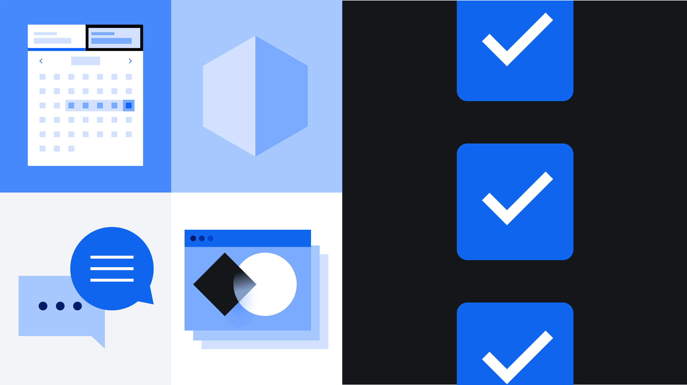

<PageDescription>

The Carbon v11 release includes quality of life updates for designers and
developers, and with no brand updates, no product redesigns are required.

</PageDescription>

<InlineNotification>

**Note:** The Carbon v11 release is currently in beta release. Be on the lookout
for the public preview release available in the coming months.

</InlineNotification>

<AnchorLinks>

<AnchorLink>Overview</AnchorLink>
<AnchorLink>Read</AnchorLink>
<AnchorLink>Watch</AnchorLink>
<AnchorLink>Release FAQs</AnchorLink>

</AnchorLinks>

## Overview

Carbon v11 focuses on quality of life updates for designers and developers
including token and prop renaming for ease of use, component API updates for a
more predictable developer experience, and introducing CSS grid for accurate
layout building in line with the design language.

With no changes to the IBM Design Language, v11 will not require any
brand-driven product redesigns.

### What’s new

- CSS grid lets you more accurately build layouts in line with the design
  language.
- Inline theming for light/dark modes.
- Token renaming for better understanding and ease of use.
- Size props introduced for icons to reduce icon package size.
- Reduced compile times with new Sass modules.

### What’s not changing

- No changes to the IBM Design Language.
- No need to redesign your UI.
- Tokens that are changing will continue to work in v11.
- Assets that are deprecated in v10 will remain in v11 and will be removed in
  v12.

## Read

<Row>
<Column colLg={4} colMd={4} noGutterMdLeft>
<ArticleCard
    title="Carbon’s 2021 release: April update"
    author="Josh Black"
    date="April 22, 2021"
    href="https://medium.com/carbondesign/carbons-2021-release-april-update-9d23242b3dea"
    >

</ArticleCard>
</Column>
<Column colLg={4} colMd={4} noGutterMdLeft>
<ArticleCard
    title="What’s coming to Carbon in 2021"
    author="Josh Black"
    date="November 12, 2020"
    href="https://medium.com/carbondesign/whats-coming-to-carbon-in-2021-39a4c7d1762a"
    >

</ArticleCard>
</Column>
</Row>

## Watch

As part of IBM's front-end developer educational series, FEDucation, Josh Black
introduces the upcoming v11 release, its features, and how to get involved and
provide feedback.

<Video title="Carbon v11 video" vimeoId="567122059" />

## Release FAQs

### What are the benefits of Carbon v11 for me as a designer?

- Token names have been updated for easier application. Names are more logical
  and easier to apply without always having to refer to a guide.

- Nothing visually has changed in any of the components, and so no redesign work
  is required.

### What are the benefits of Carbon v11 for me as a developer?

- CSS grid provides easier implementation of layouts, support for sub-grid, and
  other features that come along with this new technology.

- CSS custom properties for theming (light mode / dark mode).

- A 90% reduction in compile times for most projects with the update to Sass
  architecture.

- Quality of life updates such as:

  - Consistent component API across the board.
  - Improvements to Sass structure for getting started and productive use
    experiences.

- New components:
  - Cover a wider variety of use-cases in your product with some of our new
    components.
  - Easily build our more accessible experiences with our accessibility
    component primitives.

### What are the benefits to my product’s customers?

- Light/dark mode support.

- Faster load times due to smaller bundle sizes.

### Do I need to update right away? If not, when will we need to update?

- Carbon v11 includes functionality that may be a motivator for migration, but
  teams can migrate to v11 when they have the bandwidth.

- Teams that are using v10 today can continue to stay on v10 and everything that
  is implemented will continue to work.

### What will the Carbon team be supporting for v10?

- No new functionality will be introduced in v10 after the v11 release.

- We will continue to address high impact bugs that come up for the v10 release
  after the v11 release.

- We will continue to accept any contributions that look to address issues in
  the v10 release if we are unable to get to them in time for your product
  roadmap.

### What is the rule for supporting deprecated assets?

- Assets that were deprecated from v9 to v10 will be removed in v11.

- Assets that are deprecated in v10 will remain in v11 and will be removed in
  v12. While the timeline of v12 has not been set, the team’s intent is for
  major versions to be at minimum 12 months apart.

### Will I need to redesign my product?

- Visually, nothing is changing.

- There are system-side changes that will require changes to design specs and
  code, like the token names update and inline theming.

- Token names are largely a 1:1 update and very few tokens are keeping their v10
  name. This means color tokens will have to be updated across assets.

- We are hoping to be able to provide a script that can make these changes on
  the code side automatically, however this has not been built or tested yet.

### Why rename things instead of leaving things as they are?

- Making these updates now creates a better system user experience and it sets
  us up for growth and scale so new tokens can fit into the set more easily.

- The new names imply the usage and so will be much easier to apply. For
  example, `text-03` will be `text-placeholder`.

### How big is the effort to migrate current Sketch designs to the v11 Sketch kit?

- The Carbon Sketch files will automatically update to v11. Connected styles and
  symbols will automatically receive the v11 updates once the library update is
  accepted by the users in each design file.

- If you’re not ready to update to v11, you can stop accepting library updates
  to that file until you are ready.

- Sketch files for v10 will be available in the GitHub archive but will no
  longer be an attached library. There is no way to properly version Sketch
  Cloud files. There is only the latest version.

- The effort to update local/PAL assets depends on the structure of files. If
  you are using the Carbon layer styles then the update will be automatic. If
  you’re using hard values and just specing the token names, then you will need
  to update your specs.

- Read the
  [Sketch documentation](https://www.sketch.com/docs/libraries/#updating-library-components)
  for more details.

### How big is the expected effort to migrate code to v11?

- The Carbon team is providing an upgrade experience to automate as much of the
  migration process as possible.

- A lot of the changes made will be name-based.

- Some changes with components will require updating to the new component API.

- Teams will need to update their Sass dependency since `node-sass` has been
  deprecated. They will also need to update how they bring in Carbon. For
  details about what can be done now, see our
  [April update Medium article](https://medium.com/carbondesign/carbons-2021-release-april-update-9d23242b3dea).
