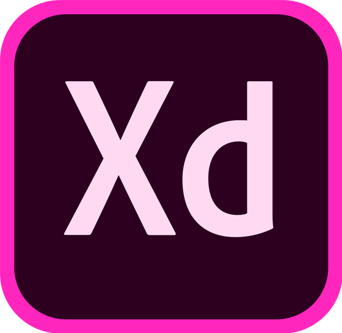
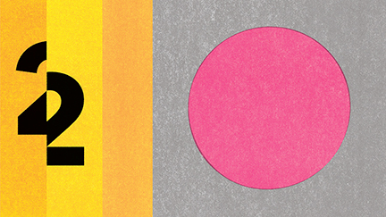
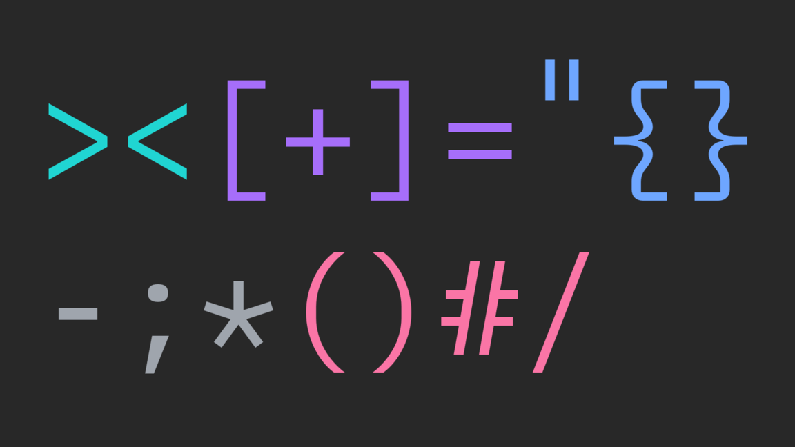

<PageDescription>

Everything you need to work with, learn about, and contribute to Carbon.

</PageDescription>

<AnchorLinks>

<AnchorLink>Development resources</AnchorLink>
<AnchorLink>Design resources</AnchorLink>
<AnchorLink>Tools</AnchorLink>
<AnchorLink>Reading</AnchorLink>

</AnchorLinks>

## Development resources

### GitHub repos

<Row className="resource-card-group">
<Column colLg={4} colMd={4} noGutterSm>
  <ResourceCard
    subTitle="Carbon Components"
    href="https://github.com/carbon-design-system/carbon-components"
    >

<MdxIcon name="github" />

  </ResourceCard>
</Column>
<Column colLg={4} colMd={4} noGutterSm>
  <ResourceCard
    subTitle="Carbon Components React"
    href="https://github.com/carbon-design-system/carbon-components-react"
    >

<MdxIcon name="github" />

  </ResourceCard>
</Column>
<Column colLg={4} colMd={4} noGutterSm>
  <ResourceCard
    subTitle="Carbon Components Angular"
    href="https://github.com/IBM/carbon-components-angular"
    >

<MdxIcon name="github" />

  </ResourceCard>
</Column>
<Column colLg={4} colMd={4} noGutterSm>
  <ResourceCard
    subTitle="Carbon Components Vue"
    href="https://github.com/carbon-design-system/carbon-components-vue"
    >

<MdxIcon name="github" />

  </ResourceCard>
</Column>
<Column colLg={4} colMd={4}  noGutterSm>
  <ResourceCard
    subTitle="Carbon boilerplate"
    href="https://github.com/carbon-design-system/carbon-boilerplate"
    >

<MdxIcon name="github" />

  </ResourceCard>
</Column>
<Column colMd={4} colLg={4} noGutterSm>
  <ResourceCard
    subTitle="Carbon Charts Core"
    href="https://github.com/carbon-design-system/carbon-charts/tree/master/packages/core">
    <MdxIcon name="github" />
  </ResourceCard>
</Column>
</Row>

### Storybooks

<Row className="resource-card-group">
<Column colLg={4} colMd={4} noGutterSm>
  <ResourceCard
    subTitle="Carbon React Storybook"
    href="http://react.carbondesignsystem.com/"
    >

<MdxIcon name="react" />

  </ResourceCard>
</Column>
<Column colLg={4} colMd={4} noGutterSm>
  <ResourceCard
      subTitle="Carbon Vue Storybook"
      href="http://vue.carbondesignsystem.com/"
      >

<MdxIcon name="vue" />

  </ResourceCard>
</Column>
<Column colLg={4} colMd={4} noGutterSm>
  <ResourceCard
      subTitle="Carbon Angular Storybook"
      href="http://angular.carbondesignsystem.com/"
      >

<MdxIcon name="angular" />

  </ResourceCard>
</Column>
</Row>

## Design resources

To use Sketch libraries you must have the **most recent version** of
[Sketch](https://www.sketchapp.com/) installed. If you're new to the design kit,
visit the [Get started](/get-started/design/sketch) guide.

### Theme libraries

<Row className="resource-card-group">
  <Column colLg={4} colMd={4} noGutterSm>
    <ResourceCard
      subTitle="White theme"
      href="sketch://add-library/cloud/557b75ff-67d3-41ab-ada5-fa25447218c1"
      actionIcon="download">
      <MdxIcon name="sketch" />
    </ResourceCard>
  </Column>
  <Column colLg={4} colMd={4} noGutterSm>
    <ResourceCard
      subTitle="Gray 10 theme"
      href="sketch://add-library/cloud/b4ea2a21-4b1a-4c64-99dc-a1365eff5d5f"
      actionIcon="download">
      <MdxIcon name="sketch" />
    </ResourceCard>
  </Column>
  <Column colLg={4} colMd={4} noGutterSm>
    <ResourceCard
      subTitle="Gray 90 theme"
      href="sketch://add-library/cloud/a324c6dd-df97-435e-b79f-3a29e04922fc"
      actionIcon="download">
      <MdxIcon name="sketch" />
    </ResourceCard>
  </Column>
  <Column colLg={4} colMd={4} noGutterSm>
    <ResourceCard
      subTitle="Gray 100 theme"
      href="sketch://add-library/cloud/9d47a4fd-70dd-44ff-bc57-22c79da8e477"
      actionIcon="download">
      <MdxIcon name="sketch" />
    </ResourceCard>
  </Column>
</Row>

### Color, grid, and icons

<Row className="resource-card-group">
<Column colLg={4} colMd={4} noGutterSm>
  <ResourceCard
    subTitle="RGB color palettes (.ase and .clr)"
    href="https://github.com/carbon-design-system/carbon/raw/master/packages/colors/artifacts/IBM_Colors.zip"
    actionIcon="download">

  </ResourceCard>
</Column>
<Column colMd={4} colLg={4} noGutterSm>
    <ResourceCard
      subTitle="IBM Design Language library"
      href="sketch://add-library/cloud/nwqmk"
      actionIcon="download">
<MdxIcon name="sketch" />
  </ResourceCard>
</Column>
<Column colMd={4} colLg={4} noGutterSm>
  <ResourceCard
    subTitle="IBM Icons (16px, 20px) library"
    href="sketch://add-library/cloud/KW2yr"
    actionIcon="download">

<MdxIcon name="sketch" />

</ResourceCard>
</Column>
<Column colMd={4} colLg={4} noGutterSm>
  <ResourceCard
    subTitle="IBM Icons (24px, 32px) library"
    href="sketch://add-library/cloud/2bwkM"
    actionIcon="download">

<MdxIcon name="sketch" />

</ResourceCard>
</Column>
<Column colMd={4} colLg={4} noGutterSm>
  <ResourceCard
    subTitle="IBM Grid template"
    href="https://www.sketch.com/s/3a3f3f2d-94d7-4c16-8e2e-88ba80a6382e"
    actionIcon="launch">

<MdxIcon name="sketch" />

</ResourceCard>
</Column>
<Column colLg={4} colMd={4}  noGutterSm>
  <ResourceCard
    subTitle="UI Shell template"
    href="https://www.sketch.com/s/6a8e1d7b-f00a-4d8d-9d83-79ecf4dc12a0"
    actionIcon="launch">
    <MdxIcon name="sketch" />
  </ResourceCard>
</Column>
</Row>

### Data visualization

<Row className="resource-card-group">
  <Column colLg={4} colMd={4} noGutterSm>
    <ResourceCard
      subTitle="Master data visualization design file WIP (IBM internal link)"
      href="https://ibm.box.com/s/w7fhywdpfb56t2l61ab8uoo93g6jaec5"
      actionIcon="download">
      <MdxIcon name="sketch" />
    </ResourceCard>
  </Column>

  <Column colLg={4} colMd={4} noGutterSm>
    <ResourceCard
      subTitle="Data visualization color palettes (IBM internal link)"
      href="https://ibm.box.com/s/3mt8fshtgy70r7rhxjhfo3gbdt0n3x5y"
      actionIcon="download">
      <MdxIcon name="sketch" />
    </ResourceCard>
  </Column>
</Row>

### GitHub repos

<Row className="resource-card-group">
<Column colLg={4} colMd={4} noGutterSm>
  <ResourceCard
    subTitle="Carbon design kit"
    href="https://github.com/carbon-design-system/carbon-design-kit"
    >

<MdxIcon name="github" />

  </ResourceCard>
</Column>
<Column colLg={4} colMd={4} noGutterSm>
  <ResourceCard
    subTitle="IBM Design Language and Icon Kits"
    href="https://github.com/IBM/design-kit"
    >

<MdxIcon name="github" />

  </ResourceCard>
</Column>
</Row>

 

#### IBM Plex

Carbon uses the open-source typeface [IBM Plex](https://github.com/ibm/plex) –
carefully designed to meet IBM's needs as a global technology company and
reflect IBM's spirit, beliefs, and design principles.

#### IBM Design Language

Carbon delivers the [IBM Design Language](https://www.ibm.com/design/language/)
as tools for designers and developers, guidance, tutorials, and support.

## Tools

<Row className="resource-card-group">
<Column colLg={4} colMd={4} noGutterSm>
  <ResourceCard
    subTitle="Carbon CodePen"
    href="http://www.codepen.io/team/carbon"
    >

<MdxIcon name="codepen" />

  </ResourceCard>
</Column>
<Column colLg={4} colMd={4} noGutterSm>
  <ResourceCard
    subTitle="Color contrast checker"
    href="https://marijohannessen.github.io/color-contrast-checker/"
    >

  </ResourceCard>
</Column>

<Column colLg={4} colMd={4} noGutterSm>
  <ResourceCard
    subTitle="Adobe XD design kit"
    href="https://github.com/IBM/design-kit/raw/master/Adobe%20XD/Carbon%20Design%20System%20-%20V10%20-%20White%20(11.01.19).xd"
    actionIcon="download">

  </ResourceCard>
</Column>
<Column colLg={4} colMd={4} noGutterSm>
  <ResourceCard
    subTitle="Carbon Devtools"
    href="https://github.com/carbon-design-system/devtools"
    >

  </ResourceCard>
</Column>
</Row>

## Reading

### Featured stories

<Row>
<Column colLg={4} colMd={4}  noGutterMdLeft>
  <ArticleCard
    title="Writing Is Designing"
    href="https://rosenfeldmedia.com/books/writing-is-designing/">

  </ArticleCard>
</Column>
<Column colLg={4} colMd={4} noGutterMdLeft>
  <ArticleCard
    title="Smashing Magazine’s “Design Systems” Book"
    href="https://www.smashingmagazine.com/design-systems-book/">

  </ArticleCard>
</Column>

<Column colLg={4} colMd={4}  noGutterMdLeft>
  <ArticleCard
    title="Path to Design System Maturity"
    href="https://medium.com/ux-power-tools/the-path-to-design-system-maturity-d403daba692a">

  </ArticleCard>
</Column>
<Column  colLg={4} colMd={4} noGutterMdLeft>
  <ArticleCard
    title="Responsive Web Design Podcast"
    href="https://responsivewebdesign.com/podcast/ibm-carbon/">

  </ArticleCard>
</Column>
<Column colLg={4} colMd={4}  noGutterMdLeft>
  <ArticleCard
    title="UX Pin Virtual Design Summit"
    href="https://www.youtube.com/watch?v=eSvq5MieOdw&t=144s">

  </ArticleCard>
</Column>
</Row>

### Articles

<Row>

<Column colLg={4} colMd={4} noGutterMdLeft>

<ArticleCard
    title="Seven new UX patterns for Carbon"
    author="Jan Child"
    date="January 9, 2020"
    href="https://medium.com/carbondesign/seven-new-ux-patterns-for-carbon-f4a18c20c535"
    >

</ArticleCard>
</Column>
<Column colLg={4} colMd={4} noGutterMdLeft>

<ArticleCard
    title="New in Carbon: October 2019"
    author="Tyler Tate"
    date="October 10, 2019"
    href="https://medium.com/carbondesign/october-release-fadc38b757ad"
    >

</ArticleCard>
</Column>
<Column colLg={4} colMd={4} noGutterMdLeft>
<ArticleCard
    title="Help build Carbon — Hacktoberfest 2019"
    author="Connor Leech"
    date="October 1, 2019"
    href="https://medium.com/carbondesign/help-build-carbon-hacktoberfest-2019-dbf337305c92"
    >

</ArticleCard>
</Column>
<Column colLg={4} colMd={4} noGutterMdLeft>
<ArticleCard
    title="Because, colors are beautiful"
    author="Shixie Shi Trofimov"
    date="September 25, 2019"
    href="https://medium.com/carbondesign/because-colors-are-beautiful-52dd4cc39f09"
    >

</ArticleCard>
</Column>
<Column colLg={4} colMd={4} noGutterMdLeft>
<ArticleCard
    title="What’s around the Carbon corner: October 🎃"
    author="Josefina Mancilla"
    date="September 6, 2019"
    href="https://medium.com/carbondesign/whats-around-the-carbon-corner-october-a47532f2933"
    >

</ArticleCard>
</Column>
<Column colLg={4} colMd={4} noGutterMdLeft>
<ArticleCard
    title="Carbon for IBM Security"
    author="Jen Downs"
    date="August 20, 2019"
    href="https://medium.com/carbondesign/carbon-for-ibm-security-986ccfe5c012"
    >

</ArticleCard>
</Column>
<Column colLg={4} colMd={4} noGutterMdLeft>
<ArticleCard
    title="Carbon: July recap + August preview"
    author="Josefina Mancilla"
    date="July 26, 2019"
    href="https://medium.com/carbondesign/carbon-july-preview-whats-coming-in-august-7a2483ea6ac9"
    >

</ArticleCard>
</Column>
<Column colLg={4} colMd={4} noGutterMdLeft>
<ArticleCard
    title="Carbon June(ish) preview"
    author="Alison Joseph"
    date="June 12, 2019"
    href="https://medium.com/carbondesign/carbon-june-ish-preview-9c5843258933"
    >

</ArticleCard>
</Column>
<Column colLg={4} colMd={4} noGutterMdLeft>
<ArticleCard
    title="Carbon v10.3.0 (May 2019)"
    author="Josh Black"
    date="June 6, 2019"
    href="https://medium.com/carbondesign/carbon-v10-3-0-may-2019-41b1f970f0ce"
    >

</ArticleCard>
</Column>
<Column colLg={4} colMd={4} noGutterMdLeft>
<ArticleCard
    title="Essentials: Learn to build with Carbon"
    author="Matt Rosno"
    date="May 15, 2019"
    href="https://medium.com/carbondesign/essentials-learn-to-build-with-carbon-1d11ce05125f"
    >

</ArticleCard>
</Column>
<Column colLg={4} colMd={4} noGutterMdLeft>
<ArticleCard
    title="Carbon is moving to a monorepo"
    author="Josh Black"
    date="May 10, 2019"
    href="https://medium.com/carbondesign/carbon-is-moving-to-a-monorepo-c6bfcbe87de0"
    >

</ArticleCard>
</Column>
<Column colLg={4} colMd={4} noGutterMdLeft>
<ArticleCard
    title="Carbon dark themes are here"
    author="Lauren Rice"
    date="April 29, 2019"
    href="https://medium.com/carbondesign/carbon-dark-themes-are-here-a18910a0f910"
    >

</ArticleCard>
</Column>
<Column colLg={4} colMd={4} noGutterMdLeft>
<ArticleCard
    title="Carbon v10 Release"
    author="Robin Cannon"
    date="April 4, 2019"
    href="https://medium.com/carbondesign/carbon-v10-release-812eacb7da7f"
    >

</ArticleCard>
</Column>
<Column colLg={4} colMd={4} noGutterMdLeft>
  <ArticleCard
    title="Design with Carbon: Update your Sketch symbols to V10"
    author="Anna Gonzales"
    date="April 2, 2019"
    href="https://medium.com/carbondesign/design-with-carbon-update-your-sketch-symbols-to-v10-ef3132ea2e97"
    >

  </ArticleCard>
</Column>
<Column colLg={4} colMd={4}  noGutterMdLeft>
  <ArticleCard
    title="Minimal CSS with Carbon"
    author="Josh Black"
    date="April 1, 2019"
    href="https://medium.com/carbondesign/minimal-css-with-carbon-b0c089ccfa71"
    >

  </ArticleCard>
</Column>
<Column colLg={4} colMd={4} noGutterMdLeft>
  <ArticleCard
    title="What to expect in Carbon 10"
    author="Robin Cannon"
    date="December 10, 2018"
    href="https://medium.com/carbondesign/what-to-expect-in-carbon-10-5af1bd6e25f6">

  </ArticleCard>
</Column>
<Column colLg={4} colMd={4} noGutterMdLeft>
  <ArticleCard
    title="Up & Running with Carbon React in less than 5 minutes"
    author="Josh Black"
    date="October 19, 2018"
    href="https://medium.com/carbondesign/up-running-with-carbon-react-in-less-than-5-minutes-25d43cca059e">

  </ArticleCard>
</Column>
<Column colLg={4} colMd={4}  noGutterMdLeft>
  <ArticleCard
    title="Hacktoberfest with Carbon"
    author="Josh Black"
    date="October 16, 2018"
    href="https://medium.com/carbondesign/hacktoberfest-with-carbon-95c48943f586">

  </ArticleCard>
</Column>
</Row>
