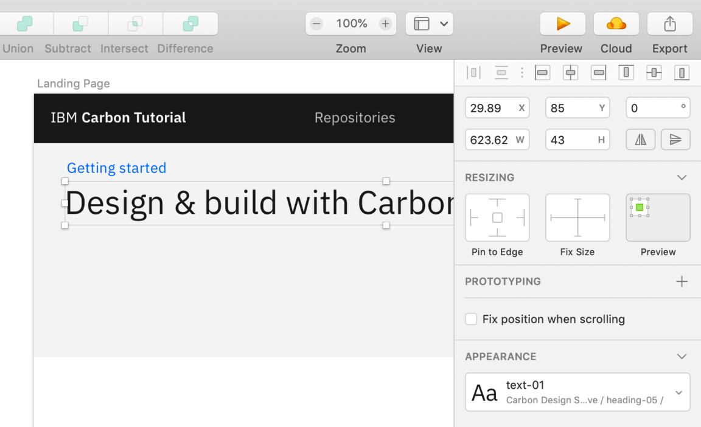
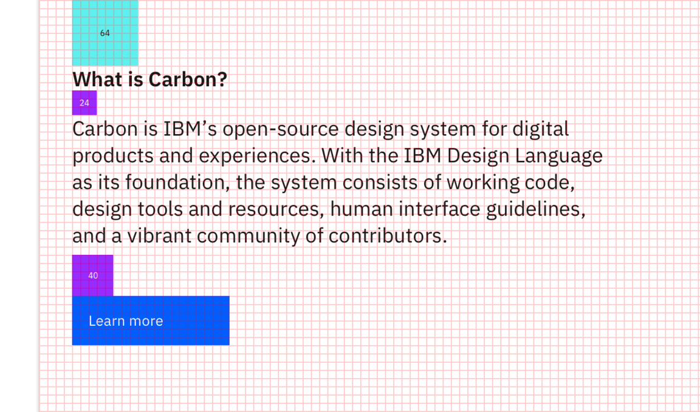

import Preview from 'components/Preview';

### Now that we have a base Angular app, it's time to build a few static pages. In this step, we'll become comfortable with the Carbon UI Shell, grid and various Carbon components.

<AnchorLinks>

<AnchorLink>Fork, clone and branch</AnchorLink>
<AnchorLink>Add UI Shell</AnchorLink>
<AnchorLink>Create pages</AnchorLink>
<AnchorLink>Add routing</AnchorLink>
<AnchorLink>Add grid</AnchorLink>
<AnchorLink>Add landing page grid</AnchorLink>
<AnchorLink>Build landing page</AnchorLink>
<AnchorLink>Style landing page</AnchorLink>
<AnchorLink>Add repo page grid</AnchorLink>
<AnchorLink>Build repo page</AnchorLink>
<AnchorLink>Style repo page</AnchorLink>
<AnchorLink>Submit pull request</AnchorLink>

</AnchorLinks>

## Preview

A [preview](https://angular-step-3-carbon-tutorial.netlify.com) of what you'll build:

<Preview
  height="400"
  title="Carbon Angular Tutorial Step 2"
  src="https://angular-step-3-carbon-tutorial.netlify.com"
  frameborder="no"
  allowtransparency="true"
  allowfullscreen={true}
  class="bx--iframe bx--iframe--border"
/>

_Note: If you get lint errors when you copy the code from the snippets, run_ `ng lint --fix` _to fix them._

## Fork, clone and branch

This tutorial has an accompanying GitHub repository called [carbon-tutorial-angular](https://github.com/carbon-design-system/carbon-tutorial-angular) that we'll use as a starting point for each step. If you haven't forked and cloned that repository yet, and haven't added the upstream remote, go ahead and do so by following the [step 1 instructions](/tutorial/angular/step-1#fork-clone--branch).

### Branch

With your repository all set up, let's check out the branch for this tutorial step's starting point.

```bash
git fetch upstream
git checkout -b angular-step-2 upstream/angular-step-2
```

_Note: This builds on top of step 1, but be sure to check out the upstream step 2 branch because it includes the static assets required to get through this step._

### Build and start app

Install the app's dependencies (in case you're starting fresh in your current directory and not continuing from the previous step):

```bash
npm install
```

Then, start the app:

```bash
npm run start
```

You should see something similar to where the [previous step](/tutorial/angular/step-1)) left off.

## Add UI Shell

Before we start adding new components, we want to begin developing with a clean app but still have the same configurations. So let's delete the starter-home directory and update the routing in `app-routing.module.ts` by removing the below block:

```javascript
{
  path: "",
  loadChildren: () => import("./starter-home/starter-home.module").then(m => m.StarterHomeModule)
},
```

Next, we're going to create an Angular component called `TutorialHeader` to use with the UI Shell Carbon component. Using Angular CLI we will create this component inside the `src/app` directory.

```bash
ng g module tutorial-header --lint-fix
ng g component tutorial-header/tutorial-header --lint-fix
```

##### Folder structure

```bash
src/app/tutorial-header
├── tutorial-header
│   ├── tutorial-header.component.html
│   ├── tutorial-header.component.scss
│   ├── tutorial-header.component.spec.ts
│   └── tutorial-header.component.ts
└── tutorial-header.module.ts
```

### Import UI Shell

Next we'll import our Carbon UI Shell components into `tutorial-header.module.ts` and `tutorial-header.component.spec.ts`. Also, make sure we import and export `TutorialHeaderComponent`. Set up the file like so:

##### src/tutorial-header/tutorial-header.module.ts

```javascript
import { NgModule } from '@angular/core';
import { CommonModule } from '@angular/common';
import { RouterModule } from '@angular/router';

import { TutorialHeaderComponent } from './tutorial-header/tutorial-header.component';

import { HeaderModule } from 'carbon-components-angular';

export {
  TutorialHeaderComponent,
} from './tutorial-header/tutorial-header.component';

@NgModule({
  declarations: [TutorialHeaderComponent],
  imports: [CommonModule, HeaderModule, RouterModule],
  exports: [TutorialHeaderComponent],
})
export class TutorialHeaderModule {}
```

##### src/tutorial-header/tutorial-header.component.spec.ts

```javascript
import { HeaderModule } from 'carbon-components-angular/ui-shell/ui-shell.module';
```

```javascript
declarations: [ TutorialHeaderComponent ],
imports: [ HeaderModule ]
```

_Note: you can find a description of the different components used in UI Shell in our [carbon-components-angular](https://github.com/IBM/carbon-components-angular/tree/master/src/ui-shell) package._

### Import icons

Now let's import the icons from our `@carbon/icons-angular` package. In `tutorial-header.module.ts` and `tutorial-header.component.spec.ts`, we need to import each individual icon we will use.

##### src/tutorial-header/tutorial-header.module.ts,

##### src/tutorial-header/tutorial-header/tutorial-header.component.spec.ts

```javascript
import { Notification20Module } from '@carbon/icons-angular/lib/notification/20';
import { UserAvatar20Module } from '@carbon/icons-angular/lib/user--avatar/20';
import { AppSwitcher20Module } from '@carbon/icons-angular/lib/app-switcher/20';
```

```javascript
imports: [Notification20Module, UserAvatar20Module, AppSwitcher20Module];
```

Then we need to add the template code. Populate `tutorial-header.component.html` with:

##### src/tutorial-header/tutorial-header.component.html

```html
<ibm-header name="Carbon Tutorial Angular">
  <ibm-header-navigation ariaLabel="Carbon Tutorial Angular">
    <ibm-header-item href="/repos">Repositories</ibm-header-item>
  </ibm-header-navigation>
  <ibm-header-global>
    <ibm-header-action title="action">
      <ibm-icon-notification20
        innerClass="header-icon"
      ></ibm-icon-notification20>
    </ibm-header-action>
    <ibm-header-action title="action">
      <ibm-icon-user-avatar20 innerClass="header-icon"></ibm-icon-user-avatar20>
    </ibm-header-action>
    <ibm-header-action title="action">
      <ibm-icon-app-switcher20
        innerClass="header-icon"
      ></ibm-icon-app-switcher20>
    </ibm-header-action>
  </ibm-header-global>
</ibm-header>
```

And we will add some styling as well in `styles.scss`

##### src/styles.scss

```scss
.header-icon {
  fill: white;
}
```

Next import the tutorial-header module in `app.module.ts` and `app.component.spec.ts` and add the component in `app.component.html`

##### src/app/app.module.ts,

##### src/app/app.component.spec.ts

```javascript
import { TutorialHeaderModule } from './tutorial-header/tutorial-header.module';
```

```javascript
imports: [TutorialHeaderModule];
```

##### src/app/app.component.html

```html
<app-tutorial-header></app-tutorial-header>
<main class="main">
  <router-outlet></router-outlet>
</main>
```

And we will add some styling as well in `app.component.scss`

##### src/app/app.component.scss

```scss
.main {
  margin: 40px 0 0 -7px;
}
```

## Create pages

Next thing we need to do is create the files for our content. These files will be located in the `app` folder inside of `src`. It should be a sibling of `tutorial-header`.

Our app will have two pages. First, we need a landing page. Let's start by running these commands:

```bash
ng g module home --routing --lint-fix
ng g component home/landing-page --lint-fix
```

##### Folder structure

```bash
src/home
├── home
│   ├── landing-page.component.html
│   ├── landing-page.component.scss
│   ├── landing-page.component.spec.ts
│   └── landing-page.component.ts
├── home-routing.module.ts
└── home-page.module.ts
```

And a repo page:

```bash
ng g module repositories --routing --lint-fix
ng g component repositories/repo-page --lint-fix
```

##### Folder structure

```bash
src/repositories
├── repositories
│   ├── repo-page.component.html
│   ├── repo-page.component.scss
│   ├── repo-page.component.spec.ts
│   └── repo-page.component.ts
├── repositories-routing.module.ts
└── repositories.module.ts
```

## Add routing

We need to update routing functionality to enable the loading of `repositories`. Inside `app-routing.module.ts` we'll add the following code in the routes array:

##### src/app-routing.module.ts

```javascript
const routes: Routes = [
  {
    path: '',
    loadChildren: () => import('./home/home.module').then(m => m.HomeModule),
  },
  {
    path: 'repos',
    loadChildren: () =>
      import('./repositories/repositories.module').then(
        m => m.RepositoriesModule
      ),
  },
  {
    path: '',
    redirectTo: '',
    pathMatch: 'full',
  },
];
```

And add routes for the landing and repo pages:

##### src/app/home/home-routing.module.ts

```javascript
import { LandingPageComponent } from './landing-page/landing-page.component';

const routes: Routes = [
  {
    path: '',
    component: LandingPageComponent,
  },
];
```

##### src/app/repositories/repositories-routing.module.ts

```javascript
import { RepoPageComponent } from './repo-page/repo-page.component';

const routes: Routes = [
  {
    path: '',
    component: RepoPageComponent,
  },
];
```

After that we need to do a couple quick fixes to the UI Shell to have it route to the repo page.

##### src/tutorial-header/tutorial-header.component.html

```html
<ibm-header-item routerLink="/repos">Repositories</ibm-header-item>
```

You should now have a working header that routes to the repos pages without full page reload!

## Add grid

In our last step we added our styles, components and icon packages. Now we are going to build the pages with the grid component.

In `styles.scss`, we need to configure our grid to use 16 columns instead of the default 12 columns. We do this by adding `grid-columns-16: true` in our `$feature-flags`.

##### src/styles.scss

```css
$feature-flags: (
  grid-columns-16: true,
  css--body: false,
  // we're providing our own body styles
    css--reset: false // prevent thousands of resets being included...
);
```

Next we'll import our Carbon grid component into `home.module.ts` and `landing-page.component.spec.ts`.

##### src/home/home.module.ts,

##### src/home/landing-page/landing-page.component.spec.ts

```javascript
import { GridModule } from 'carbon-components-angular';
```

```javascript
imports: [GridModule];
```

## Add landing page grid

Let's add our grid elements to `landing-page.component.html`.

In order to use the grid, we need to wrap everything in a `<div ibmGrid>`. We can continue to make rows by adding a `<div ibmRow>` inside the grid, as well as make columns within those rows by adding `<div ibmCol [columnNumbers]="{'[breakpoint]': [size]}`.

Our column sizes are specified by the number of columns they'll be spanning. If we use `[columnNumbers]="{'lg': 4}"`, it means it'll span 4 of the 16 columns. If we use `[columnNumbers]="{'lg': 8}"` it means it'll span 8 of the 16 columns, and so on.

We've included the designs for this tutorial app in the `design.sketch` file found as a top-level file in the `carbon-tutorial-angular` repository. But, if you don't have Sketch installed and available to inspect the design, we provide screenshots.


<Caption>Landing page grid</Caption>

_Pro tip:_ `CTRL-L` _toggles the layout in Sketch._

We'll break this down into three rows. The first row with the gray background doesn't appear to need any columns. The second row with the white background looks like it has two columns of different widths. The third row with the gray background looks like it has four columns of equal width.

We'll make rows like so:

##### src/home/landing-page/landing-page.component.html

```html
<div ibmGrid class="bx--grid--full-width landing-page">
  <div ibmRow class="landing-page__banner">
    <div ibmCol [columnNumbers]="{'lg': 16}">1</div>
  </div>
  <div ibmRow class="landing-page__r2">
    <div ibmCol [columnNumbers]="{'md': 4, 'lg': 7}">7/16</div>
    <div ibmCol class="bx--offset-lg-1" [columnNumbers]="{'md': 4, 'lg': 7}">
      8/16
    </div>
  </div>
  <div ibmRow class="landing-page__r3">
    <div ibmCol [columnNumbers]="{'md': 4, 'lg': 4}">1/4</div>
    <div ibmCol [columnNumbers]="{'md': 4, 'lg': 4}">1/4</div>
    <div ibmCol [columnNumbers]="{'md': 4, 'lg': 4}">1/4</div>
    <div ibmCol [columnNumbers]="{'md': 4, 'lg': 4}">1/4</div>
  </div>
</div>
```

We added a class of `bx--grid--full-width` to the grid container since our rows need to expand the whole page without any margins. We also added some custom classes like `landing-page`, `landing-page__banner`, `landing-page__r2`, etc., which we will use later.

Also, take notice of the second row. The tab content only covers 7 columns at this large viewport to prevent overly-large line lengths, so we needed to add a 1 column offset `bx--offset-lg-1` to the second column to fill the full 16 columns in the grid. Then, both of those columns have `'md': 4` so they are of equal width at medium-sized viewports.

## Build landing page

We'll start adding HTML elements and components by row.

### First row

In our first row we'll need a `Breadcrumb` component. First, let's import the components we need in `home.module.ts` and `landing-page.component.spec.ts`.

##### src/home/home.module.ts,

##### src/home/landing-page/landing-page.component.spec.ts

```javascript
import { BreadcrumbModule, GridModule } from 'carbon-components-angular';
```

```javascript
imports: [BreadcrumbModule, GridModule];
```

We can now add our component to the first row, along with a header, like so:

##### src/home/landing-page/landing-page.component.html

```html
<div ibmRow class="landing-page__banner">
  <div ibmCol [columnNumbers]="{'lg': 16}">
    <ibm-breadcrumb noTrailingSlash="true">
      <ibm-breadcrumb-item href="/">
        Getting started
      </ibm-breadcrumb-item>
    </ibm-breadcrumb>
    <h1 class="landing-page__heading">
      Design &amp; build with Carbon
    </h1>
  </div>
</div>
```

You may notice that the styles look off. Don't worry, we'll fix these later.

### Second row

In our second row we'll need `Tabs` and `Button` components also in `home.module.ts` and `landing-page.component.spec.ts`. We'll update the `carbon-components-angular` import to:

##### src/home/home.module.ts,

##### src/home/landing-page/landing-page.component.spec.ts

```javascript
import {
  BreadcrumbModule,
  ButtonModule,
  GridModule,
  TabsModule,
} from 'carbon-components-angular';
```

```javascript
imports: [BreadcrumbModule, ButtonModule, GridModule, TabsModule];
```

Now we need to modify the second row to use the `Tab` component.

##### src/home/landing-page/landing-page.component.html

```html
<div ibmRow class="landing-page__r2">
  <div ibmCol class="bx--no-gutter">
    <ibm-tabs>
      <ibm-tab heading="About">
        <div ibmGrid class="bx--grid--no-gutter bx--grid--full-width">
          <div ibmRow class="landing-page__tab-content">
            <div ibmCol [columnNumbers]="{'md': 4, 'lg': 7}">7/16</div>
            <div
              ibmCol
              class="bx--offset-lg-1"
              [columnNumbers]="{'md': 4, 'lg': 8}"
            >
              8/16
            </div>
          </div>
        </div>
      </ibm-tab>
      <ibm-tab heading="Design">
        <div ibmGrid class="bx--grid--no-gutter bx--grid--full-width">
          <div ibmRow class="landing-page__tab-content">
            <div ibmCol [columnNumbers]="{'lg': 16}">
              Rapidly build beautiful and accessible experiences. The Carbon kit
              contains all resources you need to get started.
            </div>
          </div>
        </div>
      </ibm-tab>
      <ibm-tab heading="Develop">
        <div ibmGrid class="bx--grid--no-gutter bx--grid--full-width">
          <div ibmRow class="landing-page__tab-content">
            <div ibmCol [columnNumbers]="{'lg': 16}">
              Carbon provides styles and components in Vanilla, React, Angular,
              and Vue for anyone building on the web.
            </div>
          </div>
        </div>
      </ibm-tab>
    </ibm-tabs>
  </div>
</div>
```

_Note: We're using the grid for the page layout, but we also need to apply the grid within the tab content. When doing so, make sure the nested grid has the expected_ `grid` _>_ `row` _>_ `col` _DOM structure._

Hold up! If you were to run [DAP](https://www.ibm.com/able/dynamic-assessment-plug-in.html) to check for accessibility violations, you'd see `Multiple navigation landmarks must have unique labels specified with aria-label or aria-labelledby` because both the `Breadcrumb` and `Tabs` components use `<nav>` elements. To fix, add `aria-label` to the `Breadcrumb` opening tag:

<!-- prettier-ignore-start -->
```html
<ibm-breadcrumb noTrailingSlash="true" ariaLabel="Page navigation">
```
<!-- prettier-ignore-end -->

Same goes for the `Tabs` opening tag:

<!-- prettier-ignore-start -->
```html
<ibm-tabs ariaLabel="Tab navigation">
```
<!-- prettier-ignore-end -->

Next, we'll need to add a styling override to move the tabs to the right on large viewports. Create a file `carbon-overrides.scss` in `src/assets` with this declaration block.

##### src/assets/carbon-overrides.scss

```scss
.landing-page__r2 .bx--tabs__nav {
  right: 0;
}
```

Then in `styles.scss` add this import at the top of the file.

##### src/styles.scss

```scss
@import './assets/carbon-overrides.scss';
```

_Note: We don't have to include this in a separate file, but it's nice to keep overrides separate from your application's styling so when migrating to future Carbon versions and if there are breaking changes via different class names, you have a consolidated list of styling declaration blocks to review._

We can now add our images and text for each column in the first `Tab` in `landing-page.component.html`.

##### src/home/landing-page/landing-page.component.html

<!-- prettier-ignore-start -->
```html
<ibm-tab heading="About">
  <div ibmGrid class="bx--grid--no-gutter bx--grid--full-width">
    <div ibmRow class="landing-page__tab-content">
      <div ibmCol [columnNumbers]="{'md': 4, 'lg': 7}">
        <h2 class="landing-page__subheading">
          What is Carbon?
        </h2>
        <p class="landing-page__p">
          Carbon is IBM’s open-source design system for digital
          products and experiences. With the IBM Design Language
          as its foundation, the system consists of working code,
          design tools and resources, human interface guidelines,
          and a vibrant community of contributors.
        </p>
        <button ibmButton>Learn more</button>
      </div>
      <div ibmCol class="bx--offset-lg-1" [columnNumbers]="{'md': 4, 'lg': 8}">
        
      </div>
    </div>
  </div>
</ibm-tab>
```
<!-- prettier-ignore-end -->

Now let's download the image in `src/assests` and set the image size in `landing-page.component.scss`:

```bash
curl -o tab-illo.png https://raw.githubusercontent.com/carbon-design-system/carbon-tutorial-vue/vue-step-3/src/assets/tab-illo.png
```

##### src/home/landing-page/landing-page.component.scss

```scss
.landing-page__illo {
  max-width: 100%;
}
```

Assuming that the second and third tab would have a similar design, we would set them up in the same way. However, since our design specs don't show those tabs, we'll leave the code as is.

### Third row

The third row will be created in a later tutorial, so we'll just add the headers for now.

##### src/home/landing-page/landing-page.component.html

```html
<div ibmRow class="landing-page__r3">
  <div ibmCol [columnNumbers]="{'md': 4, 'lg': 4}">
    <h3 class="landing-page__label">The Principles</h3>
  </div>
  <div ibmCol [columnNumbers]="{'md': 4, 'lg': 4}">Carbon is Open</div>
  <div ibmCol [columnNumbers]="{'md': 4, 'lg': 4}">Carbon is Modular</div>
  <div ibmCol [columnNumbers]="{'md': 4, 'lg': 4}">Carbon is Consistent</div>
</div>
```

## Style landing page

We've added basic layout styles in `landing-page.component.scss` and `styles.scss`, so now let's add type, color and spacing styles to match the design. We'll be using our [spacing tokens](https://www.carbondesignsystem.com/guidelines/spacing). In `landing-page.component.scss`, add these imports at the **top** of the file so we can use Carbon breakpoints, tokens, and typography Sass mixins and functions:

##### src/home/landing-page/landing-page.component.scss

```scss
@import '~carbon-components/scss/globals/scss/vendor/@carbon/type/scss/font-family';
@import '~carbon-components/scss/globals/scss/typography';
```

### Banner

<Row>
<Column colLg={8}>


<Caption>Banner vertical spacing</Caption>

</Column>
</Row>

_Pro tip:_ `CTRL-G` _toggles the grid in Sketch._

Now, we need to add a space above the breadcrumb and below the heading. For that, add:

##### src/home/landing-page/landing-page.component.scss

```scss
.landing-page__banner {
  padding-top: $spacing-05;
  padding-bottom: $spacing-07 * 4;
}
```

Referencing the [spacing token table](https://www.carbondesignsystem.com/guidelines/spacing#spacing-scale), `16px` can be set with the `$spacing-05` token. The design calls for `128px` of space below the heading and that's not in the spacing scale, we can achieve that in Sass by multiplying 32px (`$spacing-07`) by 4. We could use `128px` or `8rem` directly in our styling, but using our tokens preserves consistency should the token values get updated in the future.

Looking at the design, we need a wall-to-wall light gray background behind the banner and also behind the third row. This is a great opportunity to use a Sass mixin. We will put this at the top of `landing-page.component.scss`.

Per the design we need to use Gray 10 for our banner background color, which can be set with the `$ui-01` [color token](https://www.carbondesignsystem.com/guidelines/color/usage). Also, we want the background to extend into the grid's outermost gutters to go the full width of the viewport, so given the DOM structure, we can achieve that by setting the background in an absolutely positioned pseudo element.

##### src/home/landing-page/landing-page.component.scss

```scss
@mixin landing-page-background() {
  background-color: $ui-01;
  position: relative;

  &::before {
    content: '';
    position: absolute;
    left: -$spacing-05;
    top: 0;
    right: -$spacing-05;
    bottom: 0;
    background: $ui-01;
    z-index: -1;
  }
}
```

Now to use the new mixin, update the `.landing-page__banner` declaration block to:

##### src/home/landing-page/landing-page.component.scss

```scss
.landing-page__banner {
  padding-top: $spacing-05;
  padding-bottom: $spacing-07 * 4;
  @include landing-page-background;
}
```

Next, we can see that the `h1` is using the `heading-05` type token.

<Row>
<Column colLg={8}>



<Caption>Banner heading type</Caption>

</Column>
</Row>

The Sketch symbol naming is consistent with the development Sass tokens to help translate design to development. So, looking up the [type token](https://www.carbondesignsystem.com/guidelines/typography/productive), we know to use `productive-heading-05`:

##### src/home/landing-page/landing-page.component.scss

```scss
.landing-page__heading {
  @include carbon--type-style('productive-heading-05');
}
```

### Row two

For our second row, we need to fix the tabs vertical positioning to match the design. By inspecting the tabs component, you can see that the tab height computes to `40px`. We can use that to create our negative top margin in rem units.

##### src/home/landing-page/landing-page.component.scss

```scss
.landing-page__r2 {
  margin-top: rem(-40px);
}
```

We also need to adjust our vertical spacing and type treatment. Like before, it's a matter of using spacing and type tokens like so:

<Row>
<Column colLg={8}>



<Caption>Row 2 vertical spacing</Caption>

</Column>
</Row>

_Note: You may be wondering why there are vertical gaps between the type and spacers. Each type token has a line height that's suited for its font size. The vertical spacers adjacently touch the line height boundaries and not the baseline, for consistency as well as development ease so_ `margins` _and_ `paddings` _don't need to offset line heights._

##### src/home/landing-page/landing-page.component.scss

```scss
.landing-page__tab-content {
  padding-top: $layout-05;
  padding-bottom: $layout-05;
}

.landing-page__subheading {
  @include carbon--type-style('productive-heading-03');
  @include carbon--font-weight('semibold');
}

.landing-page__p {
  @include carbon--type-style('productive-heading-03');
  margin-top: $spacing-06;
  margin-bottom: $spacing-08;

  @include carbon--breakpoint-between((320px + 1), md) {
    max-width: 75%;
  }
}
```

### Row three

<Row>
<Column colLg={8}>


<Caption>Row 3 vertical spacing</Caption>

</Column>
</Row>

Let's also add some styles for the last row, even though that will get used later in the tutorial. You'll notice that we get to re-use the `landing-page-background` mixin that we just created.

##### src/home/landing-page/landing-page.component.scss

```scss
.landing-page__r3 {
  padding-top: $spacing-09;
  padding-bottom: $spacing-09;
  @include landing-page-background;
}

.landing-page__label {
  @include carbon--type-style('heading-01');
}
```

Ta-da! You should see a finished landing page! Now we can move on to the repo page.

## Add repo page grid

First, we’ll add our grid and table by importing a few components in `repositories.module.ts` and `repo-page.component.spec.ts`:

##### src/repositories/repositories.module.ts,

##### src/repositories/repo-page/repo-page.component.spec.ts

```javascript
import { GridModule, TableModule } from 'carbon-components-angular';
```

```javascript
imports: [GridModule, TableModule];
```

Now in our `repo-page.component.html` we will add our grid containers.

##### src/repositories/repo-page/repo-page.component.html

```html
<div ibmGrid class="bx--grid--full-width bx--grid--no-gutter repo-page">
  <div ibmRow class="repo-page__r1">
    <div ibmCol [columnNumbers]="{'lg': 16}">Data table will go here</div>
  </div>
</div>
```

## Build repo page

We currently have the `repo-page` that just contains a grid and placeholder content for the time being. In the next tutorial step we're going to be querying an API to populate the `Table` component in this page. As a best practice to separate data fetching from the presentation components, go ahead and create a `repo-table` component as a sibling to `repo-page`.

```bash
ng g component repositories/repo-table --lint-fix
```

##### Folder structure

```bash
src/repositories
├── repo-table.component.html
├── repo-table.component.scss
├── repo-table.component.spec.ts
└── repo-table.component.ts
```

Next we will add our newly generated repo-table to the declarations in `repo-page.component.spec.ts`

##### src/repositories/repo-page/repo-page.component.spec.ts

```javascript
import { RepoTableComponent } from '../repo-table/repo-table.component';
```

```javascript
declarations: [ RepoPageComponent, RepoTableComponent ],
```

### Build data table

Then, let's create the table in `repo-table.component.html`

##### src/repositories/repo-table/repo-table.component.html

<!-- prettier-ignore-start -->
```html
<ibm-table-container>
	<ibm-table-header>
		<h4 ibmTableHeaderTitle>Carbon Repositories</h4>
		<p ibmTableHeaderDescription>A collection of public Carbon repositories.</p>
	</ibm-table-header>
	<ibm-table
		[model]="model"
		[showSelectionColumn]="false"
		[striped]="false">
	</ibm-table>
</ibm-table-container>
```
<!-- prettier-ignore-end -->

Instead of the usual write-your-own-html approach you had with `<table>`, Carbon table uses the model-view-controller approach.

Here, you create a view (with built-in controller) and provide it a model. Changes you make to the model are reflected in the view.

### Render data table

Then include the following arrays to pass into the `repo-table.component.ts` component. We'll be setting the `rows` array from an API in the next tutorial step, but for now, static example rows will suffice.

##### src/repositories/repo-table/repo-table.component.ts

```javascript
import { Component, OnInit } from "@angular/core";

import {
  TableModel,
  TableItem,
  TableHeaderItem
} from "carbon-components-angular";

@Component({
  selector: "app-repo-table",
  templateUrl: "./repo-table.component.html",
  styleUrls: ["./repo-table.component.scss"]
})
export class RepoTableComponent implements OnInit {
  model = new TableModel();

  constructor() { }

  ngOnInit() {
    this.model.data = [
      [
        new TableItem({data: "Repo 1", expandedData: "Row description"}),
        new TableItem({data: "Date"}),
        new TableItem({data: "Date"}),
        new TableItem({data: "123"}),
        new TableItem({data: "456"}),
        new TableItem({data: "Links"})
      ],
      [
        new TableItem({data: "Repo 2", expandedData: "Row description"}}),
        new TableItem({data: "Date"}),
        new TableItem({data: "Date"}),
        new TableItem({data: "123"}),
        new TableItem({data: "456"}),
        new TableItem({data: "Links"})
      ],
      [
        new TableItem({data: "Repo 3", expandedData: "Row description"}}),
        new TableItem({data: "Date"}),
        new TableItem({data: "Date"}),
        new TableItem({data: "123"}),
        new TableItem({data: "456"}),
        new TableItem({data: "Links"})
      ]
    ];
    this.model.header = [
      new TableHeaderItem({data: "Name"}),
      new TableHeaderItem({data: "Created"}),
      new TableHeaderItem({data: "Updated"}),
      new TableHeaderItem({data: "Open Issues"}),
      new TableHeaderItem({data: "Stars"}),
      new TableHeaderItem({data: "Links"})
    ];
  }
}
```

At this point, go to `repo-page.component.html` because now we need to render a static `repo-table`.

##### src/repositories/repo-page/repo-page.component.html

```html
<div ibmGrid class="bx--grid--full-width bx--grid--no-gutter repo-page">
  <div ibmRow class="repo-page__r1">
    <div ibmCol [columnNumbers]="{'lg': 16}">
      <app-repo-table></app-repo-table>
    </div>
  </div>
</div>
```

## Style repo page

Our styles for the repo page are mostly fine. We just need to update a few vertical spacing issues.

In `repo-page.component.scss`, add the following styles:

##### src/repositories/repo-page/repo-page.component.ts

```scss
@import '~carbon-components/scss/globals/scss/typography';

.repo-page .bx--row {
  padding-top: $spacing-05;
  padding-bottom: $spacing-05;
}
```

Congratulations! We've now created our static repo page!

## Submit pull request

We're going to submit a pull request to verify completion of this tutorial step.

### Continuous integration (CI) check

Run the `lint` and `test` scripts to make sure we're all set to submit a pull request.

```bash
npm run lint && npm test
```

_Note: Having issues running this? [Step 1](</tutorial/angular/step-1#continuous-integration-(ci)-check>) has troubleshooting notes that may help._

### Git commit and push

Before we can create a pull request, stage and commit all of your changes:

```bash
git add --all && git commit -m "feat(tutorial): complete step 2"
```

Then, push to your repository:

```bash
git push origin Angular-step-2
```

_Note: Having issues pushing your changes? [Step 1](/tutorial/angular/step-1#git-commit-and-push) has troubleshooting notes that may help._

### Pull request (PR)

Finally, visit [carbon-tutorial-angular](https://github.com/carbon-design-system/carbon-tutorial-angular) to "Compare & pull request". In doing so, make sure that you are comparing to `angular-step-2` into `base: angular-step-2`.

_Note: Expect your tutorial step PRs to be reviewed by the Carbon team but not merged. We'll close your PR so we can keep the repository's remote branches pristine and ready for the next person!_
