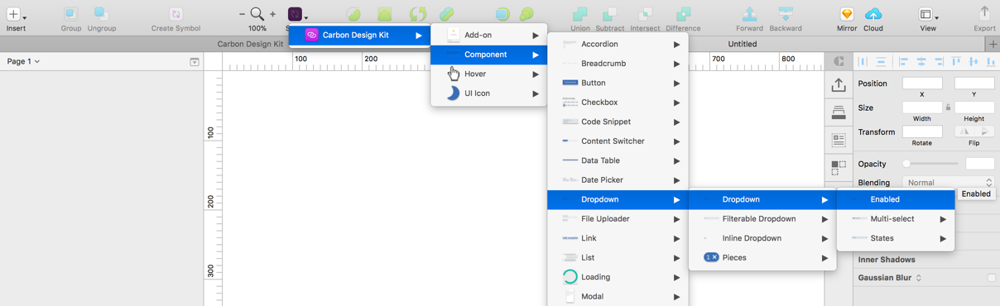
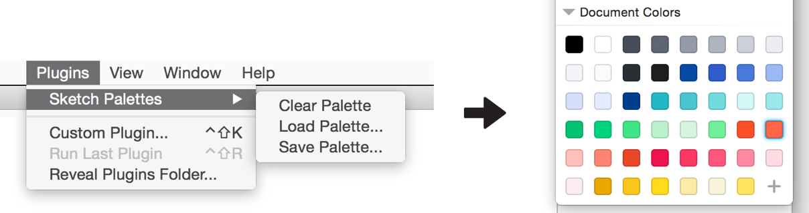
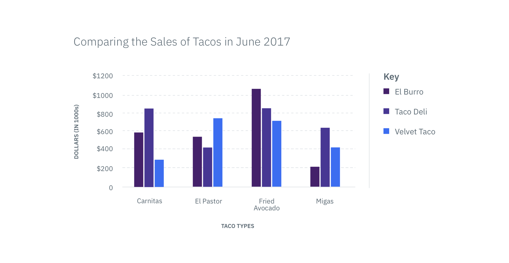
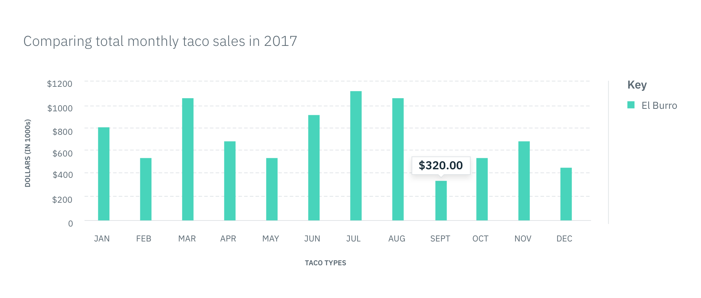

## October 2019

### @carbon/colors@10.5.0

#### New features
- feat(colors): update colors to match V2 palette  (#3957) ([`ed202f8f6`](https://github.com/carbon-design-system/carbon/commit/ed202f8f6))

#### Housekeeping
- chore(release): update package versions (#4265) ([`346e93543`](https://github.com/carbon-design-system/carbon/commit/346e93543))
- chore(release): update package versions (#4262) ([`8983ed788`](https://github.com/carbon-design-system/carbon/commit/8983ed788))
- chore(colors): add color palette source files (#4206) ([`4d1781eee`](https://github.com/carbon-design-system/carbon/commit/4d1781eee))
- chore(release): update package versions (#4139) ([`1a435757c`](https://github.com/carbon-design-system/carbon/commit/1a435757c))

### carbon-components@10.7.0

#### New features
- feat(toggle): add aria-label and label text props to skeletons (#4204) ([`fef8eb9f4`](https://github.com/carbon-design-system/carbon/commit/fef8eb9f4))
- feat(components,themes): add enable-css-custom-properties feature flag (#4100) ([`d8d93e366`](https://github.com/carbon-design-system/carbon/commit/d8d93e366))
- feat(themes): update build step to emit prefixed custom properties ([`0b0599e6e`](https://github.com/carbon-design-system/carbon/commit/0b0599e6e))
- feat(file-uploader): add drop and drop file uploader (#3873) ([`0074e2219`](https://github.com/carbon-design-system/carbon/commit/0074e2219))
- feat(link): introduce inline variant (#3859) ([`f167fd6fb`](https://github.com/carbon-design-system/carbon/commit/f167fd6fb))
- feat(FileUploader): add drag and drop file uploader (#3872) ([`8a4fae72c`](https://github.com/carbon-design-system/carbon/commit/8a4fae72c))
- feat(floating-menu): add focus wrap element to components (#3652) ([`34d1fddcf`](https://github.com/carbon-design-system/carbon/commit/34d1fddcf))
- feat(TooltipIcon): port vanilla WCAG 2.1 fixes (#3842) ([`aeacad436`](https://github.com/carbon-design-system/carbon/commit/aeacad436))

#### Bug fixes
- fix(components): make sure font weight is loaded (#4160) ([`f73d62a81`](https://github.com/carbon-design-system/carbon/commit/f73d62a81))
- fix(dropdown): update overflow style rules for ie, edge, and safari support (#4132) ([`a48e6bd66`](https://github.com/carbon-design-system/carbon/commit/a48e6bd66))
- fix(accordion): top align accordion headings (#4125) ([`1974a1e86`](https://github.com/carbon-design-system/carbon/commit/1974a1e86))
- fix(components): call carbon--theme to keep themes in sync ([`14cbc219d`](https://github.com/carbon-design-system/carbon/commit/14cbc219d))
- fix(modal): use focus theme token for close button border color on focus (#4078) ([`d96efd6d5`](https://github.com/carbon-design-system/carbon/commit/d96efd6d5))
- fix(button): add higher contrast danger button color token to all themes (#4037) ([`7c8fd431a`](https://github.com/carbon-design-system/carbon/commit/7c8fd431a))
- fix(toggle): update colors (#4038) ([`9ac1eef87`](https://github.com/carbon-design-system/carbon/commit/9ac1eef87))
- fix(button): vertically align to top by default (#3983) ([`06b15f3c6`](https://github.com/carbon-design-system/carbon/commit/06b15f3c6))
- fix(date-picker): update month UI upon manual input (#3979) ([`cccb54c56`](https://github.com/carbon-design-system/carbon/commit/cccb54c56))
- fix(form): remove italic from helper text (#3977) ([`dfbeb8dce`](https://github.com/carbon-design-system/carbon/commit/dfbeb8dce))
- fix(dropdown): restore space bar and enter key item selection (#3926) ([`fc2277328`](https://github.com/carbon-design-system/carbon/commit/fc2277328))
- fix(skeleton): disable motion if prefers-reduced-motion is true (#3905) ([`d9aede10e`](https://github.com/carbon-design-system/carbon/commit/d9aede10e))
- fix(notification): fix low contrast markup (#3899) ([`95e02b98b`](https://github.com/carbon-design-system/carbon/commit/95e02b98b))

#### Documentation
- docs(migration): update scss migration guide links (#4140) ([`b2636f786`](https://github.com/carbon-design-system/carbon/commit/b2636f786))
- docs(components): remove sassdoc annotation (#3916) ([`884c2985c`](https://github.com/carbon-design-system/carbon/commit/884c2985c))

#### Housekeeping
- chore(release): update package versions (#4265) ([`346e93543`](https://github.com/carbon-design-system/carbon/commit/346e93543))
- chore(release): update package versions (#4262) ([`8983ed788`](https://github.com/carbon-design-system/carbon/commit/8983ed788))
- chore(release): update package versions (#4139) ([`1a435757c`](https://github.com/carbon-design-system/carbon/commit/1a435757c))
- test(components): update snapshots ([`319b58952`](https://github.com/carbon-design-system/carbon/commit/319b58952))
- chore(project): sync generated files ([`f65266835`](https://github.com/carbon-design-system/carbon/commit/f65266835))
- chore(project): check-in generated files ([`9dab26827`](https://github.com/carbon-design-system/carbon/commit/9dab26827))
- refactor(components): update test formatting ([`59f999862`](https://github.com/carbon-design-system/carbon/commit/59f999862))
- chore(project): remove custom eslint rules (#4027) ([`58833d0bc`](https://github.com/carbon-design-system/carbon/commit/58833d0bc))
- chore: removes dashed outline from modal close in firefox (#3984) ([`8de0efcaf`](https://github.com/carbon-design-system/carbon/commit/8de0efcaf))
- chore(data-table): mark sticky header experimental (#3949) ([`11b87ab01`](https://github.com/carbon-design-system/carbon/commit/11b87ab01))
- chore(react): update storybook and react (#3891) ([`548a04168`](https://github.com/carbon-design-system/carbon/commit/548a04168))

### @carbon/elements@10.7.0

#### New features
- feat(components,themes): add enable-css-custom-properties feature flag (#4100) ([`d8d93e366`](https://github.com/carbon-design-system/carbon/commit/d8d93e366))

#### Bug fixes
- fix(form): remove italic from helper text (#3977) ([`dfbeb8dce`](https://github.com/carbon-design-system/carbon/commit/dfbeb8dce))

#### Housekeeping
- chore(release): update package versions (#4265) ([`346e93543`](https://github.com/carbon-design-system/carbon/commit/346e93543))
- chore(release): update package versions (#4262) ([`8983ed788`](https://github.com/carbon-design-system/carbon/commit/8983ed788))
- chore(release): update package versions (#4139) ([`1a435757c`](https://github.com/carbon-design-system/carbon/commit/1a435757c))
- chore(project): sync generated files ([`f65266835`](https://github.com/carbon-design-system/carbon/commit/f65266835))
- chore(project): check-in generated files ([`9dab26827`](https://github.com/carbon-design-system/carbon/commit/9dab26827))

### @carbon/pictograms-react@10.7.0

#### Bug fixes
- fix: update pictograms dep (#4105) ([`fc1dde65f`](https://github.com/carbon-design-system/carbon/commit/fc1dde65f))

#### Housekeeping
- chore(release): update package versions (#4265) ([`346e93543`](https://github.com/carbon-design-system/carbon/commit/346e93543))
- chore(release): update package versions (#4139) ([`1a435757c`](https://github.com/carbon-design-system/carbon/commit/1a435757c))
- chore: make pictogram packages public (#4098) ([`ca4b18e00`](https://github.com/carbon-design-system/carbon/commit/ca4b18e00))

### `@carbon/pictograms@10.7.0`

#### New features
- feat(pictograms): add pictograms and update metadata (#4041) ([`a8379f7d8`](https://github.com/carbon-design-system/carbon/commit/a8379f7d8))

#### Bug fixes
- fix(pictograms): Update metadata.yml (#4093) ([`31e74266f`](https://github.com/carbon-design-system/carbon/commit/31e74266f))

#### Housekeeping
- chore(release): update package versions (#4265) ([`346e93543`](https://github.com/carbon-design-system/carbon/commit/346e93543))
- chore(release): update package versions (#4139) ([`1a435757c`](https://github.com/carbon-design-system/carbon/commit/1a435757c))
- chore(pictograms): update metadata for milan and mexico-city as… (#4102) ([`10378d578`](https://github.com/carbon-design-system/carbon/commit/10378d578))
- chore: make pictogram packages public (#4098) ([`ca4b18e00`](https://github.com/carbon-design-system/carbon/commit/ca4b18e00))

### `carbon-components-react@7.7.0`

#### New features
- feat(toggle): add aria-label and label text props to skeletons (#4204) ([`fef8eb9f4`](https://github.com/carbon-design-system/carbon/commit/fef8eb9f4))
- feat(components,themes): add enable-css-custom-properties feature flag (#4100) ([`d8d93e366`](https://github.com/carbon-design-system/carbon/commit/d8d93e366))
- feat(tile): support ignoring click events (#4059) ([`1c7ad53b4`](https://github.com/carbon-design-system/carbon/commit/1c7ad53b4))
- feat(ui-shell): add alternative behaviours (#3990) ([`a53796102`](https://github.com/carbon-design-system/carbon/commit/a53796102))
- feat: add Carbon theme switcher to React storybook (#3989) ([`9f2894f29`](https://github.com/carbon-design-system/carbon/commit/9f2894f29))
- feat(TooltipDefinition): support custom trigger element class names (#3995) ([`59d0e3cdc`](https://github.com/carbon-design-system/carbon/commit/59d0e3cdc))
- feat(link): introduce inline variant (#3859) ([`f167fd6fb`](https://github.com/carbon-design-system/carbon/commit/f167fd6fb))
- feat(TooltipIcon): auto generate default IDs (#3954) ([`a18e7348f`](https://github.com/carbon-design-system/carbon/commit/a18e7348f))
- feat(data-table): add sticky header to React data table (#3876) ([`9b8a4619f`](https://github.com/carbon-design-system/carbon/commit/9b8a4619f))
- feat(FileUploader): add drag and drop file uploader (#3872) ([`8a4fae72c`](https://github.com/carbon-design-system/carbon/commit/8a4fae72c))
- feat(TooltipIcon): port vanilla WCAG 2.1 fixes (#3842) ([`aeacad436`](https://github.com/carbon-design-system/carbon/commit/aeacad436))

#### Bug fixes
- fix(accordion): top align accordion headings (#4125) ([`1974a1e86`](https://github.com/carbon-design-system/carbon/commit/1974a1e86))
- fix(DatePicker): improve keyboard navigation (#4101) ([`40da1fade`](https://github.com/carbon-design-system/carbon/commit/40da1fade))
- fix(tooltip): conditionally set aria-describedby on open (#4110) ([`39640c529`](https://github.com/carbon-design-system/carbon/commit/39640c529))
- fix(icon-build-helpers): remove convertPathData minification ru… (#4107) ([`81d69760a`](https://github.com/carbon-design-system/carbon/commit/81d69760a))
- fix(ExpandableTile): resolves VO issues (#4055) ([`02415c815`](https://github.com/carbon-design-system/carbon/commit/02415c815))
- fix(tooltip): add aria-labelledby and aria-describedby properties (#4073) ([`c352d315a`](https://github.com/carbon-design-system/carbon/commit/c352d315a))
- fix(Modal): remove scroller class on unmount (#4066) ([`be8980767`](https://github.com/carbon-design-system/carbon/commit/be8980767))
- fix(ComboBox): resolves DAP violations (#4028) ([`b0af77524`](https://github.com/carbon-design-system/carbon/commit/b0af77524))
- fix(date-picker): update month UI upon manual input (#3979) ([`cccb54c56`](https://github.com/carbon-design-system/carbon/commit/cccb54c56))
- fix(InlineLoading): support richer description (#3951) ([`605502a88`](https://github.com/carbon-design-system/carbon/commit/605502a88))
- fix(TileGroup): Wrap RadioTiles inside TileGroup (#3947) ([`becfd1939`](https://github.com/carbon-design-system/carbon/commit/becfd1939))
- fix(table-batch-action): remove default iconDescription, add proptype check, update stories (#3928) ([`765e7ece0`](https://github.com/carbon-design-system/carbon/commit/765e7ece0))
- fix(InlineLoading): fix prop type (#3933) ([`5ebdd2d3b`](https://github.com/carbon-design-system/carbon/commit/5ebdd2d3b))
- fix(TableToolbarAction): adds forwardRef so focus management works as expected (#3918) ([`6dcabd4cf`](https://github.com/carbon-design-system/carbon/commit/6dcabd4cf))

#### Documentation
- docs(react): upgrade storybook to 5.2 (#4192) ([`bb682418b`](https://github.com/carbon-design-system/carbon/commit/bb682418b))
- docs(text-input): set display name and props for variations (#4190) ([`6bd123ccb`](https://github.com/carbon-design-system/carbon/commit/6bd123ccb))
- docs(accordion): add displayname for select component proptable (#4186) ([`687da2f84`](https://github.com/carbon-design-system/carbon/commit/687da2f84))
- docs(inline-loading): update mocksubmission example to have proptable (#4182) ([`2e3291761`](https://github.com/carbon-design-system/carbon/commit/2e3291761))
- docs(radio-button): remove checked knob from story (#4087) ([`810498081`](https://github.com/carbon-design-system/carbon/commit/810498081))
- docs: create so-you're-going-on-vacation.md (#4029) ([`0efa21b82`](https://github.com/carbon-design-system/carbon/commit/0efa21b82))
- docs(button): add display name in storybook (#3996) ([`f00f1ce97`](https://github.com/carbon-design-system/carbon/commit/f00f1ce97))
- docs(OverflowMenu): use overflow menu example (#3966) ([`c6df3cded`](https://github.com/carbon-design-system/carbon/commit/c6df3cded))
- docs(DataTable): adds with OverflowMenu story (#3956) ([`4901bf98c`](https://github.com/carbon-design-system/carbon/commit/4901bf98c))
- docs(button): update iconDescription prop description (#3924) ([`bbc27a4af`](https://github.com/carbon-design-system/carbon/commit/bbc27a4af))

#### Housekeeping
- chore(release): update package versions (#4265) ([`346e93543`](https://github.com/carbon-design-system/carbon/commit/346e93543))
- chore(release): update package versions (#4262) ([`8983ed788`](https://github.com/carbon-design-system/carbon/commit/8983ed788))
- chore(react): add component name to deprecation warning for toolbar (#4229) ([`dd2c1357c`](https://github.com/carbon-design-system/carbon/commit/dd2c1357c))
- test(dropdown): assign mockProps before each title test (#4150) ([`d2f1562e6`](https://github.com/carbon-design-system/carbon/commit/d2f1562e6))
- test(combo-box): add required id to mockProps before each test (#4169) ([`faf492993`](https://github.com/carbon-design-system/carbon/commit/faf492993))
- chore(release): update package versions (#4139) ([`1a435757c`](https://github.com/carbon-design-system/carbon/commit/1a435757c))
- chore(react): add deprecation warning to Toolbar/ToolbarSearch (#4097) ([`2e4ee8fca`](https://github.com/carbon-design-system/carbon/commit/2e4ee8fca))
- test(react): add toHaveNoViolations matcher (#3927) ([`4c0675682`](https://github.com/carbon-design-system/carbon/commit/4c0675682))
- chore(project): force react resolutions (#3917) ([`5285ccbc4`](https://github.com/carbon-design-system/carbon/commit/5285ccbc4))
- chore(react): update storybook and react (#3891) ([`548a04168`](https://github.com/carbon-design-system/carbon/commit/548a04168))

### `@carbon/themes@10.7.0`

#### New features
- feat(themes): add type tokens to themes ([`580955f54`](https://github.com/carbon-design-system/carbon/commit/580955f54))
- feat(components,themes): add enable-css-custom-properties feature flag (#4100) ([`d8d93e366`](https://github.com/carbon-design-system/carbon/commit/d8d93e366))
- feat(themes): update build step to emit prefixed custom properties ([`0b0599e6e`](https://github.com/carbon-design-system/carbon/commit/0b0599e6e))
- feat(tokens): add danger, text05, update text02 (#3962) ([`36113ce67`](https://github.com/carbon-design-system/carbon/commit/36113ce67))

#### Bug fixes
- fix(themes): delay token or map initialization ([`225b4911b`](https://github.com/carbon-design-system/carbon/commit/225b4911b))
- fix(themes): remove duplicate danger token ([`9f37efa5b`](https://github.com/carbon-design-system/carbon/commit/9f37efa5b))
- fix(button): add higher contrast danger button color token to all themes (#4037) ([`7c8fd431a`](https://github.com/carbon-design-system/carbon/commit/7c8fd431a))
- fix(themes): update disabled-02 value (#3980) ([`401107df3`](https://github.com/carbon-design-system/carbon/commit/401107df3))

#### Housekeeping
- chore(release): update package versions (#4265) ([`346e93543`](https://github.com/carbon-design-system/carbon/commit/346e93543))
- chore(release): update package versions (#4262) ([`8983ed788`](https://github.com/carbon-design-system/carbon/commit/8983ed788))
- chore(release): update package versions (#4139) ([`1a435757c`](https://github.com/carbon-design-system/carbon/commit/1a435757c))
- test(themes): update themes test ([`c02493166`](https://github.com/carbon-design-system/carbon/commit/c02493166))
- chore(project): sync generated files ([`f65266835`](https://github.com/carbon-design-system/carbon/commit/f65266835))
- chore(themes): remove comment block from theme-maps ([`5b26e6dfc`](https://github.com/carbon-design-system/carbon/commit/5b26e6dfc))
- chore(project): check-in generated files ([`9dab26827`](https://github.com/carbon-design-system/carbon/commit/9dab26827))
- refactor(themes): move __tests__ out of scss dir to prevent copy ([`60e737bb1`](https://github.com/carbon-design-system/carbon/commit/60e737bb1))
- refactor(themes): split out tests and update import paths ([`9d9e7df53`](https://github.com/carbon-design-system/carbon/commit/9d9e7df53))
- refactor(themes): update themes build and output to generated ([`4e3264235`](https://github.com/carbon-design-system/carbon/commit/4e3264235))

### `@carbon/type@10.6.0`

#### New features
- feat(type): add support for emitting custom properties ([`a36bb199c`](https://github.com/carbon-design-system/carbon/commit/a36bb199c))
- feat(type): add token reference ([`41e2fc3b7`](https://github.com/carbon-design-system/carbon/commit/41e2fc3b7))

#### Bug fixes
- fix(type): remove italic from helper text 01 (#4004) ([`a4e1ee18c`](https://github.com/carbon-design-system/carbon/commit/a4e1ee18c))
- fix(form): remove italic from helper text (#3977) ([`dfbeb8dce`](https://github.com/carbon-design-system/carbon/commit/dfbeb8dce))

#### Housekeeping
- chore(release): update package versions (#4265) ([`346e93543`](https://github.com/carbon-design-system/carbon/commit/346e93543))
- chore(release): update package versions (#4139) ([`1a435757c`](https://github.com/carbon-design-system/carbon/commit/1a435757c))
- test(type): update test snapshots ([`a2a51058f`](https://github.com/carbon-design-system/carbon/commit/a2a51058f))
- chore(project): sync generated files ([`f65266835`](https://github.com/carbon-design-system/carbon/commit/f65266835))

## Archive

<AnchorLinks small>

<AnchorLink>July 2019</AnchorLink>
<AnchorLink>March 2019: v10 release</AnchorLink>
<AnchorLink>February 2019</AnchorLink>
<AnchorLink>October 2018</AnchorLink>
<AnchorLink>June 2018: v9 release</AnchorLink>
<AnchorLink>May 2018</AnchorLink>
<AnchorLink>March 2018</AnchorLink>
<AnchorLink>February 2018</AnchorLink>
<AnchorLink>January 2018</AnchorLink>

</AnchorLinks>

_Following the [Carbon v10 release](#march-2019), we restructured our repos and much of the Carbon site. Older links may not work._

## August 2019

### @carbon/cli@10.5.0

#### New features

- feat(cli): add changelog command [#3890](https://github.com/carbon-design-system/carbon/commit/883729adf)

### carbon-components@10.6.0

#### New features

- feat(inline-loading): introduce error state [#3772](https://github.com/carbon-design-system/carbon/commit/a19768119)
- feat(ui-shell): add option for large variation and disabling mouse listeners [#3802](https://github.com/carbon-design-system/carbon/commit/16fa92b93)

#### Bug fixes

- fix(css-reset): apply box-sizing reset to all descendants [#3884](https://github.com/carbon-design-system/carbon/commit/784e4e84d)
- fix(toggle): use rem instead of px values [#3858](https://github.com/carbon-design-system/carbon/commit/d2990fd4b)
- fix(grid): update margin at max breakpoint [#3824](https://github.com/carbon-design-system/carbon/commit/a2fd2480d)
- fix(checkbox): reverse label text [#3845](https://github.com/carbon-design-system/carbon/commit/50b3d8e4d)
- fix(TableToolbarSearch): support back-tab [#3836](https://github.com/carbon-design-system/carbon/commit/151b18e70)
- fix(tabs): update token values [#3828](https://github.com/carbon-design-system/carbon/commit/f12dfca5a)
- fix(fileUploader): add in disabled styles [#3799](https://github.com/carbon-design-system/carbon/commit/9bc9b2471)
- fix(tile): a11y fixes for expandable tile [#3785](https://github.com/carbon-design-system/carbon/commit/b44fbe3e1)
- fix(content-switcher): set height in button container instead of button [#3758](https://github.com/carbon-design-system/carbon/commit/610dbb472)
- fix(breadcrumb): terminating slash based on current page existence [#3750](https://github.com/carbon-design-system/carbon/commit/5ba259ef8)
- fix(type): add default type feature flag [#3742](https://github.com/carbon-design-system/carbon/commit/55879f50c)

#### Housekeeping

- chore(release): update package versions [#3863](https://github.com/carbon-design-system/carbon/commit/ca5231b52)
- refactor(modal): remove leftover mixin [#3846](https://github.com/carbon-design-system/carbon/commit/7bff78e4a)
- chore(devenv): simpler custom properties build [#3851](https://github.com/carbon-design-system/carbon/commit/82973502d)
- chore(release): update package versions [#3826](https://github.com/carbon-design-system/carbon/commit/e5213e51f)
- chore(readme): remove references to Bluemix Components [#3818](https://github.com/carbon-design-system/carbon/commit/02edf938e)
- refactor(tooltip): avoid calc inside `transform` for IE support [#3739](https://github.com/carbon-design-system/carbon/commit/86594dcbe)
- chore(date-picker): fix date picker disabled state colors [#3761](https://github.com/carbon-design-system/carbon/commit/3bd35e5fc)

### @carbon/elements@10.6.0

#### Bug fixes

- fix(grid): update margin at max breakpoint [#3824](https://github.com/carbon-design-system/carbon/commit/a2fd2480d)
- fix(type): add default type feature flag [#3742](https://github.com/carbon-design-system/carbon/commit/55879f50c)

#### Housekeeping

- chore(release): update package versions [#3863](https://github.com/carbon-design-system/carbon/commit/ca5231b52)
- chore(release): update package versions [#3826](https://github.com/carbon-design-system/carbon/commit/e5213e51f)

### @carbon/grid@10.6.0

#### Housekeeping

- chore(release): update package versions [#3863](https://github.com/carbon-design-system/carbon/commit/ca5231b52)

### `@carbon/icons-handlebars@10.6.0`

#### Housekeeping

- chore(release): update package versions [#3863](https://github.com/carbon-design-system/carbon/commit/ca5231b52)

### `@carbon/icons-react@10.6.0`

#### New features

- feat(icon-build-helpers): add icon-build-helpers [#3820](https://github.com/carbon-design-system/carbon/commit/25f35677b)

#### Housekeeping

- chore(release): update package versions [#3863](https://github.com/carbon-design-system/carbon/commit/ca5231b52)

### @carbon/icons-vue@10.6.0

#### Housekeeping

- chore(release): update package versions [#3863](https://github.com/carbon-design-system/carbon/commit/ca5231b52)
- chore(release): update package versions [#3826](https://github.com/carbon-design-system/carbon/commit/e5213e51f)
- refactor(icons-vue): port icons-react changes, refactors, optimizations [#3643](https://github.com/carbon-design-system/carbon/commit/83ee61254)

### @carbon/icons@10.6.0

#### New features

- feat(icons): add august batch of icons [#3731](https://github.com/carbon-design-system/carbon/commit/beef8e4d7)
- feat(icon-build-helpers): add icon-build-helpers [#3820](https://github.com/carbon-design-system/carbon/commit/25f35677b)

#### Bug fixes

- fix(icons): update ci-check and fix metadata [#3856](https://github.com/carbon-design-system/carbon/commit/a7d7d3486)
- fix(icons): remove fog.svg [#3878)](https://github.com/carbon-design-system/carbon/commit/947a6606c)
- fix: 3D-iCA metadata [#3709](https://github.com/carbon-design-system/carbon/commit/a73fcea97)

#### Housekeeping

- chore(release): update package versions [#3863](https://github.com/carbon-design-system/carbon/commit/ca5231b52)

### `@carbon/layout@10.5.0`

#### Bug fixes

- fix(grid): update margin at max breakpoint [#3824](https://github.com/carbon-design-system/carbon/commit/a2fd2480d)

#### Housekeeping

- chore(release): update package versions [#3863](https://github.com/carbon-design-system/carbon/commit/ca5231b52)

### carbon-components-react@7.6.0

#### New features

- feat(TooltipDefinition): port vanilla WCAG 2.1 fixes [#3840](https://github.com/carbon-design-system/carbon/commit/a4b1bb032)
- feat(inline-loading): introduce error state [#3772](https://github.com/carbon-design-system/carbon/commit/a19768119)
- feat(Tooltip): support controlled and uncontrolled modes [#3357](https://github.com/carbon-design-system/carbon/commit/3e99fc7a9)
- feat(ui-shell): add option for large variation and disabling mouse listeners [#3802](https://github.com/carbon-design-system/carbon/commit/16fa92b93)

#### Bug fixes

- fix(Slider): remove redundant labelText [#3894](https://github.com/carbon-design-system/carbon/commit/ea5c6d3a5)
- fix(Dropdown, ComboBox): adds listener to open/close menu on enter [#3862](https://github.com/carbon-design-system/carbon/commit/711517f46)
- fix(TableToolbarSearch): support back-tab [#3836](https://github.com/carbon-design-system/carbon/commit/151b18e70)
- fix(fileUploader): add in disabled styles [#3799](https://github.com/carbon-design-system/carbon/commit/9bc9b2471)
- fix(sidenav): sidenavmenu stays open when in rail [#3626](https://github.com/carbon-design-system/carbon/commit/92076fdaf)
- fix(tile): a11y fixes for expandable tile [#3785](https://github.com/carbon-design-system/carbon/commit/b44fbe3e1)
- fix(breadcrumb): terminating slash based on current page existence [#3750](https://github.com/carbon-design-system/carbon/commit/5ba259ef8)

#### Documentation

- docs(Icon): more detailed migration guide [#3789](https://github.com/carbon-design-system/carbon/commit/797ec5c5d)
- docs(data-table): update readme code block lang to jsx [#3779](https://github.com/carbon-design-system/carbon/commit/7f823f98e)

#### Housekeeping

- chore(release): update package versions [#3863](https://github.com/carbon-design-system/carbon/commit/ca5231b52)
- chore(Tooltip): cleanup and remove outdated `clickToOpen` tests [#3866](https://github.com/carbon-design-system/carbon/commit/d3f219524)
- refactor(TableToolbarSearch): remove unused classname [#3839](https://github.com/carbon-design-system/carbon/commit/02e139bfe)
- chore(toolbar): add proper aria labels [#3844](https://github.com/carbon-design-system/carbon/commit/3c6d91b31)
- chore(release): update package versions [#3826](https://github.com/carbon-design-system/carbon/commit/e5213e51f)
- chore(storybook): update brand url to new monorepo pkg [#3784](https://github.com/carbon-design-system/carbon/commit/76ad6a888)

### @carbon/themes@10.6.0

#### Housekeeping

- chore(release): update package versions [#3863](https://github.com/carbon-design-system/carbon/commit/ca5231b52)

### @carbon/type@10.5.0

#### Bug fixes

- fix(type): add default type feature flag [#3742](https://github.com/carbon-design-system/carbon/commit/55879f50c)

#### Housekeeping

- chore(release): update package versions [#3863](https://github.com/carbon-design-system/carbon/commit/ca5231b52)
- chore(release): update package versions [#3826](https://github.com/carbon-design-system/carbon/commit/e5213e51f)

## July 2019

Our release focused on the following projects:

- Community contribution
- Icons
- Patterns curriculum
- IDL site QA and release
- Website content and strategy
- Design kit

View our [**`v10.4.0` changelog**](https://github.com/carbon-design-system/carbon/releases/tag/v10.4.0#changelog) for more details.

## March 2019: v10 release

Carbon v10 is released. The Carbon Design System adopts the new IBM Design Language.

- There are extensive visual changes, and some functional changes, to all components.
- There should be feature parity with Carbon v9.
- For full information on component changes, please refer to the migration guides;
  [Carbon Components Vanilla Javascript](https://github.com/carbon-design-system/carbon/blob/master/docs/migration/migrate-to-10.x.md), [Carbon Components React](https://github.com/carbon-design-system/carbon/tree/master/packages/react/blob/master/docs/migration/migrate-to-10.x.md)
- Introduction of production ready [Carbon Elements](https://github.com/carbon-design-system/carbon/tree/master/packages/elements) package.
- The Carbon Design System website at [next.carbondesignsystem.com](https://next.carbondesignsystem.com) will convert to the www site on 4/1/2019.

## February 2019

The Carbon v10 launch is just around the corner, and we've officially entered Beta! That means the core team has been hard at work ensuring the new system is ready to ship. We have tons of improvements headed your way, including implementation of the new IBM Design Language and an all-new website.

We expect v10 to launch mid-March, so keep your eyes peeled. If you're interested in getting started before our public launch, we're always looking for beta testers to help us squash bugs and improve the Carbon Design System.

## October 2018

### Experimental

A new [Experimental](/experimental/about/overview) section has been added to the website. Experimental components, designs, patterns, and other resources are work that is still under development.

**Experimental components, designs, and other resources are presented for testing and feedback. They are not intended for production use.**

## June 2018: V9 Release

### Website

- Add-ons section has been removed. There is an [Add-ons](contributing/add-ons) page that now lives under the Getting Started section
- The [contribution overview](/how-to-contribute/overview) page has been moved from the Guidelines to the Getting Started section
- [Data Visualization](/data-visualization/overview/general) has moved from under the components section into its own section

### Components

#### New

- [Inline Code Snippet](/components/code-snippet/code)
- [Icon Tooltip](/components/tooltip/code)
- [Definition Tooltip](/components/tooltip/code)
- [Danger Modal](/components/modal/code)
- [Danger Primary Button](/components/button/code)

#### Updates (Visual & Interaction)

- [Code snippets](/components/code-snippet/code) now have a new style and new interaction options. There is also a variation with line numbers available.
- [Interactive Tooltip](/components/tooltip/code) (formerly Tooltip) can now contain interactive elements and opens on click
- Updated all inputs so they meet the new WCAG 3:1 color ratio guidelines for defined objects
- [Date & Time Picker](/components/date-picker/code)
- [Dropdown](/components/dropdown/code)
- [Number Input](/components/number-input/code)
- [Search](/components/search/code)
- [Select](/components/select/code)
- [Slider](/components/slider/code)
- [Text Input](/components/text-input/code)
- [Text Area](/components/text-input/code)

### Color

#### Go check out the [Swatches](/guidelines/color/swatches) page to see the new color options and updates.

- Colors have been updated to make them more accessible— changing hex values and roles for some of the swatches
- The new, updated palette is available with Design Kit
- The changes include (bold indicates a new color token)
- `$ui-05 – #5A6872` (passing 4.5:1, high contrast border, secondary icons)
- `$ui-04 – #8897A2` (passing 3:1, now used for emphasis borders)
- `$ui-03 – #DFE3E6` (not passing 3:1, now used for subtle borders)
- `$support-01 – #E0182D` (passing 4.5:1)
- `$support-01 – #CDD1D4` (not passing 4,5:1, used only for placeholder text)
- `$field-01 – #F4F7FB` (input field background on `$ui-01`)
- `$field-02 – #FFFFFF` (input field background on `$ui-02`)
- `$inverse-02 – #272d33` (passing 4,5:1)

There are four new hover tokens added to the Carbon palette. They can now be found on the [Swatches](/guidelines/color/swatches) page and are available in the Design Kit and palette plugin

- `$hover-primary – #30588c`
- `$hover-primary-text – #294c86`
- `$hover-row – #5596e6` at 10% opacity
- `$hover-secondary – #3d70b2`
- `$hover-danger – #bd1427`

### Icons

- Check out the [Iconography](/guidelines/icons/library) page to see the new icon style
- All Icons are now `16x16px` (24x24px is no longer being supported).
- The `--glyph` modifier has been deprecated. Most of the glyph variations were replaced with a `--solid modifier`. Check out the [icon migration docs](https://github.com/carbon-design-system/carbon-icons/blob/master/docs/migration-guides/migration-v7.md) to see the status of all the icons.

### Design Kit

- Download the latest version of the [Carbon Design Kit & Library](https://github.com/carbon-design-system/carbon-design-kit)
- Components on the Component page are now split up into five different artboards: Controls, Content, Navigation, Inputs, and Data Tables
- Library has been made more flexible and customizable
- Kit and library have been updated with the new colors, components, and icon styles.

## May 2018

### Utilities

There is a new section called Utilities which gives guidance on common pattern handlings.
Unlike the component section, these guidelines offer usage guidance with minimal code documentation. To read more about each of these utilities see the sections below:

- [Common Actions](patterns/common-actions)
- [Disabled States](patterns/disabled-states)
- [Filtering](patterns/filtering)
- [Loading](patterns/loading)
- [Overflow Content](patterns/overflow-content)

### Themes

The [Themes page](guidelines/themes) has been moved to the Style section.

## March 2018

### Style

#### Systematic spacing

We have tokenized our spacing and now offer two systemized scales. The Spacing Scale defines space within a component while the Layout Scale is used to help position elements on a page. Check out the new [Spacing](guidelines/spacing) section to learn more about these scales and read the rest of the spacing guidelines.

### Design Kit

#### Sketch Libraries

We have recorded a [Carbon Design Kit with Sketch Libraries Tutorial](https://www.youtube.com/watch?v=Tm-s0Hcbwck&list=PL4BR_VlGD31aVhe1ScKk9UOhbi8YOL0dF) over on our YouTube channel. It goes over how to download the Carbon Sketch Kit, import a Sketch Library, as well as how to get and accept library updates/notifications. It also gives a brief overview of how the Library is organized and how to use the overrides panel and library symbols.

## February 2018

### Design Kit

#### Sketch Libraries

The Carbon Design Kit now includes Sketch Libraries, a better way to share and version symbols across Sketch files. Check out our [Sketch Libraries wiki](https://github.com/carbon-design-system/carbon-design-kit/wiki/Sketch-Libraries-Overview) to get a quick tutorial on libraries.

<Row>
<Column colLg={8}>

<Caption>Sketch libraries in the Carbon design kit.</Caption>

</Column>
</Row>

#### Sketch Plugins

With the latest release of the Design Kit, we've included the [Sketch Palettes](https://github.com/andrewfiorillo/sketch-palettes) plugin, which allows you to load in pre-saved palettes for Sketch. You can import Carbon's four color palettes (Carbon default theme, Data Vis primary, Data Vis secondary, and Data Vis tertiary) into your working Sketch document. There's also a variety of other [plugins](https://github.com/carbon-design-system/carbon-design-kit/wiki/Suggested-Sketch-Plugins) we recommend to help improve your workflow using Sketch.

Download the latest kit today! [Carbon design kit](https://github.com/carbon-design-system/carbon-design-kit).

<Row>
<Column colLg={8}>

<Caption>Sketch palettes plugin.</Caption>

</Column>
</Row>

### Carbon Sessions

Interested in getting some 1:1 time with the Carbon team? Carbon Sessions is a chance for anyone using the Carbon Design System to ask questions and get feedback. Sessions happen very Wednesday morning (Central Standard Time). Time slots are around 10 minutes, but feel free to book more than one if you need additional time.

Sign up for a [Carbon Sessions time slot](https://github.com/carbon-design-system/design-system-website/wiki/Carbon-Sessions) if you're interested in chatting further!

## January 2018

### Components

#### Dropdown

We're excited to bring some added functionality that enhances our [Dropdown](/components/dropdown/code) component. Filtering, Multi-select, and Inline Dropdown are new additions to our basic Dropdown component.

_Note: This component is currently only available in [React](http://react.carbondesignsystem.com/?selectedKind=ComboBox&selectedStory=default&full=0&addons=1&stories=1&panelRight=0&addonPanel=storybook%2Factions%2Factions-panel)._

<Row>
<Column colLg={8}>

<Caption>Example of a dropdown with multi-select.</Caption>

</Column>
</Row>

#### Small Toggle

Small Toggle is a style variation of our traditional [Toggle](/components/toggle/code) component. It's more compact in size, which allows them to be used in Data Tables or inline with Form elements.

<Row>
<Column colLg={8}>

<Caption>Example of small toggle.</Caption>

</Column>
</Row>

#### Data Vis: Bar Graph

Bar Graph is the newest addition to our Data Visualization collection. It comes in two variations: Bar Graph and Grouped Bar Graph. You can use this component to represent quantitative information, such as comparing the taco sales between Austin taco shops in the month of June.

Read more about the usage of [Bar Graph](/data-visualization/bar-graph/usage), or check out our [CodePen](https://codepen.io/team/carbon/pen/OzBKKN) to view the live demo.

<Row>
<Column colLg={8}>

</Column>
</Row>

#### Data Vis: Tooltip

We have created several Data Visualization Tooltip variations to show the value for a specific data point or increment range. Tooltips appear on hover above or below a data representation, depending on the use case.

Read more about the usage of [Data Vis Tooltips](/data-visualization/tooltip/usage), or check out our [CodePen](https://codepen.io/team/carbon/pen/rJWymp) to view the live demo.

<Row>
<Column colLg={8}>

<Caption>Small tooltip used within a bar graph.</Caption>

</Column>
</Row>
