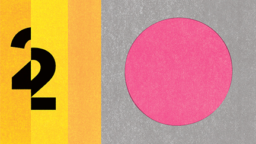
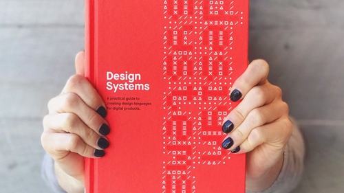
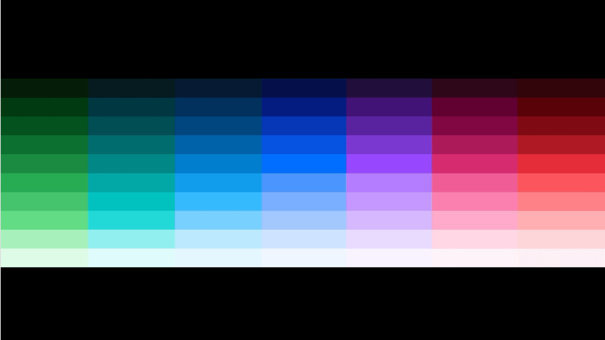
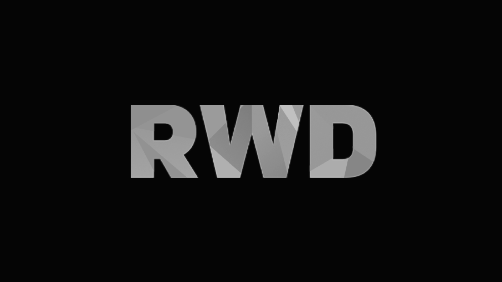

<PageDescription>

Learn about some of Carbon's bigger projects and read other articles of interest
about design systems.

</PageDescription>

<AnchorLinks>
  <AnchorLink>Latest news</AnchorLink>
  <AnchorLink>Books and articles</AnchorLink>
</AnchorLinks>

## Latest news

<Row>

<Column colLg={4} colMd={4} noGutterMdLeft>

<ArticleCard
    title="Seven new UX patterns for Carbon"
    author="Jan Child"
    date="January 9, 2020"
    href="https://medium.com/carbondesign/seven-new-ux-patterns-for-carbon-f4a18c20c535"
    >

</ArticleCard>
</Column>
<Column colLg={4} colMd={4} noGutterMdLeft>

<ArticleCard
    title="New in Carbon: October 2019"
    author="Tyler Tate"
    date="October 10, 2019"
    href="https://medium.com/carbondesign/october-release-fadc38b757ad"
    >

</ArticleCard>
</Column>
<Column colLg={4} colMd={4} noGutterMdLeft>
<ArticleCard
    title="Help build Carbon — Hacktoberfest 2019"
    author="Connor Leech"
    date="October 1, 2019"
    href="https://medium.com/carbondesign/help-build-carbon-hacktoberfest-2019-dbf337305c92"
    >

</ArticleCard>
</Column>
<Column colLg={4} colMd={4} noGutterMdLeft>
<ArticleCard
    title="Because, colors are beautiful"
    author="Shixie Shi Trofimov"
    date="September 25, 2019"
    href="https://medium.com/carbondesign/because-colors-are-beautiful-52dd4cc39f09"
    >

</ArticleCard>
</Column>
<Column colLg={4} colMd={4} noGutterMdLeft>
<ArticleCard
    title="What’s around the Carbon corner: October 🎃"
    author="Josefina Mancilla"
    date="September 6, 2019"
    href="https://medium.com/carbondesign/whats-around-the-carbon-corner-october-a47532f2933"
    >

</ArticleCard>
</Column>
<Column colLg={4} colMd={4} noGutterMdLeft>
<ArticleCard
    title="Carbon for IBM Security"
    author="Jen Downs"
    date="August 20, 2019"
    href="https://medium.com/carbondesign/carbon-for-ibm-security-986ccfe5c012"
    >

</ArticleCard>
</Column>
<Column colLg={4} colMd={4} noGutterMdLeft>
<ArticleCard
    title="Carbon: July recap + August preview"
    author="Josefina Mancilla"
    date="July 26, 2019"
    href="https://medium.com/carbondesign/carbon-july-preview-whats-coming-in-august-7a2483ea6ac9"
    >

</ArticleCard>
</Column>
<Column colLg={4} colMd={4} noGutterMdLeft>
<ArticleCard
    title="Carbon June(ish) preview"
    author="Alison Joseph"
    date="June 12, 2019"
    href="https://medium.com/carbondesign/carbon-june-ish-preview-9c5843258933"
    >

</ArticleCard>
</Column>
<Column colLg={4} colMd={4} noGutterMdLeft>
<ArticleCard
    title="Carbon v10.3.0 (May 2019)"
    author="Josh Black"
    date="June 6, 2019"
    href="https://medium.com/carbondesign/carbon-v10-3-0-may-2019-41b1f970f0ce"
    >

</ArticleCard>
</Column>
<Column colLg={4} colMd={4} noGutterMdLeft>
<ArticleCard
    title="Essentials: Learn to build with Carbon"
    author="Matt Rosno"
    date="May 15, 2019"
    href="https://medium.com/carbondesign/essentials-learn-to-build-with-carbon-1d11ce05125f"
    >

</ArticleCard>
</Column>
<Column colLg={4} colMd={4} noGutterMdLeft>
<ArticleCard
    title="Carbon is moving to a monorepo"
    author="Josh Black"
    date="May 10, 2019"
    href="https://medium.com/carbondesign/carbon-is-moving-to-a-monorepo-c6bfcbe87de0"
    >

</ArticleCard>
</Column>
<Column colLg={4} colMd={4} noGutterMdLeft>
<ArticleCard
    title="Carbon dark themes are here"
    author="Lauren Rice"
    date="April 29, 2019"
    href="https://medium.com/carbondesign/carbon-dark-themes-are-here-a18910a0f910"
    >

</ArticleCard>
</Column>
<Column colLg={4} colMd={4} noGutterMdLeft>
<ArticleCard
    title="Carbon v10 Release"
    author="Robin Cannon"
    date="April 4, 2019"
    href="https://medium.com/carbondesign/carbon-v10-release-812eacb7da7f"
    >

</ArticleCard>
</Column>
<Column colLg={4} colMd={4} noGutterMdLeft>
  <ArticleCard
    title="Design with Carbon: Update your Sketch symbols to V10"
    author="Anna Gonzales"
    date="April 2, 2019"
    href="https://medium.com/carbondesign/design-with-carbon-update-your-sketch-symbols-to-v10-ef3132ea2e97"
    >

  </ArticleCard>
</Column>
<Column colLg={4} colMd={4}  noGutterMdLeft>
  <ArticleCard
    title="Minimal CSS with Carbon"
    author="Josh Black"
    date="April 1, 2019"
    href="https://medium.com/carbondesign/minimal-css-with-carbon-b0c089ccfa71"
    >

  </ArticleCard>
</Column>
<Column colLg={4} colMd={4} noGutterMdLeft>
  <ArticleCard
    title="What to expect in Carbon 10"
    author="Robin Cannon"
    date="December 10, 2018"
    href="https://medium.com/carbondesign/what-to-expect-in-carbon-10-5af1bd6e25f6">

  </ArticleCard>
</Column>
<Column colLg={4} colMd={4} noGutterMdLeft>
  <ArticleCard
    title="Up & Running with Carbon React in less than 5 minutes"
    author="Josh Black"
    date="October 19, 2018"
    href="https://medium.com/carbondesign/up-running-with-carbon-react-in-less-than-5-minutes-25d43cca059e">

  </ArticleCard>
</Column>
<Column colLg={4} colMd={4}  noGutterMdLeft>
  <ArticleCard
    title="Hacktoberfest with Carbon"
    author="Josh Black"
    date="October 16, 2018"
    href="https://medium.com/carbondesign/hacktoberfest-with-carbon-95c48943f586">

  </ArticleCard>
</Column>
</Row>

## Books and articles

<Row>
<Column colLg={4} colMd={4} noGutterMdLeft>

<ArticleCard
    title="Design + Open Source"
    author="Gaby Moreno Cesar"
    date="August 11, 2020"
    href="https://medium.com/design-ibm/design-open-source-lessons-from-a-year-of-contributing-to-the-kubernetes-project-a85120acc890"
    >

</ArticleCard>
</Column>

<Column colLg={4} colMd={4}  noGutterMdLeft>
  <ArticleCard
    title="Writing Is Designing"
    href="https://rosenfeldmedia.com/books/writing-is-designing/">

  </ArticleCard>
</Column>
<Column colLg={4} colMd={4} noGutterMdLeft>
  <ArticleCard
    title="Smashing Magazine’s “Design Systems” Book"
    href="https://www.smashingmagazine.com/design-systems-book/">

  </ArticleCard>
</Column>

<Column colLg={4} colMd={4}  noGutterMdLeft>
  <ArticleCard
    title="Path to Design System Maturity"
    href="https://medium.com/ux-power-tools/the-path-to-design-system-maturity-d403daba692a">

  </ArticleCard>
</Column>
<Column  colLg={4} colMd={4} noGutterMdLeft>
  <ArticleCard
    title="Responsive Web Design Podcast"
    href="https://responsivewebdesign.com/podcast/ibm-carbon/">

  </ArticleCard>
</Column>
<Column colLg={4} colMd={4}  noGutterMdLeft>
  <ArticleCard
    title="UX Pin Virtual Design Summit"
    href="https://www.youtube.com/watch?v=eSvq5MieOdw&t=144s">

  </ArticleCard>
</Column>
</Row>
