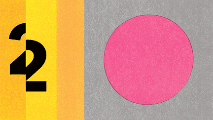
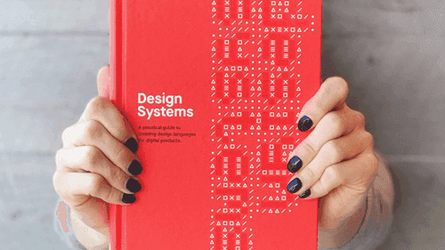
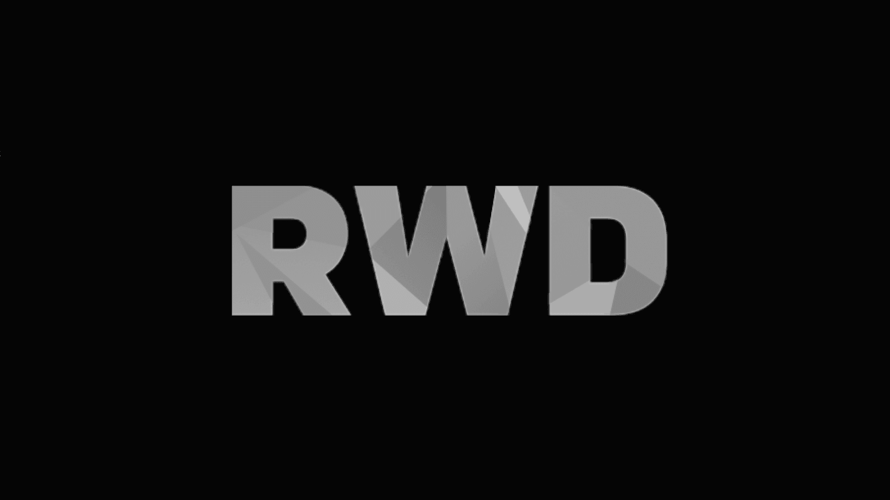

<PageDescription>

Learn about some of Carbon's bigger projects and read other articles of interest
about design systems.

</PageDescription>

<AnchorLinks>
  <AnchorLink>Latest news</AnchorLink>
  <AnchorLink>Books and articles</AnchorLink>
</AnchorLinks>

## Latest news

<MediumPosts postLimit={9} cardProps={{ color: 'light' }} />

## Books and articles

<Row>
<Column colLg={4} colMd={4} noGutterMdLeft>

<ArticleCard
    title="Design + Open Source"
    author="Gaby Moreno Cesar"
    date="August 11, 2020"
    href="https://medium.com/design-ibm/design-open-source-lessons-from-a-year-of-contributing-to-the-kubernetes-project-a85120acc890"
    >

</ArticleCard>
</Column>

<Column colLg={4} colMd={4}  noGutterMdLeft>
  <ArticleCard
    title="Writing Is Designing"
    href="https://rosenfeldmedia.com/books/writing-is-designing/">

  </ArticleCard>
</Column>
<Column colLg={4} colMd={4} noGutterMdLeft>
  <ArticleCard
    title="Smashing Magazine’s “Design Systems” Book"
    href="https://www.smashingmagazine.com/design-systems-book/">

  </ArticleCard>
</Column>

<Column colLg={4} colMd={4}  noGutterMdLeft>
  <ArticleCard
    title="Path to Design System Maturity"
    href="https://medium.com/ux-power-tools/the-path-to-design-system-maturity-d403daba692a">

  </ArticleCard>
</Column>
<Column colLg={4} colMd={4} noGutterMdLeft>
  <ArticleCard
    title="Responsive Web Design Podcast"
    href="https://responsivewebdesign.com/podcast/ibm-carbon/">

  </ArticleCard>
</Column>
<Column colLg={4} colMd={4}  noGutterMdLeft>
  <ArticleCard
    title="UX Pin Virtual Design Summit"
    href="https://www.youtube.com/watch?v=eSvq5MieOdw&t=144s">

  </ArticleCard>
</Column>
</Row>
