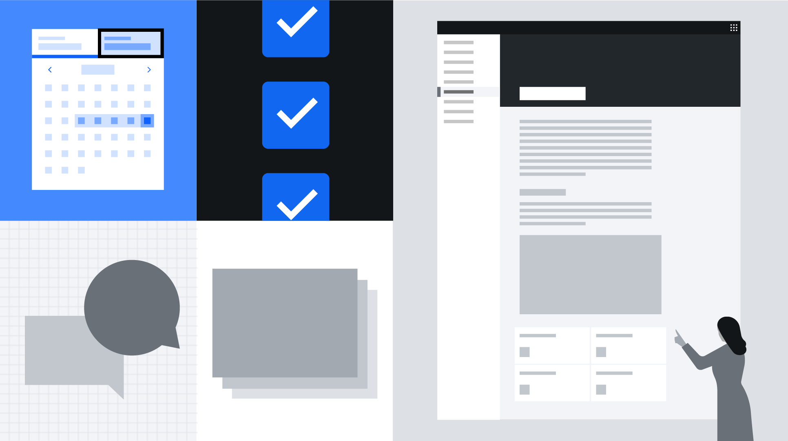

<PageDescription>

The Carbon v11 Beta release includes great quality of life updates for designers
and developers, and with no brand updates, no product redesigns are required.

</PageDescription>

To learn more about the v11 Beta Release head over to the <<<<<<< HEAD
[Migration guide overview](/migrating/guide/overview/) page. =======
[Migration guide](/migrating/guide/overview/) page.

> > > > > > > 911aa6307d4fb6719ecf3da2001454982fa5a8e5

## Read

<Row>
<Column colLg={4} colMd={4} noGutterMdLeft>
<ArticleCard
    title="Carbon’s 2021 release: April update"
    author="Josh Black"
    date="April 22, 2021"
    href="https://medium.com/carbondesign/carbons-2021-release-april-update-9d23242b3dea"
    >

</ArticleCard>
</Column>
<Column colLg={4} colMd={4} noGutterMdLeft>
<ArticleCard
    title="What’s coming to Carbon in 2021"
    author="Josh Black"
    date="November 12, 2020"
    href="https://medium.com/carbondesign/whats-coming-to-carbon-in-2021-39a4c7d1762a"
    >

</ArticleCard>
</Column>
</Row>

## Watch

As part of IBM's front-end developer educational series, FEDucation, Josh Black
introduces the upcoming v11 release, its features, and how to get involved and
provide feedback.

<Video title="Carbon v11 video" vimeoId="567122059" />
